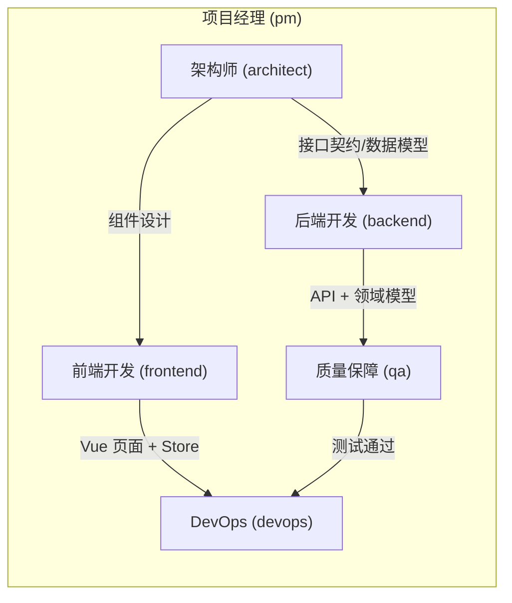

# AGENTS.md — TradeX 编码规范

AI 代理唯一编码准则。不遵守 = 拒收 PR。

---

## 1. 多角色分工协作

AI 代理在开发流程中根据任务类型自动切换角色。每个角色有明确的职责边界和交付物。

### 1.1 角色定义

| 角色 | 代号 | 职责 | 典型产出 |
|------|------|------|----------|
| **架构师** | `architect` | 系统设计、模块划分、接口契约定义、技术选型 | ADR / 接口签名 / 模块图 |
| **后端开发** | `backend` | C# API、领域模型、基础设施、Exchange 集成 | Controller / Service / Repository |
| **前端开发** | `frontend` | Vue 3 页面、组件、状态管理、路由配置 | `.vue` / Pinia Store / Router |
| **质量保障** | `qa` | xUnit 测试、边界覆盖、Mock 策略、集成测试 | `*Tests.cs` |
| **DevOps** | `devops` | Docker 编排、CI/CD、构建脚本、镜像发布 | Dockerfile / Compose / Workflow |
| **项目经理** | `pm` | 任务拆解、优先级排序、进度跟踪 | Todo List / 里程碑 |

### 1.2 角色切换触发规则

| 任务类型 | 启动角色 | 交接链 | 说明 |
|----------|----------|--------|------|
| **新功能/模块** | `architect` → `backend` → `frontend` → `qa` → `devops` | 线性递进 | 先设计再实现，每步完成后由 pm 确认 |
| **纯后端变更** | `backend` → `qa` | 后端→测试 | 不涉及 UI |
| **纯前端变更** | `frontend` | 独立完成 | 不涉及后端逻辑 |
| **Bug 修复** | `qa`(定位) → `backend`/`frontend`(修复) → `qa`(验证) | 闭环 | QA 先复现定位，修复后回归 |
| **重构/优化** | `architect`(方案) → `backend`/`frontend`(执行) → `qa`(回归) | 方案先行 | 必须有架构师方案才能开始执行 |
| **部署/发布** | `devops` | 独立完成 | CI/CD 流水线触发 |
| **跨模块联合** | `architect`(协调) + `backend` + `frontend`(并行) → `qa`(集成) | 架构师协调 | 后端/前端可并行开发 |

### 1.3 角色协作流程



### 1.4 角色产出标准

| 角色 | 必须产出 | 质量门禁 |
|------|----------|----------|
| `architect` | 接口定义文件、数据模型设计 | 未新增接口/模型时需说明理由 |
| `backend` | Controller + Service + 单元测试 | 编译通过 + 测试通过 |
| `frontend` | Vue 组件 + Store + 路由 | TypeScript 无错误 + 构建通过 |
| `qa` | 正常路径 + 边界 + 异常测试 | 覆盖率 ≥80% |
| `devops` | Dockerfile / Compose 更新 | `docker compose build` 通过 |
| `pm` | Todo List + 状态跟踪 | 所有任务标记完成 |

### 1.5 工作模式

- **Agent 模式（默认）**：AI 自动判断任务类型，按触发规则切换角色，无需用户指定
- **Plan 模式**：先以 `pm` + `architect` 角色输出计划方案，用户确认后再按序执行
- **Spec 模式**：以 `architect` 角色输出 Spec 文件（spec.md / tasks.md / checklist.md），用户确认后以剩余角色按序执行

### 1.6 协作约束

- **单点串行**：一次只激活一个角色（线性交接链中），避免上下文混乱
- **并行例外**：`architect` 确认方案后，`backend` + `frontend` 可并行交付（PM 协调）
- **强制门禁**：每个角色交付后必须运行对应质量门禁命令，失败则退回修改
- **上下文集**：角色切换时，上一个角色的输出作为下一个角色的输入上下文

---

## 2. 技术栈（不可协商）

| 项 | 值 |
|---|---|
| TargetFramework | `net10.0` |
| LangVersion | `preview` |
| Nullable | `enable` |
| ImplicitUsings | `enable` |
| 测试 | xUnit + NSubstitute |
| 前端 | Vue 3 + TypeScript + Pinia |

所有代码必须使用以下 C# 14 语法：
- **主构造函数** — 消除所有简单 DI 字段注入。例外：`IOptions<T>.Value` 延迟访问、循环依赖
- **集合表达式** — `[]` 替代 `new List<T>()` / `Array.Empty<T>()` / `new Dictionary<K,V>()`
- **`field` 关键字** — 代替手动 `_field` 声明
- 禁止：`new List<T>()`、`new Dictionary<K,V>()`、`private readonly` DI 字段、`net8.0`/`net9.0`

---

## 3. 项目结构 & 依赖方向

```
backend/
├── TradeX.Api/            # ASP.NET Core + SignalR Hubs
├── TradeX.Core/           # 纯领域模型、枚举、接口（叶节点，零依赖）
├── TradeX.Exchange/       # IExchangeClient + 各交易所实现
├── TradeX.Indicators/     # Trady 封装
├── TradeX.Trading/        # 策略引擎 + 风控 + 回测 + 订单 reconciliation
├── TradeX.Infrastructure/ # EF Core + SQLite + Casbin + IoTDB
├── TradeX.Notifications/  # Telegram / Discord / Email
└── TradeX.Tests/
```

依赖方向：`Api → Trading → Exchange, Indicators, Infrastructure, Notifications`。**Core 不依赖任何项目**。

---

## 4. 设计模式

| 模式 | 场景 |
|---|---|
| Strategy + DI | 可替换算法（费用计算、滑点、条件评估） |
| Options | 强类型配置绑定，`IOptions<T>` 注入 |
| Singleton | 无状态/共享服务（ExchangeClientManager, CasbinEnforcer, IRateLimiter） |
| Factory | 运行时条件创建对象（不同交易所实例） |
| Repository | 数据持久化抽象 |
| Chain of Responsibility | 风控管线：日亏损 → 回撤 → 连续亏损 → 熔断 → 滑点 |

**禁止**：Service Locator（`GetService<T>()`，仅 `Program.cs` 允许）、God Object（类 ≤300 行，方法 ≤50 行）、Magic String/Number、`catch(Exception)` 吞异常。

---

## 5. DI 规范

- **Singleton**：无状态/共享服务
- **Scoped**：ASP.NET Core Controller（默认）
- **Transient**：轻量无状态（`IConditionEvaluator`、通知发送器）
- 禁止注入 `IServiceProvider`
- `IOptions<T>` 仅注入需要运行时读配置的服务

---

## 6. 命名 & 编码

| 元素 | 规则 |
|---|---|
| 类/方法 | PascalCase |
| 接口 | 前缀 `I` |
| 局部变量 | camelCase |
| 私有字段 | `_camelCase` |
| 参数 | camelCase |
| 异步方法 | 后缀 `Async` |
| 常量 | 统一风格：全 PascalCase 或 SCREAMING_SNAKE |

**异步**：I/O 用 `async Task` / `async Task<T>`，传 `CancellationToken`，禁止 `Wait()` / `.Result`。

**错误**：边界层 catch + log 返回默认值；内部层传播异常。结构化日志，禁止字符串拼接：
```csharp
_logger.LogWarning("余额不足: {Balance} < {Required}", balance, required); // ✅
_logger.LogWarning($"余额不足: {balance} < {required}");                   // ❌
```

**防御**：方法参数用 `IReadOnlyList<T>` 而非 `List<T>`。DTO 用 `record`。

---

## 7. 测试

- 每个接口对应测试类，命名 `[ClassName]Tests`
- 覆盖：正常路径 + 边界 + 异常
- 方法命名：`{MethodName}_{Scenario}_{ExpectedOutcome}`

```
TradeX.Tests/
├── Trading/   (TradeExecutor, ConditionEvaluator, RiskManager, OrderReconciler)
├── Infrastructure/ (CasbinAuthorization)
├── Core/      (Position)
└── Api/       (AuthController)
```

---

## 8. 构建

```bash
dotnet build && dotnet test && docker compose build
```

Docker 镜像发布，无单文件产物。

---

## 9. 审查清单

- [ ] `net10.0` + `LangVersion=preview` + Nullable 启用
- [ ] 主构造函数替代简单 DI 注入
- [ ] 集合用 `[]` 语法
- [ ] 无 magic string/number
- [ ] I/O 方法传递 `CancellationToken`，后缀 `Async`
- [ ] 异常边界层正确处理
- [ ] 新配置在对应 `Settings` 类有强类型属性
- [ ] 无 Service Locator
- [ ] Casbin 策略已为新 API 端点添加规则
- [ ] 前端新页面已添加路由 + 角色守卫

---

## 10. 沟通规范

- **回复语言**：AI 助理在回复时**只能使用中文**，禁止使用其他语言
- **图表渲染**：需要展示流程图、架构图、状态图、时序图等图表时，**一律使用 `.md` 文件所支持的渲染语法**（如 Mermaid 的 ` ```mermaid ` 代码块）。**禁止使用文字画图**（如 ASCII art 拼凑的框线箭头、表格拼凑的模拟图等）
- **Mermaid 换行**：Mermaid 节点文本中**不支持 `\n` 换行符**，如需换行必须使用 HTML 标签 `<br/>`（如 `"状态一<br/>状态二"`）
