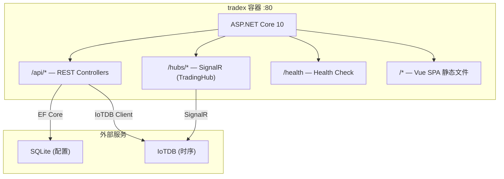

# TradeX

TradeX 是一个多交易所现货自动交易系统，基于 ASP.NET Core 10 + Vue 3。前端 SPA 内嵌至 ASP.NET Core 同一进程，单容器部署。

## 架构概览



## 技术栈

| 层 | 技术 |
|---|------|
| 后端 | ASP.NET Core 10 + C# 14（主构造函数、集合表达式 `[]`、`field` 关键字）|
| 前端 | Vue 3 + TypeScript + Pinia |
| 数据库 | SQLite（配置）+ IoTDB（时序数据）|
| 鉴权 | Casbin.NET RBAC + JWT + MFA TOTP |
| 实时通信 | SignalR |
| 通知 | Telegram / Discord / Email |
| 部署 | Docker Compose（三阶段构建）|

## 快速启动

```bash
git clone <repo>
cd TradeX

# 设置 JWT Secret 并启动
JWT_SECRET=your-secret-key docker compose up --build
```

访问 `http://localhost` 即可打开 TradeX 管理界面。

### 初始化流程（首次启动）

1. 首次访问自动跳转到初始化向导页面
2. 设置系统参数、创建 Super Admin 账户、绑定 MFA
3. 完成后恢复正常模式，使用 Super Admin 登录

## 项目结构

```
TradeX/
├── AGENTS.md                # AI 代理编码规范（多角色协作、技术约束）
├── Dockerfile               # 统一三阶段构建（frontend build → backend build → runtime）
├── docker-compose.yml       # tradex + iotdb 编排
├── backend/
│   ├── TradeX.slnx
│   ├── TradeX.Api/          # ASP.NET Core Web API + SPA 静态文件
│   │   ├── Controllers/     # 16 个控制器（Auth、Traders、Strategies、Orders、Backtesting 等）
│   │   ├── Hubs/            # TradingHub（SignalR 实时行情推送）
│   │   ├── Middleware/      # 5 个中间件（异常、鉴权、审计、IP 白名单、安装守卫）
│   │   ├── Services/        # JwtService、MfaService、SignalREventBus
│   │   └── Settings/        # JwtSettings 强类型配置
│   ├── TradeX.Core/         # 领域模型、接口、枚举（零依赖）
│   ├── TradeX.Exchange/     # 交易所客户端（Binance/OKX/Gate/Bybit/HTX）
│   ├── TradeX.Indicators/   # 技术指标（Skender.Stock.Indicators）
│   ├── TradeX.Trading/      # 策略引擎 + 风控管线 + 回测 + Reconciliation
│   ├── TradeX.Infrastructure/ # EF Core + Casbin + IoTDB Client
│   ├── TradeX.Notifications/  # Telegram/Discord/Email 通知
│   └── TradeX.Tests/        # xUnit + NSubstitute（14 文件，118+ 测试方法）
├── frontend/                # Vue 3 + TypeScript SPA（Vite 构建）
│   ├── api/                 # 15 个 API 模块
│   ├── components/          # 14 个公共组件（ConditionTreeEditor、ExecutionRuleEditor 等）
│   ├── views/               # 15 个视图页面（Dashboard、Strategies、Backtest、SetupWizard 等）
│   ├── composables/         # useSignalR（SignalR 实时连接管理）
│   ├── stores/              # auth Pinia Store
│   ├── router/              # Vue Router + 角色守卫
│   └── layouts/             # AppLayout 主布局
└── docs/                    # PRD、FSD、TAD、TestCases
```

## 开发

```bash
# 后端
cd backend && dotnet run --project TradeX.Api

# 前端（开发模式，代理 API 到后端）
cd frontend && npm run dev

# 测试
cd backend && dotnet test
```

## Docker 部署

```bash
# 构建并启动
JWT_SECRET=your-secret-key docker compose up --build

# 后台运行
JWT_SECRET=your-secret-key docker compose up --build -d

# 查看日志
docker compose logs -f
```

支持的交易所：Binance、OKX、Gate.io、Bybit、HTX。
