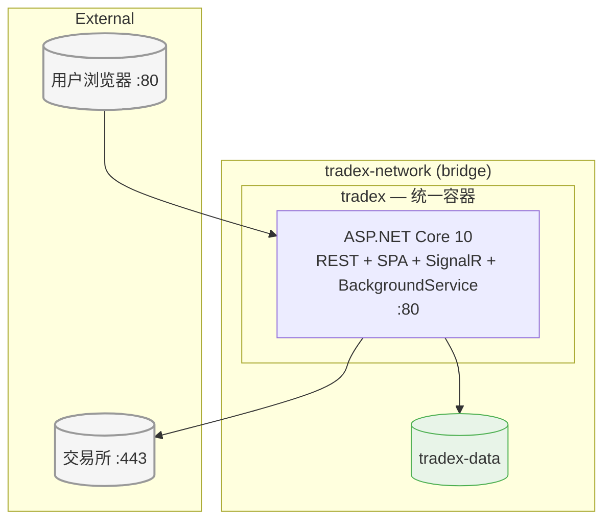
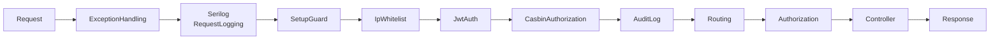

# 01-选型清单 — TradeX 技术选型决策记录

## 文档信息

| 项目 | 内容 |
|------|------|
| 版本 | v2.0 |
| 日期 | 2026-05-17 |
| 作者 | architect |
| 状态 | 已确认 |
| 基于 | AGENTS.md / TAD.md v1.3 / ROLE.md |

---

## 1. 架构原则

| # | 原则 | 说明 |
|---|------|------|
| P1 | **防御第一** | 所有外部输入视为不可信；资金操作必须过风控链；交易所 API 调用必须过限流器 |
| P2 | **离线韧性** | 每个交易所 WebSocket 断线、交易所 API 5xx，均不可导致系统崩溃；应有降级路径 |
| P3 | **可观测性内建** | 结构化日志、审计日志、Health 端点、风控事件，不是后加的功能 |
| P4 | **状态显式化** | 策略状态机、订单状态机、持仓状态机全部用枚举 + 状态转换表驱动，禁止 if/else 隐式状态 |
| P5 | **依赖单向** | `Api → Trading → Exchange / Indicators / Infrastructure / Notifications`，Core 是叶节点，零依赖 |
| P6 | **配置即代码** | 所有可调参数（风控阈值、限流参数、K 线预热天数）均为强类型 Options 绑定，禁止 hardcode |
| P7 | **数据一致性兜底** | 订单 Reconciliation 是启动时必执行流程；本地状态以交易所为准，但交易所不可用时以本地为准 |

---

## 2. 外部约束

| # | 约束 | 来源 |
|---|------|------|
| C1 | 目标框架 `net10.0` + `LangVersion=14.0` | AGENTS.md |
| C2 | 前端 Blazor Server + Bootstrap Blazor `BootstrapBlazor` v10.6.0 | AGENTS.md |
| C3 | SQLite 为主存储 | PRD FR-13 |
| C4 | Docker Compose 单机部署，无 K8s | PRD FR-16 |
| C5 | 仅支持现货交易，不涉及合约/杠杆 | FSD §25 待确认 #10 |
| C6 | 交易所 SDK 统一使用 JKorf 系列 | FSD v1.3 |

---

## 3. 后端框架

| 技术 | 版本 | 决策 | 决策理由 | 备选方案 |
|------|------|------|----------|----------|
| .NET | 10.0 SDK | ✅ 选用 | 最新长期支持版本，性能优异（吞吐量对比 .NET 8 提升约 15%），原生支持 C# 14 新语法，微软官方持续维护至 2030+ | .NET 8/9（已有较新 LTS 可用，无需停留在旧版本）；Java/Go（团队技术栈偏 .NET，切换成本高） |
| C# LangVersion | 14.0 | ✅ 强制 | 主构造函数消除简单 DI 字段注入；集合表达式 `[]` 简化初始化；`field` 关键字替代 `_field` 声明；禁止 `new List<T>()` / `new Dictionary<K,V>()` / `private readonly` DI 字段 | C# 12/13（语法糖较少，代码冗余度更高） |
| ASP.NET Core | 10.0 | ✅ 选用 | 统一承载 REST API + SignalR Hub + Blazor Server + BackgroundService 于同一进程，减少部署复杂度；中间件管线灵活，已在 .NET 生态验证超 10 年 | 独立 Nginx + Kestrel 分离部署（单机场景过度设计）；gRPC（实时通信场景需额外 SSE/WS 配合） |
| Nullable | enable | ✅ 强制 | 编译期空引用检查，减少 NullReferenceException；与 C# 14 主构造函数配合可显著提升代码安全性 | disable（不开启则丧失编译期空安全检查能力） |
| ImplicitUsings | enable | ✅ 启用 | 自动导入 `System`、`System.Threading` 等常用命名空间，减少文件头部 `using` 冗余 | disable（每个文件需手动维护 using 列表） |

---

## 4. 前端技术

| 技术 | 版本 | 决策 | 决策理由 | 备选方案 |
|------|------|------|----------|----------|
| Blazor Server | InteractiveServer | ✅ 选用 | 与后端同一 ASP.NET Core 进程，通过 SignalR 实现实时交互，免去 REST 轮询开销；前后端共享 C# 类型（DTO、枚举减少重复定义）；.NET 10 InteractiveServer 渲染模式成熟 | Blazor WASM（需独立下载 .NET 运行时，首屏加载 > 2MB）；React/Vue（需跨语言前后端对接，增加沟通成本）；SSR + 静态页面（缺乏实时交互能力） |
| BootstrapBlazor | 10.6.0 | ✅ 选用 | Bootstrap 5 风格响应式布局，内建表格/表单/导航/弹窗等 50+ 组件，社区活跃（GitHub 4k+ star），与 Blazor Server 集成零额外配置 | Ant Design Blazor（组件更丰富但包体积更大，且与 Blazor Server 配合需更多配置）；MudBlazor（Material Design 风格，与本项目沿用 Bootstrap 5 的约定不符） |
| Bootstrap 5 | 5.x | ✅ 隐含 | BootstrapBlazor 底层依赖，提供 CSS 栅格系统和 UI 基座 | Tailwind CSS（需额外构建工具链，与 BootstrapBlazor 组件设计不兼容） |
| ECharts | 最新 | ✅ 选用 | K 线图（`candlestick` 系列）、回测绩效图表（曲线/柱状/热力图）、仪表盘可视化（仪表盘/饼图/雷达图）均有成熟 API；社区庞大，示例丰富，跨浏览器兼容好 | Chart.js（功能较少，不支持 K 线图原生渲染）；D3.js（学习曲线陡峭，开发效率低）；LightweightCharts（TradingView 系，仅 ECharts 的 K 线功能子集） |

---

## 5. 数据存储

| 技术 | 版本 | 决策 | 决策理由 | 备选方案 |
|------|------|------|----------|----------|
| SQLite | 3.x | ✅ 选用 | 零运维零独立进程，单文件数据库，Docker 持久卷挂载即用；`sqlite3 .backup` 一行命令完成备份；TradeX 单机部署数据规模可控（配置数据 < 1GB/年） | PostgreSQL（功能强大但增加运维复杂度，单机场景过重）；SQL Server Express（Windows 依赖，Docker 镜像 > 1GB） |
| EF Core | 10.0 | ✅ 选用 | 成熟 ORM，Code-First Migration 自动管理 Schema 版本；与 ASP.NET Core 同属微软生态，集成无缝；LINQ 强类型查询编译期检查 | Dapper（轻量但需手写 SQL，Migration 需额外工具管理）；SQLite 裸 `Microsoft.Data.Sqlite`（缺少迁移、变更跟踪等 ORM 特性） |

### 5.1 数据存储分布策略

| 数据类别 | 存储引擎 | 访问模式 | 一致性要求 | 备份策略 |
|----------|---------|---------|-----------|---------|
| 用户 / 配置 | SQLite | 低频读写 | 强一致 | `sqlite3 .backup` |
| 交易所凭证 | SQLite (AES 加密) | 低频读 | 强一致 | 同上 |
| 策略 / 订单 | SQLite | 中频读写 | 强一致 | 同上 |
| 持仓 | SQLite | 高频更新（15s/cycle） | 最终一致 | 同上 |
| 审计日志 | SQLite | 仅追加写 + 低频范围查 | 最终一致 | 同上 + 归档 |
| K 线历史 | 交易所 REST API | 回测时实时拉取 | 最终一致 | — |
| 归档订单 | JSON (gzip) | 极低频读 | 最终一致 | 与 SQLite 同卷 |

---

## 6. 鉴权与安全

| 技术 | 版本 | 决策 | 决策理由 | 备选方案 |
|------|------|------|----------|----------|
| Casbin.NET | 最新 | ✅ 选用 | API 路径级 RBAC，策略与代码完全分离（`model.conf` + `policy.csv`）；支持热加载（修改策略文件无需重启）；C# 生态成熟，社区活跃 | 手写 middleware + `[Authorize(Roles="...")]`（策略硬编码在代码中，变更需重编译部署）；`[Authorize]` Attribute（不支持路径模式匹配 `/api/strategies/*:GET`） |
| JWT Bearer | ASP.NET Core 内置 | ✅ 选用 | 无状态认证，无需服务端 Session；ASP.NET Core `AddJwtBearer()` 一行配置集成；标准 RFC 7519 实现 | Session + Cookie（有状态，多实例需分布式 Session 存储）；OAuth 2.0 Auth Code Flow（个人系统过度设计） |
| Refresh Token | — | ✅ 选用 | 与 JWT AccessToken 配套，AccessToken 短时效（30 分钟）；RefreshToken 长时效（7 天）、数据库持久化、支持吊销 | 仅 AccessToken（长期有效增加泄露风险）；长期 Token（无法吊销，安全性差） |
| MFA TOTP | Otp.NET | ✅ 选用 | 基于 RFC 6238 标准 TOTP 实现，与 Google Authenticator / Authy 等兼容；新增用户先置 `PendingMfa` 状态，绑定后才激活 | SMS OTP（依赖第三方短信服务，成本高，延迟不稳定）；硬件 Token（Key 管理复杂，不适合个人系统） |
| AES-256-GCM | .NET `AesGcm` | ✅ 选用 | 认证加密模式（GCM = CTR + GMAC），内置认证标签防篡改；NIST 推荐标准；.NET `AesGcm` 类原生支持，零额外依赖 | AES-CBC + HMAC（需要手动组合加密 + 认证，易出错）；RSA（非对称加密性能差，不适合大批量凭证加解密） |

### 6.1 安全边界

| 安全域 | 信任边界 | 控制点 |
|--------|---------|--------|
| 浏览器 ↔ Nginx | 不可信 | HTTPS（生产）、CORS、XSS 防护（前端输出编码） |
| Nginx ↔ Backend | 可信内网 | Docker 内网通信 |
| Backend ↔ 交易所 | 不可信 | API Key 仅内存解密；错误处理不泄露凭证 |
| Backend ↔ SQLite | 可信 | 文件权限 0600 |
| Backend ↔ IoTDB | 可信 | Docker 内网通信 |

### 6.2 安全控制矩阵

| 控制项 | 实现 |
|--------|------|
| 认证 | JWT AccessToken + RefreshToken + MFA TOTP |
| 授权 | Casbin RBAC（API 路径 + HTTP 方法级别） |
| 加密 | AES-256-GCM 凭证加密；bcrypt 密码哈希；HTTPS |
| 审计 | 敏感操作自动记录 AuditLog |
| 防暴力 | MFA 失败次数上限（5 次锁定 5 分钟） |

---

## 7. 交易所 SDK

| 技术 | 版本 | 决策 | 决策理由 | 备选方案 |
|------|------|------|----------|----------|
| Binance.Net | JKorf | ✅ 选用 | JKorf 系列统一设计风格，WebSocket 内置（自动重连、心跳保活），社区活跃（各 SDK 共 2k+ star）。`IExchangeClient` 网帘层屏蔽各 SDK 差异 | 各交易所官方 SDK（API 风格差异大：Binance C# SDK 与 OKX C# SDK 接口设计完全不同，封装成本高；部分交易所无官方 .NET SDK） |
| JK.OKX.Net | JKorf | ✅ 选用 | 同上 JKorf 系列，接口风格与 Binance.Net 一致 | OKX 官方 .NET SDK（接口风格差异大，缺少 WebSocket 高级管理功能） |
| GateIo.Net | JKorf | ✅ 选用 | 同上 JKorf 系列 | Gate.io 官方 SDK（无官方 .NET SDK，需自行封装 REST/WS） |
| Bybit.Net | JKorf | ✅ 选用 | 同上 JKorf 系列 | Bybit 官方 SDK（接口设计不同，封装成本高） |
| JKorf.HTX.Net | JKorf | ✅ 选用 | 同上 JKorf 系列 | HTX 官方 SDK（无官方 .NET SDK，需自行封装） |

> **统一接口 `IExchangeClient`** 封装了行情订阅、账户查询、下单执行、连接测试、交易规则查询等核心方法，所有交易所实现通过 `ExchangeClientFactory` 运行时创建。限流器 `IExchangeRateLimiter`（Token Bucket）和 WebSocket 管理器 `IWebSocketManager` 分别处理 API 限流和连接生命周期。

---

## 8. 技术指标

| 技术 | 版本 | 决策 | 决策理由 | 备选方案 |
|------|------|------|----------|----------|
| Skender.Stock.Indicators | 最新 | ✅ 选用 | 50+ 技术指标覆盖 TradeX 首批 8 个指标需求（SMA/EMA/MACD/RSI/BB/Stochastic/ATR/Volume）；活跃维护（GitHub 7k+ star），`net10.0` 兼容；`TradeX.Indicators` 封装层可替换底层库 | Trady（已不活跃，最后更新 2021 年，兼容性风险）；TA-Lib（C 依赖，跨平台问题，macOS/Linux 需额外编译） |

### 8.1 首批 8 个指标

| 指标 | 计算方式 | Warmup | 关键参数 | 典型使用 |
|------|---------|--------|---------|---------|
| SMA | 简单移动平均 | period - 1 | period: 5-200 | 趋势识别 |
| EMA | 指数加权移动平均 | period × 2 | period: 5-200 | 快线/慢线交叉 |
| MACD | EMA(12) - EMA(26) + Signal(9) | 33 | fast/slow/signal | 趋势动量 |
| RSI | 平均涨幅 / 平均跌幅 | period + 1 | period: 14 | 超买/超卖 (70/30) |
| BB | 中轨 ± k × 标准差 | period - 1 | period: 20, k: 2 | 波动率/突破 |
| Stochastic | %K = (C-L14)/(H14-L14)×100 | period + 1 | k/d: 5/3 | 超买/超卖 (80/20) |
| ATR | EMA of True Range | period - 1 | period: 14 | 波动率/止损 |
| Volume | 均值对比 | 0 | period: 20 | 放量/缩量 |

---

## 9. 实时通信

| 技术 | 决策 | 决策理由 | 备选方案 |
|------|------|----------|----------|
| SignalR | ✅ 选用 | ASP.NET Core 内置，零额外依赖；强类型 Hub（C# 接口定义，前后端共享类型）；自动重连机制；支持 WebSocket 回退到 SSE/LongPolling | 裸 WebSocket（需自行处理心跳、重连、协议序列化）；gRPC-Web（不适合高频推送，Bidirectional Streaming 复杂度高） |
| SSE | ✅ 选用 | 回测 K 线分析数据实时推送场景只需后端→前端单向通信，SSE 比 SignalR 更轻量（HTTP 长连接，无额外帧协议）；`fetch + ReadableStream` 解析 SSE 行协议即可兼容 JWT 认证（对比原生 `EventSource` 无法自定义请求头） | SignalR（已集成但推荐，SSE 仅用于回测场景）；WebSocket（过度设计，双向通道浪费）；轮询（浪费带宽、延迟大） |

### 9.1 SignalR 事件合约

| 事件名 | 推送方向 | 触发时机 |
|--------|---------|---------|
| `PositionUpdated` | Server → Client | 持仓更新/关闭 |
| `OrderPlaced` | Server → Client | 下单/成交/取消 |
| `StrategyStatusChanged` | Server → Client | 状态机转换 |
| `RiskAlert` | Server → Client | 风控链拦截 |
| `DashboardSummary` | Server → Client | 定时推送 (15s) |
| `ExchangeConnectionChanged` | Server → Client | WS 断线/重连 |

---

## 10. 日志与监控

| 技术 | 决策 | 决策理由 | 备选方案 |
|------|------|----------|----------|
| Serilog | ✅ 选用 | 结构化日志（`Log.ForContext("OrderId", x)`），支持 Sink 热切换；File + Console 双 Sink 满足开发/生产需求；ASP.NET Core `UseSerilogRequestLogging()` 自动记录 HTTP 请求日志 | NLog（配置较繁琐，结构化日志支持不如 Serilog）；`Microsoft.Extensions.Logging` 裸用（缺少文件轮换、结构化模板等功能） |

### 10.1 日志类别与保留策略

| 日志类别 | Serilog Sink | 保留策略 | 格式 |
|----------|-------------|---------|------|
| 应用日志 | Console + File | 7 天轮换 | JSON 结构化 |
| 审计日志 | AuditLog 表 | 6 个月 | 结构化 + 已索引 |
| 交易日志 | Console + File | 30 天轮换 | 结构化（含 OrderId/TraderId） |
| 风控日志 | Console + File | 30 天轮换 | 结构化（含 RiskContext） |

---

## 11. 测试框架

| 技术 | 版本 | 决策 | 决策理由 | 备选方案 |
|------|------|------|----------|----------|
| xUnit | 最新 | ✅ 选用 | .NET 生态标准测试框架，`[Fact]` / `[Theory]` 简洁直观；社区活跃，所有 .NET CI 模版默认支持 | NUnit（功能类似但社区倾向 xUnit）；MSTest（微软官方但功能较少） |
| NSubstitute | 最新 | ✅ 选用 | API 简洁（`.Received()` / `.Returns()` / `.When()` 链式调用）；与 xUnit 配合无缝 | Moq（最老牌但最后更新较慢，API 比 NSubstitute 冗长）；FakeItEasy（社区较小） |
| bUnit | 最新 | ✅ 选用 | Blazor 组件渲染与交互测试专用框架；支持 `InteractiveServer` 渲染模式测试；可验证组件渲染树、事件触发、参数传递 | 无替代品（Blazor 组件测试唯一成熟方案） |
| Playwright | 最新 | ✅ 选用 | 跨浏览器 E2E 测试（Chromium/Firefox/WebKit），`Microsoft.Playwright` .NET 绑定；支持 Blazor Server 的 SignalR 交互测试 | Selenium（慢，API 笨重）；Cypress（仅 JavaScript，无法与 .NET 测试项目统一） |

---

## 12. 部署

| 技术 | 决策 | 决策理由 | 备选方案 |
|------|------|----------|----------|
| Docker | ✅ 选用 | 多阶段构建（`sdk:10.0` build → `aspnet:10.0` runtime），镜像分层优化；`nonroot` 用户运行，`HEALTHCHECK` 端点探测；环境变量注入配置 | 裸机部署（环境不一致，无法复现构建）；K8s（单机场景过度设计） |
| Docker Compose | ✅ 选用 | 单机编排，`depends_on` 管理启动顺序，持久卷映射 SQLite 数据；`networks` 隔离内网通信 | K8s（复杂度不合算）；`docker stack`（需要 Swarm 模式，功能不如 Compose 直观） |

### 12.1 网络拓扑



### 12.2 路由策略

所有请求在同一端口 (80) 上按路径分发：

| 路径 | 目标 | 说明 |
|------|------|------|
| `/_blazor/*` | Blazor Server SignalR | 前端交互连接 |
| `/api/*` | REST Controllers | 后端 API |
| `/hubs/trading` | SignalR Hub | 实时数据推送 |
| `/health` | Health Check | 健康检查 |
| `/*` | Blazor 页面路由 | SPA 页面导航 |

Blazor Server 与 REST API 共享同一 ASP.NET Core 进程，无需独立 Nginx 容器。

### 12.3 环境变量配置清单

| 变量 | 默认值 | 说明 |
|------|--------|------|
| `ASPNETCORE_ENVIRONMENT` | Production | 运行环境 |
| `ASPNETCORE_URLS` | http://+:80 | 监听地址（统一端口） |
| `ConnectionStrings__Sqlite` | Data Source=/data/tradex.db | SQLite 路径 |
| `Jwt__Secret` | — | **必填**，JWT 签名密钥 |
| `Jwt__AccessTokenExpiresMinutes` | 30 | AccessToken 有效期 |
| `Jwt__RefreshTokenExpiresDays` | 7 | RefreshToken 有效期 |
| `Serilog__MinimumLevel__Default` | Information | 日志级别 |

---

## 13. 横切关注点

### 13.1 错误处理策略

| 层级 | 策略 | 说明 |
|------|------|------|
| Controller | 全局异常过滤器 `ExceptionHandlingMiddleware` | 500 → 统一 JSON 错误响应 + 日志 + traceId |
| Service/Business | 传播异常，自定义 `DomainException` | 400/404/409 → 带业务错误码 |
| Trading Engine | catch + log + 继续循环 | 单策略异常不影响其他策略；连续 N 次异常暂停该策略 |
| Exchange Client | catch API 异常 → 转换为 `ExchangeException` | 包含错误码、HTTP 状态、原始消息 |
| WebSocket | 断线重连自动恢复 | 重连失败上限后标记 `Disconnected`，不 crash |

### 13.2 日志策略

| 日志类别 | Serilog Sink | 保留策略 | 格式 |
|----------|-------------|---------|------|
| 应用日志 | Console + File | 7 天轮换 | JSON 结构化 |
| 审计日志 | AuditLog 表 | 6 个月 | 结构化 + 已索引 |
| 交易日志 | Console + File | 30 天轮换 | 结构化（含 OrderId/TraderId） |
| 风控日志 | Console + File | 30 天轮换 | 结构化（含 RiskContext） |

### 13.3 并发策略

| 场景 | 策略 | 说明 |
|------|------|------|
| 同一 Pair 同时触发买入 | 策略级锁 + 风控熔断 | Trading Engine 同周期内同一 Pair 仅执行一次 |
| 手动下单 vs 策略下单 | 无冲突（共用风控链） | 手动下单同样经过滑点 + 日亏损检查 |
| 策略编辑 vs 策略评估 | 乐观并发（Version 字段） | `UPDATE ... WHERE Version = @expected` |
| 订单状态更新 | 幂等更新 | `Order.Status = Filled` 可重复执行，不报错 |
| 回测多任务同时执行 | 资源感知调度（ResourceMonitor + BacktestScheduler） | Worker 池固定 `MaxConcurrency` 个，`ResourceMonitor` 每 5s 采样内存 + CPU，`AllowedConcurrency = min(mem_cap, cpu_cap)`，按双维度水位动态限制活跃并发数；超过水位的新任务等待槽位释放，不中断进行中的任务 |

### 13.4 安全边界

| 安全域 | 信任边界 | 控制点 |
|--------|---------|--------|
| 浏览器 ↔ Nginx | 不可信 | HTTPS（生产）、CORS、XSS 防护（前端输出编码） |
| Nginx ↔ Backend | 可信内网 | Docker 内网通信 |
| Backend ↔ 交易所 | 不可信 | API Key 仅内存解密；错误处理不泄露凭证 |
| Backend ↔ SQLite | 可信 | 文件权限 0600 |

---

## 14. 质量属性指标

### 14.1 性能

| 指标 | 目标 | 测量方式 |
|------|------|---------|
| Trading Engine 评估周期 | ≤ 15s | 日志记录 cycle start/end |
| WebSocket 数据延迟 | ≤ 2s（交易所 → 内存缓存） | 时间戳比对 |
| REST API P95 响应时间 | ≤ 500ms | 中间件记录 |
| SignalR 推送延迟 | ≤ 1s | 客户端时间戳 |
| 回测 30 天 15m K 线 | ≤ 10s | 计时 |

### 14.2 可用性

| 场景 | 行为 | RTO | RPO |
|------|------|-----|-----|
| 进程崩溃 | Docker restart + Reconciliation 恢复 | < 30s | 0（SQLite 写后即落盘）|
| 交易所 API 5xx | 限流 + 自动暂停（连续 N 次）→ 手动恢复 | < 1min | N/A |
| 交易所 WS 断线 | 指数退避重连 + K 线回填 | < 30s | 断线期间的 K 线通过 REST 回填 |

### 14.3 安全性

| 控制项 | 实现 |
|--------|------|
| 认证 | JWT AccessToken + RefreshToken + MFA TOTP |
| 授权 | Casbin RBAC（API 路径 + HTTP 方法级别） |
| 加密 | AES-256-GCM 凭证加密；bcrypt 密码哈希；HTTPS |
| 审计 | 敏感操作自动记录 AuditLog |
| 防暴力 | MFA 失败次数上限（5 次锁定 5 分钟） |

---

## 15. 架构决策记录 (ADR)

### ADR-001: SQLite 为主存储

| 属性 | 值 |
|------|-----|
| **状态** | ✅ **已采纳** |
| **上下文** | TradeX 为单机 Docker 部署系统，数据规模可控（配置数据 < 1GB/年），无高可用需求 |
| **决策** | 使用 SQLite 作为主存储引擎，EF Core 作为 ORM |
| **理由** | 零运维零独立进程、备份简单（`sqlite3 .backup`、EF Core 迁移成熟）、单文件数据库管理方便 |
| **后果** | 不支持多实例并发写；写锁争用需注意（Trading Engine 15s/cycle 写入 Order）；归档机制缓解单表增长 |
| **替代否决** | PostgreSQL（增加运维复杂度，单机场景过重）；SQL Server（Docker 镜像 > 1GB，Windows 依赖） |

### ADR-002: [废弃] IoTDB 为时序数据库

| 属性 | 值 |
|------|-----|
| **状态** | ❌ **已废弃 — 已移除** |
| **上下文** | K 线数据是典型的时序数据：高频追加写、范围读、无需事务 |
| **决策** | 移除 IoTDB。回测 K 线数据直接通过交易所 REST API 实时拉取，不再独立缓存 |
| **理由** | 减少容器依赖、简化部署运维。回测为离线任务，对延迟不敏感 |
| **后果** | 已删除 `IIoTDbService` 接口、`IoTDbService` 实现、`IoTDbOptions` 配置；移除 docker-compose 中的 iotdb 服务 |
| **替代否决** | InfluxDB（Docker 镜像 > 300MB vs IoTDB ~200MB）；TimescaleDB（依赖 PostgreSQL） |

### ADR-003: Casbin.NET 为鉴权引擎

| 属性 | 值 |
|------|-----|
| **状态** | ✅ **已采纳** |
| **上下文** | 四角色（SuperAdmin / Admin / Operator / Viewer）基于 API 路径 + HTTP 方法的 RBAC |
| **决策** | 使用 Casbin.NET，模型为 `keyMatch3 + regexMatch` |
| **理由** | 策略与代码分离（`model.conf` + `policy.csv`）；策略文件支持热加载（修改后不需重启）；C# 生态成熟 |
| **后果** | 每新增 API 端点需同步更新 `policy.csv`；需要额外的 `CasbinAuthorizationMiddleware` |
| **替代否决** | 手写 middleware + `[Authorize(Roles="...")]` Attribute（策略硬编码在代码中，变更需重编译部署，不支持路径模式匹配如 `/api/strategies/*:GET`） |

### ADR-004: Chain of Responsibility 为风控模式

| 属性 | 值 |
|------|-----|
| **状态** | ✅ **已采纳** |
| **上下文** | 7 个风控检查项（滑点/日亏损/最大回撤/连续亏损/频次熔断/冷却期/持仓上限），未来可能增加；检查顺序固定，每个独立可配置 |
| **决策** | 使用 Chain of Responsibility 模式组装风控管线 |
| **理由** | 新增检查项只需新加 Handler 并注册到管线；每个 Handler 可独立测试；管线执行顺序在配置中一目了然 |
| **后果** | 需注意 Handler 之间不要产生隐含状态依赖；通过 `RiskContext` 传递共享数据 |
| **替代否决** | 硬编码 if-else 链（每次增删检查项需修改核心代码，违反开闭原则）；装饰器模式（不便于管线顺序控制） |

#### 风控链节点顺序

```mermaid
flowchart LR
    A["入场信号"] --> B["[1] SlippageCheck<br/>预估滑点 > 容差？"]
    B --> C["[2] DailyLossCheck<br/>当日亏损超限？"]
    C --> D["[3] MaxDrawdownCheck<br/>最大回撤超限？"]
    D --> E["[4] ConsecutiveLossCheck<br/>连续亏损超限？"]
    E --> F["[5] FreqCircuitBreaker<br/>5分钟内触发 ≥3 次？"]
    F --> G["[6] CooldownCheck<br/>距上次交易 < 冷却期？"]
    G --> H["[7] MaxPositionCheck<br/>持仓数已达上限？"]
    H --> I["[通过] ExecuteBuy / ExecuteSell"]
```



### ADR-005: Trading Engine 为单实例 BackgroundService

| 属性 | 值 |
|------|-----|
| **状态** | ✅ **已采纳** |
| **上下文** | 策略评估循环需要维护内存态 K 线缓存和活跃策略列表 |
| **决策** | `TradingEngine` 作为 `BackgroundService` 在 API 进程中运行，固定评估周期 15s |
| **理由** | 避免部署分布式缓存（Redis）的复杂度；单机场景可接受 15s 延迟；直接访问内存缓存无网络开销 |
| **后果** | 无法水平扩展多实例（多实例会导致重复下单）。如未来需要 HA，需引入分布式锁 + Redis 缓存 |
| **替代否决** | 独立 Trading Worker 进程（增加部署和 IPC 复杂度，不合算）；定时触发器（Azure Functions/Quartz，不适合维护内存态缓存） |

### ADR-006: JKorf 系列为交易所 SDK

| 属性 | 值 |
|------|-----|
| **状态** | ✅ **已采纳** |
| **上下文** | 5 个交易所（Binance/OKX/Gate.io/Bybit/HTX）需要统一的 .NET SDK 封装 |
| **决策** | 使用 JKorf 系列各交易所 SDK（Binance.Net / JK.OKX.Net / GateIo.Net / Bybit.Net / JKorf.HTX.Net） |
| **理由** | 统一设计风格，社区活跃，WebSocket 内置（自动重连、心跳、补发），支持 .NET 10；网帘层 `IExchangeClient` 屏蔽 SDK 差异 |
| **后果** | SDK 本身有第三方依赖风险；需关注各 SDK 的 `net10.0` 兼容性 |
| **替代否决** | 各交易所官方 SDK（API 风格差异大、封装成本高、部分交易所如 Gate.io/HTX 无官方 .NET SDK） |

### ADR-007: Skender.Stock.Indicators 为指标库

| 属性 | 值 |
|------|-----|
| **状态** | ✅ **已采纳** |
| **上下文** | 技术支持 8 个首批指标，未来可扩展 |
| **决策** | 封装 Skender.Stock.Indicators 为 `TradeX.Indicators` 模块 |
| **理由** | 50+ 指标、活跃维护（GitHub 7k+ star）、net10.0 兼容；`IIndicatorCalculator<TResult>` 封装层可替换底层库 |
| **后果** | 需确保计算结果与交易所内置指标一致（尤其 Stochastic/KDJ 等非标准指标）；各指标 Warmup 周期不同需注意 |
| **替代否决** | Trady（已不活跃，最后更新 2021 年）；TA-Lib（C 依赖，跨平台问题，macOS 需额外编译） |

### ADR-008: AES-256-GCM 为凭证加密算法

| 属性 | 值 |
|------|-----|
| **状态** | ✅ **已采纳** |
| **上下文** | API Key / Secret / Passphrase / MFA Secret 需加密存储在 SQLite 中 |
| **决策** | 使用 AES-256-GCM（认证加密） |
| **理由** | GCM 模式内置认证标签（GMAC）防篡改；NIST 推荐标准；.NET `AesGcm` 类原生支持，零额外 NuGet 依赖 |
| **后果** | 密钥管理在 `jwt.secret` 派生（或独立密钥），需密钥轮换策略；密钥丢失 = 数据不可恢复 |
| **替代否决** | AES-CBC + HMAC（需要手动组合加密与认证，易出错）；RSA（非对称加密性能差，不适合大批量加解密场景） |

### ADR-009: JSON 字段命名统一为小驼峰 (camelCase)

| 属性 | 值 |
|------|-----|
| **状态** | ✅ **已采纳** |
| **上下文** | 前后端通过 HTTP JSON 通信，后端 `Ok(new { ... })` 匿名对象默认 C# PascalCase，前端接口字段定义风格不统一导致多次修复（camelCase → snake_case → camelCase） |
| **决策** | 全系统 JSON 序列化统一使用 camelCase |
| **理由** | (1) camelCase 是 JSON/Web API 社区标准（JavaScript/TypeScript/Blazor 均采用），前端可直接使用 `response.dataField` 无需映射；(2) ASP.NET Core `AddJsonOptions(o => o.JsonSerializerOptions.PropertyNamingPolicy = JsonNamingPolicy.CamelCase)` 一行配置即可全局生效；(3) 匿名对象和 DTO 均自动转换，无需逐个加 `[JsonPropertyName]` |
| **实施方式** | (1) 后端 `Program.cs` 中 `AddJsonOptions` 配置 `PropertyNamingPolicy = JsonNamingPolicy.CamelCase`；(2) 手动 `JsonSerializer.Serialize` 处（如 `BacktestEngine.cs`）显式传入相同 options；(3) 前端 API 接口定义使用 camelCase 字段名；(4) Blazor 组件中引用 API 字段时直接使用 camelCase |
| **例外** | Controller 查询参数（`[FromQuery]`）不受影响，仍可按 C# 命名 |
| **后果** | 所有 HTTP JSON 响应字段均为小驼峰；新增 API 端点时前后端字段命名需保持一致 |
| **替代否决** | PascalCase（C# 默认，前端需要额外映射层 `.Select(x => new { x.Field })`）；snake_case（Python 友好但 JSON/Blazor 社区不占优势，与 ASP.NET Core 默认配置不符） |

### ADR-010: SSE 为回测 K 线实时推送协议

| 属性 | 值 |
|------|-----|
| **状态** | ✅ **已采纳** |
| **上下文** | 回测执行时前端需实时查看 K 线分析过程，完成后支持回放；SignalR 已集成但 SSE 更轻量 |
| **决策** | 使用 SSE（Server-Sent Events）作为回测分析数据的实时推送协议，已完成任务通过 REST + 客户端定时器实现回放 |
| **理由** | (1) SSE 基于 HTTP 长连接，天然携带 `Authorization` 头（对比原生 EventSource 无法自定义请求头）；(2) 只需后端写入，无需双向通信，SSE 比 SignalR 更轻量（无额外帧协议）；(3) `fetch + ReadableStream` 解析 SSE 行协议即可兼容 JWT 认证；(4) 已完成任务的回放不依赖 SSE，使用 REST 全量拉取后客户端逐根显示，架构更简单 |
| **实施方式** | (1) `TaskAnalysisStore` 为每个任务维护 `List<T> + Channel<T>`，`Push` 时同时写入；(2) SSE 端点 `GET /tasks/{id}/analysis/stream` 运行中走 Channel，已完成走 DB 反序列化后 `Task.Delay` 控制速度；(3) 前端 `fetch + ReadableStream` 解析 `data: {...}\n\n` 格式；(4) 运行时增量推送，已完成全量拉取后客户端 `setInterval` 自增 index |
| **后果** | SSE 断连需前端重试；Channel 在 Worker 完成后 `TryComplete()` |
| **替代否决** | SignalR（已集成但仍推荐 SSE，因回测场景只需单向推送）；WebSocket（过度设计，双向通道浪费）；轮询（浪费带宽、延迟大，不适合逐 K 线实时场景） |

### ADR-011: 回测并发调度采用资源感知调度

| 属性 | 值 |
|------|-----|
| **状态** | ✅ **已采纳** |
| **上下文** | 默认 `BacktestWorker` 为单消费者（`Channel.SingleReader = true`），逐任务串行处理。随着回测使用增加，单线程成为吞吐瓶颈。但无限制并发会挤压 `TradingEngine` 的 15s 评估周期资源，且有 OOM 风险（大数据量回测峰值接近 1GB 内存） |
| **决策** | 使用资源感知的并发调度：固定 Worker 池 + `ResourceMonitor` 根据内存 + CPU 水位动态控制活跃并发数 |
| **理由** | (1) 固定并发上限（硬编码 `MaxConcurrency`）在资源空闲时浪费吞吐，在资源紧张时仍可能压垮系统——动态调度能自适应；(2) 回测是 CPU + IO + 内存密集型操作，`TradingEngine` 每 15 秒跑一次实时策略评估，回测并发必须让路；(3) 联合监控内存（`GC.GetTotalMemory()`）和 CPU（`Process.TotalProcessorTime` 间隔采样），`AllowedConcurrency = min(mem_cap, cpu_cap)`，任一资源紧张即自动降级 |
| **实施方式** | (1) `BacktestTaskQueue.Channel` 改为 `SingleReader = false`，允许多消费者；(2) 新增 `IResourceProvider` 接口（`GetMemoryMb()` / `GetCpuPercent()`），`SystemResourceProvider` 调 `GC.GetTotalMemory()` + `Process.TotalProcessorTime`，另提供 Mock 实现供测试使用；(3) 新增 `ResourceMonitor`（Singleton + `IHostedService`），注入 `IResourceProvider`，每 5 秒采样内存 + CPU，按双维度四档水位计算 `AllowedConcurrency = min(mem_cap, cpu_cap)`，首个 CPU 采样周期返回 `MaxConcurrency`（无有效差值前不限制）；(4) `BacktestScheduler` 启动 `MaxConcurrency` 个 Worker 任务，每个循环 `TryAcquire()` → `ReadAsync()` → `ProcessTaskAsync()` → `Release()`；(5) acquire/release 使用 `lock` 保护计数器，未获取到槽位时 200ms 轮询重试；(6) 配置走 `IOptions<BacktestSchedulerSettings>`（含内存阈值 + CPU 阈值）；(7) `GET /health` 暴露 `runningCount`、`allowedConcurrency`、`currentMemoryMb`、`currentCpuPercent`（`HealthController` 注入 `ResourceMonitor`）；(8) 启动时 `RecoverStuckTasksAsync` 将 N 个 Running 任务全部重置为 Pending |
| **后果** | Worker 池大小固定为 `MaxConcurrency`，不会无限增长；进行中的回测不会被中断，完成后才受新水位影响；Channel 多消费者公平竞争；水位下降时 200ms 自动恢复；`TaskAnalysisStore` 累积内存受 `MaxConcurrency` 天然约束 |
| **替代否决** | `SemaphoreSlim` 固定并发（静态上限无法自适应，空闲时浪费资源、紧张时仍可能压垮系统）；无限制并发（内存溢出风险）；独立回测进程（IPC + 部署复杂度，不合算） |

---

## 16. 项目结构

```
backend/
├── TradeX.Api/            # ASP.NET Core + SignalR Hubs + Blazor 组件
├── TradeX.Core/           # 纯领域模型、枚举、接口（叶节点，零依赖）
├── TradeX.Exchange/       # IExchangeClient + 各交易所实现
├── TradeX.Indicators/     # Skender.Stock.Indicators 封装
├── TradeX.Trading/        # 策略引擎 + 风控 + 回测 + 订单 reconciliation
├── TradeX.Infrastructure/ # EF Core + SQLite + Casbin
├── TradeX.Notifications/  # Telegram / Discord / Email
└── TradeX.Tests/
```

依赖方向：`Api → Trading → Exchange, Indicators, Infrastructure, Notifications`。**Core 不依赖任何项目**。

---

## 17. 编码约定

| 约定 | 规则 |
|------|------|
| TargetFramework | `net10.0` |
| LangVersion | `14.0` |
| Nullable | `enable` |
| ImplicitUsings | `enable` |
| 主构造函数 | 消除所有简单 DI 字段注入。例外：`IOptions<T>.Value` 延迟访问、循环依赖 |
| 集合表达式 | `[]` 替代 `new List<T>()` / `Array.Empty<T>()` / `new Dictionary<K,V>()` |
| `field` 关键字 | 代替手动 `_field` 声明 |
| 禁止 | `new List<T>()`、`new Dictionary<K,V>()`、`private readonly` DI 字段、`net8.0`/`net9.0` |
| 命名 | 所有 JSON 字段使用 camelCase；SignalR 事件名使用 PascalCase |
| 审计日志 Action | `resource.operation`（点号分隔）格式，如 `user.login` |
| I/O 方法 | 传递 `CancellationToken`，后缀 `Async` |
| 日志 | 结构化日志，禁止字符串拼接 |

---

## 18. 中间件管线



| 中间件 | 职责 | 说明 |
|--------|------|------|
| `ExceptionHandlingMiddleware` | 全局异常捕获，统一 JSON 错误响应 | 500 → 带 traceId 的标准化错误体 |
| `SetupGuardMiddleware` | 初始化守卫 | 未初始化时仅放行 `/api/setup` 和 `/health` |
| `IpWhitelistMiddleware` | IP 白名单验证 | 从 `SystemConfig.security.ip_whitelist` 读取白名单列表，支持 CIDR 格式 |
| `JwtAuthMiddleware` | JWT 令牌验证 | 通过 `app.UseAuthentication()` 中间件 |
| `CasbinAuthorizationMiddleware` | RBAC 角色鉴权 | 路由白名单：`/api/auth/*`, `/health`, `/api/setup`, `/hubs/*` 跳过检查 |
| `AuditLogMiddleware` | 审计日志自动记录 | 自动忽略 GET/HEAD/OPTIONS 无变更操作 |
