# 03-设计规范 — TradeX 系统设计规范

> 本文档完整覆盖系统架构设计规格，包括 C4 模型、数据架构、核心状态机、风控管线、部署架构等。

## 1. 文档信息

| 项目 | 内容 |
|------|------|
| 版本 | v2.0 |
| 日期 | 2026-05-17 |
| 作者 | architect |
| 基于 | PRD v2.6, FSD v1.10, TAD v1.3 |

## 2. 架构原则与外部约束

### 2.1 架构原则

| # | 原则 | 说明 |
|---|------|------|
| P1 | **防御第一** | 所有外部输入视为不可信；资金操作必须过风控链；交易所 API 调用必须过限流器 |
| P2 | **离线韧性** | 每个交易所 WebSocket 断线、交易所 API 5xx，均不可导致系统崩溃；应有降级路径 |
| P3 | **可观测性内建** | 结构化日志、审计日志、Health 端点、风控事件，不是后加的功能 |
| P4 | **状态显式化** | 策略状态机、订单状态机、持仓状态机全部用枚举 + 状态转换表驱动，禁止 if/else 隐式状态 |
| P5 | **依赖单向** | `Api → Trading → Exchange / Indicators / Infrastructure / Notifications`，Core 是叶节点，零依赖 |
| P6 | **配置即代码** | 所有可调参数（风控阈值、限流参数、K 线预热天数）均为强类型 Options 绑定，禁止 hardcode |
| P7 | **数据一致性兜底** | 订单 Reconciliation 是启动时必执行流程；本地状态以交易所为准，但交易所不可用时以本地为准 |

### 2.2 外部约束

| # | 约束 | 来源 |
|---|------|------|
| C1 | 目标框架 `net10.0` + `LangVersion=14.0` + Nullable 启用 | AGENTS.md |
| C2 | 前端 Vue 3 + TypeScript + Vite + Arco Design Vue | AGENTS.md |
| C3 | PostgreSQL 为主存储，Redis 为缓存/事件总线 | PRD FR-13 |
| C4 | Docker Compose 单机部署，无 K8s | PRD FR-16 |
| C5 | 仅支持现货交易，不涉及合约/杠杆 | FSD §25 |
| C6 | 交易所 SDK 统一使用 JKorf 系列（Binance.Net / JK.OKX.Net / GateIo.Net / Bybit.Net / JKorf.HTX.Net） | FSD v1.3 |

## 3. C4 模型

### 3.1 系统上下文 (Level 1 — Context)

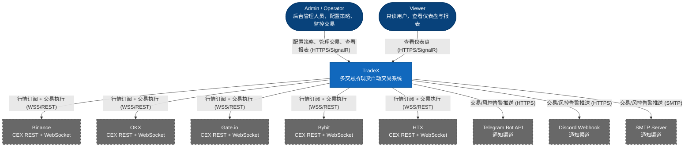

### 3.2 容器视图 (Level 2 — Container)

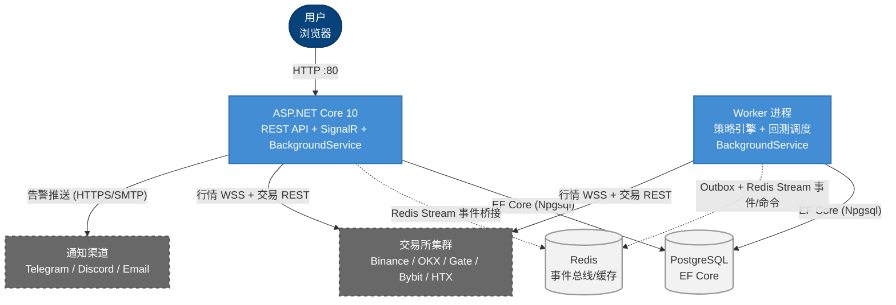

**容器职责矩阵**：

| 容器 | 技术 | 实例数 | 状态持久化 | 扩缩容 |
|------|------|--------|-----------|--------|
| Backend (API) | ASP.NET Core 10 | 1 | 无状态 | 水平扩展 |
| Worker | .NET 10 Generic Host | 1 | 有状态（策略引擎） | 仅垂直 |
| PostgreSQL | PostgreSQL 16 + Npgsql EF Core | 1 | 持久卷 | N/A |
| Redis | Redis 7.4 | 1 | 无持久化 | N/A |

> **关键约束**：Trading Engine 作为 `BackgroundService` 维护策略评估循环和内存 K 线缓存，当前架构仅支持单后端实例。多实例部署需引入分布式缓存（Redis）和分布式锁，属于后期可演进方向。

**前端架构**：

| 方面 | 方案 | 说明 |
|------|------|------|
| 框架 | Vue 3 + TypeScript + Vite | 组合式 API `<script setup>` 渲染模式 |
| 组件库 | Arco Design Vue (`@arco-design/web-vue`) | 企业级 UI 组件库，响应式布局 |
| 路由 | Vue Router 4 | 声明式路由 + 导航守卫 + 角色鉴权 |
| 状态管理 | Pinia Store | 按业务域拆分 Store |
| 实时通信 | `@microsoft/signalr` + `useSignalR` composable | 强类型 TypeScript 订阅模式 |
| 图表 | `vue-echarts` + `lightweight-charts` | K 线图、回测图表 |

**SignalR 事件订阅关系**：

| 事件 | 推送方向 | 消费方 |
|------|---------|--------|
| `PositionUpdated` | Server → Client | 前端持仓面板 |
| `OrderPlaced` | Server → Client | 前端订单列表 |
| `StrategyStatusChanged` | Server → Client | 前端策略列表 |
| `RiskAlert` | Server → Client | 前端风控告警 |
| `DashboardSummary` | Server → Client | 前端仪表盘 |
| `ExchangeConnectionChanged` | Server → Client | 前端连接状态 |

### 3.3 组件视图 (Level 3 — Component)

#### 3.3.1 TradeX.Api 组件

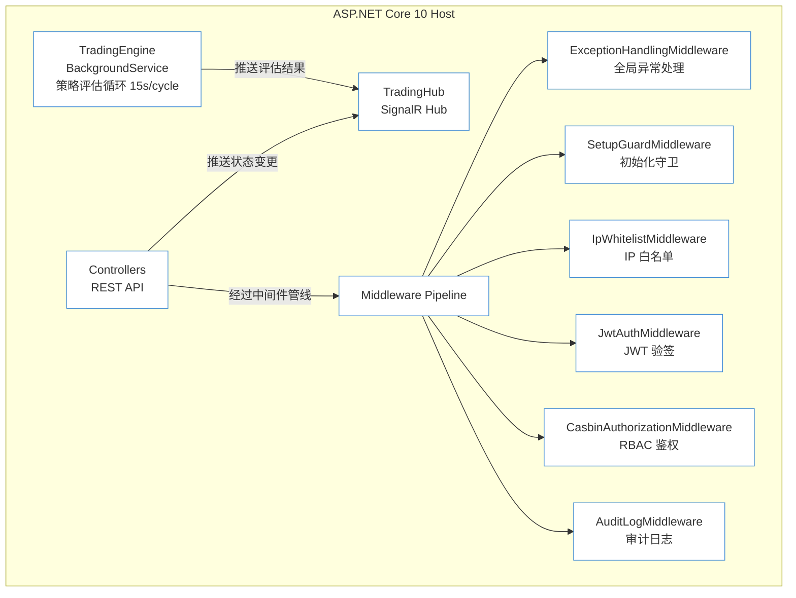

**中间件管线顺序**：

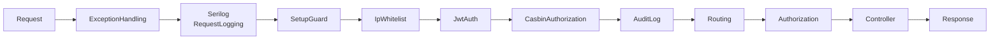

**各中间件职责**：

| 中间件 | 职责 | 说明 |
|--------|------|------|
| `ExceptionHandlingMiddleware` | 全局异常捕获，统一 JSON 错误响应 | 500 → 带 traceId 的标准化错误体 |
| `SetupGuardMiddleware` | 初始化守卫 | 未初始化时仅放行 `/api/setup` 和 `/health` |
| `IpWhitelistMiddleware` | IP 白名单验证 | 从 `SystemConfig.security.ip_whitelist` 读取白名单列表，支持 CIDR 格式 |
| `JwtAuthMiddleware` | JWT 令牌验证 | 通过 `app.UseAuthentication()` 中间件 |
| `CasbinAuthorizationMiddleware` | RBAC 角色鉴权 | 路由白名单：`/api/auth/*`, `/health`, `/api/setup`, `/hubs/*` 跳过检查 |
| `AuditLogMiddleware` | 审计日志自动记录 | 自动忽略 GET/HEAD/OPTIONS 无变更操作 |

**SignalR Hub — TradingHub**：

```csharp
public class TradingHub : Hub
{
    public async Task SubscribeToStrategy(string strategyId);
    public async Task UnsubscribeFromStrategy(string strategyId);
}
```

**事件合约（命名规范：PascalCase）**：

| 事件名 | Payload 字段 | 触发时机 |
|--------|-------------|---------|
| `PositionUpdated` | `positionId, traderId, exchangeId, strategyId, Pair, quantity, entryPrice, unrealizedPnl, realizedPnl, status, updatedAt` | 持仓更新/关闭 |
| `OrderPlaced` | `orderId, traderId, exchangeId, strategyId, Pair, side, type, quantity, status, placedAt` | 下单/成交/取消 |
| `StrategyStatusChanged` | `strategyId, traderId, oldStatus, newStatus, reason, changedAt` | 状态机转换 |
| `RiskAlert` | `alertId, level (Info/Warning/Critical), category (DailyLoss/Drawdown/CircuitBreaker/Cooldown/Slippage/MaxPosition), traderId, strategyId, message, detailJson, triggeredAt` | 风控链拦截 |
| `DashboardSummary` | `totalPnl, totalPositions, activeStrategies, dailyPnl, winRate, lastUpdatedAt` | 定时推送 (15s) |
| `ExchangeConnectionChanged` | `exchangeId, traderId, oldStatus (Connected/Disconnected/Error), newStatus, errorMessage, changedAt` | WS 断线/重连 |

#### 3.3.2 TradeX.Trading 组件

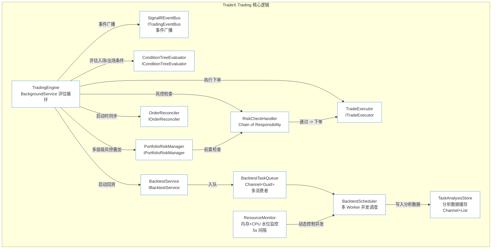

**Trading Engine 评估周期（15s/cycle）**：

```
1. 从 DB 读取所有 Active 策略列表
2. For each Active strategy:
   a. 从内存缓存读取最新 K 线
   b. 计算绑定指标
   c. 评估入场条件树 → 满足 → 风控链检查 → 执行买入
   d. 评估出场条件树 → 满足 → 执行卖出/止损/止盈
3. 更新所有 Open 持仓的当前价格 + PnL
4. 通过 SignalR 推送状态变更
5. 生成通知（新交易/告警）
```

**Volatility Grid 决策流程**：

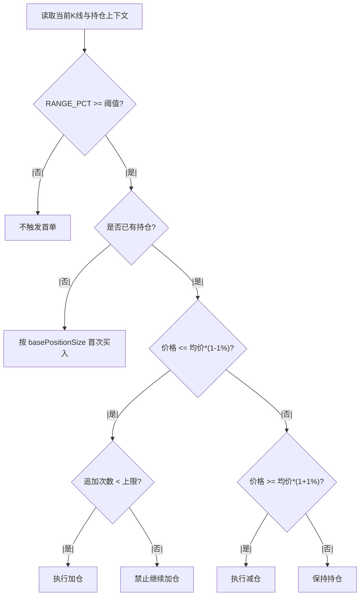

实现约束：
- 回测引擎与实盘引擎共用同一决策函数，避免行为漂移
- `noStopLoss=true` 仅影响仓位级止损分支，不跳过账户级风险控制
- 双周期（5m/15m）通过双部署实现，执行层增加去重窗口避免重复下单

**回测引擎设计**：

| 方面 | 设计决策 |
|------|---------|
| 回放模式 | 逐 K 线回放，从数据库读取历史 K 线，以 Close Time 为时间轴步进 |
| 策略执行 | 同一个 `ConditionTreeEvaluator` + `TradeExecutor`（mock 模式），风控链仅在统计中标记 |
| 费用模型 | maker/taker 费率（从 `ExchangePairRuleSnapshot` 读取），默认 taker 0.1%；滑点模拟 0.05% |
| 绩效指标 | 总收益率、年化收益率、最大回撤 (MDD)、夏普比率、胜率、盈亏比、总交易次数、平均持仓时间 |
| 回测限制 | 不支持市价单模拟（以 close 价成交）；不支持滑点动态模型；假设无限流动性 |

**绩效指标计算方式**：

| 指标 | 公式 | 说明 |
|------|------|------|
| 总收益率 | `(finalEquity - initialEquity) / initialEquity` | 不含手续费 |
| 年化收益率 | `总收益率 * (365 / 回测天数)` | 简化年化，非复利 |
| 最大回撤 | `max(peak - trough) / peak` | 净值曲线峰值到后续谷值最大跌幅 |
| 夏普比率 | `(年化收益率 - 无风险利率) / 年化波动率` | 无风险利率默认 2% |
| 胜率 | `盈利交易次数 / 总交易次数` | 含手续费后计算盈亏 |
| 盈亏比 | `平均盈利额 / \|平均亏损额\|` | 含手续费 |

**回测通过标准**：

| 指标 | 最低要求 |
|------|---------|
| 总收益率 | ≥ 5%（周期内） |
| Sharpe Ratio | ≥ 1.0 |
| 胜率 | ≥ 40% |
| 交易次数 | ≥ 10 |

#### 3.3.3 TradeX.Exchange 组件

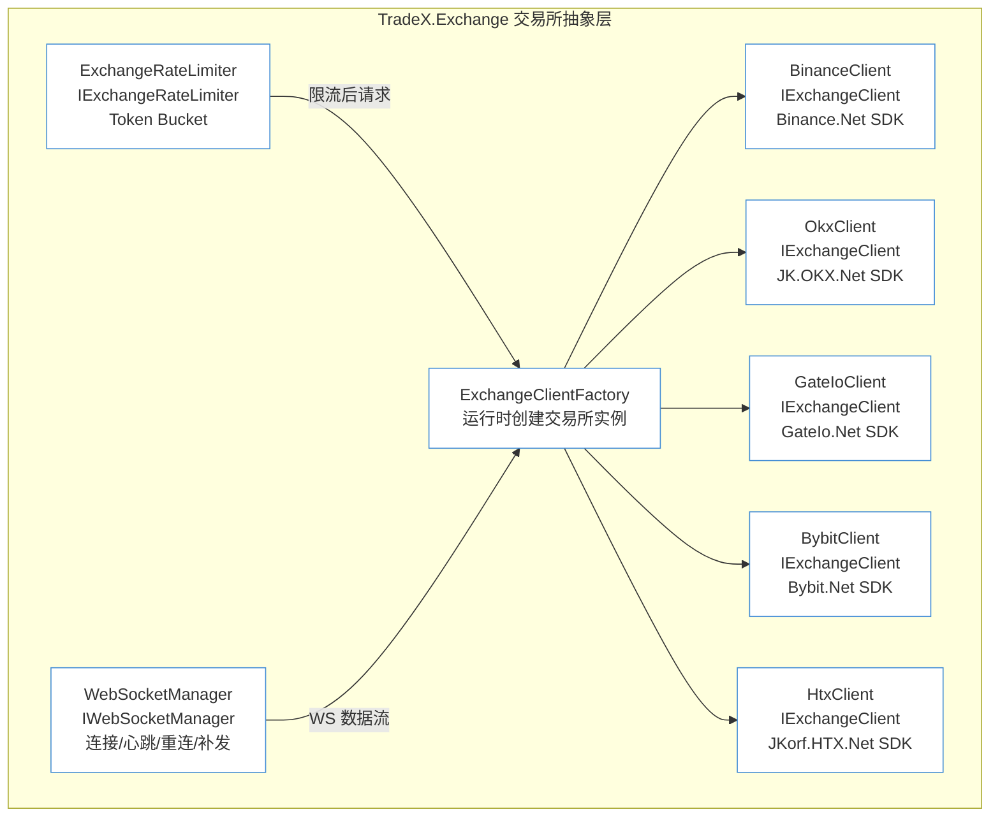

**IExchangeClient 统一接口**：

```csharp
public interface IExchangeClient
{
    // Market Data
    IAsyncEnumerable<Kline> SubscribeKlinesAsync(string Pair, string interval, CancellationToken ct);
    Task<Kline[]> GetKlinesAsync(string Pair, string interval, DateTime start, DateTime end, CancellationToken ct);
    Task<OrderBook> GetOrderBookAsync(string Pair, int limit, CancellationToken ct);

    // Account
    Task<AccountBalance> GetBalanceAsync(CancellationToken ct);
    Task<Position[]> GetPositionsAsync(CancellationToken ct);

    // Trading
    Task<OrderResult> PlaceOrderAsync(OrderRequest request, CancellationToken ct);
    Task<OrderResult> CancelOrderAsync(string exchangeOrderId, CancellationToken ct);
    Task<OrderResult> GetOrderAsync(string exchangeOrderId, CancellationToken ct);
    Task<OrderResult[]> GetRecentOrdersAsync(DateTime since, CancellationToken ct);

    // Validation
    Task<ConnectionTestResult> TestConnectionAsync(CancellationToken ct);

    // Rules
    Task<PairRule[]> GetPairRulesAsync(CancellationToken ct);
}
```

#### 3.3.4 TradeX.Indicators 组件

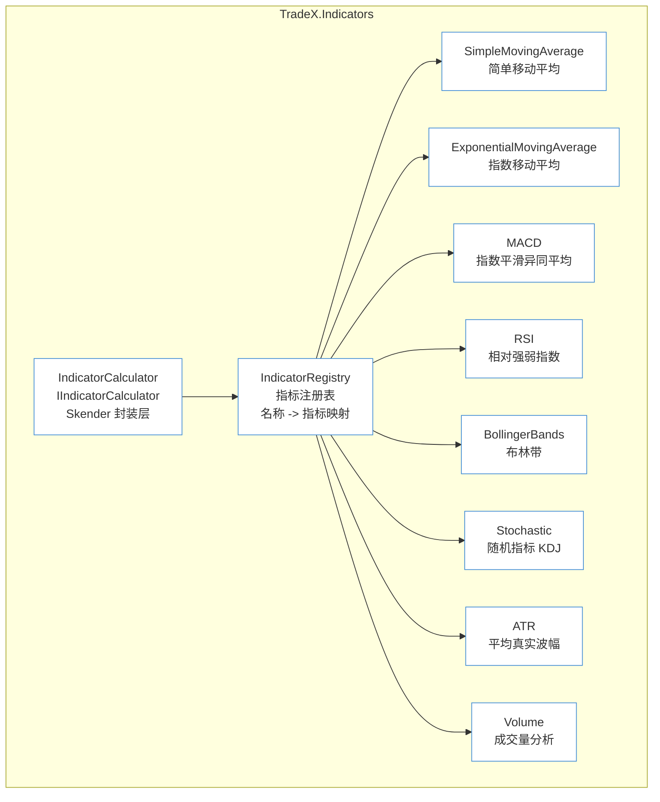

**接口定义**：

```csharp
public interface IIndicatorCalculator<TResult>
    where TResult : class
{
    string Name { get; }
    TResult Calculate(IReadOnlyList<Kline> klines);
    bool RequiresWarmup { get; }
    int WarmupPeriod { get; }
}
```

**首批支持的 8 个指标**：

| 指标 | 计算方式 | Warmup | 关键参数 | 典型使用 |
|------|---------|--------|---------|---------|
| SMA | 简单移动平均 | period - 1 | period: 5-200 | 趋势识别 |
| EMA | 指数加权移动平均 | period × 2 | period: 5-200 | 快线/慢线交叉 |
| MACD | EMA(12) - EMA(26) + Signal(9) | 33 | fast/slow/signal | 趋势动量 |
| RSI | 平均涨幅 / 平均跌幅 | period + 1 | period: 14 | 超买/超卖 (70/30) |
| BB | 中轨 ± k × 标准差 | period - 1 | period: 20, k: 2 | 波动率/突破 |
| Stochastic | %K = (C-L14)/(H14-L14)×100 | period + 1 | k/d: 5/3 | 超买/超卖 (80/20) |
| ATR | EMA of True Range | period - 1 | period: 14 | 波动率/止损 |
| Volume | 均值对比 | 0 | period: 20 | 放量/缩量 |

#### 3.3.5 TradeX.Infrastructure 组件

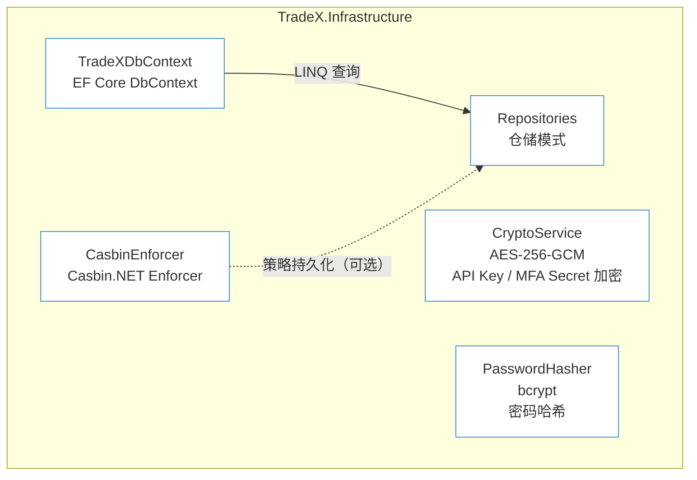

**数据库迁移策略**：

| 项 | 规格 |
|---|------|
| 迁移工具 | EF Core Migrations（`dotnet ef migrations add`） |
| 自动执行 | 启动时 `Database.MigrateAsync()` 自动应用未处理迁移 |
| 设计时工厂 | `TradeXDbContextFactory` 提供设计时 DbContext 创建 |
| 迁移文件 | 存储在 `TradeX.Infrastructure/Data/Migrations/`，需提交至 Git |

#### 3.3.6 TradeX.Notifications 组件

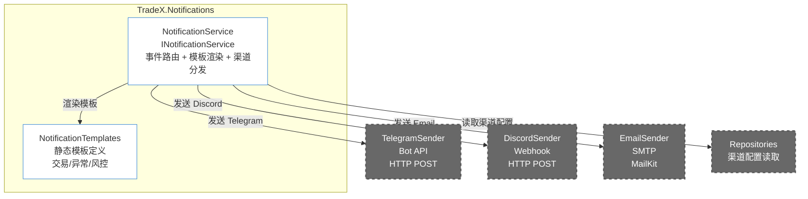

**通知事件分类**：

| 事件类别 | 事件 | 触发条件 |
|---------|------|---------|
| 交易 | order_filled | 订单完全成交 |
| 交易 | position_opened | 新开仓 |
| 交易 | position_closed | 平仓 |
| 交易 | stop_loss_triggered | 止损触发 |
| 交易 | take_profit_triggered | 止盈触发 |
| 异常 | ws_disconnected | WS 断线 |
| 异常 | ws_reconnected | WS 重连成功 |
| 异常 | api_key_invalid | API Key 验证失败 |
| 风控 | daily_loss_breach | 日亏损超限 |
| 风控 | max_drawdown_breach | 回撤超限 |
| 风控 | consecutive_loss_pause | 连续亏损暂停 |

#### 3.3.7 TradeX.Core 领域模型

Core 是 TradeX 的领域叶节点，包含枚举定义、值对象和领域接口。**零依赖**。

**核心枚举**：

| 枚举 | 值 | 使用场景 |
|------|-----|---------|
| `ExchangeType` | `Binance`, `Okx`, `GateIo`, `Bybit`, `Htx` | Exchange 配置、客户端工厂 |
| `StrategyStatus` | `Draft`, `Backtesting`, `Passed`, `Active`, `Disabled` | 策略状态机 |
| `OrderSide` | `Buy`, `Sell` | 订单、持仓方向 |
| `OrderType` | `Market`, `Limit` | 订单类型 |
| `OrderStatus` | `Pending`, `PartiallyFilled`, `Filled`, `Cancelled`, `Failed` | 订单生命周期 |
| `PositionStatus` | `Open`, `Closed` | 持仓状态 |
| `UserRole` | `SuperAdmin`, `Admin`, `Operator`, `Viewer` | RBAC 鉴权 |
| `UserStatus` | `PendingMfa`, `Active`, `Disabled` | 用户状态 |
| `TraderStatus` | `Active`, `Disabled` | 交易员状态 |
| `RiskAlertLevel` | `Info`, `Warning`, `Critical` | 风控告警级别 |
| `RiskAlertCategory` | `DailyLoss`, `MaxDrawdown`, `ConsecutiveLoss`, `CircuitBreaker`, `Cooldown`, `Slippage`, `MaxPosition` | 风控类别 |
| `ConnectionStatus` | `Connected`, `Disconnected`, `Error` | 交易所连接状态 |
| `BacktestTaskStatus` | `Pending`, `Running`, `Completed`, `Failed`, `Cancelled` | 回测任务状态 |
| `NotificationChannelType` | `Telegram`, `Discord`, `Email` | 通知渠道类型 |

**核心值对象**：

| 值对象 | 字段 | 用途 |
|--------|------|------|
| `Pair` | `ExchangeType + BaseAsset + QuoteAsset` (e.g. `Binance:BTCUSDT`) | 交易对唯一标识 |
| `Money` | `decimal Amount + string Currency` / `string Asset` | 金额/资产数量 |
| `Kline` | `Open/High/Low/Close/Volume/Timestamp` | K 线数据 |
| `KlineInterval` | 标准间隔值对象 (`1m`, `5m`, `15m`, `1h`, `4h`, `1d`) | K 线时间间隔 |

## 4. 数据架构

### 4.1 数据存储分布策略

| 数据类别 | 存储引擎 | 访问模式 | 一致性要求 | 备份策略 |
|----------|---------|---------|-----------|---------|
| 用户 / 配置 | PostgreSQL | 低频读写 | 强一致 | pg_dump |
| 交易所凭证 | PostgreSQL (AES 加密) | 低频读 | 强一致 | 同上 |
| 策略 / 订单 | PostgreSQL | 中频读写 | 强一致 | 同上 |
| 持仓 | PostgreSQL | 高频更新（15s/cycle） | 最终一致 | 同上 |
| 审计日志 | PostgreSQL | 仅追加写 + 低频范围查 | 最终一致 | 同上 + 归档 |
| K 线历史 | 交易所 REST API | 回测时实时拉取 | 最终一致 | — |
| 归档订单 | JSON (gzip) | 极低频读 | 最终一致 | 与 PostgreSQL 同卷 |

### 4.2 ER 图（核心实体）

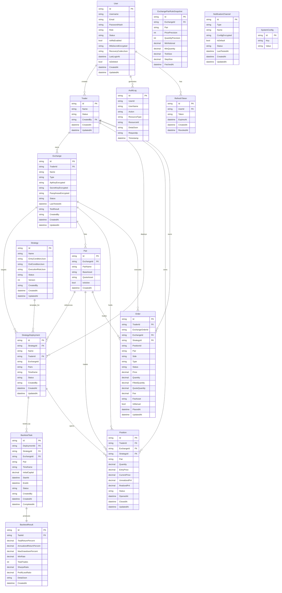

## 5. 数据流设计

### 5.1 实时交易数据流

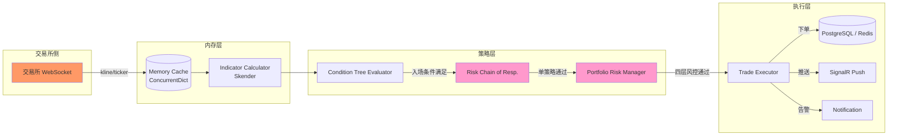

### 5.2 系统启动数据流

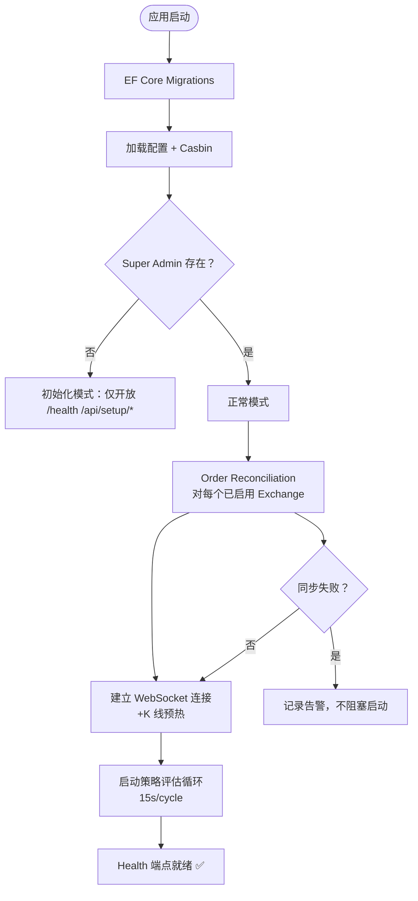

### 5.3 WebSocket 断线重连 + K 线回填

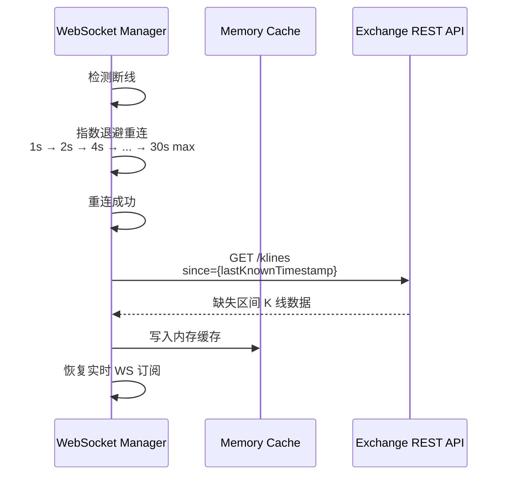

## 6. 条件树数据结构

策略的入场/出场条件以 JSON 树形式存储在 `Strategy.EntryConditionJson` / `ExitConditionJson` 字段中。

### 6.1 节点类型定义

| 节点类型 | 作用 | 子节点 | 示例 |
|---------|------|--------|------|
| `AND` | 所有子条件同时满足 | N 个条件节点 | `{ "operator": "AND", "conditions": [...] }` |
| `OR` | 任一子条件满足 | N 个条件节点 | `{ "operator": "OR", "conditions": [...] }` |
| `NOT` | 取反子条件 | 1 个条件节点 | `{ "operator": "NOT", "conditions": [...] }` |
| 叶节点 | 指标值比较 | 0（叶节点） | `{ "indicator": "RSI", ... }` |

### 6.2 叶节点字段

| 字段 | 说明 | 取值范围 |
|------|------|---------|
| `indicator` | 指标名称 | `SMA`, `EMA`, `MACD`, `RSI`, `BB`, `Stochastic`, `ATR`, `Volume` |
| `parameters` | 指标参数 | 各指标对应的参数 (period/fast/slow/signal/k 等) |
| `source` | K 线周期 | `15m`, `1h`, `4h`, `1d` |
| `comparison` | 比较运算符 | `>` / `<` / `>=` / `<=` / `==` / `CrossAbove` / `CrossBelow` / `Inside` / `Outside` |
| `value` | 比较值或阈值 | 数值或 JSON 对象（BB 上下轨等） |
| `offset` | K 线偏移量 | `0` 当前未闭合 K 线, `1` 上一根已闭合 |

### 6.3 完整条件树示例（入场条件）

```json
{
  "operator": "AND",
  "conditions": [
    {
      "indicator": "RSI",
      "parameters": { "period": 14 },
      "source": "1h",
      "comparison": "CrossAbove",
      "value": 30,
      "offset": 1
    },
    {
      "operator": "NOT",
      "conditions": [
        {
          "indicator": "SMA",
          "parameters": { "period": 50, "source": "close" },
          "source": "1h",
          "comparison": ">",
          "value": 50000,
          "offset": 1
        }
      ]
    }
  ]
}
```

### 6.4 约束规则

| # | 规则 | 校验逻辑 |
|---|------|---------|
| 1 | 树深度 ≤ 5 层 | 递归遍历，超限拒绝 |
| 2 | NOT 节点必须且仅有 1 个子节点 | 检查 children.length == 1 |
| 3 | Indicator 节点必须为叶节点 | 检查 hasChildren == false |
| 4 | CrossAbove / CrossBelow 不能用于多指标对比 | 仅支持与常数值比较 |
| 5 | source 必须为配置中已启用的 K 线周期 | 校验枚举值 |
| 6 | offset 仅 0/1，出场条件允许 -1（下一周期） | 校验整数值范围 |

## 7. 核心业务状态机

### 7.1 系统初始化状态机

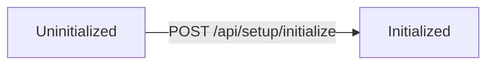

- **Uninitialized**：数据库不存在 Super Admin，仅放行 `/health`, `/api/setup/*`
- **Initialized**：初始化完成，全部 API 按鉴权规则工作
- 不可逆：重置需通过数据库清理 + 容器重建

### 7.2 用户状态机

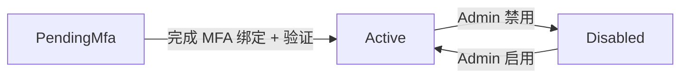

- 约束：Super Admin 不可被禁用

### 7.3 策略状态机

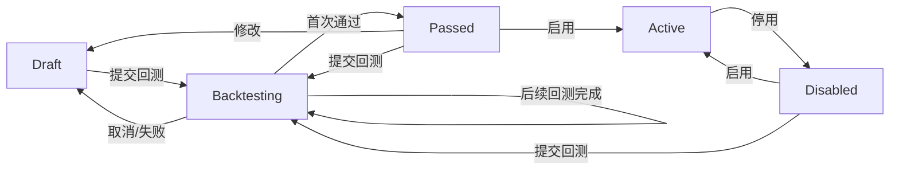

约束：
- **首次回测规则**：策略从 `Draft` 提交回测，通过后切换为 `Passed`。此后的所有回测均**不改变状态**
- 仅 `Passed` 状态可切换为 `Active`
- 同一 Trader 在同一 Exchange 上对同一 Pair 同时仅允许一个 `Active` 策略
- `Active → Disabled` 可在任意时间由用户触发
- 删除部署时，级联删除关联的回测任务和回测结果数据

#### 策略部署作用域与优先级

策略模板可按以下三个作用域部署，优先级从高到低：

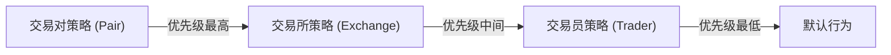

| 作用域 | TraderId | ExchangeId | Pairs | 适用场景 |
|--------|----------|------------|-----------|----------|
| Trader | ✅ 必填 | 空 | 空 | 全局风控、统一止损 |
| Exchange | ✅ 必填 | ✅ 必填 | 空 | 交易所级别策略 |
| Pair | ✅ 必填 | ✅ 必填 | ✅ 必填 | 精确交易对策略 |

**生效规则**：按 `Pair → Exchange → Trader → 默认行为` 顺序查找，高优先级覆盖低优先级。

### 7.4 订单状态机

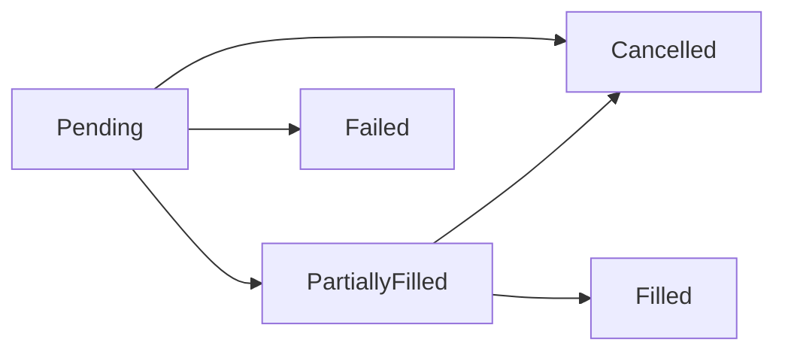

### 7.5 持仓状态机

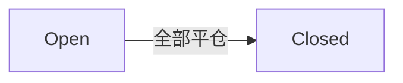

### 7.6 回测任务状态机

```mermaid
flowchart LR
    A["Pending"] --> B["Running"]
    B --> C["Completed"]
    B --> D["Failed"]
```

### 7.7 Volatility Grid 策略约束

| 约束 | 说明 |
|------|------|
| 首单触发条件 | `RANGE_PCT >= entryVolatilityPercent`（默认 `1.0`） |
| 持仓后加仓条件 | `lastPrice <= avgEntryPrice * (1 - rebalancePercent)` |
| 持仓后减仓条件 | `lastPrice >= avgEntryPrice * (1 + rebalancePercent)` |
| 最大追加次数 | `pyramidingCount <= maxPyramidingLevels`（默认 `5`） |
| `noStopLoss=true` | 仅关闭仓位级止损，不影响账户级风控链 |

## 8. 风控规格

### 8.1 风控管线 (Chain of Responsibility)

风控由链式管线执行，每个节点独立检查，全通过则放行：

```mermaid
flowchart LR
    A["入市请求"] --> B["[1] SlippageCheck<br/>滑点检查"]
    B --> C["[2] DailyLossCheck<br/>日亏损检查"]
    C --> D["[3] MaxDrawdownCheck<br/>最大回撤检查"]
    D --> E["[4] ConsecutiveLossCheck<br/>连续亏损检查"]
    E --> F["[5] FreqCircuitBreaker<br/>交易频率熔断"]
    F --> G["[6] CooldownCheck<br/>冷却期检查"]
    G --> H["[7] MaxPositionCheck<br/>最大持仓检查"]
    H --> I["[通过] 执行下单"]
```

### 8.2 各检查项规格

| 检查项 | 触发条件 | 处理方式 |
|--------|---------|---------|
| 滑点检查 | 预估滑点 > `slippageTolerancePercent` | 拒绝并记录 |
| 日亏损检查 | 当日累计已实现亏损 > `maxDailyLossPercent` | 暂停全账户，次日 00:00 UTC 恢复 |
| 最大回撤检查 | 账户净值回撤 > `maxDrawdownPercent` | 暂停全账户，通知管理员 |
| 连续亏损检查 | 策略连续亏损 ≥ `consecutiveLossLimit` | 暂停该策略，通知 |
| 交易频率熔断 | 单策略 5 分钟内触发买入 ≥ 3 次 | 跳过本次，冷却延长 |
| 冷却期检查 | 距上次交易 < `cooldownSeconds` | 跳过本次 |
| 最大持仓检查 | 当前持仓数 ≥ `maxPositionCount` | 跳过买入 |

### 8.3 RiskContext 字段

| 字段 | 说明 |
|------|------|
| `TraderId` | 所属交易员 |
| `StrategyId` | 触发策略（手动下单可为 null） |
| `ExchangeId` | 目标交易所 |
| `Pair` | 交易对 |
| `Side` | 买卖方向 |
| `EstimatedQuantity` | 预估数量 |
| `EstimatedPrice` | 预估价格 |
| `EstimatedSlippagePercent` | 预估滑点百分比 |
| `ExecutionRule` | 策略执行规则 |
| `SystemConfig` | 系统配置快照 |
| `Stats` | 交易统计快照 |
| `PortfolioRisks` | 多层级风控上下文 |

### 8.4 多层级组合风控（四层模型）

| 层级 | 风控项 | 配置位置 |
|------|--------|---------|
| **系统级** | Kill Switch、总敞口上限、日亏损上限、最大回撤、Engine 看门狗 | `SystemConfig.Risk.*` |
| **交易员级** | 总敞口上限、日亏损上限、活跃策略数上限、最大回撤 | `Trader.RiskSettings.*` |
| **交易所级** | 最大可交易余额、API 健康度、单日交易量上限、币种集中度 | `Exchange.*`, `Exchange.RiskSettings.*` |
| **币种级** | 单币种总持仓上限、日交易次数上限 | `PairRule.*` |

### 8.5 风控触发与恢复策略

| 层级 | 触发行为 | 恢复条件 |
|------|---------|---------|
| 系统级 | 停止所有交易，禁用所有策略，发紧急通知 | 手动确认后恢复 |
| 交易员级 | 暂停该 Trader 下所有策略，通知 Trader 创建者 | 手动恢复或次日 UTC 重置 |
| 交易所级 | 自动 Disable 该 Exchange 下所有关联策略，通知 | 手动恢复 |
| 币种级 | 跳过本轮该 Pair 买入，记录日志 | 下一评估周期自动重试 |

## 9. WebSocket 连接管理器规格

### 9.1 职责

| 职责 | 说明 |
|------|------|
| 连接管理 | 建立、维护、重连 WebSocket 连接 |
| 心跳 | 按各交易所要求发送 ping/pong |
| 重连 | 断线检测后自动重连，指数退避（1s → 2s → 4s → ... → 30s max） |
| 数据写入 | 接收数据后写入内存缓存 |
| 连接状态 | 暴露连接状态供 Health 检查使用 |

### 9.2 WS 断线补发策略

| 交易所 | 补发机制 | 说明 |
|--------|---------|------|
| Binance | 支持 | WS 断线后 REST GET /klines 回填缺失区间 |
| OKX | 支持 | WS 断线后 REST GET /market/candles 回填 |
| Gate.io | 需调研 | — |
| Bybit | 支持 | WS 断线后 REST GET /market/kline 回填 |
| HTX | 需调研 | — |

默认降级策略：以 REST 接口作为 fallback，回填自上次已知 kline 时间戳到当前时间。

### 9.3 合约

```csharp
public interface IWebSocketManager
{
    Task ConnectAsync(string exchangeType, CancellationToken ct);
    Task DisconnectAsync(string exchangeType);
    WebSocketStatus GetStatus(string exchangeType);
}

public enum WebSocketStatus
{
    Disconnected,
    Connecting,
    Connected,
    Reconnecting
}
```

## 10. 统一限流层规格

### 10.1 设计

| 维度 | 说明 |
|------|------|
| 粒度 | `ExchangeType + AccountId + EndpointGroup` |
| 算法 | Token Bucket |
| 配置来源 | `ExchangeRateLimitSettings` 强类型配置 |
| 限流参数 | 按各交易所官方文档配置（`/api/*`、`/sapi/*`、WS 等分组） |

### 10.2 策略

| 场景 | 行为 |
|------|------|
| 有可用 token | 立即获取，继续执行 |
| 无可用 token + 可等待 | 排队等待，最大超时 2s |
| 无可用 token + 不可等待 | 快速失败，记录告警日志 |
| 排队超时 | 快速失败，记录告警 |

### 10.3 合约

```csharp
public interface IExchangeRateLimiter
{
    ValueTask<IDisposable> AcquireAsync(
        string exchange,
        string accountId,
        string endpointGroup,
        int permits,
        CancellationToken cancellationToken);
}
```

## 11. 部署架构

### 11.1 Docker Compose 网络拓扑

```mermaid
flowchart TB
  classDef external fill:#f5f5f5,color:#333,stroke:#999,stroke-width:2px
  classDef group fill:none,stroke:#666,stroke-width:2px,stroke-dasharray:5 5
  classDef volume fill:#e8f4e8,color:#333,stroke:#4caf50,stroke-width:1px

  subgraph External["External"]
    direction TB
    USER[("用户浏览器 :80")]:::external
    EXS[("交易所 :443")]:::external
  end

  subgraph NETWORK["tradex-network (bridge)"]
    subgraph APP["tradex — 统一容器"]
      API[ASP.NET Core 10<br/>REST + SPA + SignalR + BackgroundService<br/>:80]
    end

    VOL_DATA[(tradex-data)]:::volume
  end

  USER --> API
  API --> VOL_DATA
  API --> EXS
```

### 11.2 路由策略

所有请求在同一端口 (80) 上按路径分发：

| 路径 | 目标 | 说明 |
|------|------|------|
| `/api/*` | REST Controllers | 后端 API |
| `/hubs/trading` | SignalR Hub | 实时数据推送 |
| `/health` | Health Check | 健康检查 |
| `/metrics` | Prometheus | OpenTelemetry 指标暴露 |
| `/*` | Vue SPA 页面路由 | 前端页面导航 |

### 11.3 Docker Compose 配置

```yaml
services:
  postgres:
    image: postgres:16-alpine
    container_name: tradex-postgres
    environment:
      - POSTGRES_DB=tradex
      - POSTGRES_USER=tradex
      - POSTGRES_PASSWORD=${POSTGRES_PASSWORD:?POSTGRES_PASSWORD is required}
    volumes:
      - tradex-postgres-data:/var/lib/postgresql/data
    healthcheck:
      test: ["CMD-SHELL", "pg_isready -U tradex -d tradex"]
      interval: 10s
      timeout: 5s
      retries: 10
      start_period: 30s
    restart: unless-stopped

  redis:
    image: redis:7.4-alpine
    container_name: tradex-redis
    command: ["redis-server", "--appendonly", "no", "--save", ""]
    healthcheck:
      test: ["CMD", "redis-cli", "ping"]
      interval: 10s
      timeout: 3s
      retries: 5
    restart: unless-stopped

  backend:
    build:
      context: .
      dockerfile: Dockerfile
      target: api
    container_name: tradex-api
    depends_on:
      postgres: { condition: service_healthy }
      redis: { condition: service_healthy }
    ports: ["80:80"]
    environment:
      - ASPNETCORE_ENVIRONMENT=Production
      - ASPNETCORE_URLS=http://+:80
      - ConnectionStrings__DefaultConnection=Host=postgres;Port=5432;Database=tradex;Username=tradex;Password=${POSTGRES_PASSWORD};
      - Redis__ConnectionString=redis:6379
      - Jwt__Secret=${JWT_SECRET:?JWT_SECRET is required}
    healthcheck:
      test: ["CMD", "curl", "-f", "http://localhost:80/health"]
      interval: 30s
      timeout: 10s
      retries: 3
      start_period: 30s
    restart: unless-stopped

  worker:
    build:
      context: .
      dockerfile: Dockerfile
      target: worker
    container_name: tradex-worker
    depends_on:
      postgres: { condition: service_healthy }
      redis: { condition: service_healthy }
    environment:
      - DOTNET_ENVIRONMENT=Production
      - ConnectionStrings__DefaultConnection=Host=postgres;Port=5432;Database=tradex;Username=tradex;Password=${POSTGRES_PASSWORD};
      - Redis__ConnectionString=redis:6379
      - Otel__PrometheusListener=http://+:9464/
    expose: ["9464"]
    restart: unless-stopped

volumes:
  tradex-postgres-data:
```

### 11.4 环境变量配置清单

| 变量 | 默认值 | 说明 |
|------|--------|------|
| `ASPNETCORE_ENVIRONMENT` | Production | 运行环境 |
| `ASPNETCORE_URLS` | http://+:80 | 监听地址（统一端口） |
| `ConnectionStrings__DefaultConnection` | — | PostgreSQL 连接串 |
| `Redis__ConnectionString` | — | Redis 连接串 |
| `Jwt__Secret` | — | **必填**，JWT 签名密钥 |
| `Jwt__AccessTokenExpiresMinutes` | 30 | AccessToken 有效期 |
| `Jwt__RefreshTokenExpiresDays` | 7 | RefreshToken 有效期 |
| `POSTGRES_PASSWORD` | — | **必填**，PostgreSQL tradex 用户密码 |
| `Serilog__MinimumLevel__Default` | Information | 日志级别 |

### 11.5 构建要求

- 多目标 Dockerfile（根级），4 阶段构建（frontend → backend → api-publish → worker-publish + runtime）
  1. `mcr.microsoft.com/dotnet/sdk:10.0-preview` — `dotnet publish -c Release`
  2. `mcr.microsoft.com/dotnet/aspnet:10.0-preview` — 运行编译后的应用
  - Vue SPA 静态文件（Vite build 输出）由 ASP.NET Core 中间件托管，REST API / SignalR Hub 在统一端口提供服务
- HTTPS 生产环境通过反向代理（Nginx）终止 TLS

## 12. 横切关注点

### 12.1 错误处理策略

| 层级 | 策略 | 说明 |
|------|------|------|
| Controller | 全局异常过滤器 `ExceptionHandlingMiddleware` | 500 → 统一 JSON 错误响应 + 日志 + traceId |
| Service/Business | 传播异常，自定义 `DomainException` | 400/404/409 → 带业务错误码 |
| Trading Engine | catch + log + 继续循环 | 单策略异常不影响其他策略；连续 N 次异常暂停该策略 |
| Exchange Client | catch API 异常 → 转换为 `ExchangeException` | 包含错误码、HTTP 状态、原始消息 |
| WebSocket | 断线重连自动恢复 | 重连失败上限后标记 `Disconnected`，不 crash |

### 12.2 日志策略

| 日志类别 | Serilog Sink | 保留策略 | 格式 |
|----------|-------------|---------|------|
| 应用日志 | Console + File | 7 天轮换 | JSON 结构化 |
| 审计日志 | AuditLog 表 | 6 个月 | 结构化 + 已索引 |
| 交易日志 | Console + File | 30 天轮换 | 结构化（含 OrderId/TraderId） |
| 风控日志 | Console + File | 30 天轮换 | 结构化（含 RiskContext） |

**结构化日志规范**：
```csharp
// ✅ 正确
_logger.LogInformation("Order {OrderId} filled for {Quantity} {Pair} at {Price}",
    order.Id, order.Quantity, order.Pair, order.Price);
// ❌ 禁止字符串拼接
```

### 12.3 并发策略

| 场景 | 策略 | 说明 |
|------|------|------|
| 同一 Pair 同时触发买入 | 策略级锁 + 风控熔断 | Trading Engine 同周期内同一 Pair 仅执行一次 |
| 手动下单 vs 策略下单 | 无冲突（共用风控链） | 手动下单同样经过滑点 + 日亏损检查 |
| 策略编辑 vs 策略评估 | 乐观并发（Version 字段） | `UPDATE ... WHERE Version = @expected` |
| 订单状态更新 | 幂等更新 | `Order.Status = Filled` 可重复执行，不报错 |
| 回测多任务同时执行 | 资源感知调度 | Worker 池固定 `MaxConcurrency` 个，`ResourceMonitor` 每 5s 采样内存 + CPU |

**回测资源感知调度架构**：

```mermaid
flowchart TB
    subgraph Scheduler["BacktestScheduler (BackgroundService)"]
        direction TB
        W1["Worker 1"] --> ACQ["TryAcquire"]
        W2["Worker 2"] --> ACQ
        WN["Worker N<br/>= MaxConcurrency"] --> ACQ
        ACQ -->|acquired| READ["Channel.Reader.ReadAsync()"]
        READ --> PROCESS["ProcessTaskAsync"]
        PROCESS --> RELEASE["ResourceMonitor.Release()"]
        PROCESS -->|失败| FAIL["FailTaskAsync"]
    end

    subgraph Monitor["ResourceMonitor (Singleton, IHostedService)"]
        direction TB
        LOOP["Timer 每 5s"] --> SAMPLE["采样内存 + CPU"]
        SAMPLE --> CALC["计算 AllowedConcurrency<br/>= min(mem_cap, cpu_cap)"]
        CALC --> UPDATE["更新 _allowedConcurrency"]
    end

    subgraph Queue["BacktestTaskQueue"]
        CHANNEL["Channel&lt;Guid&gt;<br/>SingleReader = false"]
    end

    BacktestService -->|EnqueueAsync| CHANNEL
    CHANNEL --> W1
    CHANNEL --> W2
    CHANNEL --> WN
```

**调度策略**：

```mermaid
flowchart TD
    subgraph mem_cap["mem_cap 计算"]
        M1{"memory <br/>< MemoryWarningMb?"}
        M1 --|是|--> M2["MaxConcurrency<br/>绿色：全力运行"]
        M1 --|否|--> M3{"memory <br/>< MemoryCriticalMb?"}
        M3 --|是|--> M4["max(1, Max-1)<br/>黄色：降级"]
        M3 --|否|--> M5{"memory <br/>< MemoryAbsoluteMb?"}
        M5 --|是|--> M6["1<br/>红色：仅保留 1 个"]
        M5 --|否|--> M7["0<br/>黑色：暂停新任务"]
    end

    subgraph cpu_cap["cpu_cap 计算"]
        C1{"cpu <br/>< CpuWarningPercent?"}
        C1 --|是|--> C2["MaxConcurrency"]
        C1 --|否|--> C3{"cpu <br/>< CpuCriticalPercent?"}
        C3 --|是|--> C4["max(1, Max-1)"]
        C3 --|否|--> C5{"cpu <br/>< CpuAbsolutePercent?"}
        C5 --|是|--> C6["1"]
        C5 --|否|--> C7["0"]
    end

    M2 --> R["AllowedConcurrency = min(mem_cap, cpu_cap)"]
    M4 --> R
    M6 --> R
    M7 --> R
    C2 --> R
    C4 --> R
    C6 --> R
    C7 --> R
```

**配置**：
```json
{
  "BacktestScheduler": {
    "maxConcurrency": 3,
    "taskTimeoutMinutes": 30,
    "monitorIntervalSeconds": 5,
    "memoryWarningMb": 512,
    "memoryCriticalMb": 1024,
    "memoryAbsoluteMb": 1536,
    "cpuWarningPercent": 50,
    "cpuCriticalPercent": 75,
    "cpuAbsolutePercent": 90
  }
}
```

### 12.4 安全边界

| 安全域 | 信任边界 | 控制点 |
|--------|---------|--------|
| 浏览器 ↔ Backend | 不可信 | HTTPS（生产）、CORS、XSS 防护 |
| Backend ↔ PostgreSQL/Redis | 可信内网 | Docker 内网通信 |
| Backend ↔ 交易所 | 不可信 | API Key 仅内存解密；错误处理不泄露凭证 |

**安全规格清单**：

| 安全项 | 规格 |
|--------|------|
| API Key / Secret / Passphrase | AES-256-GCM 加密后入库 |
| IP 白名单 | 可选开关，支持 CIDR 格式 |
| 密码 | bcrypt 哈希，cost 默认 12 |
| MFA Secret | AES-256-GCM 加密存储 |
| Recovery Codes | 只存 bcrypt 哈希，单次使用 |
| JWT AccessToken | 默认 30 分钟 |
| JWT RefreshToken | 默认 7 天，数据库持久化（可吊销），轮换策略 |
| MFA Token | 短生命周期（5 分钟） |
| Casbin | 模型配置文件 + CSV 策略文件 |
| CORS | 仅允许前端域名 |
| Swagger | 仅 Development 环境暴露 |
| 审计日志 | 敏感写操作自动记录 |
| 防暴力 | MFA 失败 5 次锁定 5 分钟 |

## 13. 质量属性

### 13.1 性能指标

| 指标 | 目标 | 测量方式 |
|------|------|---------|
| Trading Engine 评估周期 | ≤ 15s | 日志记录 cycle start/end |
| WebSocket 数据延迟 | ≤ 2s（交易所 → 内存缓存） | 时间戳比对 |
| REST API P95 响应时间 | ≤ 500ms | 中间件记录 |
| SignalR 推送延迟 | ≤ 1s | 客户端时间戳 |
| 回测 30 天 15m K 线 | ≤ 10s | 计时 |

### 13.2 可用性 (RTO/RPO)

| 场景 | 行为 | RTO | RPO |
|------|------|-----|-----|
| 进程崩溃 | Docker restart + Reconciliation 恢复 | < 30s | 0（PostgreSQL 事务写后即持久化）|
| 交易所 API 5xx | 限流 + 自动暂停（连续 N 次）→ 手动恢复 | < 1min | N/A |
| 交易所 WS 断线 | 指数退避重连 + K 线回填 | < 30s | 断线 K 线通过 REST 回填 |

### 13.3 安全性控制

| 控制项 | 实现 |
|--------|------|
| 认证 | JWT AccessToken + RefreshToken + MFA TOTP |
| 授权 | Casbin RBAC（API 路径 + HTTP 方法级别） |
| 加密 | AES-256-GCM 凭证加密；bcrypt 密码哈希；HTTPS |
| 审计 | 敏感操作自动记录 AuditLog |
| 防暴力 | MFA 失败次数上限（5 次锁定 5 分钟） |

## 14. 架构演进路线

| 阶段 | 架构目标 | 关键变化 |
|------|---------|---------|
| M1-M2 | 单体可运行 | PostgreSQL + 基础鉴权 + 交易所集成 |
| M3-M4 | 核心交易能力 | Trading Engine + 风控链 + 多层级组合风控 |
| M5-M6 | 完整运维能力 | 通知 + 回测 + 仪表盘 + 审计 + 回测并发调度 |
| M7 | 质量加固 | 全量测试 + 性能调优 + 边界调研 |
| **Post-MVP** | **高可用演进** | 如需要：Redis 分布式缓存 → 多实例 Trading Engine → 分布式锁 → 读写分离 |
| **Post-MVP** | **期货支持** | 多空双向、杠杆、保证金管理（需全新 RiskContext） |

## 15. 崩溃恢复与启动同步

### 15.1 启动顺序

```mermaid
flowchart TD
    A["ASP.NET Core 启动"] --> B["Database.MigrateAsync()<br/>自动执行未应用的 EF Core 迁移"]
    B --> C["加载配置 / 初始化 Casbin"]
    C --> D{"检查 Super Admin<br/>→ 初始化模式决策"}
    D --> E["Trading Engine 启动"]
    E --> E1["1. 读取所有 Status=Enabled 的 Exchange"]
    E1 --> E2["2. 对每个已启用交易所执行 Order Reconciliation"]
    E2 --> E3["3. 建立 WebSocket 连接 + K 线预热"]
    E3 --> E4["4. 启动策略评估循环"]
    E4 --> F["Health 端点就绪"]
```

### 15.2 Reconciliation 流程

```mermaid
flowchart TD
    A["For each Enabled Exchange:"] --> B["调用 IExchangeClient.GetRecentOrdersAsync(since: local last order time)"]
    B --> C{"比对返回的订单<br/>与本地 Order 表"}
    C --> D{"本地 pending<br/>但交易所已 filled?"}
    D --|是|--> E["更新本地状态"]
    D --|否|--> F{"本地 filled<br/>但交易所不存在?"}
    F --|是|--> G["标记异常，记录审计"]
    F --|否|--> H{"交易所订单数量<br/>与本地不匹配?"}
    H --|是|--> I["补充缺失记录"]
    H --|否|--> J["更新 Position 表"]
    E --> J
    G --> J
    I --> J
    J --> K["根据交易所余额/持仓数据<br/>校正本地持仓数量"]
    K --> L["记录日志: 同步条数 N, 修复条数 M"]
    L --> M{"失败?"}
    M --|是|--> N["记录告警<br/>不阻塞启动继续"]
    M --|否|--> O["继续下一交易所"]
```

## 16. 关键接口合约速查

| 接口 | 模块 | 用途 |
|------|------|------|
| `IExchangeClient` | TradeX.Exchange | 交易所统一操作抽象 |
| `IWebSocketManager` | TradeX.Exchange | WS 连接生命周期 |
| `IExchangeRateLimiter` | TradeX.Exchange | 交易所 API 限流 |
| `IIndicatorCalculator<TResult>` | TradeX.Indicators | 技术指标计算抽象 |
| `IConditionTreeEvaluator` | TradeX.Trading | 条件树评估 |
| `IRiskCheckHandler` | TradeX.Trading | 风控单节点 |
| `IPortfolioRiskManager` | TradeX.Trading | 四层组合风控 |
| `ITradeExecutor` | TradeX.Trading | 下单执行 |
| `ITradingEngine` | TradeX.Trading | 引擎启停控制 |
| `IOrderReconciler` | TradeX.Trading | 订单同步 |
| `IBacktestService` | TradeX.Trading | 回测服务 |
| `IBacktestTaskQueue` | TradeX.Trading | 回测任务队列 |
| `ITradingEventBus` | TradeX.Api | 交易事件总线 |
| `IResourceProvider` | TradeX.Trading | 系统资源抽象 |
| `IIndicatorService` | TradeX.Indicators | 指标计算服务 |
| `INotificationService` | TradeX.Notifications | 通知发送 |
| `IRepository<T>` | TradeX.Infrastructure | 数据持久化 |

## 17. 统一规则引擎 (RuleSet) 架构与流程

### 17.1 概述

统一规则引擎（`TradeX.Rules`）将策略定义从**硬编码的条件树（旧 Entry/Exit）** 升级为**可配置、可校验、前后端一致的规则集（RuleSet）**。

核心设计原则：

| 原则 | 说明 |
|------|------|
| **纯函数求值** | 同一输入（指标 + 持仓）永远产生同一决策，无副作用 |
| **短路求值** | 按优先级遍历规则，首条命中的规则即产出决策并立即返回 |
| **三道闸过滤** | 每条规则依次经过"上下文 → 约束 → 条件"三道闸，全通过才触发动作 |
| **实盘/回测同源** | `IStrategyDecisionEngine.Decide()` 是实盘和回测的唯一决策入口，行为一致 |
| **fail-closed** | 任一规则解析失败即拒绝整个规则集，杜绝"半套规则生效" |

### 17.2 核心模型关系

```mermaid
classDiagram
    class RuleSet {
        +string Code
        +string Name
        +IReadOnlyList~TradingRule~ Rules
        +Dictionary~string,decimal~? Params
    }

    class TradingRule {
        +string Code
        +string Name
        +ConditionNode? When
        +RuleAction Then
        +RuleContext Context
        +int Priority
        +RuleConstraints? Constraints
    }

    class ConditionNode {
        +string Operator
        +List~ConditionNode~ Conditions
        +string? Indicator
        +string? Comparison
        +decimal? Value
        +string? Ref
    }

    class RuleAction {
        +RuleActionType Type
        +decimal Size
        +string? SizeType
        +string? SizeMultiplierRef
        +string? Reason
    }

    class RuleConstraints {
        +int? MaxPositions
        +decimal? MaxPositionValue
        +int? MinInterval
    }

    class RuleEvaluationContext {
        +decimal CurrentPrice
        +decimal AverageEntryPrice
        +decimal QuantityHeld
        +int LotCount
        +Dictionary~string,decimal~ IndicatorValues
        +Dictionary~string,decimal~? PreviousIndicatorValues
        +string ScopeKey
        +DateTime EvaluationTime
    }

    RuleSet "1" --> "*" TradingRule
    TradingRule "1" --> "0..1" ConditionNode : when
    TradingRule "1" --> "1" RuleAction : then
    TradingRule "1" --> "0..1" RuleConstraints : constraints
    ConditionNode "1" --> "*" ConditionNode : conditions (递归子节点)
```

### 17.3 规则引擎全生命周期

```mermaid
flowchart TB
    subgraph 前端
        UI[策略配置页面<br/>JSON 编辑器] -->|POST /api/strategies| API
    end

    subgraph API层[TradeX.Api]
        API[StrategiesController] --> VAL[RuleSetValidator<br/>校验规则集 JSON]
        VAL -->|校验通过| SAVE[EF Core 持久化<br/>Strategy.ExecutionRule]
        VAL -->|校验失败| ERR[返回 400 + ValidationIssue 列表]
    end

    subgraph Worker[TradeX.Worker / TradeX.BacktestWorker]
        direction TB
        subgraph 实盘路径
            SEC[StrategyEvaluationConsumer<br/>Trade/Kline 双通道驱动] --> SDE[IStrategyDecisionEngine.Decide]
        end
        subgraph 回测路径
            BE[BacktestEngine<br/>逐 K 线遍历] --> SDE
        end
        SDE --> PARSER[RuleSetParser.TryParse<br/>JSON → RuleSet]
        PARSER --> EVAL[RuleEvaluator.Evaluate<br/>核心求值]
        EVAL --> DECISION[RuleDecision<br/>Buy / Sell / SellAll / Hold]
        DECISION --> MAP[StrategyDecision<br/>EnterMarket / Reduce / ExitAll / Hold]
        MAP -->|实盘| EXEC_LIVE[TradeExecutor<br/>交易所下单]
        MAP -->|回测| EXEC_BT[模拟 Lot 操作<br/>FIFO 持仓队列]
    end

    subgraph 通知
        EVENT[领域事件] --> NOTIF[通知渠道<br/>Telegram/Discord/Email]
    end

    UI -->|预览/校验| API
    EXEC_LIVE --> EVENT
    EXEC_BT --> EVENT
```

### 17.4 规则集 JSON 结构

```json
{
  "code": "trend_follow_v1",
  "name": "趋势追踪策略 v1",
  "params": {
    "risk_factor": 0.02
  },
  "rules": [
    {
      "code": "entry_rsi",
      "name": "RSI 超卖入场",
      "priority": 10,
      "context": "noPosition",
      "when": {
        "operator": "AND",
        "conditions": [
          { "indicator": "RSI", "comparison": "<", "value": 30 },
          { "indicator": "RSI", "comparison": "CA", "value": 30 }
        ]
      },
      "then": {
        "action": "buy",
        "size": 100,
        "reason": "RSI {RSI:F2} 超卖区金叉入场"
      },
      "constraints": {
        "maxPositions": 5,
        "minInterval": 300
      }
    },
    {
      "code": "exit_profit",
      "name": "止盈出场",
      "priority": 5,
      "context": "hasPosition",
      "when": {
        "operator": "OR",
        "conditions": [
          { "indicator": "DEVIATION_FROM_AVG", "comparison": ">", "value": 3 },
          { "indicator": "RSI", "comparison": ">", "value": 70 }
        ]
      },
      "then": {
        "action": "sellAll",
        "reason": "偏离均价 {DEVIATION_FROM_AVG:F2}% 或 RSI 超买止盈"
      }
    }
  ]
}
```

**字段说明**：

| 字段路径 | 必需 | 类型 | 说明 |
|---------|------|------|------|
| `code` | 是 | string | 规则集唯一标识 |
| `name` | 是 | string | 规则集名称 |
| `params` | 否 | object | 运行时参数（键值对，暂未消费） |
| `rules[]` | 是 | array | **至少 1 条**规则 |
| `rules[].code` | 是 | string | 规则唯一标识（规则集内唯一） |
| `rules[].name` | 是 | string | 规则显示名 |
| `rules[].priority` | 否 | int | 优先级（**越小越优先**，默认 0） |
| `rules[].context` | 否 | string | `any` / `noPosition` / `hasPosition`（默认 `any`） |
| `rules[].when` | 是 | object | 条件树（恒真用 `TRUE` 运算符或缺省 `conditions`） |
| `rules[].then` | 是 | object | 动作定义 |
| `rules[].constraints` | 否 | object | 约束条件 |

### 17.5 校验管线（Pre-persist）

```mermaid
flowchart TD
    START([接收策略 JSON]) --> PARSE{JSON 解析}
    PARSE -->|解析失败| ERR_JSON["返回 400<br/>JSON 格式错误"]
    PARSE -->|成功| ROOT_VAL[校验顶层字段]

    ROOT_VAL --> CHK_CODE{code 存在且非空?}
    CHK_CODE -->|否| ERR_CODE["$.code 必需的非空字符串"]
    CHK_CODE -->|是| CHK_RULES{rules 为非空数组?}

    CHK_RULES -->|否| ERR_RULES["$.rules 必需的非空数组"]
    CHK_RULES -->|是| CHK_PARAMS{params<br/>值必须为数字?}

    CHK_PARAMS -->|有误| ERR_PARAMS["$.params.* 值必须为数字"]
    CHK_PARAMS -->|正确| RULE_UNIQUE[检查 rules code 唯一性]

    RULE_UNIQUE -->|重复| ERR_DUP["rule.code 重复"]
    RULE_UNIQUE -->|唯一| FOR_EACH[遍历每条规则]

    FOR_EACH --> VAL_RULE[校验单条规则]
    VAL_RULE --> CHK_RULE_CODE{code/name 存在?}
    CHK_RULE_CODE -->|缺失| ERR_RULE_META["规则必需 code/name"]
    CHK_RULE_CODE -->|存在| VAL_WHEN[校验 when 条件树]

    VAL_WHEN --> COND_VAL[ConditionTreeValidator]
    COND_VAL --> CHK_OP{Operator 合法?}
    CHK_OP -->|AND/OR/NOT/TRUE| CHK_COND_ARRAY{conditions 子节点?}
    CHK_OP -->|空| VAL_LEAF[校验叶节点]
    CHK_COND_ARRAY -->|NOT 子节点数≠1| ERR_NOT["NOT 必须恰好1子节点"]
    CHK_COND_ARRAY -->|符合| RECURSE[递归校验子节点]

    VAL_LEAF --> CHK_IND{indicator 已注册?}
    CHK_IND -->|未注册| ERR_IND["指标未注册"]
    CHK_IND -->|已注册| CHK_CMP{comparison 合法?}
    CHK_CMP -->|非法| ERR_CMP["不支持比较运算符"]
    CHK_CMP -->|合法| CHK_VAL{value 合法或存在 ref?}
    CHK_VAL -->|缺失| ERR_VAL["叶节点必须指定 value"]
    CHK_VAL -->|合法| CHK_REF{ref 指标已注册?}
    CHK_REF -->|未注册| ERR_REF["ref 指标未注册"]

    VAL_WHEN -->|通过| VAL_THEN[校验 then 动作]
    VAL_THEN --> CHK_ACTION{action buy/sell/<br/>sellAll/hold?}
    CHK_ACTION -->|非法| ERR_ACTION["无效的动作类型"]
    CHK_ACTION -->|buy/sell| CHK_SIZE{sizeType 合法?}
    CHK_SIZE -->|percent/grid| ERR_SIZETYPE["不支持 sizeType"]
    CHK_SIZE -->|multiplier| CHK_SIZEREF{sizeMultiplierRef<br/>已提供且合法?}
    CHK_SIZEREF -->|缺失| ERR_SIZEREF["multiplier 必须带 sizeMultiplierRef"]
    CHK_SIZE -->|fixed/缺省| CHK_SELLALL{sellAll/hold<br/>不应带 size?}
    CHK_SELLALL -->|带了| ERR_SIZE_FORBID["sellAll/hold 不接受 size 字段"]

    VAL_THEN -->|通过| VAL_CTX{context<br/>any/noPosition/hasPosition?}
    VAL_CTX -->|非法| ERR_CTX["无效的 context"]
    VAL_CTX -->|合法| VAL_CONST[校验 constraints]

    VAL_CONST --> CHK_MAXPOS{maxPositions 正数?}
    CHK_MAXPOS -->|否| ERR_MAXPOS["maxPositions 必须为正整数"]
    CHK_MAXPOS -->|是| CHK_MAXVAL{maxPositionValue 正数?}
    CHK_MAXVAL -->|否| ERR_MAXVAL["maxPositionValue 必须为正数"]
    CHK_MAXVAL -->|是| CHK_MININT{minInterval 正数?}
    CHK_MININT -->|否| ERR_MININT["minInterval 必须为正整数（秒）"]
    CHK_MININT -->|是| NEXT_RULE[下一条规则]

    FOR_EACH -->|所有规则校验完毕| DECIDE{存在校验错误?}
    DECIDE -->|是| ERR_SUMMARY[返回 400 + 全部校验错误列表]
    DECIDE -->|否| PASS[校验通过 → 持久化]
```

### 17.6 核心评估管线（运行时）

```mermaid
flowchart TB
    START([RuleEvaluator.Evaluate]) --> MERGE[1. 合并指标]
    MERGE --> MERGE_DESC["技术指标 + 上下文指标<br/>DEVIATION_FROM_AVG / PYRAMIDING_LEVEL<br/>POSITION_NOTIONAL / POSITION_PNL_PCT / POSITION_COUNT<br/>上下文指标优先级高于同名技术指标"]

    MERGE --> SORT[2. 按优先级排序规则<br/>Priority 越小越优先]
    SORT --> LOOP[3. 遍历排序后的规则列表]

    LOOP --> GATE1{上下文匹配?<br/>Any / NoPosition / HasPosition}
    GATE1 -->|不匹配| SKIP1["跳过 → 下一条规则"]
    GATE1 -->|匹配| GATE2{约束检查通过?<br/>MaxPositions / MaxPositionValue / MinInterval}

    GATE2 -->|不通过| SKIP2["跳过 → 下一条规则<br/>日志记录未通过约束"]
    GATE2 -->|通过| GATE3{条件评估通过?<br/>EvaluateCondition}

    GATE3 -->|不满足| SKIP3["跳过 → 下一条规则"]
    GATE3 -->|满足 → 命中!| TRIGGER[记录触发时间到 ITriggerTracker]

    TRIGGER --> EXECUTE[执行动作 ExecuteAction]
    EXECUTE --> RESOLVE_SIZE[解析下单金额]
    RESOLVE_SIZE --> SIZE_DECIDE{sizeType?}
    SIZE_DECIDE -->|fixed / 缺省| SIZE_FIXED[使用 action.Size 作为绝对 quote 金额]
    SIZE_DECIDE -->|multiplier| SIZE_MULTI["Size × indicators[sizeMultiplierRef]"]

    RESOLVE_SIZE --> TEMPLATE["解析 reason 模板<br/>用当前指标值替换 {{INDICATOR_NAME}} 占位符"]
    TEMPLATE --> RETURN[返回 RuleDecision<br/>Action + Size + Reason]

    SKIP1 --> LOOP_NEXT[下一条规则]
    SKIP2 --> LOOP_NEXT
    SKIP3 --> LOOP_NEXT
    LOOP_NEXT --> LOOP

    LOOP -->|遍历完毕无命中| HOLD[返回 Hold<br/>理由: 无规则触发]
```

### 17.7 条件树评估逻辑（EvaluateNode 递归）

```mermaid
flowchart TD
    EVAL([EvaluateNode]) --> IS_TRUE{Operator == TRUE?}
    IS_TRUE -->|是| TRUE_RET[返回 true 恒真]

    IS_TRUE -->|否| HAS_CHILDREN{Conditions 数组非空?}
    HAS_CHILDREN -->|空 → 叶节点| EVAL_LEAF[EvaluateLeaf]

    HAS_CHILDREN -->|有子节点| SWITCH_OP{Operator 类型}
    SWITCH_OP --> AND["AND"]
    SWITCH_OP --> OR["OR"]
    SWITCH_OP --> NOT["NOT"]
    SWITCH_OP -->|其他| EVAL_LEAF

    EVAL_LEAF --> CHK_INPUT{indicator 存在<br/>且 comparison 存在?}
    CHK_INPUT -->|否| FALSE_RET[返回 false]
    CHK_INPUT -->|是| VAL_LOOKUP[从 indicatorValues 查询<br/>指标实际值]

    VAL_LOOKUP --> FOUND{找到?}
    FOUND -->|否| FALSE_RET
    FOUND -->|是| RESOLVE_CMP[TryResolveCompareValue<br/>解析比较基准]

    RESOLVE_CMP --> HAS_REF{ref 非空?}
    HAS_REF -->|是: 相对比较| REF_MULTI["compared = indicators[ref] × (value ?? 1)<br/>ref 缺失 → 无法比较 → false"]
    HAS_REF -->|否: 绝对比较| ABS_VAL["compared = value<br/>value 缺失 → 无法比较 → false"]

    REF_MULTI --> COMPARE
    ABS_VAL --> COMPARE

    COMPARE --> COMPARE_SWITCH{comparison 运算符}
    COMPARE_SWITCH --> GT[">  actual > compared"]
    COMPARE_SWITCH --> LT["<  actual < compared"]
    COMPARE_SWITCH --> GTE[">=  actual >= compared"]
    COMPARE_SWITCH --> LTE["<=  actual <= compared"]
    COMPARE_SWITCH --> EQ["==  |actual - compared| < 0.0001"]
    COMPARE_SWITCH --> CA["CA 金叉穿越<br/>prev <= prevCompared<br/>&& actual > compared"]
    COMPARE_SWITCH --> CB["CB 死叉穿越<br/>prev >= prevCompared<br/>&& actual < compared"]

    AND --> AND_EVAL["递归全部子节点<br/>All(子节点) → true?"]
    AND_EVAL -->|全部 true| TRUE_RET
    AND_EVAL -->|任一 false| FALSE_RET

    OR --> OR_EVAL["递归全部子节点<br/>Any(子节点) → true?"]
    OR_EVAL -->|任一 true| TRUE_RET
    OR_EVAL -->|全部 false| FALSE_RET

    NOT --> NOT_EVAL["递归唯一子节点<br/>NOT 子节点 → true?"]
    NOT_EVAL -->|子节点 true| NOT_FALSE[返回 false]
    NOT_EVAL -->|子节点 false| TRUE_RET

    GT --> RET["返回 true/false"]
    LT --> RET
    GTE --> RET
    LTE --> RET
    EQ --> RET
    CA --> CA_PREV{prev 和 prevCompared<br/>均存在?}
    CA_PREV -->|否| FALSE_RET
    CA_PREV -->|是| RET
    CB --> CB_PREV{prev 和 prevCompared<br/>均存在?}
    CB_PREV -->|否| FALSE_RET
    CB_PREV -->|是| RET

    TRUE_RET --> DONE([返回 boolean])
    FALSE_RET --> DONE
    RET --> DONE
```

### 17.8 决策映射与执行（实盘 vs 回测）

```mermaid
flowchart TB
    subgraph 规则引擎决策
        RD[RuleDecision]
        RD -- Buy ----> RD_BUY["Action=Buy<br/>Size=quote金额<br/>Reason=模板替换后文本"]
        RD -- Sell ----> RD_SELL["Action=Sell<br/>Size=减仓目标金额<br/>Reason=..."]
        RD -- SellAll --> RD_SELLALL["Action=SellAll<br/>Size=0<br/>Reason=..."]
        RD -- Hold ----> RD_HOLD["Action=Hold<br/>Size=0<br/>Reason='无规则触发'"]
    end

    subgraph 决策映射 StrategyDecisionEngine
        DMAP["Decide(StrategyDecisionInput)"]
        DMAP --> PARSE_JSON["RuleSetParser.TryParse<br/>JSON → RuleSet"]
        PARSE_JSON --> BUILD_CTX["构建 RuleEvaluationContext<br/>(指标 + 持仓 + ScopeKey + 时间)"]
        BUILD_CTX --> CALL_EVAL["ruleEvaluator.Evaluate"]
        CALL_EVAL --> MAP_SWITCH

        MAP_SWITCH["RuleDecision → StrategyDecision"]
        MAP_SWITCH -- Buy ----> SD_ENTER["StrategyAction.EnterMarket<br/>QuoteSize = decision.Size"]
        MAP_SWITCH -- Sell ----> SD_REDUCE["StrategyAction.Reduce<br/>QuoteSize = decision.Size<br/>(0 → 减最早一笔)"]
        MAP_SWITCH -- SellAll --> SD_EXIT["StrategyAction.ExitAll<br/>QuoteSize = 0"]
        MAP_SWITCH -- Hold ----> SD_HOLD["StrategyAction.Hold<br/>QuoteSize = 0"]
    end

    subgraph 实盘执行 StrategyEvaluationConsumer
        LIVE_INPUT["事件驱动<br/>Trade/Kline 通道"]
        LIVE_INPUT --> CALC_LIVE_INDICATORS[计算技术指标<br/>currentWindow / prevWindow]
        CALC_LIVE_INDICATORS --> FETCH_POS[查询 DB 持仓<br/>聚合 quantityHeld / avgEntry]
        FETCH_POS --> CALL_DECIDE["调用<br/>IStrategyDecisionEngine.Decide"]
        CALL_DECIDE --> LIVE_SWITCH{决策}

        LIVE_SWITCH -- EnterMarket --> RISK_CHECK["风控检查<br/>组合级 + 币种级"]
        RISK_CHECK -->|通过| INFLIGHT_ENTRY{入场幂等闸<br/>在途/DB 已有买单?}
        INFLIGHT_ENTRY -->|无| PLACE_BUY["TradeExecutor<br/>ExecuteMarketOrderAsync"]
        INFLIGHT_ENTRY -->|有| SKIP_LIVE["跳过本次入场"]

        LIVE_SWITCH -- Reduce --> SELECT_POS["SelectPositionsToReduce<br/>FIFO 选择要平的持仓"]
        SELECT_POS --> INFLIGHT_EXIT{平仓幂等闸<br/>该持仓在途/已有卖单?}
        INFLIGHT_EXIT -->|无| FOR_EACH_POS[逐笔 CloseGridPositionAsync]
        INFLIGHT_EXIT -->|有| SKIP_LIVE

        LIVE_SWITCH -- ExitAll --> CLOSE_ALL[全部持仓 CloseGridPositionAsync]
        LIVE_SWITCH -- Hold --> LOG_LIVE[日志记录 Hold 理由]
    end

    subgraph 回测执行 BacktestEngine
        BT_INPUT["逐 K 线遍历<br/>i = 50 → N-1"]
        BT_INPUT --> CALC_BT_INDICATORS[计算技术指标<br/>currentWindow / prevWindow]
        CALC_BT_INDICATORS --> AGG_LOTS[聚合 Lot 队列<br/>quantityHeld / avgEntry]
        AGG_LOTS --> CALL_BT_DECIDE["调用<br/>IStrategyDecisionEngine.Decide"]
        CALL_BT_DECIDE --> BT_SWITCH{决策}

        BT_SWITCH -- EnterMarket --> CALC_CAPITAL["计算入场金额<br/>positionSize > 规则Size > 全仓(复利)"]
        CALC_CAPITAL --> ADD_LOT[追加 Lot 到 FIFO 队列<br/>含手续费扣除]

        BT_SWITCH -- Reduce --> CHECK_TARGET{QuoteSize > 0<br/>&& 价格可用?}
        CHECK_TARGET -->|是| ACCUM_LOTS[累计平仓至目标金额<br/>整笔 Lot 粒度]
        CHECK_TARGET -->|否| POP_FIRST[平掉最早一笔 Lot]

        BT_SWITCH -- ExitAll --> CLEAR_LOTS[逐笔平掉全部 Lot]
        BT_SWITCH -- Hold --> LOG_BT

        BT_SWITCH --> CHECK_LAST{末根 K 线?}
        CHECK_LAST -->|是| FORCE_CLOSE[强制平掉全部剩余持仓]
        CHECK_LAST -->|否| RECORD_ANALYSIS[记录本根分析行<br/>+ 权益曲线]
        FORCE_CLOSE --> RECORD_ANALYSIS
    end

    SD_ENTER --> LIVE_INPUT
    SD_REDUCE --> LIVE_INPUT
    SD_EXIT --> LIVE_INPUT
    SD_HOLD --> LIVE_INPUT

    SD_ENTER --> BT_INPUT
    SD_REDUCE --> BT_INPUT
    SD_EXIT --> BT_INPUT
    SD_HOLD --> BT_INPUT
```

### 17.9 ITriggerTracker 与 MinInterval 冷却机制

```mermaid
sequenceDiagram
    participant E as RuleEvaluator
    participant T as ITriggerTracker (Singleton)
    participant C as IClock (实盘) / K线时间 (回测)

    Note over E: 规则 X 通过三道闸<br/>即将触发执行

    Note over E: 各路径 ScopeKey 不同<br/>实盘: "{bindingId}:{pair}/{ruleCode}"<br/>回测: "backtest:{guid}/{ruleCode}"

    E->>C: 获取当前时间（实盘/回测）
    C-->>E: now

    Note over E: ScopeKey 隔离含义:<br/>不同 binding 同名规则冷却独立<br/>不同回测任务同名规则冷却独立

    E->>T: RecordTrigger(scopeKey, now)<br/>记录本次触发
    T-->>E: 记录完成

    Note over E: 下次评估同一规则时

    E->>C: 获取当前时间
    C-->>E: now
    E->>T: ElapsedSecondsSinceLastTrigger(scopeKey, now)
    T-->>E: elapsed (秒)

    Note over E: 冷却判定<br/>elapsed < constraints.MinInterval?<br/>→ 跳过本规则<br/>elapsed >= constraints.MinInterval?<br/>→ 继续评估
```

**关键隔离策略**：

| 场景 | ScopeKey | 时间基准 | 说明 |
|------|----------|---------|------|
| 实盘 | `{bindingId}:{pair}` | `IClock.UtcNow` | 不同策略绑定/交易对的同名规则冷却独立，互不串扰 |
| 回测 | `backtest:{guid}` | 当前 K 线时间戳 | 每次 Run 用唯一 GUID，阻断同进程多回测任务间的冷却串扰；用 K 线时间让冷却在模拟时钟下正确推进 |

### 17.10 上下文指标（由持仓状态派生）

```mermaid
flowchart LR
    subgraph 输入[输入]
        CP["CurrentPrice<br/>当前价"]
        AEP["AverageEntryPrice<br/>持仓均价"]
        QH["QuantityHeld<br/>持仓数量"]
        LC["LotCount<br/>持仓笔数"]
    end

    subgraph 计算[ContextIndicatorCalculator.Calculate]
        DEVIATION["DEVIATION_FROM_AVG<br/>= (当前价 - 均价) / 均价 * 100"]
        PYRAMID["PYRAMIDING_LEVEL<br/>= LotCount"]
        POS_NOTIONAL["POSITION_NOTIONAL<br/>= QuantityHeld * CurrentPrice"]
        POS_PNL["POSITION_PNL_PCT<br/>= (当前价 - 均价) / 均价 * 100<br/>(与 DEVIATION 等价，保留兼容性)"]
        POS_COUNT["POSITION_COUNT<br/>= LotCount"]
    end

    subgraph 输出[输出到 mergedIndicators]
        MI["合并指标字典<br/>覆盖同名技术指标<br/>上下文指标优先级更高"]
    end

    CP --> DEVIATION
    AEP --> DEVIATION
    CP --> POS_NOTIONAL
    QH --> POS_NOTIONAL
    CP --> POS_PNL
    AEP --> POS_PNL
    LC --> PYRAMID
    LC --> POS_COUNT

    DEVIATION --> MI
    PYRAMID --> MI
    POS_NOTIONAL --> MI
    POS_PNL --> MI
    POS_COUNT --> MI
```

### 17.11 策略决策输入输出数据流

```mermaid
flowchart LR
    subgraph 输入[StrategyDecisionInput]
        ER["ExecutionRule<br/>规则集 JSON"]
        IV["IndicatorValues<br/>当前指标值 Dict"]
        PV["PreviousIndicatorValues<br/>上根指标值 Dict"]
        PR["CurrentPrice<br/>当前价"]
        AE["AverageEntryPrice<br/>持仓均价"]
        QH["QuantityHeld<br/>持仓数量"]
        LC["LotCount<br/>持仓笔数"]
        SK["ScopeKey<br/>冷却作用域"]
        ET["EvaluationTime<br/>评估时间"]
    end

    subgraph 处理[StrategyDecisionEngine.Decide]
        P["RuleSetParser.TryParse"]
        C["构建 RuleEvaluationContext"]
        E["RuleEvaluator.Evaluate"]
        M["RuleDecision → StrategyDecision 映射"]
    end

    subgraph 输出[StrategyDecision]
        SA["Action<br/>EnterMarket / Reduce / ExitAll / Hold"]
        QS["QuoteSize<br/>下单/减仓金额"]
        RN["Reason<br/>触发理由"]
    end

    ER --> P
    P --> C
    IV --> C
    PV --> C
    PR --> C
    AE --> C
    QH --> C
    LC --> C
    SK --> C
    ET --> C
    C --> E
    E --> M
    M --> SA
    M --> QS
    M --> RN

    style 输入 fill:#e1f5fe
    style 处理 fill:#f3e5f5
    style 输出 fill:#e8f5e9
```
