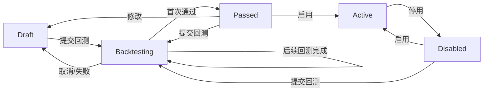
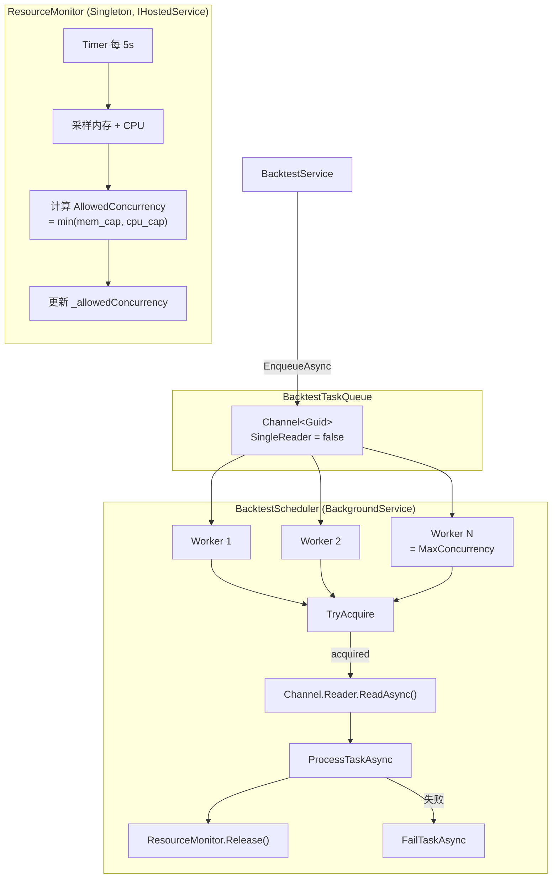

# TradeX — FSD (Functional Specification Document)

## 1. 文档信息

| 项目 | 内容 |
|---|---|
| 文档版本 | v1.10 |
| 文档状态 | Draft / 待共识 |
| 基于 PRD | `docs/PRD.md` v2.6 (2026-04-27) |
| 更新时间 | 2026-04-27 |

---

## 2. 目标与范围

### 2.1 目标
将 PRD 转化为可实施的功能规格，明确：
- 功能边界
- 业务状态机
- API 契约
- 数据模型与约束
- 模块职责与依赖
- 里程碑验收口径

### 2.2 本版范围（FSD v1.2）
覆盖 PRD 全部 16 个功能需求模块（FR-01 ~ FR-16），对应 M1~M7 七个里程碑的完整规格。

---

## 3. 术语定义

| 术语 | 定义 |
|---|---|
| 初始化模式 | 未存在 Super Admin 时系统所处模式，仅开放 Setup/Health API |
| 正常模式 | 已完成初始化后的运行模式 |
| 交易员 (Trader) | 系统的核心业务实体，代表一个被自动化的交易操作者。一个交易员可绑定多个交易所和多个策略，但在一个交易所上同时只能使用一个策略进行交易 |
| 交易所 | 交易员配置的一组交易所凭证与连接参数，归属于特定交易员 |
| 活跃策略冲突 | 同一 Trader 在同一 Exchange 上对同一 Symbol 存在多个 Active 策略（不允许） |
| 规则快照 | 当前从交易所实时拉取并缓存的 symbol 交易规则 |
| 条件树 | 由 AND/OR/NOT 逻辑门和条件节点组成的嵌套树结构，用于表达策略入场/出场条件 |
| 评估周期 | Trading Engine 每次循环执行策略评估的时间间隔 |
| 冷却期 | 策略执行交易后必须等待的时间窗口，期间不执行新交易 |
| 熔断 | 短时间内反复触发买入信号时采取的合并或限流处理 |
| Reconciliation | 系统启动或断线恢复后，与交易所同步订单状态以修复本地数据不一致的 process |
| K 线预热 | 策略首次启用时，从交易所 REST 接口回填历史 K 线数据到时序数据库 |
| K 线回填 | WebSocket 断线后，通过 REST 接口补充缺失区间的 K 线数据 |

---

## 4. 系统模块拆分

| 模块 | 职责 |
|---|---|
| `TradeX.Api` | ASP.NET Core Web API 宿主，含 Controllers、Middleware（SetupGuard/Auth/Casbin）、Hubs（SignalR）、Program.cs、Dockerfile |
| `TradeX.Core` | 纯领域模型、枚举、跨模块接口定义。零依赖，叶节点 |
| `TradeX.Exchange` | `IExchangeClient` 统一抽象 + 各交易所 SDK 适配（Binance.Net / JK.OKX.Net / GateIo.Net / Bybit.Net / JKorf.HTX.Net）+ WebSocket 连接管理器 + 统一限流层 |
| `TradeX.Indicators` | 基于 Skender.Stock.Indicators 的技术指标封装库，首批 8 个指标（RSI/MACD/SMA/EMA/BB/Volume SMA/OBV/KDJ） |
| `TradeX.Trading` | 策略引擎（条件树评估）、风控链（Chain of Responsibility）、回测引擎、订单 Reconciliation |
| `TradeX.Infrastructure` | EF Core + SQLite + Casbin Enforcer + IoTDB Client + 安全能力（AES/PasswordHasher/JWT） |
| `TradeX.Notifications` | 通知渠道客户端（Telegram/Discord/Email）+ 模板渲染 |
| `TradeX.Tests` | xUnit + NSubstitute，按模块分目录 |

依赖方向：`Api → Trading → Exchange, Indicators, Infrastructure, Notifications`。Core 不依赖任何项目。

---

## 5. 核心业务状态机

### 5.1 系统初始化状态机

```
Uninitialized ──[POST /api/setup/initialize]──> Initialized
```

- **Uninitialized**
  - 条件：数据库不存在 Super Admin
  - 行为：仅放行 `/health`, `/api/setup/*`，其余一律返回 `503 SYSTEM_NOT_INITIALIZED`
- **Initialized**
  - 条件：初始化完成，写入 Super Admin
  - 行为：全部 API 按鉴权规则工作
- 不可逆：重置需通过特殊维护操作（数据库清理 + 容器重建）

### 5.2 用户状态机

```
PendingMfa ──[完成 MFA 绑定 + 验证]──> Active
Active ──[Admin 禁用]──> Disabled
Disabled ──[Admin 启用]──> Active
```

- **PendingMfa**: 刚创建，未绑定 MFA
- **Active**: 正常可用
- **Disabled**: 不可登录，不可操作
- 约束：Super Admin 不可被禁用

### 5.3 策略状态机



约束：
- **首次回测规则**：策略从 `Draft` 提交回测，通过后切换为 `Passed`。此后的所有回测（无论从 `Passed` 还是 `Disabled` 提交）均**不改变状态**，状态保持在回测前的值
- 仅 `Passed` 状态可切换为 `Active`
- 同一 Trader 在同一 Exchange 上对同一 Symbol 同时仅允许一个 `Active` 策略
- `Active → Disabled` 可在任意时间由用户触发
- `Backtesting → Draft` 在用户取消（主动）或系统异常（数据不足/引擎崩溃）时触发
- 删除部署时，级联删除关联的回测任务和回测结果数据

#### 5.3.1 策略部署作用域与优先级

策略模板可按以下三个作用域部署，优先级从高到低：

```
交易对策略 (Symbol)   ← 最高优先级
交易所策略 (Exchange) ← 中间优先级
交易员策略 (Trader)   ← 最低优先级
```

**交易员策略（Trader 作用域）**
- 适用范围：全局作用于整个交易员账号，不绑定具体交易所或交易对
- 配置条件：仅绑定 `TraderId`，`ExchangeId` 为空，`SymbolIds` 为空
- 用途：交易员级别的通用策略，如统一的风控规则、全局止损
- 示例：交易员全局风控策略

**交易所策略（Exchange 作用域）**
- 适用范围：仅针对特定交易所生效
- 配置条件：绑定 `TraderId` + `ExchangeId`，`SymbolIds` 为空
- 用途：交易所级别的策略，如针对某个交易所的费率优化、特定交易规则
- 示例：Binance 专属套利策略

**交易对策略（Symbol 作用域）**
- 适用范围：针对特定交易对的精确策略
- 配置条件：绑定 `TraderId` + `ExchangeId` + `SymbolIds`
- 用途：对某个或某几个交易对执行精确的买卖逻辑
- 示例：BTCUSDT 网格策略、ETHUSDT 趋势追踪

**生效规则**：当交易引擎评估一次交易时，按以下顺序查找匹配的策略：

1. **交易对策略** — 检查当前交易对是否有对应的 Symbol 级部署
2. **交易所策略** — 若无，检查当前交易所是否有 Exchange 级部署
3. **交易员策略** — 若仍无，检查当前交易员是否有 Trader 级部署
4. **默认行为** — 若没有任何匹配，按系统默认逻辑执行

**覆盖规则**：
- 高优先级覆盖低优先级：如同一交易对同时存在 Symbol 级和 Exchange 级策略，以 Symbol 级为准
- 同级不叠加：同一作用域下的多个部署，按更新时间取最新的一个
- 部分覆盖：不同作用域可同时存在且互不冲突，各自负责自己的范围

**部署配置参考**：

| 作用域 | TraderId | ExchangeId | SymbolIds | 适用场景 |
|--------|----------|------------|-----------|----------|
| Trader | ✅ 必填 | 空 | 空 | 全局风控、统一止损 |
| Exchange | ✅ 必填 | ✅ 必填 | 空 | 交易所级别策略 |
| Symbol | ✅ 必填 | ✅ 必填 | ✅ 必填 | 精确交易对策略 |

### 5.4 订单状态机

```
Pending ──> PartiallyFilled ──> Filled
Pending ──> Cancelled
Pending ──> Failed
PartiallyFilled ──> Cancelled
PartiallyFilled ──> Filled
```

- **Pending**: 已提交等待成交
- **PartiallyFilled**: 部分成交
- **Filled**: 完全成交
- **Cancelled**: 已撤销（用户手动或超时）
- **Failed**: 下单失败（交易所拒绝等）

### 5.5 持仓状态机

```
Open ──>[全部平仓]──> Closed
```

- **Open**: 持仓中
- **Closed**: 已平仓

### 5.6 回测任务状态机

```
Pending ──> Running ──> Completed
Running ──> Failed
```

### 5.7 Volatility Grid 策略状态约束

Volatility Grid 属于策略执行规则的一种特化实现，遵循现有策略状态机，但增加以下运行时约束：

- 首单触发条件：`RANGE_PCT >= entryVolatilityPercent`（默认 `1.0`）
- 持仓后加仓条件：`lastPrice <= avgEntryPrice * (1 - rebalancePercent)`
- 持仓后减仓条件：`lastPrice >= avgEntryPrice * (1 + rebalancePercent)`
- 最大追加次数：`pyramidingCount <= maxPyramidingLevels`（默认 `5`）
- `noStopLoss=true` 时仅关闭仓位级止损，不影响账户级风控链

---

## 6. 数据模型

### 6.1 User

| 字段 | 类型 | 约束 | 说明 |
|---|---|---|---|
| Id | Guid | PK | |
| Username | string(100) | unique, required | 实际代码中字段名为 `Username`（非 `UserName`） |
| Email | string(200) | nullable | 邮箱地址 |
| PasswordHash | string(300) | required | bcrypt |
| Role | enum | SuperAdmin / Admin / Operator / Viewer | |
| Status | enum | PendingMfa / Active / Disabled | |
| IsMfaEnabled | bool | default false | MFA 是否已完成绑定 |
| MfaSecretEncrypted | string? | AES-256-GCM | |
| RecoveryCodesJson | string | not null, default [] | 8 个恢复码 JSON 数组 |
| LastLoginAt | datetimeoffset? | nullable | 最近登录时间 |
| IsDeleted | bool | default false | 软删除标记 |
| CreatedAt | datetimeoffset | required | |
| UpdatedAt | datetimeoffset | required | |

### 6.2 SystemConfig

| 字段 | 类型 | 约束 | 说明 |
|---|---|---|---|
| Id | Guid | PK | |
| Key | string(100) | unique, required | |
| Value | string(4000) | required | |

预定义配置键：

| Key | 默认值 | 说明 |
|---|---|---|
| `jwt.secret` | — | JWT 签名密钥，初始化时设置 |
| `jwt.access_token_expires_minutes` | 30 | AccessToken 有效期 |
| `jwt.refresh_token_expires_days` | 7 | RefreshToken 有效期 |
| `risk.default_slippage_percent` | 0.1 | 全局默认滑点容差百分比 |
| `risk.max_daily_loss_percent` | 10 | 日亏损限额百分比 |
| `risk.max_drawdown_percent` | 25 | 最大回撤百分比 |
| `risk.cooldown_seconds` | 300 | 交易冷却期 |
| `risk.consecutive_loss_limit` | 5 | 连续亏损止损次数 |
| `data.kline_warmup_days` | 3 | K 线预热天数 |
| `data.kline_warmup_interval` | 15m | 预热 K 线周期 |
| `notification.default_channel` | — | 默认通知渠道 ID |
| `order.archive_after_months` | 1 | 订单归档月数 |

### 6.3 Trader

| 字段 | 类型 | 约束 | 说明 |
|---|---|---|---|
| Id | Guid | PK | |
| Name | string(100) | unique, required | 交易员名称 |
| Status | enum | Active / Disabled | |
| CreatedBy | Guid | required | 创建者 UserId |
| CreatedAt | datetimeoffset | required | |
| UpdatedAt | datetimeoffset | required | |

### 6.4 Exchange

| 字段 | 类型 | 约束 | 说明 |
|---|---|---|---|
| Id | Guid | PK | |
| TraderId | Guid | FK, required | 所属交易员 |
| Name | string(100) | required | 用户自定义名称 |
| Type | enum | Binance / Okx / GateIo / Bybit / Htx | |
| ApiKeyEncrypted | string | required | AES-256-GCM |
| SecretKeyEncrypted | string | required | AES-256-GCM |
| PassphraseEncrypted | string? | nullable | 部分交易所需要 |
| Status | enum | Enabled / Disabled | |
| LastTestedAt | datetimeoffset? | nullable | 最近测试连接时间 |
| TestResult | string(500)? | nullable | 最近测试结果摘要 |
| CreatedBy | Guid | required | |
| CreatedAt | datetimeoffset | required | |
| UpdatedAt | datetimeoffset | required | |

### 6.5 ExchangeSymbolRuleSnapshot

| 字段 | 类型 | 约束 | 说明 |
|---|---|---|---|
| Id | Guid | PK | |
| ExchangeId | Guid | FK | |
| Symbol | string(30) | required | e.g. BTCUSDT |
| PricePrecision | int | required | 价格精度（小数位） |
| QuantityPrecision | int | required | 数量精度（小数位） |
| MinNotional | decimal(38,18) | required | 最小名义价值 |
| MinQuantity | decimal(38,18) | required | 最小交易量 |
| TickSize | decimal(38,18) | required | 价格最小变动单位 |
| StepSize | decimal(38,18) | required | 数量最小变动单位 |
| FetchedAtUtc | datetimeoffset | required | 拉取时间戳 |

### 6.6 Strategy

策略模板是纯条件树 + 执行规则的复用单元，**不绑定**交易所、交易对或时间周期。运行环境参数由部署层（§6.12 StrategyDeployment）指定。

| 字段 | 类型 | 约束 | 说明 |
|---|---|---|---|
| Id | Guid | PK | |
| Name | string(200) | required | 策略模板名称 |
| EntryConditionJson | string | required | 入场条件树 JSON |
| ExitConditionJson | string | required | 出场条件树 JSON |
| ExecutionRuleJson | string | required | 执行规则 JSON |
| Status | enum | Draft / Backtesting / Passed / Active / Disabled | |
| Version | int | default 1 | 乐观并发版本号 |
| CreatedBy | Guid | required | |
| CreatedAt | datetimeoffset | required | |
| UpdatedAt | datetimeoffset | required | |

**ExecutionRuleJson 结构**:

```json
{
  "entryAmountType": "fixed|percent",
  "entryAmountValue": 100.0,
  "slippageTolerancePercent": 0.1,
  "stopLossPercent": 5.0,
  "takeProfitPercent": 10.0,
  "trailingStopEnabled": false,
  "trailingStopPercent": 3.0,
  "cooldownSeconds": 300,
  "maxPositionSize": null,
  "orderType": "market|limit"
}
```

**ExecutionRuleJson 扩展（Volatility Grid）**:

```json
{
  "type": "volatility_grid",
  "entryVolatilityPercent": 1.0,
  "rebalancePercent": 1.0,
  "basePositionSize": 100,
  "maxPositionSize": 500,
  "maxPyramidingLevels": 5,
  "noStopLoss": true,
  "slippageTolerance": 0.0005,
  "maxDailyLoss": 200
}
```

字段约束：

- `entryVolatilityPercent > 0`
- `rebalancePercent > 0`
- `maxPyramidingLevels >= 0`
- `basePositionSize > 0`
- `maxPositionSize >= basePositionSize`

### 6.6.1 Volatility Grid 指标与上下文变量

为支持该策略风格，条件评估上下文新增以下变量：

| 名称 | 类型 | 说明 |
|---|---|---|
| `RANGE_PCT` | decimal | 当前 K 线波幅百分比，公式 `(high - low) / open * 100` |
| `AVG_ENTRY_PRICE` | decimal | 当前持仓均价 |
| `PYRAMIDING_COUNT` | int | 当前已追加次数 |
| `POSITION_SIZE` | decimal | 当前持仓数量 |

以上变量在回测与实盘必须同口径计算。

### 6.7 Position

| 字段 | 类型 | 约束 | 说明 |
|---|---|---|---|
| Id | Guid | PK | |
| TraderId | Guid | FK, required | 所属交易员 |
| ExchangeId | Guid | FK, required | |
| StrategyId | Guid | FK, required | |
| SymbolId | string(30) | required | |
| Quantity | decimal(38,18) | required | 当前持仓数量 |
| EntryPrice | decimal(38,18) | required | 开仓均价 |
| CurrentPrice | decimal(38,18) | required | 当前市场价格，定期更新 |
| UnrealizedPnl | decimal(38,18) | required | 未实现盈亏 |
| RealizedPnl | decimal(38,18) | default 0 | 已实现盈亏（部分平仓时） |
| Status | enum | Open / Closed | |
| OpenedAtUtc | datetimeoffset | required | |
| ClosedAtUtc | datetimeoffset? | nullable | |
| UpdatedAt | datetimeoffset | required | |

### 6.8 Order

| 字段 | 类型 | 约束 | 说明 |
|---|---|---|---|
| Id | Guid | PK | |
| TraderId | Guid | FK, required | 所属交易员 |
| ExchangeOrderId | string(100) | nullable | 交易所侧订单 ID |
| ExchangeId | Guid | FK, required | |
| StrategyId | Guid? | FK, nullable | 手动下单时可为 null |
| PositionId | Guid? | FK, nullable | 关联的持仓 ID |
| SymbolId | string(30) | required | |
| Side | enum | Buy / Sell | |
| Type | enum | Market / Limit | |
| Status | enum | Pending / PartiallyFilled / Filled / Cancelled / Failed | |
| Price | decimal(38,18) | nullable | 限价单必填 |
| Quantity | decimal(38,18) | required | |
| FilledQuantity | decimal(38,18) | default 0 | |
| QuoteQuantity | decimal(38,18) | required | 成交额 |
| Fee | decimal(38,18) | default 0 | |
| FeeAsset | string(20) | nullable | |
| IsManual | bool | default false | 手动下单标记 |
| PlacedAtUtc | datetimeoffset | required | |
| UpdatedAt | datetimeoffset | required | |

### 6.9 BacktestTask

| 字段 | 类型 | 约束 | 说明 |
|---|---|---|---|
| Id | Guid | PK | |
| DeploymentId | Guid | FK, required | 所属策略部署 ID，删除部署时级联删除 |
| StrategyId | Guid | FK, required | |
| ExchangeId | Guid | FK, required | |
| SymbolId | string(50) | required | 回测交易对 |
| Timeframe | string(10) | required | K 线周期 |
| InitialCapital | decimal | default 1000 | 初始资金 |
| StartAtUtc | datetimeoffset | required | 回测开始时间 |
| EndAtUtc | datetimeoffset | required | 回测结束时间 |
| Status | enum | Pending / Running / Completed / Failed / Cancelled | |
| Phase | enum? | Queued / FetchingData / Running | 运行阶段 |
| CreatedBy | Guid | required | |
| CreatedAt | datetimeoffset | required | |
| CompletedAtUtc | datetimeoffset? | nullable | |

### 6.10 BacktestResult

| 字段 | 类型 | 约束 | 说明 |
|---|---|---|---|
| Id | Guid | PK | |
| TaskId | Guid | FK, unique | 一对一关联 |
| TotalReturnPercent | decimal(18,6) | | 总收益率 |
| AnnualizedReturnPercent | decimal(18,6) | | 年化收益率 |
| MaxDrawdownPercent | decimal(18,6) | | 最大回撤 |
| WinRate | decimal(18,6) | | 胜率 |
| TotalTrades | int | | 交易次数 |
| SharpeRatio | decimal(18,6) | | Sharpe Ratio |
| ProfitLossRatio | decimal(18,6) | | 盈亏比 |
| DetailJson | string | | 每笔交易明细 JSON 数组 |
| CreatedAt | datetimeoffset | required | |

### 6.11 NotificationChannel

| 字段 | 类型 | 约束 | 说明 |
|---|---|---|---|
| Id | Guid | PK | |
| Type | enum | Telegram / Discord / Email | |
| Name | string(100) | required | 用户自定义名称 |
| ConfigEncrypted | string | required | AES-256-GCM 加密 |
| IsDefault | bool | default false | |
| Status | enum | Enabled / Disabled | |
| LastTestedAt | datetimeoffset? | nullable | |
| CreatedAt | datetimeoffset | required | |
| UpdatedAt | datetimeoffset | required | |

### 6.12 StrategyDeployment

策略部署是策略模板与交易员/交易所/交易对的绑定关系。

| 字段 | 类型 | 约束 | 说明 |
|---|---|---|---|
| Id | Guid | PK | |
| StrategyId | Guid | FK, required | 关联的策略模板 ID |
| Name | string(200) | required | 部署名称，创建时自动从策略模板继承 |
| TraderId | Guid | FK, required | 所属交易员 |
| ExchangeId | Guid | required | 关联的交易所 ID，为空时表示 Trader 作用域 |
| SymbolIds | string | default "[]" | 关联交易对 ID 列表 JSON 数组，为空时表示 Exchange/Trader 作用域 |
| Timeframe | string(10) | default "15m" | 时间周期：1m/5m/15m/1h |
| Status | enum | Draft / Backtesting / Passed / Active / Disabled | 部署状态，与策略模板状态独立 |
| CreatedBy | Guid | required | |
| CreatedAt | datetimeoffset | required | |
| UpdatedAt | datetimeoffset | required | |

作用域自动推导规则（见 §5.3.1）：
- Symbol 作用域：`SymbolIds` 不为空
- Exchange 作用域：`SymbolIds` 为空且 `ExchangeId` 不为空
- Trader 作用域：`SymbolIds` 为空且 `ExchangeId` 为空

### 6.13 RefreshToken

| 字段 | 类型 | 约束 | 说明 |
|---|---|---|---|
| Id | Guid | PK | |
| UserId | Guid | FK, required | 所属用户 |
| Token | string(500) | required | Refresh Token 字符串 |
| ExpiresAt | datetimeoffset | required | 过期时间 |
| CreatedAt | datetimeoffset | required | |
| RevokedAt | datetimeoffset? | nullable | 吊销时间 |

### 6.14 AuditLog

| 字段 | 类型 | 约束 | 说明 |
|---|---|---|---|
| Id | Guid | PK | |
| UserId | Guid | required | 操作用户 |
| UserName | string(100) | required | 冗余，用户删除后仍可追溯 |
| Action | string(100) | required | 操作类型 |
| ResourceType | string(50) | required | 资源类型 |
| ResourceId | string(100) | nullable | 资源 ID |
| DetailJson | string | nullable | 操作详情 |
| RequestIp | string(50) | nullable | 请求 IP |
| Timestamp | datetimeoffset | required | |

预定义 Action 枚举：

> **命名规范**：审计日志 Action 采用 `resource.operation`（点号分隔）格式，如 `user.login`、`exchange.created`。SignalR 事件采用 PascalCase，如 `PositionUpdated`、`OrderPlaced`。

| Action | 说明 |
|---|---|
| `user.login` | 用户登录 |
| `user.logout` | 用户登出 |
| `user.created` | 创建用户 |
| `user.role_changed` | 角色变更 |
| `user.disabled` | 禁用用户 |
| `user.enabled` | 启用用户 |
| `exchange.created` | 创建交易所 |
| `exchange.updated` | 更新交易所 |
| `exchange.deleted` | 删除交易所 |
| `exchange.test` | 测试连接 |
| `exchange.rules_fetched` | 拉取交易规则 |
| `trader.created` | 创建交易员 |
| `trader.updated` | 更新交易员 |
| `trader.deleted` | 删除交易员 |
| `trader.disabled` | 禁用交易员 |
| `trader.enabled` | 启用交易员 |
| `strategy.created` | 创建策略 |
| `strategy.updated` | 更新策略配置 |
| `strategy.deleted` | 删除策略 |
| `strategy.enabled` | 启用策略 |
| `strategy.disabled` | 停用策略 |
| `strategy.backtest_started` | 提交回测 |
| `order.manual` | 手动下单 |
| `notification.test` | 测试通知 |
| `notification.created` | 创建通知渠道 |
| `notification.updated` | 更新通知渠道 |
| `notification.deleted` | 删除通知渠道 |
| `settings.updated` | 更新系统设置 |

### 6.13 Symbol

| 字段 | 类型 | 约束 | 说明 |
|---|---|---|---|
| Id | Guid | PK | |
| ExchangeId | Guid | FK, required | |
| SymbolName | string(30) | required | e.g. BTCUSDT |
| BaseAsset | string(20) | required | e.g. BTC |
| QuoteAsset | string(20) | required | e.g. USDT |
| IsActive | bool | default true | |
| CreatedAt | datetimeoffset | required | |

---

## 7. API 规格

### 7.1 通用规范

**统一响应体（成功）**:
```json
{
  "data": { ... }
}
```
列表响应额外包含 `total` 字段：
```json
{
  "data": [ ... ],
  "total": 42
}
```

**统一错误响应体**:
```json
{
  "code": "AUTH_INVALID_CREDENTIALS",
  "message": "Invalid username or password.",
  "traceId": "00-abc123..."
}
```

**翻页参数**:
- `page` (query, default 1)
- `pageSize` (query, default 20, max 100)

**认证头**: `Authorization: Bearer <accessToken>`

### 7.2 Setup

#### `GET /api/setup/status`
- Auth: Public
- Response:
```json
{
  "isInitialized": true
}
```

#### `POST /api/setup/initialize`
- Auth: Public（仅 Uninitialized 可用）
- Request:
```json
{
  "userName": "superadmin",
  "password": "<secret>"
}
```
- Success: `204 No Content`
  - 创建 Super Admin（状态 `PendingMfa`），写入默认系统配置
  - Super Admin 后续通过标准 MFA 绑定流程激活：`login → mfa/setup → mfa/verify`
- Error:
  - `409 SETUP_ALREADY_INITIALIZED` — 已初始化
  - `400 SETUP_INVALID_INPUT` — 参数非法

### 7.3 Auth

#### `POST /api/auth/login`
- Auth: Public
- Request:
```json
{
  "userName": "string",
  "password": "string"
}
```
- Response:
```json
{
  "mfaRequired": true,
  "mfaToken": "short-lived-token"
}
```
- Error:
  - `401 AUTH_INVALID_CREDENTIALS`
  - `403 AUTH_USER_DISABLED`

#### `POST /api/auth/verify-mfa`
- Auth: Public
- Request:
```json
{
  "mfaToken": "string",
  "totpCode": "123456",
  "recoveryCode": "xxxx-xxxx"
}
```
- `totpCode` 与 `recoveryCode` 二选一
- Response:
```json
{
  "accessToken": "jwt-string",
  "refreshToken": "refresh-token-string",
  "expiresIn": 1800,
  "role": "Admin"
}
```
- Error:
  - `401 AUTH_MFA_INVALID_CODE`

#### `POST /api/auth/refresh`
- Auth: Public
- Request:
```json
{
  "refreshToken": "string"
}
```
- Response:
```json
{
  "accessToken": "new-jwt-string",
  "refreshToken": "new-refresh-token-string",
  "expiresIn": 1800
}
```
- Error:
  - `401 AUTH_REFRESH_TOKEN_INVALID`

#### `POST /api/auth/mfa/setup`
- Auth: Bearer（需临时 token，Login 返回）
- Request: 无请求体
- Response:
```json
{
  "secretKey": "JBSWY3DPEHPK3PXP",
  "qrCodeUrl": "otpauth://totp/TradeX:user?secret=...",
  "qrCodeImage": "data:image/png;base64,...",
  "recoveryCodes": ["xxxx-xxxx", "..."]
}
```

#### `POST /api/auth/mfa/verify`
- Auth: Bearer（需临时 token，Login 返回）
- Request:
```json
{
  "code": "123456"
}
```
- Response:
```json
{
  "recoveryCodes": ["xxxx-xxxx", ...],
  "accessToken": "jwt-string",
  "refreshToken": "...",
  "expiresIn": 1800
}
```
- Error:
  - `400 AUTH_MFA_INVALID_CODE`

#### `POST /api/auth/logout`
- Auth: Bearer（已登录）
- 吊销当前用户所有 RefreshToken
- Response: `200`
- 关联需求：FR-08.1

#### `POST /api/auth/send-recovery-codes`
- Auth: Bearer (Admin+)
- Request:
```json
{
  "userId": "guid"
}
```
- Response: `200` + 新恢复码列表（旧码立即失效）

### 7.4 Users

#### `GET /api/users`
- Role: admin / super_admin
- 翻页
- Response:
```json
{
  "data": [
    {
      "id": "guid",
      "userName": "string",
      "role": "Admin",
      "status": "Active",
      "createdAt": "2026-04-24T00:00:00Z"
    }
  ],
  "total": 10
}
```
- 不返回 PasswordHash / MfaSecret / RecoveryCodes

#### `POST /api/users`
- Role: admin / super_admin
- Request:
```json
{
  "userName": "string",
  "password": "string",
  "role": "Operator"
}
```
- Response: `201` + User 对象（不含敏感字段）
- 创建后用户状态为 `PendingMfa`
- Error:
  - `409 AUTH_USERNAME_EXISTS`
  - `400 AUTH_INVALID_ROLE` — 不可创建 SuperAdmin；Admin 不可创建/分配 Admin 角色

#### `PUT /api/users/:id/role`
- Role: super_admin（仅 super_admin 可变更）
- Request:
```json
{
  "role": "Operator"
}
```
- Response: `200`
- 约束：Super Admin 不可降级

#### `PUT /api/users/:id/status`
- Role: admin / super_admin
- Request:
```json
{
  "status": "Disabled"
}
```
- Response: `200`
- 约束：Super Admin 不可禁用

### 7.5 Exchanges

#### `GET /api/exchanges`
- Role: admin / super_admin / operator
- Response:
```json
{
  "data": [
    {
      "id": "guid",
      "traderId": "guid",
      "traderName": "string",
      "label": "My Binance",
      "exchangeType": "Binance",
      "isEnabled": true,
      "lastTestedAt": null,
      "testResult": null,
      "createdAt": "2026-04-24T00:00:00Z"
    }
  ]
}
```
- 返回脱敏数据：不返回 ApiKey / Secret / Passphrase

#### `POST /api/exchanges`
- Role: admin / super_admin / operator
- Request:
```json
{
  "name": "My Binance",
  "exchangeType": "Binance",
  "apiKey": "string",
  "secretKey": "string",
  "passphrase": "string?"
}
```
- Response: `201` + Exchange 对象（脱敏）
- 写入时自动 AES-256-GCM 加密凭证

#### `PUT /api/exchanges/:id`
- Role: admin / super_admin / operator
- Request: 同 POST，所有字段可选（只传要更新的字段）
- Response: `200`
- Error:
  - `404 EXCHANGE_NOT_FOUND`

#### `DELETE /api/exchanges/:id`
- Role: admin / super_admin / operator
- Response: `204`
- Error:
  - `409 EXCHANGE_HAS_ACTIVE_STRATEGIES`

#### `POST /api/exchanges/:id/test`
- Role: admin / super_admin / operator
- Response:
```json
{
  "connected": true,
  "error": null
}
```
- Error:
  - `400 EXCHANGE_TEST_FAILED`

#### `GET /api/exchanges/:id/rules`
- Role: admin / super_admin / operator
- Response:
```json
{
  "data": [
    {
      "symbol": "BTCUSDT",
      "pricePrecision": 2,
      "quantityPrecision": 5,
      "minNotional": 10.0,
      "minQuantity": 0.00001,
      "tickSize": 0.01,
      "stepSize": 0.00001
    }
  ],
  "cachedAtUtc": "2026-04-24T12:00:00Z"
}
```
- 缓存策略：间隔 < 60s 命中缓存，>= 60s 实时拉取
- Error:
  - `400 EXCHANGE_RULES_FETCH_FAILED`

#### `POST /api/exchanges/:id/toggle`
- Role: admin / super_admin / operator
- 切换交易所启用/禁用状态
- Request:
```json
{
  "enable": true
}
```
- Response:
```json
{
  "id": "guid",
  "isEnabled": false
}
```

#### `GET /api/exchanges/:id/symbols`
- Role: admin / super_admin / operator
- 获取交易所 USDT 交易对列表（含实时行情）
- Response:
```json
{
  "data": [
    {
      "symbol": "BTCUSDT",
      "pricePrecision": 2,
      "quantityPrecision": 5,
      "minNotional": 10.0,
      "price": 65000.0,
      "priceChangePercent": 1.5,
      "volume": 100000.0,
      "highPrice": 66000.0,
      "lowPrice": 64000.0
    }
  ]
}
```

#### `GET /api/exchanges/:id/assets`
- Role: admin / super_admin / operator
- 实时获取交易所账户资产余额
- Response:
```json
{
  "data": [
    { "currency": "USDT", "balance": 50000.0 },
    { "currency": "BTC", "balance": 0.5 }
  ]
}
```

#### `GET /api/exchanges/:id/orders`
- Query: `?type=open|history`
- Role: admin / super_admin / operator
- 实时获取交易所侧订单列表
- Response:
```json
{
  "data": [ ... ]
}
```

### 7.6 Strategies（策略模板）

实际代码中策略分为两层：**策略模板**（`GlobalStrategiesController`，路由 `/api/strategies`）和**策略部署**（`TradersStrategiesController`，路由 `/api/traders/{traderId}/strategies`）。

策略模板是一个可复用的条件树 + 执行规则配置，策略部署是将模板绑定到具体的 Trader/Exchange/Symbol 作用域。

#### `GET /api/strategies`
- Role: all authenticated
- 获取策略模板列表
- Response:
```json
{
  "data": [
    {
      "id": "guid",
      "name": "RSI Strategy",
      "entryConditionJson": "...",
      "exitConditionJson": "...",
      "executionRuleJson": "...",
      "version": 3,
      "createdAt": "2026-04-24T00:00:00Z"
    }
  ]
}
```

#### `POST /api/strategies`
- Role: admin / operator
- Request:
```json
{
  "name": "RSI Strategy",
  "entryConditionJson": "{ ... }",
  "exitConditionJson": "{ ... }",
  "executionRuleJson": "{ ... }"
}
```
- Response: `201` + Strategy 对象

#### `PUT /api/strategies/:id`
- Role: admin / operator
- Request: 同 POST，所有字段可选
- Response: `200`
- Error:
  - `404 STRATEGY_NOT_FOUND`

#### `DELETE /api/strategies/:id`
- Role: admin / operator
- Response: `204`

#### `GET /api/strategies/:id`
- Role: all authenticated
- Response: 完整策略模板对象

### 7.6.1 策略部署（Strategy Deployments）

策略部署是将策略模板绑定到某 Trader 下指定作用域的操作。

#### `GET /api/traders/{traderId}/strategies`
- Role: all authenticated
- 获取交易员下的策略部署列表
- Response:
```json
{
  "data": [
    {
      "id": "guid",
      "strategyId": "guid",
      "traderId": "guid",
      "exchangeId": "guid",
      "symbolIds": "[\"guid1\"]",
      "timeframe": "15m",
      "status": "Active",
      "scope": "Symbol",
      "createdAt": "2026-04-24T00:00:00Z"
    }
  ]
}
```
- 作用域自动推导：`scope` 由后端根据 `symbolIds` 和 `exchangeId` 自动计算

#### `POST /api/traders/{traderId}/strategies`
- Role: admin / operator
- Request:
```json
{
  "strategyId": "guid",
  "exchangeId": "guid",
  "symbolIds": "[\"guid1\", \"guid2\"]",
  "timeframe": "15m"
}
```
- 创建后状态为 `Draft`
- Response: `201`

#### `PUT /api/traders/{traderId}/strategies/{id}`
- Role: admin / operator
- 约束：`Active` 状态不可编辑，需先停用

#### `DELETE /api/traders/{traderId}/strategies/{id}`
- Role: admin / operator
- 约束：`Active` 不可删除
- Response: `204`

#### `POST /api/traders/{traderId}/strategies/{id}/toggle`
- Role: admin / operator
- Request:
```json
{
  "enable": true
}
```
- `enable: true`:
  - 约束：部署状态必须为 `Passed`（非 `Draft`）
  - 约束：同一 Trader 在同一 Exchange 上对同一 Symbol 无其他 `Active` 部署
  - 成功：状态 → `Active`
- `enable: false`:
  - 约束：部署状态必须为 `Active`
  - 成功：状态 → `Disabled`
- Error:
  - `409` — Symbol 级冲突
  - `400` — Draft 状态不可启用

### 7.7 Positions

#### `GET /api/traders/{traderId}/positions`
- Role: all authenticated
- 实际路由为 trader 作用域下，支持筛选：`?openOnly=true`
- Response:
```json
{
  "data": [
    {
      "id": "guid",
      "traderId": "guid",
      "exchangeId": "guid",
      "strategyId": "guid",
      "symbolId": "BTCUSDT",
      "quantity": 0.5,
      "entryPrice": 65000.0,
      "currentPrice": 67000.0,
      "unrealizedPnl": 1000.0,
      "realizedPnl": 0.0,
      "status": "Open",
      "openedAtUtc": "2026-04-24T00:00:00Z"
    }
  ],
  "total": 3
}
```

#### `GET /api/traders/{traderId}/positions/{id}`
- Role: all authenticated
- Response: 单个持仓详情

### 7.8 Orders

#### `GET /api/traders/{traderId}/orders`
- Role: all authenticated
- 实际路由为 trader 作用域下
- Response:
```json
{
  "data": [
    {
        "id": "guid",
        "traderId": "guid",
        "exchangeOrderId": "12345678",
        "exchangeId": "guid",
        "strategyId": "guid",
        "positionId": "guid",
      "symbolId": "BTCUSDT",
      "side": "Buy",
      "type": "Market",
      "status": "Filled",
      "price": 65000.0,
      "quantity": 0.5,
      "filledQuantity": 0.5,
      "quoteQuantity": 32500.0,
      "fee": 9.75,
      "feeAsset": "USDT",
      "isManual": false,
      "placedAtUtc": "2026-04-24T00:00:00Z"
    }
  ],
  "total": 50
}
```

#### `GET /api/traders/{traderId}/orders/{id}`
- Role: all authenticated
- Response: 单个 Order 详情

#### `POST /api/traders/{traderId}/orders/manual`
- Role: admin / operator
- Request:
```json
{
  "exchangeId": "guid",
  "symbolId": "BTCUSDT",
  "side": "Buy",
  "type": "Market",
  "quantity": 0.5,
  "price": null,
  "strategyId": null
}
```
- Response: `201` + Order 对象
- 风控检查：滑点预估、日亏损限额
- Error:
  - `400 ORDER_SLIPPAGE_EXCEEDED`
  - `400 ORDER_RISK_REJECTED`

#### `GET /api/orders/export`
- Role: admin / operator
- Query: `?format=csv|json&startUtc=&endUtc=`
- Response: `200` + 文件流（Content-Disposition: attachment）
- 默认当月，max 3 个月

### 7.9 Backtests

#### `GET /api/traders/{traderId}/strategies/{strategyId}/backtests/tasks`
- Role: all authenticated
- 按 StrategyId 查询回测任务列表
- Response: BacktestTask[]

#### `POST /api/traders/{traderId}/strategies/{strategyId}/backtests`
- Role: admin / operator
- Query: `?deploymentId=guid&exchangeId=guid&symbolId=string&timeframe=string&startUtc=datetime&endUtc=datetime&initialCapital=1000`
- Response: `200` + `{ taskId, status, createdAt, strategyName, symbolId, timeframe }`
- 回测完成后，关联部署状态从 `Draft` → `Passed`（仅首次生效）
- 异步执行（BacktestWorker 后台消费队列）

#### `GET /api/traders/{traderId}/strategies/{strategyId}/backtests/tasks/{taskId}/result`
- Role: all authenticated
- Response:
```json
{
  "totalReturnPercent": 12.5,
  "annualizedReturnPercent": 18.2,
  "maxDrawdownPercent": 8.3,
  "winRate": 65.0,
  "totalTrades": 40,
  "sharpeRatio": 1.85,
  "profitLossRatio": 2.1,
  "analysisCount": 594,
  "trades": [...]
}
```

#### `GET /api/traders/{traderId}/strategies/{strategyId}/backtests/tasks/{taskId}/analysis`
- Role: all authenticated
- Query: `?page=1&pageSize=100`
- Response: 分页 K 线分析数据（含指标值），使用 `JsonElement` 保留原始 JSON 结构

#### `GET /api/traders/{traderId}/strategies/{strategyId}/backtests/tasks/{taskId}/analysis/stream`
- Role: all authenticated
- SSE 端点，支持运行中任务实时推送和已完成任务回放
- Query: `?speed=1`（1x~16x，仅对已完成任务有效）
- 消息格式见 §14.6.3

### 7.10 Dashboard

#### `GET /api/dashboard/summary`
- Role: all authenticated
- Response:
```json
{
  "totalBalance": 100000.0,
  "totalPnl": 2500.0,
  "totalPnlPercent": 2.5,
  "openPositionCount": 3,
  "activeStrategyCount": 2,
  "dailyLossPercent": 0.5,
  "maxDrawdownPercent": 8.3,
  "riskStatus": "Normal",
  "exchangeStatus": {
    "binance": "Connected",
    "okx": "Connected"
  },
  "recentTrades": [
    {
      "orderId": "guid",
      "symbolId": "BTCUSDT",
      "side": "Buy",
      "quantity": 0.5,
      "price": 65000.0,
      "placedAtUtc": "2026-04-24T10:00:00Z"
    }
  ]
}
```

### 7.11 Notifications

#### `GET /api/notifications/channels`
- Role: admin / super_admin

#### `POST /api/notifications/channels`
- Role: admin / super_admin
- Request:
```json
{
  "type": "Telegram",
  "name": "My Telegram Bot",
  "config": { "botToken": "...", "chatId": "..." }
}
```
- Response: `201`
- config 字段因 type 不同而变化，写入时 AES 加密

#### `PUT /api/notifications/channels/:id`
- Role: admin / super_admin

#### `DELETE /api/notifications/channels/:id`
- Role: admin / super_admin

#### `POST /api/notifications/channels/:id/test`
- Role: admin / super_admin
- 行为：发送测试消息到该渠道
- Response:
```json
{
  "success": true,
  "message": "Test message sent successfully."
}
```

### 7.12 AuditLog

#### `GET /api/audit-logs`
- Role: admin / super_admin
- 翻页，支持筛选：`?userId=guid&action=user.login&resourceType=exchange&startUtc=&endUtc=`
- Response:
```json
{
  "data": [
    {
      "id": "guid",
      "userId": "guid",
      "userName": "admin",
      "action": "user.login",
      "resourceType": "user",
      "resourceId": "guid",
      "detailJson": "{\"ip\":\"192.168.1.1\"}",
      "requestIp": "192.168.1.1",
      "timestamp": "2026-04-24T10:00:00Z"
    }
  ],
  "total": 200
}
```

### 7.13 System Settings

#### `GET /api/settings`
- Role: admin / super_admin
- Response:
```json
{
  "data": [
    { "key": "jwt.access_token_expires_minutes", "value": "30" },
    { "key": "risk.default_slippage_percent", "value": "0.1" }
  ]
}
```

#### `PUT /api/settings`
- Role: admin / super_admin
- Request:
```json
{
  "settings": [
    { "key": "risk.default_slippage_percent", "value": "0.2" }
  ]
}
```
- Response: `200`
- 约束：部分 key 不可修改（如 `jwt.secret`）

### 7.14 System

#### `POST /api/system/emergency-stop`
- Role: admin / super_admin
- 触发系统级紧急停止：禁用所有已启用交易所，发送紧急通知
- Response:
```json
{
  "success": true,
  "disabledExchanges": 3,
  "cancelledOrders": 0,
  "message": "紧急停止完成: 已禁用 3 个交易所"
}
```

### 7.15 Traders

#### `GET /api/traders`
- Role: admin / super_admin / operator
- 翻页
- Response:
```json
{
  "data": [
    {
      "id": "guid",
      "name": "Trader Alpha",
      "status": "Active",
      "exchangeCount": 2,
      "strategyCount": 3,
      "createdBy": "guid",
      "createdAt": "2026-04-24T00:00:00Z"
    }
  ],
  "total": 5
}
```

#### `POST /api/traders`
- Role: admin / super_admin / operator
- Request:
```json
{
  "name": "Trader Alpha"
}
```
- Response: `201` + Trader 对象
- 创建后状态为 `Active`

#### `GET /api/traders/:id`
- Role: all authenticated
- Response:
```json
{
  "id": "guid",
  "name": "Trader Alpha",
  "status": "Active",
  "exchanges": [
    {
      "id": "guid",
      "type": "Binance",
      "name": "My Binance",
      "status": "Enabled"
    }
  ],
  "strategies": [
    {
      "id": "guid",
      "name": "RSI Strategy",
      "timeframe": "15m",
      "status": "Active"
    }
  ],
  "exchangeCount": 2,
  "strategyCount": 3,
  "createdAt": "2026-04-24T00:00:00Z"
}
```

#### `PUT /api/traders/:id`
- Role: admin / super_admin / operator
- Request:
```json
{
  "name": "Trader Beta"
}
```
- Response: `200`

#### `PUT /api/traders/:id/status`
- Role: admin / super_admin
- Request:
```json
{
  "status": "Disabled"
}
```
- Response: `200`
- 约束：禁用 Trader 时，其关联的所有 Active 策略同时被停用（策略状态变为 Disabled）
- 约束：重新启用 Trader 后，策略**不自动恢复**为 Active，需用户逐个手动启用

#### `DELETE /api/traders/:id`
- Role: admin / super_admin
- Response: `204`
- 约束：级联删除关联的 Exchange、Strategy、Position、Order 等所有子资源
- Error:
  - `409 TRADER_HAS_ACTIVE_STRATEGIES` — 有关联活跃策略，需先停用

### 7.15 Health

#### `GET /health`
- Auth: Public
- Response:
```json
{
  "status": "Ok|Degraded",
  "database": "Connected|Disconnected",
  "iotdb": "Connected|Disconnected|Unknown",
  "exchangeWs": {
    "binance": "Connected|Disconnected|Unknown",
    "okx": "Connected|Disconnected|Unknown"
  }
}
```

---

## 8. 条件树引擎规格

### 8.1 数据结构

条件树是嵌套 JSON 结构，支持任意深度嵌套：

```json
{
  "operator": "AND",
  "conditions": [
    {
      "operator": "OR",
      "conditions": [
        {
          "indicator": "RSI",
          "parameters": { "period": 14 },
          "comparison": ">",
          "value": 70
        },
        {
          "indicator": "RSI",
          "parameters": { "period": 14 },
          "comparison": "<",
          "value": 30
        }
      ]
    },
    {
      "operator": "NOT",
      "conditions": [
        {
          "indicator": "SMA",
          "parameters": { "period": 50, "source": "close" },
          "comparison": ">",
          "value": 50000
        }
      ]
    }
  ]
}
```

### 8.2 节点类型

| 节点类型 | 子节点 | 说明 |
|---|---|---|
| `AND` | conditions[] | 全部条件同时满足 |
| `OR` | conditions[] | 至少一个条件满足 |
| `NOT` | conditions[0] | 条件取反（仅一个子节点） |
| 叶节点 | 无 | `indicator` + `parameters` + `comparison` + `value` |

### 8.3 叶节点字段

| 字段 | 类型 | 说明 |
|---|---|---|
| `indicator` | string | 指标名称，首批支持：RSI / MACD / SMA / EMA / BB / VolumeSMA / OBV / KDJ |
| `parameters` | object | 指标参数键值对，如 `{ "period": 14 }` |
| `comparison` | enum | `>` / `<` / `>=` / `<=` / `==` |
| `value` | number | 阈值或基准值 |

### 8.4 条件评估合约

| 方法 | 用途 |
|------|------|
| `Evaluate(node, candles)` | 评估单个条件节点是否满足 |
| `EvaluateTree(root, candles)` | 递归评估完整条件树，返回最终 true/false |

> 接口契约签名详见 `docs/TAD.md` §接口契约。

---

## 9. 风控规格（Chain of Responsibility）

### 9.1 风控管线

风控由链式管线执行，每个节点独立检查，全通过则放行：

```
入市请求
  → [1] 滑点检查 (SlippageCheck)
  → [2] 日亏损检查 (DailyLossCheck)
  → [3] 最大回撤检查 (MaxDrawdownCheck)
  → [4] 连续亏损检查 (ConsecutiveLossCheck)
  → [5] 交易频率熔断 (FreqCircuitBreaker)
  → [6] 冷却期检查 (CooldownCheck)
  → [7] 最大持仓检查 (MaxPositionCheck)
  → [通过] 执行下单
```

### 9.2 各检查项规格

| 检查项 | 触发条件 | 处理方式 |
|---|---|---|
| 滑点检查 | 预估滑点 > `slippageTolerancePercent` | 拒绝并记录 |
| 日亏损检查 | 当日累计已实现亏损 > `maxDailyLossPercent` | 暂停全账户，次日 00:00 UTC 恢复 |
| 最大回撤检查 | 账户净值回撤 > `maxDrawdownPercent` | 暂停全账户，通知管理员 |
| 连续亏损检查 | 策略连续亏损 ≥ `consecutiveLossLimit` | 暂停该策略，通知 |
| 交易频率熔断 | 单策略 5 分钟内触发买入 ≥ 3 次 | 跳过本次，冷却延长 |
| 冷却期检查 | 距上次交易 < `cooldownSeconds` | 跳过本次 |
| 最大持仓检查 | 当前持仓数 ≥ `maxPositionCount` | 跳过买入 |

### 9.3 风控合约

风控链节点接口：每个检查节点实现 `Check(RiskContext)` → 返回通过/拒绝。下一个节点通过 `SetNext()` 链接。

### 9.4 RiskContext 字段

| 字段 | 说明 |
|------|------|
| `TraderId` | 所属交易员 |
| `StrategyId` | 触发策略（手动下单可为 null） |
| `ExchangeId` | 目标交易所 |
| `SymbolId` | 交易对 |
| `Side` | 买卖方向 |
| `EstimatedQuantity` | 预估数量 |
| `EstimatedPrice` | 预估价格 |
| `EstimatedSlippagePercent` | 预估滑点百分比 |
| `ExecutionRule` | 策略执行规则 |
| `SystemConfig` | 系统配置快照 |
| `Stats` | 交易统计快照 |
| `PortfolioRisks` | 多层级风控上下文 |

> 接口契约签名详见 `docs/TAD.md` §接口契约。

---

### 9.5 多层级组合风控

除 §9.1 策略级风控管线外，系统在四个层级叠加组合风控约束。各层级独立配置、独立触发、叠加生效。

#### 9.5.1 系统级（System-Level）

| 风控项 | 说明 | 配置位置 |
|--------|------|---------|
| 系统级 Kill Switch | `POST /api/system/emergency-stop` 触发后：停止 Trading Engine → 遍历所有交易所撤单 → 禁用全部策略 → 发送通知。恢复需手动操作 | 前端紧急按钮 / API |
| 系统总敞口上限 | 所有持仓标记总市值上限 | `SystemConfig.Risk.MaxTotalExposure` |
| 系统日亏损上限 | 所有策略当日已实现 + 未实现亏损合计上限 | `SystemConfig.Risk.MaxDailyPnlLoss` |
| 系统最大回撤 | 从组合最高净值回撤百分比上限 | `SystemConfig.Risk.MaxPortfolioDrawdown` |
| Trading Engine 看门狗 | 检测引擎心跳，连续 N 个周期无响应则自动重启 | `SystemConfig.Risk.EngineHeartbeatTimeout` |

#### 9.5.2 交易员级（Trader-Level）

| 风控项 | 说明 | 配置位置 |
|--------|------|---------|
| 交易员总敞口上限 | 该 Trader 所有持仓的标记总市值上限 | `Trader.RiskSettings.MaxTotalExposure` |
| 交易员日亏损上限 | 该 Trader 当日总亏损上限 | `Trader.RiskSettings.MaxDailyLoss` |
| 交易员活跃策略数上限 | 该 Trader 同时允许的最大 Active 策略数 | `Trader.RiskSettings.MaxActiveStrategies` |
| 交易员最大回撤 | 该 Trader 从最高净值回撤百分比上限 | `Trader.RiskSettings.MaxDrawdown` |

#### 9.5.3 交易所级（Exchange-Level）

| 风控项 | 说明 | 配置位置 |
|--------|------|---------|
| 交易所最大可交易余额 | 该 Exchange 可用于交易的资金上限（防止策略耗尽全仓） | `Exchange.MaxTradableBalance` |
| 交易所 API 健康度 | 检测到连续 N 次 API 调用 5xx ≥ 阈值 → 自动暂停该 Exchange 所有关联策略 | `Exchange.RiskSettings.MaxConsecutiveApiError` |
| 交易所单日交易量上限 | 该 Exchange 单日累计交易额上限 | `Exchange.DailyVolumeLimit` |
| 交易所币种集中度 | 该 Exchange 上单币种持仓不超过总敞口的 X% | `Exchange.MaxSymbolConcentration` |

#### 9.5.4 币种级（Symbol-Level）

| 风控项 | 说明 | 配置位置 |
|--------|------|---------|
| 单币种总持仓上限 | 该 Symbol 在所有策略上的合计持仓数量上限 | `SymbolRule.MaxTotalPosition` |
| 单币种日交易次数上限 | 该 Symbol 每日累计买入次数上限 | `SymbolRule.MaxDailyTradeCount` |
| 单币种持仓保证金 | 针对同一个 Symbol 的同时持仓量在多个关联策略间的累加 | 运行时由 Trading Engine 叠加计算 |

#### 9.5.5 风控触发与恢复策略

| 层级 | 触发行为 | 恢复条件 |
|------|---------|---------|
| 系统级 | 停止所有交易，禁用所有策略，发紧急通知 | 手动确认后恢复 |
| 交易员级 | 暂停该 Trader 下所有策略，通知 Trader 创建者 | 手动恢复或次日 UTC 重置 |
| 交易所级 | 自动 Disable 该 Exchange 下所有关联策略，通知 | 手动恢复 |
| 币种级 | 跳过本轮该 Symbol 的买入，记录日志 | 下一评估周期自动重试 |

#### 9.5.6 风控合约扩展

四层组合风控由 `PortfolioRiskManager` 执行，提供四个层级独立检查方法：

| 方法 | 层级 | 用途 |
|------|------|------|
| `CheckSystemLevel()` | 系统级 | Kill Switch、总敞口、日亏损、回撤、引擎心跳 |
| `CheckTraderLevel(traderId)` | 交易员级 | 交易员敞口、日亏损、活跃策略数、回撤 |
| `CheckExchangeLevel(exchangeId)` | 交易所级 | 可交易余额、API 健康度、日交易量、币种集中度 |
| `CheckSymbolLevel(symbolId)` | 币种级 | 单币种持仓上限、日交易次数 |

> 配置模型 `PortfolioRiskConfig` 和接口契约签名详见 `docs/TAD.md` §接口契约。

---

### 10.1 架构

Trading Engine 作为 `BackgroundService` 运行，每个评估周期（默认 15s）执行：

```
┌─────────────────────────────────────────────────────┐
│                Trading BackgroundService             │
│  每个评估周期 (15s):                                  │
│    1. 读取所有 Active 策略列表                         │
│    2. For each Active strategy:                      │
│       a. 从内存缓存读取最新 K 线                        │
│       b. 计算绑定指标                                  │
│       c. 评估入场条件树                                 │
│          → 满足 → 风控链检查 → 执行买入                  │
│       d. 评估出场条件树                                 │
│          → 满足 → 执行卖出/止损/止盈                     │
│    3. 更新所有 Open 持仓的当前价格 + PnL                │
│    4. 通过 SignalR 推送状态变更                         │
│    5. 生成通知（新交易/告警）                            │
└─────────────────────────────────────────────────────┘
```

### 10.2 数据流

```
交易所 WebSocket
  → 内存缓存 (ConcurrentDictionary)
    → 指标计算 (Skender.Stock.Indicators)
      → 策略评估 (条件树)
        → 风控检查 (Chain of Responsibility)
          → 下单执行 (IExchangeClient)
            → 写入 Order/Position 数据库
              → SignalR 推送前端
              → 通知渠道推送
```

### 10.3 关键合约

| 接口/上下文 | 方法 | 用途 |
|-------------|------|------|
| `ITradingEngine` | `Start/Stop` | 引擎启停控制 |
| `TradeContext` | 交易上下文（Trader/Exchange/Strategy/Symbol/Side/Quantity/Price/ExecutionRule） | 下单执行入参 |
| `ITradeExecutor` | `ExecuteBuy/Sell/StopLoss/TakeProfit` | 四种交易执行 |

> 接口契约签名详见 `docs/TAD.md` §接口契约。

---

## 11. WebSocket 连接管理器规格

### 11.1 职责

| 职责 | 说明 |
|---|---|
| 连接管理 | 建立、维护、重连 WebSocket 连接 |
| 心跳 | 按各交易所要求发送 ping/pong |
| 重连 | 断线检测后自动重连，指数退避（1s → 2s → 4s → ... → 30s max） |
| 数据写入 | 接收数据后写入内存缓存 + 时序数据库（K 线） |
| 连接状态 | 暴露连接状态供 Health 检查使用 |

### 11.2 WS 断线补发策略

| 交易所 | 补发机制 | 说明 |
|---|---|---|
| Binance | 支持 | WS 断线后 REST GET /klines 回填缺失区间 |
| OKX | 支持 | WS 断线后 REST GET /market/candles 回填 |
| Gate.io | 需调研 | |
| Bybit | 支持 | WS 断线后 REST GET /market/kline 回填 |
| HTX | 需调研 | |

默认降级策略：以 REST 接口作为 fallback，回填自上次已知 kline 时间戳到当前时间的区间。

### 11.3 合约

```csharp
public interface IWebSocketManager
{
    Task ConnectAsync(string exchangeType, CancellationToken ct);
    Task DisconnectAsync(string exchangeType);
    WebSocketStatus GetStatus(string exchangeType);
}

public enum WebSocketStatus
{
    Disconnected,
    Connecting,
    Connected,
    Reconnecting
}
```

---

## 12. 统一限流层规格

### 12.1 设计

| 维度 | 说明 |
|---|---|
| 粒度 | `ExchangeType + AccountId + EndpointGroup` |
| 算法 | Token Bucket（漏桶实现亦可） |
| 配置来源 | `ExchangeRateLimitSettings` 强类型配置 |
| 限流参数 | 按各交易所官方文档配置（`/api/*`、`/sapi/*`、WS 等分组） |

### 12.2 策略

| 场景 | 行为 |
|---|---|
| 有可用 token | 立即获取，继续执行 |
| 无可用 token + 可等待 | 排队等待，最大超时 2s |
| 无可用 token + 不可等待 | 快速失败，记录告警日志 |
| 排队超时 | 快速失败，记录告警 |

### 12.3 合约

```csharp
public interface IExchangeRateLimiter
{
    ValueTask<IDisposable> AcquireAsync(
        string exchange,
        string accountId,
        string endpointGroup,
        int permits,
        CancellationToken cancellationToken);
}
```

---

## 13. 通知框架规格

### 13.1 通知渠道实现

| 渠道 | 实现方式 | 配置字段 |
|---|---|---|
| Telegram | Bot API (HTTP POST) | `botToken`, `chatId` |
| Discord | Webhook | `webhookUrl` |
| Email | SMTP | `host`, `port`, `userName`, `password`, `fromAddress`, `toAddress` |

### 13.2 通知事件分类

| 事件类别 | 事件 | 触发条件 |
|---|---|---|
| 交易 | order_filled | 订单完全成交 |
| 交易 | position_opened | 新开仓 |
| 交易 | position_closed | 平仓 |
| 交易 | stop_loss_triggered | 止损触发 |
| 交易 | take_profit_triggered | 止盈触发 |
| 异常 | ws_disconnected | WS 断线 |
| 异常 | ws_reconnected | WS 重连成功 |
| 异常 | api_key_invalid | API Key 验证失败 |
| 风控 | daily_loss_breach | 日亏损超限 |
| 风控 | max_drawdown_breach | 回撤超限 |
| 风控 | consecutive_loss_pause | 连续亏损暂停 |

### 13.3 通知模板格式

```json
{
  "type": "order_filled",
  "template": "🟢 {strategyName} | BUY {quantity} {symbol}\nPrice: {price} USDT\nAmount: {amount} USDT\nFee: {fee} {feeAsset}\nTime: {timestamp}"
}
```

所有模板在 `TradeX.Notifications` 模块中以静态常量定义，支持 `{placeholder}` 替换。

### 13.4 合约

```csharp
public interface INotificationService
{
    Task SendAsync(NotificationEvent @event, CancellationToken ct);
    Task SendTestAsync(Guid channelId, CancellationToken ct);
}

public record NotificationEvent(
    string Type,
    string StrategyName,
    Dictionary<string, object> Data);
```

---

## 14. 回测引擎规格

### 14.1 架构

回测引擎异步执行，逐根按时间顺序处理 K 线：

```
POST /api/backtests → 创建 BacktestTask (Pending)
  → 策略状态 → Backtesting
  → 异步启动回测线程:
    1. 从 IoTDB 查询历史 K 线数据（startAtUtc → endAtUtc）
    2. 逐根 K 线:
       a. 计算当前指标值
       b. 评估入场/出场条件
       c. 模拟交易执行（滑点按配置模拟）
       d. 记录每笔交易明细
    3. 计算绩效指标:
       - 总收益率 / 年化收益率 / 最大回撤
       - 胜率 / 交易次数 / Sharpe / 盈亏比
    4. 写入 BacktestResult → 策略状态:
       - 绩效达标 → Passed
       - 绩效不达标 → Draft
    5. 通知完成
```

### 14.2 回测通过标准

| 指标 | 最低要求 |
|---|---|
| 总收益率 | ≥ 5%（周期内） |
| Sharpe Ratio | ≥ 1.0 |
| 胜率 | ≥ 40% |
| 交易次数 | ≥ 10（有足够统计意义的样本量） |

通过标准为系统默认值，可后续在系统设置中调整。

### 14.3 回测约束

- 回测数据必须覆盖至少 30 根 K 线（不足则返回空结果）
- 回测模拟市价单（不考虑流动性不足场景）
- 滑点按 `executionRule.slippageTolerancePercent` 模拟
- 回测中不考虑手续费率（不同交易所/VIP 等级费率不同，后期可配置）
- **指标精度**：`IndicatorService` 中 SMA、EMA、MACD、Bollinger Bands 不进行 `Math.Round` 截断，保留 Skender 库原始精度。RSI、StochRSI 因自身为百分比值（0~100），保留 `Math.Round(..., 2)` 截断

### 14.4 分析数据 JSON 格式

每根 K 线的分析数据包含以下字段，序列化为 JSON 存储在 `BacktestResult.AnalysisJson`：

```json
{
  "index": 50,
  "timestamp": "2026-04-19T04:30:00Z",
  "open": 0.00000372,
  "high": 0.00000375,
  "low": 0.00000371,
  "close": 0.00000375,
  "volume": 168657514668.00,
  "indicators": {
    "RSI": 41.33,
    "SMA_20": 0.00000373,
    "SMA_50": 0.00000374,
    "EMA_20": 0.00000372,
    "MACD_LINE": 0.00000001,
    "MACD_SIGNAL": 0.00000001,
    "BB_UPPER": 0.00000376,
    "BB_LOWER": 0.00000370,
    "OBV": 0,
    "VOLUME_SMA": 150000000
  },
  "entry": null,
  "exit": null,
  "inPosition": false,
  "action": "none"
}
```

指标值不做小数位截断，以适配 PEPE 等极小价格代币。前端 `fmt()` 函数根据数值大小自适应精度：
 - `>= 1`：2 位小数
 - `>= 0.01`：6 位小数
 - `>= 0.0001`：8 位小数
 - `< 0.0001`：科学计数法 4 位有效数字

### 14.5 合约

```csharp
public interface IBacktestService
{
    Task<BacktestTask> StartBacktestAsync(Guid deploymentId, Guid strategyId, Guid exchangeId, string symbolId, string timeframe, DateTime startUtc, DateTime endUtc, decimal initialCapital = 1000m, CancellationToken ct = default);
    Task<BacktestTask?> GetTaskAsync(Guid taskId, CancellationToken ct = default);
    Task<BacktestResult?> GetResultAsync(Guid taskId, CancellationToken ct = default);
    Task<List<BacktestTask>> GetTasksByStrategyAsync(Guid strategyId, CancellationToken ct = default);
}
```


### 14.6 K 线实时回放

回测结束时前端一次性能查看到完整的绩效报告（概览标签），同时支持 K 线级别的逐根回放查看策略执行过程。

#### 14.6.1 数据流

| 阶段 | 数据源 | 传输方式 | 前端行为 |
|------|--------|---------|---------|
| 回测进行中 | `TaskAnalysisStore`（内存缓存） | SSE（Server-Sent Events） | 每根 K 线完成后即时推送，前端定时器控制显示进度 |
| 回测已完成 | SQLite `BacktestResult.AnalysisJson` | REST API 一次性拉取全部数据 | 前端全量缓存，客户端定时器控制逐根显示 |

#### 14.6.2 架构组件

- **`TaskAnalysisStore`**（单例）: 内存中维护 `ConcurrentDictionary<Guid, List<CandleAnalysis>>` + 每个任务对应的 `Channel<CandleAnalysis>`。`Push()` 同时写入字典和 Channel。
- **`BacktestEngine.Run()`**: 新增 `onAnalysis` 回调参数，每根 K 线分析后触发 `onAnalysis?.Invoke(item)`，由 Worker 写入 Store。
- **`GET /analysis/stream`**（SSE 端点）:
  - 运行中任务：从 Store Channel 实时读取推送，Store 未就绪时等待循环（每 200ms 检查）
  - 已完成任务：从 `AnalysisJson` 反序列化后以 `300ms/speed` 间隔逐根推送
- **`GET /analysis?page=&pageSize=`**（REST 分页端点）: 供表格模式使用，支持运行中（走 Store）和已完成（走 DB）统一分页。

#### 14.6.3 SSE 消息格式

| type | 时机 | 载荷 |
|------|------|------|
| `meta` | 回放开始时 | `{ total: number }` |
| `item` | 每根 K 线 | `{ index, timestamp, open, high, low, close, volume, indicators, entry, exit, inPosition, action }` |
| `batch` | 连接建立时已有的全量数据 | `{ items: [...], total: number }` |
| `complete` | 回放结束 | `{ type: "complete" }` |

#### 14.6.4 回放控制

- 速度：1x（300ms/根）/ 2x / 4x / 8x / 16x，改间隔即时生效，无需重建连接
- 暂停/继续：`clearInterval` / `setInterval`
- 重新回放：`replayIndex = 0` + 重启定时器
- 图/表切换：图表模式使用客户端缓存逐根回放，表格模式使用分页 REST API

#### 14.6.5 竞态处理

- Worker 初始化 Store 与前端 SSE 连接存在竞态：SSE 端点到 Store 未就绪时查 DB 确认为 Running 任务后进入等待循环，直到 Store 就绪
- 前端 `watch(tasks)` 自动同步 `selectedTask` 状态：Pending → Running / Running → Completed 时自动触发切换回放方式
- SSE 流无数据结束时自动 3 秒后重连

### 14.7 回测并发调度

当前 `BacktestTaskQueue` 的 `Channel<Guid>` 配置为 `SingleReader = true`，`BacktestWorker` 作为单消费者逐一处理回测任务。此设计为阶段性简化实现，需演进为资源感知的并发调度，在保障交易引擎稳定性的前提下最大化回测吞吐。

#### 14.7.1 调度架构



核心组件：

| 组件 | 角色 | 生命周期 |
|------|------|----------|
| `BacktestScheduler` | 替换原 `BacktestWorker`，启动固定数量 Worker 任务，每个循环 acquire → dequeue → process → release | `BackgroundService`（Singleton） |
| `ResourceMonitor` | Singleton + `IHostedService`，注入 `IResourceProvider`，每 5 秒采样内存 + CPU，按双维度水位计算允许并发数 | Singleton |
| `IResourceProvider` / `SystemResourceProvider` | 系统资源抽象，封装 `GC.GetTotalMemory()` / `Process.TotalProcessorTime`，支持测试 Mock | Singleton |
| `BacktestTaskQueue` | Channel 多消费者模式，`SingleReader = false` | Singleton |

#### 14.7.2 ResourceMonitor 调度策略

`AllowedConcurrency` 取内存维度和 CPU 维度的**较小值**，确保任一资源紧张时自动降级：

```
mem_cap =
    memory < MemoryWarningMb  → MaxConcurrency     // 绿色：全力运行
    memory < MemoryCriticalMb → max(1, Max-1)      // 黄色：降级
    memory < MemoryAbsoluteMb → 1                   // 红色：仅保留 1 个
    else                        → 0                 // 黑色：暂停新任务

cpu_cap =
    cpu < CpuWarningPercent    → MaxConcurrency
    cpu < CpuCriticalPercent   → max(1, Max-1)
    cpu < CpuAbsolutePercent   → 1
    else                         → 0

AllowedConcurrency = min(mem_cap, cpu_cap)
```

CPU 采样方式：通过 `Process.GetCurrentProcess().TotalProcessorTime` 间隔采样，计算 ΔCPU / (Δ实时间 × `Environment.ProcessorCount`)，得到近 5s 窗口的平均 CPU 使用率。

**初始化处理**：首个监视周期无有效差值，`cpu_cap` 默认返回 `MaxConcurrency`（不限制），第 2 个周期起使用实际采样值，确保启动后不会因冷启动数据失真而误触发 CPU 降级。

Worker 内部循环伪代码：

```
while (!stoppingToken)
{
    while (!TryAcquire())           // 检查 currentRunning < AllowedConcurrency
        await Task.Delay(200ms);    // 未获取到槽位，等待重试

    var taskId = await queue.ReadAsync(stoppingToken);  // 阻塞等待新任务
    await ProcessTaskWithTimeoutAsync(taskId, stoppingToken);
    Release();                                          // 释放槽位
}
```

- **Worker 池固定**：Worker 数量 = `MaxConcurrency`，不会无限增长
- **无锁 slot 管理**：`TryAcquire()` / `Release()` 使用 `lock` 保护计数器
- **执行不中断**：已开始的回测继续执行到完成，`Release()` 后才受新水位影响
- **Channel 公平竞争**：多 Worker 通过 `ReadAsync` 公平竞争任务，无需额外调度
- **响应延迟**：资源水位变化后，Worker 最迟在 `monitorIntervalSeconds + 200ms`（约 5.2s）内响应。对于 TradingEngine 的 15s 评估周期，此延迟可接受

#### 14.7.3 配置

```json
{
  "BacktestScheduler": {
    "maxConcurrency": 3,
    "taskTimeoutMinutes": 30,
    "monitorIntervalSeconds": 5,
    "memoryWarningMb": 512,
    "memoryCriticalMb": 1024,
    "memoryAbsoluteMb": 1536,
    "cpuWarningPercent": 50,
    "cpuCriticalPercent": 75,
    "cpuAbsolutePercent": 90
  }
}
```

强类型绑定 `BacktestSchedulerSettings`，通过 `IOptions<T>` 注入。配置分为三逻辑组：调度器参数（`maxConcurrency`, `taskTimeoutMinutes`）、内存监控参数（`monitorIntervalSeconds`, `memory*Mb`）和 CPU 监控参数（`cpu*Percent`）。

#### 14.7.4 边界场景

**水位下降恢复**
当 `ResourceMonitor` 采样到内存回落（如 Worker 完成大面积回测后 `GC` 回收内存），`AllowedConcurrency` 自动上升。Worker 池中等待 `TryAcquire()` 的各线程以 200ms 间隔轮询，水位恢复后自动获取槽位，无需重启或手动干预。

**TaskAnalysisStore 内存累积**
多 Worker 并发时，每个任务在 `TaskAnalysisStore` 中维护 `List<CandleAnalysis>` + `Channel<CandleAnalysis>`。若 N 个 Worker 同时执行大数据量回测，Store 累积内存 ≈ Σ(每个任务的分析数据 ≈ K 线数 × ~200 bytes)。约束：
- `MaxConcurrency` 天然限制了最大累积数
- Worker 完成一个任务后立即调用 `Remove()` 释放该任务的分析数据
- 当 `AllowedConcurrency = 0`（暂停状态）时不再有新任务入 Store，存量数据随已有 Worker 逐个完成而释放
- 若 `TC-BACKTEST-019` 约定的单任务内存峰值 < 1GB 成立，`MaxConcurrency=3` 时 Store 峰值 ≤ 3GB（合理边界，超标可进一步收紧 `MemoryWarningMb`）

**优雅停机和卡死恢复**
`BacktestScheduler` 在启动时继承原 `RecoverStuckTasksAsync` 逻辑：检测所有 `Status == Running` 的任务，重置为 `Pending` 并重新入队。多 Worker 并发后此逻辑不变——崩溃时 N 个 Running 任务全部重置，重启后由 Worker 池公平竞争重试。
系统停止（`IHostedService.StopAsync`）时，`CancellationToken` 传递到各 Worker 循环：

```
// Worker 循环中的 stoppingToken 由 StopAsync 触发取消
// Channel.ReadAsync 收到取消信号立即抛出 OperationCanceledException
// 进行中的 ProcessTaskAsync 收到 linkedCts 取消信号
// 任务标记为 Running，重启时由 RecoverStuckTasksAsync 恢复
```

**SSE Remove() 与活跃连接竞态**
Worker 在 `ProcessTaskAsync` 末尾调用 `analysisStore.Remove(task.Id)` 时，若仍有前端 SSE 连接在订阅该任务的分析流，`Channel.TryComplete()` 会导致 SSE 流正常结束（`complete` 消息已在前端显示）。这是一个**良性竞态**——前端在任务状态由 Running → Completed 时已自动切换为 REST 回放模式。但需确保 `Remove()` 在标记 `Completed` 之后调用（当前代码顺序正确：先 Update 状态→后 Remove）。

#### 14.7.5 可观测性

`GET /health` 端点暴露回测调度指标供管理员监控：

```json
{
  "backtestScheduler": {
    "runningCount": 2,
    "allowedConcurrency": 3,
    "currentMemoryMb": 456,
    "currentCpuPercent": 42
  }
}
```

| 字段 | 来源 | 说明 |
|------|------|------|
| `runningCount` | `ResourceMonitor.RunningCount`（lock 保护计数器） | 当前活跃 Worker 数 |
| `allowedConcurrency` | `ResourceMonitor.AllowedConcurrency` | 当前内存 + CPU 水位联合允许的并发上限 |
| `currentMemoryMb` | `GC.GetTotalMemory(false) / 1MB` | 近似内存使用，非精确值 |
| `currentCpuPercent` | `Process.TotalProcessorTime` 间隔采样均值 | 近 5s 窗口平均 CPU 使用率 |

此信息有助于区分"没任务"（队列空、无 Worker 活跃）与"资源受限"（`runningCount == allowedConcurrency > 0` 或 `allowedConcurrency == 0`）。

#### 14.7.6 组件清单

| 文件 | 操作 | 说明 |
|------|------|------|
| `BacktestTaskQueue.cs` | 修改 | `SingleReader = true` → `false` |
| `BacktestWorker.cs` | 重写为 `BacktestScheduler` | 多 Worker 并发 + acquire/release 循环，单文件替换无需新增 |
| `IResourceProvider.cs` (new) | 新增 | 系统资源抽象接口，含 `GetMemoryMb()`/`GetCpuPercent()`，支持测试 Mock |
| `SystemResourceProvider.cs` (new) | 新增 | 生产实现，调用 `GC.GetTotalMemory()` + `Process.TotalProcessorTime` |
| `ResourceMonitor.cs` (new) | 新增 | Singleton + `IHostedService`，注入 `IResourceProvider`，5s 定时采样 + 并发许可计算 |
| `BacktestSchedulerSettings.cs` (new) | 新增 | 强类型配置 Options |
| `DependencyInjection.cs` | 修改 | 注册 `IResourceProvider` → `SystemResourceProvider`（Singleton），`ResourceMonitor`（Singleton + `IHostedService` 双注册），`BacktestScheduler`（HostedService 替换原 Worker） |
| `HealthController.cs` | 修改 | 新增 `IResourceMonitor` 注入，返回体增加 `backtestScheduler` 调度指标块 |
| `BacktestingController.cs` | 无需改动 | 接口不变化 |

---

## 15. 数据生命周期管理规格

### 15.1 数据存储分布

| 数据类型 | 存储引擎 | 说明 |
|---|---|---|
| 用户、配置、交易所 | SQLite | `TradeX.db` |
| 策略、持仓、订单 | SQLite | `TradeX.db` |
| 审计日志 | SQLite | `TradeX.db` |
| K 线历史数据 | IoTDB | 时序数据容器 |
| 订单归档 | JSON 文件 | 按月压缩，`./archives/` |

### 15.2 K 线预热

- 触发时机：策略状态从 `Passed` → `Active` 时
- 行为：从交易所 REST 接口拉取至少 3 天的 15 分钟级 K 线
- 失败处理：预热失败 → 策略不激活 → 给出明确错误提示

### 15.3 K 线回填

- 触发时机：WebSocket 断线重连后
- 行为：检测断线区间 → REST 回填缺失 K 线
- 回填完成后恢复实时 WS 数据流

### 15.4 订单归档

- 触发时机：每日 00:00 UTC 检查
- 行为：`UpdatedAt > archiveAfterMonths` 的 Filled/Closed 订单
  1. 从 SQLite 读取完整记录
  2. 写入压缩 JSON 文件（gzip，按年月分文件）
  3. SQLite 中仅保留摘要（ID + ExchangeOrderId + Status + Archived=true）
- 恢复：用户查看归档订单时，读取 JSON 文件返回

### 15.5 数据导出

- 格式：CSV / JSON
- 范围：订单历史（支持时间范围筛选，max 3 个月）
- 权限：admin / operator

---

## 16. 崩溃恢复与启动同步规格

### 16.1 启动顺序

```
ASP.NET Core 启动
  → Database.MigrateAsync() — 自动执行未应用的 EF Core 迁移
  → 加载配置 / 初始化 Casbin
  → 检查 Super Admin → 初始化模式决策
  → Trading Engine 启动:
    1. 读取所有 Status=Enabled 的 Exchange
    2. 对每个已启用交易所执行 Order Reconciliation
    3. 建立 WebSocket 连接 + K 线预热
    4. 启动策略评估循环
  → Health 端点就绪
```

### 16.2 数据库迁移策略

| 项 | 规格 |
|---|---|
| 迁移工具 | EF Core Migrations（`dotnet ef migrations add`） |
| 自动执行 | 启动时 `Database.MigrateAsync()` 自动应用未处理迁移 |
| 设计时工厂 | `TradeXDbContextFactory` 提供设计时 DbContext 创建，避免 `dotnet ef` 命令需启动完整应用 |
| 迁移文件 | 存储在 `TradeX.Infrastructure/Data/Migrations/`，需提交至 Git 仓库 |
| 后续变更 | 修改模型 → `dotnet ef migrations add 描述性名称 -p TradeX.Infrastructure -s TradeX.Api` → 重启应用自动应用 |

### 16.3 Reconciliation 流程

```
For each Enabled Exchange:
  1. 调用 IExchangeClient.GetRecentOrdersAsync(since: local last order time)
  2. 比对返回的订单与本地 Order 表:
     - 本地 pending 但交易所已 filled → 更新本地状态
     - 本地 filled 但交易所不存在 → 标记异常，记录审计
     - 交易所订单数量与本地不匹配 → 补充缺失记录
  3. 更新 Position 表:
     - 根据交易所余额/持仓数据校正本地持仓数量
  4. 记录日志: 同步条数 N, 修复条数 M
  5. 失败 → 记录告警，不阻塞启动继续
```

### 16.4 合约

```csharp
public interface IOrderReconciler
{
    Task<ReconciliationResult> ReconcileAsync(
        Exchange exchange,
        CancellationToken ct);
}

public record ReconciliationResult(
    int TotalOrdersChecked,
    int FixedOrderCount,
    int FixedPositionCount,
    bool HasError);
```

---

## 17. SignalR 推送规格

### 17.1 Hub

```csharp
// TradingHub
public class TradingHub : Hub
{
    // 客户端连接后自动加入组
    public async Task SubscribeToStrategy(string strategyId);
    public async Task UnsubscribeFromStrategy(string strategyId);
}
```

### 17.2 推送事件

| 事件名 | 推送内容 | 频率 |
|---|---|---|
| `PositionUpdated` | Position 对象 | 每次变更 |
| `OrderPlaced` | Order 对象 | 下单时 |
| `StrategyStatusChanged` | Strategy Status | 状态变更时 |
| `RiskAlert` | RiskAlert 对象 | 风控触发时 |
| `DashboardSummary` | DashboardSummary 对象 | 每 15s |
| `ExchangeConnectionChanged` | ExchangeConnectionStatus | 连接状态变更 |

### 17.3 Blazor 端订阅

```csharp
// Blazor Server 中通过 HubConnection 强类型订阅
public sealed class TradingHubClient : IAsyncDisposable
{
    private HubConnection _hubConnection;

    public async Task InitializeAsync(string hubUrl, string accessToken)
    {
        _hubConnection = new HubConnectionBuilder()
            .WithUrl(hubUrl, options => options.AccessTokenProvider = () => Task.FromResult(accessToken))
            .WithAutomaticReconnect()
            .Build();

        _hubConnection.On<Position>("PositionUpdated", position => OnPositionUpdated?.Invoke(position));
        _hubConnection.On<Order>("OrderPlaced", order => OnOrderPlaced?.Invoke(order));
        _hubConnection.On<StrategyStatus>("StrategyStatusChanged", status => OnStrategyStatusChanged?.Invoke(status));
        _hubConnection.On<RiskAlert>("RiskAlert", alert => OnRiskAlert?.Invoke(riskAlert));
        _hubConnection.On<DashboardSummary>("DashboardSummary", summary => OnDashboardSummary?.Invoke(summary));
        _hubConnection.On<ExchangeConnectionStatus>("ExchangeConnectionChanged", status => OnExchangeConnectionChanged?.Invoke(status));

        await _hubConnection.StartAsync();
    }

    public event Action<Position>? OnPositionUpdated;
    public event Action<Order>? OnOrderPlaced;
    public event Action<StrategyStatus>? OnStrategyStatusChanged;
    public event Action<RiskAlert>? OnRiskAlert;
    public event Action<DashboardSummary>? OnDashboardSummary;
    public event Action<ExchangeConnectionStatus>? OnExchangeConnectionChanged;

    public async ValueTask DisposeAsync()
    {
        await _hubConnection.DisposeAsync();
    }
}
```

---

## 18. 前端页面规格

| 页面 | 路由 | 角色 | 实时数据 |
|---|---|---|---|
| 初始化向导 | `/setup` | 公开（仅未初始化） | 否 |
| 登录 | `/login` | 公开 | 否 |
| MFA 绑定 | `/mfa/setup` | 认证（临时 token） | 否 |
| MFA 验证 | `/mfa/verify` | 公开（login 后） | 否 |
| 仪表盘 | `/dashboard` | 全部 | SignalR |
| 交易员管理 | `/traders` | admin+ | 否 |
| 交易员详情 | `/traders/:id` | 全部 | 否 |
| 交易员新建 | `/traders/new` | admin/operator | 否 |
| 交易所管理 | `/exchanges` | admin+ | 否 |
| 交易所详情 | `/exchanges/:id` | admin+ | 否 |
| 策略列表 | `/strategies` | 全部 | SignalR |
| 策略编辑器 | `/strategies/:id/edit` | admin/operator | 否 |
| 策略新建 | `/strategies/new` | admin/operator | 否 |
| 持仓面板 | `/positions` | 全部 | SignalR |
| 订单历史 | `/orders` | 全部 | 否 |
| 回测列表 | `/backtests` | 全部 | 否 |
| 回测结果 | `/backtests/:id` | 全部 | 否 |
| 回测新建 | `/backtests/new` | admin/operator | 否 |
| 通知配置 | `/notifications` | admin+ | 否 |
| 审计日志 | `/audit-logs` | admin+ | 否 |
| 用户管理 | `/users` | admin+ | 否 |
| 系统设置 | `/settings` | admin+ | 否 |

### 18.1 策略部署对话框 UI 规格

部署对话框通过交易员详情页的「新建部署」按钮触发，提供三层作用域选择和数据可视化。

**作用域选择（Tab 切换）**：
- 交易员级（Trader）：全局作用于交易员账号，仅需选择策略模板
- 交易所级（Exchange）：绑定交易所生效，需选择策略模板 + 交易所
- 交易对级（Symbol）：绑定具体交易对，需选择策略模板 + 交易所 + 交易对列表

**交易对选择表格（仅 Symbol 作用域）**：
- 切换交易所后自动调用 `GET /api/exchanges/{id}/symbols` 实时拉取 USDT 交易对
- 响应包含：`symbol`, `price`, `priceChangePercent`, `volume`, `highPrice`, `lowPrice`, `pricePrecision`, `minNotional`
- 交易对显示：基础币种白色高亮（`BTC`），计价币种灰色小字（`USDT`），不可见分隔
- 表格列：`交易对 | 价格 | 24h 涨跌 | 24h 量`
- 表头可点击排序（点击切换正序/倒序），默认按 24h 量倒序
- 表头粘性定位，滚动时不消失
- 筛选栏位于搜索框下方，三列网格布局：
  | 价格范围 | 方向选择 | 成交量下限 |
  | `≥___` ~ `≤___` | 全部/上涨/下跌 | `≥___` |
- 搜索框按交易对名称模糊过滤，与筛选条件联动
- 整行可点击选中/取消勾选，checkbox 区域独立事件处理

**时间周期选择**：
- 固定选项：1m / 5m / 15m / 30m / 1h / 4h / 1d

### 18.2 策略模板编辑器 UI 规格

**新建策略弹窗**：
- 首次打开显示预设模板卡片（网格策略、趋势追踪、无限网格）
- 点击预设自动填充名称 + 入场/出场条件树 + 执行规则表单
- 预设选中后在上方展示蓝色最佳实践提示框

**入场/出场条件编辑**（ConditionTreeEditor）：
- 使用条件树组件，图形化构建 AND / OR / NOT 逻辑树
- 叶子节点：选择指标（RSI / SMA_20 / SMA_50 / EMA_20 / MACD_LINE / MACD_SIGNAL / BB / OBV / VolumeSMA）+ 比较符（> / < / >= / <= / == / CrossAbove / CrossBelow）+ 阈值输入
- 逻辑节点：AND / OR / NOT，可递归添加子条件
- 支持添加条件组（子逻辑节点）+ 条件（叶子节点）

**执行规则编辑**（ExecutionRuleEditor）：
- 选择规则类型（网格 / 趋势追踪 / 无限网格）后动态展示对应参数表
- 标签在上、组件在下的纵向布局，参数按两列网格排列
- 底部可折叠展开「原始 JSON」查看

**策略模板列表表格**：
- 列：`名称 | 入场条件 | 出场条件 | 类型 | 版本 | 更新时间 | 操作`
- 入场/出场条件显示为可读文本（如 `RSI < 30`，`(MACD_LINE 上穿 0 且 RSI > 50)`）
- 类型列显示执行规则类型中文名

### 18.3 审计日志页面 UI 规格

**表格布局**：
- 列：`时间 | 操作 | 资源`
- 时间：完整本地化时间戳
- 操作：中文操作描述（如 `新建交易员`、`启用/禁用`）
- 资源：资源类型中文名 + 截断 ID（`#a1b2c3d4`）
- 点击行弹出操作详情弹窗

**操作详情弹窗**：
- 摘要行显示时间 + 操作 + 资源
- 2×2 网格技术详情：
  | HTTP 方法 | 完整路径 |
  | 状态码 | IP 地址 |
  | 用户 ID | — |
- 底部可折叠展开「原始 JSON」
- 点击弹窗背景或关闭按钮关闭

### 18.4 全局 UI 风格

**滚动条**：细 6px，半透明灰色滑块，3px 圆角，透明轨道
```css
::-webkit-scrollbar { width: 6px; height: 6px; }
::-webkit-scrollbar-track { background: transparent; }
::-webkit-scrollbar-thumb { background: rgba(148, 163, 184, 0.25); border-radius: 3px; }
* { scrollbar-width: thin; scrollbar-color: rgba(148, 163, 184, 0.25) transparent; }
```

---

## 19. 权限模型（Casbin）

### 19.1 模型

与 PRD 保持一致，采用 `keyMatch3 + regexMatch`。

### 19.2 策略表

```
p, super_admin, /api/*, (GET)|(POST)|(PUT)|(DELETE)
p, admin, /api/traders/*, (GET)|(POST)|(PUT)|(DELETE)
p, admin, /api/traders/*/strategies/*, (GET)|(POST)|(PUT)|(DELETE)
p, admin, /api/traders/*/strategies/*/toggle, POST
p, admin, /api/exchanges/*, (GET)|(POST)|(PUT)|(DELETE)
p, admin, /api/exchanges/*/test, POST
p, admin, /api/exchanges/*/toggle, POST
p, admin, /api/exchanges/*/symbols, GET
p, admin, /api/exchanges/*/assets, GET
p, admin, /api/exchanges/*/orders, GET
p, admin, /api/users/*, (GET)|(POST)|(PUT)
p, admin, /api/audit-logs, GET
p, admin, /api/system/*, (GET)|(PUT)|(POST)
p, admin, /api/notifications/*, (GET)|(POST)|(PUT)|(DELETE)
p, admin, /api/settings, (GET)|(PUT)
p, operator, /api/traders, (GET)|(POST)
p, operator, /api/traders/*, (GET)|(PUT)
p, operator, /api/traders/*/strategies, (GET)|(POST)
p, operator, /api/traders/*/strategies/*, (GET)|(PUT)
p, operator, /api/traders/*/strategies/*/toggle, POST
p, operator, /api/traders/*/orders, GET
p, operator, /api/traders/*/orders/manual, POST
p, operator, /api/traders/*/positions, GET
p, operator, /api/exchanges/*, (GET)|(POST)|(PUT)|(DELETE)
p, operator, /api/exchanges/*/test, POST
p, operator, /api/exchanges/*/toggle, POST
p, operator, /api/exchanges/*/symbols, GET
p, operator, /api/exchanges/*/assets, GET
p, operator, /api/exchanges/*/orders, GET
p, operator, /api/strategies, (GET)|(POST)
p, operator, /api/strategies/*, (GET)|(PUT)|(DELETE)
p, operator, /api/dashboard/*, GET
p, operator, /api/backtests, (GET)|(POST)
p, operator, /api/orders/export, GET
p, viewer, /api/*, GET
```

### 19.3 初始化模式下的特例

- SetupGuard 中间件直接短路：非 Setup/Health 请求一律返回 `503 SYSTEM_NOT_INITIALIZED`
- 避免"未初始化但 JWT 可通过"的歧义路径

### 19.4 中间件流程

1. 请求到达 → SetupGuard 检查初始化状态
2. 未初始化 → 仅放行 `/health` + `/api/setup/*`
3. 已初始化 → JWT 中间件验签 → 取 `sub(role)` + `sub(userId)`
4. Casbin `Enforce(role, path, method)` → false → 403

Casbin 不参与 MFA 验证。MFA 在 JWT 签发前完成，是登录的前置条件。

---

## 20. 安全规格

| 安全项 | 规格 |
|---|---|
| API Key / Secret / Passphrase | AES-256-GCM 加密后入库，密钥来源 `jwt.secret`（派生）或独立密钥 |
| IP 白名单 | 可选开关（`Security.IpWhitelist.Enabled`），开启后拦截非白名单 IP 请求；白名单列表支持 CIDR 格式；API Key 测试连接时校验交易所后台 IP 白名单配置，若未配置则给出警告但不拒绝 |
| 密码 | bcrypt 哈希，cost 默认 12，可配置 |
| MFA Secret | AES-256-GCM 加密存储 |
| Recovery Codes | 只存 bcrypt 哈希，初始化生成 8 个，单次使用 |
| JWT AccessToken | 默认 30 分钟，`sub=userId`, `role` 放入 claims |
| JWT RefreshToken | 默认 7 天，随机字符串 + 数据库持久化（可吊销），轮换策略（每次使用刷新） |
| RefreshToken 轮换 | 每次使用 RefreshToken 时签发新 RT + 吊销旧 RT（旧 RT 放入黑名单到过期） |
| MFA Token | 短生命周期（5 分钟），用于 login → verify-mfa 中间状态 |
| Casbin | 模型配置文件 + CSV 策略文件存入 `TradeX.Infrastructure`，应用启动时加载 |
| HTTPS | 生产环境通过反向代理（Nginx）终止 TLS |
| CORS | 仅允许前端域名，开发环境放宽 |
| Swagger | 仅 Development 环境暴露 |
| 审计日志 | 敏感写操作自动记录 |

---

## 21. 错误码表

### 21.1 通用

| Code | HTTP | 说明 |
|---|---|---|
| `SYSTEM_NOT_INITIALIZED` | 503 | 系统尚未初始化 |
| `SYSTEM_INTERNAL_ERROR` | 500 | 未预期的内部错误 |
| `AUTH_FORBIDDEN` | 403 | 权限不足 |
| `VALIDATION_ERROR` | 400 | 请求参数校验失败 |
| `NOT_FOUND` | 404 | 资源不存在 |

### 21.2 Setup

| Code | HTTP | 说明 |
|---|---|---|
| `SETUP_ALREADY_INITIALIZED` | 409 | 系统已初始化 |
| `SETUP_INVALID_INPUT` | 400 | 初始化参数非法或 MFA 校验失败 |

### 21.3 Auth

| Code | HTTP | 说明 |
|---|---|---|
| `AUTH_INVALID_CREDENTIALS` | 401 | 用户名或密码错误 |
| `AUTH_USER_DISABLED` | 403 | 用户已被禁用 |
| `AUTH_MFA_REQUIRED` | 401 | 需要 MFA 验证 |
| `AUTH_MFA_INVALID_CODE` | 401 | MFA 验证码错误 |
| `AUTH_REFRESH_TOKEN_INVALID` | 401 | RefreshToken 无效或已吊销 |
| `AUTH_USERNAME_EXISTS` | 409 | 用户名已存在 |
| `AUTH_INVALID_ROLE` | 400 | 角色分配非法 |

### 21.4 Exchange

| Code | HTTP | 说明 |
|---|---|---|
| `EXCHANGE_NOT_FOUND` | 404 | 交易所配置不存在 |
| `EXCHANGE_TEST_FAILED` | 400 | 连接测试失败 |
| `EXCHANGE_RULES_FETCH_FAILED` | 400 | 交易规则拉取失败 |
| `EXCHANGE_HAS_ACTIVE_STRATEGIES` | 409 | 有关联活跃策略，不可删除 |

### 21.5 Strategy

| Code | HTTP | 说明 |
|---|---|---|
| `STRATEGY_NOT_FOUND` | 404 | 策略不存在 |
| `STRATEGY_NOT_EDITABLE` | 400 | 当前状态不可编辑 |
| `STRATEGY_CANNOT_ENABLE` | 400 | 策略不满足启用条件 |
| `STRATEGY_EXCHANGE_CONFLICT` | 409 | 同一 Trader 在同一 Exchange 上对同一 Symbol 已有活跃策略 |
| `STRATEGY_IS_ACTIVE` | 409 | 活跃策略不可删除 |
| `STRATEGY_KLINE_WARMUP_FAILED` | 400 | K 线预热失败 |

### 21.6 Order

| Code | HTTP | 说明 |
|---|---|---|
| `ORDER_NOT_FOUND` | 404 | 订单不存在 |
| `ORDER_SLIPPAGE_EXCEEDED` | 400 | 滑点超出容差 |
| `ORDER_RISK_REJECTED` | 400 | 风控拒绝下单 |
| `ORDER_INSUFFICIENT_BALANCE` | 400 | 余额不足 |
| `ORDER_EXCHANGE_REJECTED` | 400 | 交易所拒绝下单 |

### 21.7 Backtest

| Code | HTTP | 说明 |
|---|---|---|
| `BACKTEST_NOT_FOUND` | 404 | 回测任务不存在 |
| `BACKTEST_INSUFFICIENT_DATA` | 400 | K 线数据不足，至少需要 30 根 |
| `BACKTEST_ALREADY_RUNNING` | 409 | 该策略已有回测在运行 |

### 21.8 Trader

| Code | HTTP | 说明 |
|---|---|---|
| `TRADER_NOT_FOUND` | 404 | 交易员不存在 |
| `TRADER_HAS_ACTIVE_STRATEGIES` | 409 | 交易员有关联活跃策略，不可删除（仅 DELETE 场景） |

### 21.9 Notification

| Code | HTTP | 说明 |
|---|---|---|
| `NOTIFICATION_NOT_FOUND` | 404 | 通知渠道不存在 |
| `NOTIFICATION_TEST_FAILED` | 400 | 测试消息发送失败 |
| `NOTIFICATION_INVALID_CONFIG` | 400 | 渠道配置无效 |

### 21.10 User

| Code | HTTP | 说明 |
|---|---|---|
| `USER_NOT_FOUND` | 404 | 用户不存在 |
| `USER_CANNOT_DISABLE_SUPER_ADMIN` | 400 | 不可禁用 Super Admin |
| `USER_CANNOT_DOWNGRADE_SUPER_ADMIN` | 400 | 不可降级 Super Admin |

---

## 22. 可观测性与审计

### 22.1 结构化日志

使用 Serilog，所有日志遵循结构化格式：

```csharp
// ✅ 正确
_logger.LogInformation("Order {OrderId} filled for {Quantity} {Symbol} at {Price}",
    order.Id, order.Quantity, order.SymbolId, order.Price);

// ❌ 禁止字符串拼接
```

### 22.2 审计日志

所有敏感写操作自动记录 AuditLog，涵盖：
- 登录/登出、用户管理、角色变更
- 交易所 CRUD、测试连接
- 策略 CRUD、启用/停用、回测
- 手动下单
- 系统设置变更
- 通知渠道 CRUD

**审计日志 Action 自动解析规则**（AuditLogMiddleware）：
- 路径解析为中文可读名称：`POST /api/traders` → 操作="新建交易员"，资源="交易员"
- 已知资源名映射：`traders`→交易员, `exchanges`→交易所, `strategies`→策略, `users`→用户, `auth`→认证, `orders`→订单, `settings`→系统设置, `notifications`→通知渠道, `positions`→持仓
- 已知子操作：`toggle`→启用/禁用, `test`→测试连接, `backtests`→回测
- Detail 字段存储技术信息 JSON：`{ method, path, statusCode, ip }`

### 22.3 审计日志存储

- 表：`AuditLog`（SQLite）
- 定期清理策略：保留最近 6 个月，超期归档为压缩 JSON 文件

---

## 23. Docker 部署规格

### 23.1 容器编排

```yaml
services:
  tradex:
    build:
      context: .
      dockerfile: Dockerfile
    container_name: tradex
    ports: ["80:80"]
    environment:
      - ASPNETCORE_ENVIRONMENT=Production
      - ASPNETCORE_URLS=http://+:80
      - ConnectionStrings__Sqlite=Data Source=/data/tradex.db
      - IoTDB__Host=iotdb
      - Jwt__Secret=${JWT_SECRET:?JWT_SECRET is required}
    volumes: ["tradex-data:/data"]
    healthcheck:
      test: ["CMD", "curl", "-f", "http://localhost:80/health"]
      interval: 30s
      timeout: 10s
      retries: 3
      start_period: 15s

  iotdb:
    image: apache/iotdb:1.3.3-standalone
    container_name: tradex-iotdb
    ports: ["6667:6667", "8181:8181"]
    volumes: ["iotdb-data:/iotdb/data", "iotdb-wal:/iotdb/wal"]
    environment:
      - cn_iotdb_rest_service_enable=true
    healthcheck:
      test: ["CMD", "curl", "-f", "http://localhost:8181/"]
      interval: 30s
      timeout: 10s
      retries: 5
      start_period: 30s

volumes:
  tradex-data:
  iotdb-data:
  iotdb-wal:
```

### 23.2 构建要求

- 统一 Dockerfile（根级），2 阶段构建：
  1. `mcr.microsoft.com/dotnet/sdk:10.0-preview` — `dotnet publish -c Release` 构建包含 Blazor Server 的全量应用
  2. `mcr.microsoft.com/dotnet/aspnet:10.0-preview` — 运行编译后的应用
- Blazor Server UI 与 REST API / SignalR Hub 在同一个 ASP.NET Core 进程中提供服务
- docker-compose.yml 中配置 healthcheck 指令
- 环境变量注入关键配置（数据库路径、IoTDB 连接串、JWT Secret）

---

## 24. 开发里程碑拆解（执行级）

### M1-A 初始化与认证基础
- Setup 状态判断与守卫中间件（`SetupGuardMiddleware`）
- SuperAdmin 初始化流程（含 MFA 初始化）
- JWT + RefreshToken（签发、验证、轮换、吊销）
- User/Mfa/RecoveryCode 数据模型 + EF Migration
- `GET /health` 端点
- Docker 基础编排

### M1-B 权限与系统设置
- Casbin 模型配置、策略装载、授权中间件（`CasbinAuthorizationMiddleware`）
- User 管理 API（CRUD + 角色变更 + 状态变更）
- System Settings API（GET/PUT）
- 审计日志基础设施（`AuditLog` 表 + 自动记录中间件）

### M1-C Trader 核心实体
- Trader 数据模型 + EF Core 配置（Id, Name, Status, CreatedBy, CreatedAt, UpdatedAt）
- Trader CRUD API（POST/GET/PUT/DELETE/status toggle）
- Trader 级联删除逻辑（级联 Exchange、Strategy、Position、Order）
- Trader 名称唯一性约束
- 单元测试

### M2-A 交易所与安全
- `IExchangeClient` 接口定义 + 基础抽象
- Exchange CRUD API（依赖 M1-C Trader，请求体含 `traderId`）
- AES-256-GCM 加密存储凭证
- TestConnection + 权限检查 API（检测 API Key 是否含 WITHDRAW 权限，若包含则发出警告）
- IP 白名单功能（可开关，`Security.IpWhitelist.Enabled`，支持 CIDR 格式，开启后拦截非白名单请求）

### M2-B 规则与限流
- Rules 拉取接口 + `ExchangeSymbolRuleSnapshot` 存储
- `IExchangeRateLimiter` 实现（Token Bucket）
- 各交易所限流参数配置

### M2-C 交易所实现（分批）
- Binance 客户端实现（首批）
- OKX / Gate.io / Bybit / HTX 客户端实现
- WebSocket 连接管理器基础框架

### M3-A 策略框架
- Strategy 数据模型 + CRUD API（依赖 M1-C Trader，模型含 `traderId` + `exchangeId`）
- 条件树 JSON 定义 + `IConditionEvaluator` 实现
- 策略状态机 + toggle API（含活跃策略冲突校验：同一 Trader 在同一 Exchange 上对同一 Symbol 仅允许一个 Active 策略）
- 策略编辑器前端骨架

### M3-B 技术指标
- Skender.Stock.Indicators 封装库实现
- 首批 8 个指标：RSI / MACD / SMA / EMA / BB / VolumeSMA / OBV / KDJ
- 指标单元测试

### M3-C K 线预热
- IoTDB 客户端集成
- K 线预热流程（策略 Active 时触发）
- WebSocket K 线数据写入 IoTDB

### M4-A 交易执行基础
- TradingEngine BackgroundService
- ITradeExecutor 实现（市价单）
- 滑点预估 + 检查

### M4-B 风控链
- 全部 7 个 RiskCheckHandler 实现
- RiskContext 构建 + 链式装配
- 风控状态恢复逻辑（日亏损跨日重置、冷却期计时）

### M4-B2 多层级组合风控
- `IPortfolioRiskManager` 接口定义 + `PortfolioRiskConfig` 配置模型
- 系统级风控（Kill Switch 端点 `POST /api/system/emergency-stop`、系统总敞口/日亏损/回撤上限）
- 交易员级风控（Trader 级别敞口/亏损/活跃策略数约束）
- 交易所级风控（API 健康度自动暂停、可交易余额上限、币种集中度）
- 币种级风控（单币种持仓/交易次数上限）
- 四层风控触发与恢复策略实现
- 单元测试

### M4-C 持仓与订单管理
- Position 管理（开仓、平仓、更新 PnL）
- Order 完整生命周期（Pending → Filled/Cancelled/Failed）
- 限价单支持 + 超时撤单
- SignalR TradingHub

### M4-D 启动同步
- Order Reconciliation 流程
- 启动时自动执行同步

### M5-A 通知系统
- Telegram / Discord / Email 渠道实现
- 通知事件分类 + 模板渲染
- 通知渠道 CRUD API + 测试
- 健康检查

### M5-B 运维功能
- Web 仪表盘前端：交易所管理、策略列表、策略编辑器页面
- 手动下单功能
- 订单导出功能
- AuditLog 查询 API + 前端页面

### M6-A 实时数据与 Web 仪表盘
- WebSocket 完整数据管道（内存缓存 → 指标 → 条件评估 → 下单）
- Dashboard 仪表盘前端：总览、pnl、风险状态、最近交易
- 持仓面板前端（SignalR 实时更新）
- 订单历史前端
- WebSocket 连接状态指示器

### M6-B 回测功能
- 回测引擎完整实现（异步执行 + 绩效计算）
- 回测 API + 前端页面（新建、列表、详情）
- 绩效报告可视化（图表展示）
- K 线逐根回放（已完成任务 SSE 回放 + 运行中任务实时推送）
- 回放速度控制（1x/2x/4x/8x/16x）+ 暂停/继续/重放
- 表格模式分页查询
- 回测任务状态 watch 自动同步
- **回测并发调度**：[依赖①→③] ① `BacktestTaskQueue` 改 `SingleReader = false`（5min）→ ② `IResourceProvider` + `SystemResourceProvider` 接口/实现 → ③ `ResourceMonitor`（Singleton + `IHostedService`）→ ④ `BacktestScheduler` 替换 `BacktestWorker`
- **并发调度单元测试**：[依赖②] ResourceMonitor 阈值计算（Mock IResourceProvider）、BacktestScheduler acquire/release 并发控制、多 Worker 恢复
- **Health 端点调度指标**：[依赖③] `HealthController` 注入 `IResourceMonitor`，暴露 runningCount / allowedConcurrency / currentMemoryMb / currentCpuPercent

### M6-C 仪表盘完善
- 13 个 Blazor 页面全部完成 + 路由 + 角色守卫
- 前端项目基础框架（Blazor 服务注册、SignalR HubConnection 管理、Blazor 路由）
- 前端构建 + Docker 集成

### M7 测试与收尾
- Trading Engine 单元测试 + 集成测试
- 风控链单元测试
- 回测引擎测试（含指标验证）
- Exchange 客户端 Mock 测试
- 交易所限价单挂单调研（是否支持、费率差异）
- WebSocket 重连机制调研（指数退避参数确认、各交易所补发能力验证）
- Docker Compose 端到端集成验证
- 性能调优（缓存策略、数据库索引、查询优化）

---

## 25. 待确认清单

### 待确认问题

| # | 问题 | 倾向 | 影响模块 |
|---|---|---|---|
| 1 | MFA 校验时机：初始化时即要求 MFA，还是允许先创建、后续强制绑定？ | 倾向：初始化时强制绑定（当前实现） | Setup / Auth |
| 2 | 初始化模式是否放行 `/api/auth/login` 与 `/api/auth/verify-mfa`？ | 建议：不放行，用户无权限登录。否则存在未初始化时「可以登录但无 role」的歧义 | SetupGuard |
| 3 | RefreshToken 存储策略：DB 持久化（可吊销）vs 客户端仅持有一个、无持久化 | 当前：DB 持久化 + 吊销 | Auth |
| 4 | 恢复码生成时机：初始化时生成 vs 初始化后 Admin 可以在「用户管理」页面生成？ | 当前：初始化时生成 + Admin 可重新生成 | Auth / User |
| 5 | 冷却期的粒度：全局级别 vs per-strategy vs per-symbol | 当前：per-strategy（由 `ExecutionRule.cooldownSeconds` 控制）| Trading |
| 6 | 回测通过标准是否应可配置？ | 当前：硬编码最低门槛；建议 M6 前改为可配置 | System Settings |
| 7 | 限价单支持：首批交易所是否均支持？不符合是否禁止启用策略？ | 建议：M7 调研后统一，M4-C 暂按市价单实现 | Exchange |
| 8 | 是否支持同一个策略多币种？当前 model 支持 `SymbolIds[]` | 倾向：支持，但条件树中应能引用 `$symbol` 变量 | Strategy |
| 9 | 最大 Open 持仓数量限制：全局还是 per-exchange？ | 当前：per-exchange（`MaxPositionCheck`）| Risk |
| 10 | 期货 vs 现货：当前 FSD 是否只覆盖现货交易？ | 倾向：当前覆盖现货；期货做多做空后续版本考虑 | Trading |

### 外部依赖确认

| # | 依赖 | 状态 | 替代方案 |
|---|---|---|---|
| 1 | IoTDB 生产可用性 | 需确认 | 可初期用 SQLite 存储 K 线作为降级 |
| 2 | 各交易所 WebSocket 订阅限制 | 需调研 | 统一连接管理器做连接复用 |
| 3 | Skender.Stock.Indicators 在 net10.0 上的兼容性 | 已验证 | 完美适配 |

---

## 26. 版本历史

| 版本 | 日期 | 变更摘要 |
|---|---|---|
| v0.1 | 2026-04-24 | 初始版本，覆盖 M1-M2 完整规格 + 部分 M3 数据模型 |
| v1.0 | 2026-04-24 | 完整版：覆盖 M1-M7 全部 16 个 FR 模块规格。新增：条件树引擎、风控链、Trading Engine 循环、通知框架、回测引擎、数据生命周期、崩溃恢复、SignalR 推送、前端页面、完整错误码表、里程碑执行级拆解 |
| v1.1 | 2026-04-24 | 领域修正：引入 Trader 核心实体。新增 Trader 数据模型 + CRUD API；Exchange/Strategy/Position/Order 增加 TraderId FK；增加活跃策略冲突约束（同一 Trader 在同一 Exchange 上对同一 Symbol 仅一个 Active 策略）；更新权限模型与错误码；里程碑新增 M1-C |
| v1.2 | 2026-04-24 | 领域修正：重构 ExchangeAccount → Exchange，消除「交易所账户」中间抽象。Exchange 直属于 Trader，为用户配置交易所的关键实体。约束范围细化至同一 Trader × 同一 Exchange × 同一 Symbol |
| v1.3 | 2026-04-24 | 技术选型更新：Exchange SDK 确认 JKorf 系列正式包名（Binance.Net / JK.OKX.Net / GateIo.Net / Bybit.Net / JKorf.HTX.Net）；指标库从 Trady（不活跃）迁移至 Skender.Stock.Indicators（50+ 指标，net10.0 完美兼容） |
| v1.4 | 2026-04-24 | 资金安全与组合风控补充：新增 §9.5 多层级组合风控（系统级/交易员级/交易所级/币种级）；新增 §20 IP 白名单开关；新增 Kill Switch 紧急停止机制；扩展 RiskContext 含 PortfolioRiskSnapshot 层级上下文；更新 M2-A/M4-B 里程碑 |
| v1.5 | 2026-04-25 | K 线实时回放功能：新增 §14.6 K 线实时回放规格；新增 `TaskAnalysisStore` 内存缓存 + Channel 推送机制；新增 SSE 端点 `/analysis/stream`；回放控制（1x~16x 速度切换、暂停/继续/重放）；表格模式分页；运行中任务 SSE 实时推送；回测任务状态 watch 自动同步 |
| v1.6 | 2026-04-26 | 时间字段统一命名：`CreatedAtUtc`/`UpdatedAtUtc` → `CreatedAt`/`UpdatedAt`，`LastTestedAtUtc` → `LastTestedAt`（前后端同步修改）。数据库迁移策略：`EnsureCreatedAsync` → EF Core Migrations（`Database.MigrateAsync`），新增 `TradeXDbContextFactory` 设计时工厂。策略部署级联删除：`BacktestTask.DeploymentId` 新增，删除部署时级联清理关联回测数据。策略状态机简化：首次回测完成 `Draft` → `Passed`（后续回测不改变状态）。指标精度修复：移除 `Math.Round(..., 4)` 截断，适配 PEPE 等极小价格代币 |
| v1.7 | 2026-04-26 | 回测并发调度：新增 §14.7 回测并发调度规格；引入 `BacktestScheduler` 替换 `BacktestWorker`，支持多 Worker 并发；新增 `ResourceMonitor` 资源感知调度（根据内存 + CPU 双维度水位动态调整并发数）；`BacktestTaskQueue` 改为多消费者模式；新增 ADR-011 资源感知调度决策记录 |
| v1.8 | 2026-04-27 | 代码实现同步：补充遗漏数据模型 `StrategyDeployment`（§6.12）、`RefreshToken`（§6.13）；补充 User 字段 `Username`（原名 `UserName`）、`Email`、`IsMfaEnabled`、`LastLoginAt`、`IsDeleted`；补充 Order 字段 `PositionId`；补充 Exchange API 端点 `symbols`/`assets`/`orders`/`toggle`；补充 Auth logout 端点；策略拆分为模板（`/api/strategies`）和部署（`/api/traders/{traderId}/strategies`）两层 API；Orders/Positions 路由修正为 trader 作用域；更新 Casbin 策略表以包含新增端点 |
