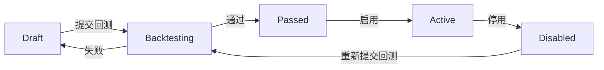
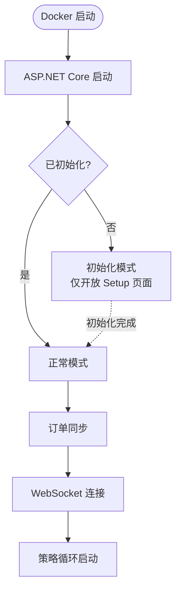

# TradeX — PRD

## 1. 文档信息

| 项目 | 内容 |
|------|------|
| 文档版本 | v2.6 |
| 文档状态 | Draft |
| 更新日期 | 2026-04-27 |

## 2. 产品定位

TradeX 多交易所现货交易机器人，通过 CEX 市场数据驱动，支持可视化可组合策略，提供 Web 管理后台，Docker 容器化部署的全自动交易系统。

## 3. 技术方向约束

| 方向 | 约束 |
|------|------|
| 后端 | .NET 平台，目标框架 `net10.0` |
| 前端 | 同一进程内的 Blazor Server |
| 部署 | Docker Compose 单机部署 |
| 数据库 | 关系型（配置数据）+ 时序型（K 线历史数据） |

> 详细技术选型见 `docs/TAD.md` §技术选型。

## 4. 目标用户与使用场景

### 4.1 用户角色

| 角色 | 权限 | MFA 要求 |
|------|------|----------|
| Super Admin | 系统初始化时创建，全部权限，不可删除 | 强制 |
| Admin | 除系统初始化外的全部权限，含用户管理 | 强制 |
| Operator | 策略编辑、交易执行、回测 | 强制 |
| Viewer | 只读查看仪表盘、持仓、订单 | 强制 |

### 4.2 核心场景

- **系统首次部署**：前端初始化向导页面配置系统参数、创建 Super Admin 账户
- **日常自动运行**：每交易所单策略并行交易，无人值守
- **策略配置**：用户在 Web UI 上选择指标、设置参数、组合条件，创建自定义策略，回测验证后启用
- **安全运营**：多用户管理，MFA 保护，API 级别权限控制，操作审计日志可追溯
- **回测验证**：任何策略上线前必须通过回测；回测数据来自时序数据库的历史 K 线
- **通知告警**：交易执行、风控触发、异常事件通过 Telegram/Discord/Email 实时推送
- **崩溃恢复**：进程意外终止后重启，自动同步交易所订单信息确保数据一致性
- **数据管理**：K 线数据存储于时序数据库，订单历史按月归档，支持数据导出
- **Docker 部署**：一条命令拉起全部服务，环境隔离，内置健康检查

## 5. 功能需求

### FR-01 交易所抽象层

| ID | 需求 |
|----|------|
| FR-01.1 | 系统必须提供统一的 `IExchangeClient` 接口，封装所有交易所共同操作 |
| FR-01.2 | 首批实现：**Binance、OKX、Gate.io、Bybit、HTX** |
| FR-01.3 | 接口必须支持：WebSocket 订阅行情、获取 K 线、获取订单簿、获取账户余额、市价/限价下单、查询订单、查询持仓、查询交易规则 |
| FR-01.4 | 每个交易所实例必须支持「测试连接」功能验证 API Key 有效性 |
| FR-01.5 | 交易所被使用时，系统必须实时从交易所拉取精准交易规则（精度、最小名义价值、最小交易量等），并在前端展示 |
| FR-01.6 | **统一限流层**：系统必须实现交易所级别的请求限流器（Rate Limiter），防止 API 调用超限被交易所封禁。限流参数按各交易所官方文档配置 |

### FR-02 交易所管理

| ID | 需求 |
|----|------|
| FR-02.1 | 用户必须能在 Web UI 上创建/编辑/删除交易所配置 |
| FR-02.2 | 每个交易所配置包含：名称、交易所类型、API Key、Secret Key、Passphrase（如有）等认证信息 |
| FR-02.3 | API Key / Secret Key 必须使用 AES-256 加密后存入 SQLite |
| FR-02.4 | 交易所必须支持启用/禁用状态切换 |
| FR-02.5 | 新增或修改 API Key 时，系统必须主动验证 Key 的权限：检查是否具有现货交易权限、检测提现权限是否已关闭（若有则发出警告）、引导用户配置交易所 IP 白名单 |
| FR-02.6 | 系统支持可选 IP 白名单开关（`Security.IpWhitelist.Enabled`），开启后拦截非白名单 IP 的 API 请求，白名单列表支持 CIDR 格式 |

### FR-03 可组合策略框架

| ID | 需求 |
|----|------|
| FR-03.1 | 策略模板支持三个部署作用域（优先级从高到低）：**交易对策略（Pair）→ 交易所策略（Exchange）→ 交易员策略（Trader）**。具体生效规则见 FSD §5.3.1 |
| FR-03.2 | **同一 Trader 在同一 Exchange 上，对同一个 Pair，同时仅允许 1 个 Active 策略**。尝试启用冲突策略时前端应提示冲突 |
| FR-03.3 | 策略必须包含入场条件树和出场条件树 |
| FR-03.4 | 条件树必须支持嵌套 AND / OR / NOT 逻辑门，任意深度 |
| FR-03.5 | 每个条件节点包含：指标类型、参数、运算符（`>`/`<`/`>=`/`<=`/`==`）、阈值 |
| FR-03.6 | 策略必须包含执行规则：入场金额（固定值/余额百分比）、滑点容差、止损/止盈、冷却时间 |
| FR-03.7 | 策略必须绑定时间周期（1m/5m/15m/1h），指标基于该周期的 K 线数据计算 |
| FR-03.8 | **策略创建后必须先通过回测才能启用**。策略状态流转：Draft → Backtesting → Passed → Active（仅 Passed 可切换为 Active） |
| FR-03.9 | 策略回测或运行时若 K 线数据拉取失败，策略不得激活，必须给出明确错误提示 |
| FR-03.10 | 策略评估周期执行过程中若进程意外中断，该次评估视为未执行过，策略状态保持为当前未生效状态 |
| FR-03.11 | 系统必须支持 **Volatility Grid（波幅触发均价再平衡）** 策略风格，围绕持仓均价进行分批加仓/减仓 |
| FR-03.12 | Volatility Grid 必须支持多时间周期部署能力 |
| FR-03.13 | Volatility Grid 必须支持可配置的加仓次数上限 |
| FR-03.14 | Volatility Grid 允许关闭单笔止损，但必须保留账户级风控兜底 |

### FR-04 技术指标

| ID | 需求 |
|----|------|
| FR-04.1 | 基于 Skender.Stock.Indicators 封装技术指标库 |
| FR-04.2 | 首批支持的指标：RSI、MACD、SMA、EMA、Bollinger Bands、Volume SMA、OBV、KDJ |
| FR-04.3 | 指标是策略的一部分，在策略层面绑定（指标 → 策略，而非全局配置） |
| FR-04.4 | 指标计算使用策略绑定的 K 线数据（回测时用历史数据，运行时用实时数据） |

### FR-05 实时数据管道

| ID | 需求 |
|----|------|
| FR-05.1 | 系统必须使用 **WebSocket** 订阅交易所实时行情（ticker / kline / depth），禁止使用 REST 轮询获取实时数据 |
| FR-05.2 | 每个交易所必须有独立的 WebSocket 连接管理器，处理连接、认证（如需）、心跳、重连 |
| FR-05.3 | WebSocket 数据流入内存缓存，策略引擎从缓存读取而非直接请求交易所 |
| FR-05.4 | K 线数据同时写入时序数据库作为持久化历史数据 |
| FR-05.5 | 数据流向：`交易所 WebSocket → 内存缓存 → 指标计算 → 策略评估 → SignalR → 前端` |

### FR-06 交易执行

| ID | 需求 |
|----|------|
| FR-06.1 | 策略引擎作为 BackgroundService 定时执行策略评估循环 |
| FR-06.2 | 入场条件满足时，经风控检查通过后执行买入 |
| FR-06.3 | 出场条件满足时，执行卖出/止损/止盈 |
| FR-06.4 | 支持市价单和限价单 |
| FR-06.5 | 支持手动下单（Web UI 上直接执行买入/卖出） |
| FR-06.6 | 下单结果必须写入订单记录并更新持仓状态 |
| FR-06.7 | 限价单需调研各交易所的限制和要求（部分成交处理、超时撤单机制、订单状态同步与 reconcile） |
| FR-06.8 | **滑点控制**：滑点容差必须作为可配置项（策略级别或全局默认值），允许用户设定最大允许滑点百分比。下单前预估滑点，超过阈值时拒绝下单 |

### FR-07 风控

| ID | 需求 |
|----|------|
| FR-07.1 | 系统必须支持仓位级别止损（固定百分比） |
| FR-07.2 | 系统必须支持仓位级别止盈（固定百分比） |
| FR-07.3 | 系统必须支持移动止损 |
| FR-07.4 | 系统必须支持交易冷却期（单策略维度） |
| FR-07.5 | 系统必须支持最大持仓数限制 |
| FR-07.6 | **日亏损限额**：当日累计已实现亏损超过阈值时，暂停所有交易，次日 00:00 UTC 自动恢复 |
| FR-07.7 | **最大回撤暂停**：账户净值从峰值回撤超过阈值时，暂停所有交易并通知 |
| FR-07.8 | **连续亏损暂停**：连续 N 笔交易亏损时，暂停该策略并通知 |
| FR-07.9 | **交易频率熔断**：单策略短时间内反复触发买入信号时，系统应合并或限流处理 |
| FR-07.10 | **系统级风控**：支持全局 Kill Switch（紧急停止所有交易、撤单、禁用策略）；系统总敞口上限、日亏损上限、最大回撤百分比 |
| FR-07.11 | **交易员级风控**：按 Trader 维度独立配置总敞口上限、日亏损上限、活跃策略数上限、最大回撤 |
| FR-07.12 | **交易所级风控**：按 Exchange 维度配置最大可交易余额、API 健康度自动暂停（连续 N 次 5xx 自动停用）、单日交易量上限、币种集中度限制 |
| FR-07.13 | **币种级风控**：按 Pair 维度配置总持仓上限、日交易次数上限 |
| FR-07.14 | **四层风控叠加生效**：系统级 → 交易员级 → 交易所级 → 币种级，任一层级触发即停止对应范围内的交易行为，各层级独立恢复策略 |

### FR-08 用户与鉴权

| ID | 需求 |
|----|------|
| FR-08.1 | 支持用户登录、登出 |
| FR-08.2 | 密码必须使用 bcrypt 哈希存储 |
| FR-08.3 | 所有用户（含 Super Admin）登录时必须验证 MFA TOTP 码 |
| FR-08.4 | 首次绑定 MFA 时生成 8 个恢复码（单次使用） |
| FR-08.5 | 使用 Casbin.NET 实现 API 级别 RBAC 鉴权：Super Admin / Admin / Operator / Viewer 四级角色 |
| FR-08.6 | Super Admin 不可删除，不可降级；Admin 可管理普通用户和分配角色 |
| FR-08.7 | 未登录请求一律返回 401，未授权请求一律返回 403 |
| FR-08.8 | 用户注册仅通过系统初始化创建 Super Admin，后续用户由 Admin 在管理页面创建 |

#### FR-08-A Casbin 权限策略模型

Casbin 策略以 API 路径 + HTTP 方法为资源单元，按角色授权：

```
# 模型 (model.conf):
[request_definition]
r = sub, obj, act

[policy_definition]
p = sub, obj, act

[role_definition]
g = _, _

[matchers]
m = g(r.sub, p.sub) && keyMatch3(r.obj, p.obj) && regexMatch(r.act, p.act)

# 策略示例:
p, super_admin, /api/*, (GET)|(POST)|(PUT)|(DELETE)
p, admin, /api/exchanges/*, (GET)|(POST)|(PUT)|(DELETE)
p, admin, /api/users/*, (GET)|(POST)|(PUT)|(DELETE)
p, admin, /api/audit-logs, GET
p, admin, /api/system/*, (GET)|(POST)
p, operator, /api/strategies, (GET)|(POST)
p, operator, /api/strategies/*, (GET)|(PUT)
p, operator, /api/strategies/*/toggle, POST
p, operator, /api/orders/manual, POST
p, operator, /api/backtests, (GET)|(POST)
p, viewer, /api/*, GET

g, alice, super_admin
g, bob, admin
g, charlie, operator
g, dave, viewer
```

Casbin 不参与 MFA 验证。MFA 在 JWT 签发前完成，是登录的前置条件。JWT 中包含用户角色，API 层通过 Casbin 鉴权中间件校验。

### FR-09 通知与告警

| ID | 需求 |
|----|------|
| FR-09.1 | 系统必须支持多渠道通知：Telegram、Discord、Email |
| FR-09.2 | 通知渠道配置在 Web UI 上进行（Webhook URL / Bot Token / SMTP 等），配置加密存储 |
| FR-09.3 | **交易通知**：开仓、平仓、止损/止盈触发时推送到配置的通知渠道 |
| FR-09.4 | **异常告警**：交易所连接断开、WS 断线重连、API Key 失效时发送告警 |
| FR-09.5 | **风控告警**：日亏损限额触发、最大回撤暂停、连续亏损暂停时发送告警 |
| FR-09.6 | 通知模板必须包含关键信息：策略名称、交易对、金额、价格、PnL、时间 |
| FR-09.7 | 通知渠道必须有健康检查，发送失败应记录日志 |

### FR-10 审计日志

| ID | 需求 |
|----|------|
| FR-10.1 | 系统必须记录所有敏感操作的审计日志 |
| FR-10.2 | 审计范围包括：登录/登出、交易所配置变更（创建/编辑/删除）、策略启用/停用、策略配置修改、手动下单、用户创建/角色变更 |
| FR-10.3 | 每条审计日志包含：操作时间、操作用户、操作类型、资源类型、资源 ID、操作详情、请求 IP |
| FR-10.4 | 审计日志存储在 SQLite 的 `AuditLog` 表中 |
| FR-10.5 | Admin 及以上角色可在 Web UI 上按时间/用户/操作类型查询审计日志 |

### FR-11 Web 仪表盘

| ID | 需求 |
|----|------|
| FR-11.1 | **初始化向导页面**（仅首次启动无 Super Admin 时显示）：配置系统参数、创建 Super Admin 账号、绑定 MFA |
| FR-11.2 | **系统设置页面**（Admin 及以上）：查看/修改系统级配置参数（通知默认值、滑点默认值、风控全局默认值等） |
| FR-11.3 | 仪表盘页面展示：账户余额汇总、活跃持仓、最近交易、策略状态、风控状态（当日亏损、回撤等） |
| FR-11.4 | 交易所管理页面：CRUD 交易所、查看实时交易规则 |
| FR-11.5 | 策略编辑器页面：可视化配置策略（指标选择、参数设置、条件组合）、策略状态流转 |
| FR-11.6 | 策略列表页面：查看/回测/启用/停用策略 |
| FR-11.7 | 持仓面板：实时持仓详情、PnL |
| FR-11.8 | 订单历史页面：按时间/策略/交易对筛选，支持数据导出 |
| FR-11.9 | 回测页面：创建回测任务、查看结果图表（收益曲线、回撤曲线） |
| FR-11.10 | 通知配置页面：管理 Telegram/Discord/Email 通知渠道 |
| FR-11.11 | 审计日志页面（Admin 及以上）：查询操作审计日志 |
| FR-11.12 | 用户管理页面（Admin 及以上）：用户列表、创建用户、角色分配 |
| FR-11.13 | 所有实时数据通过 SignalR 推送 |

### FR-12 回测引擎

| ID | 需求 |
|----|------|
| FR-12.1 | 支持选择策略 + 时间范围创建回测任务 |
| FR-12.2 | 回测数据来源为时序数据库中的历史 K 线数据 |
| FR-12.3 | 回测引擎按时间顺序逐根 K 线执行策略评估，模拟交易过程 |
| FR-12.4 | 回测结果包含：总收益率、年化收益率、最大回撤、胜率、交易次数、Sharpe Ratio、盈亏比 |
| FR-12.5 | 回测结果以图表展示（收益曲线、回撤曲线、每笔交易标注） |
| FR-12.6 | 策略只有通过回测（pass）才允许切换为 Active 状态 |
| FR-12.7 | Volatility Grid 回测必须与实盘使用同一套决策逻辑（首单触发、均价加减仓、加仓次数上限），仅允许成交价格因滑点模型不同而产生偏差 |

### FR-13 数据管理与生命周期

| ID | 需求 |
|----|------|
| FR-13.1 | **配置数据**（用户、交易所、策略、持仓、订单、审计日志）存储在 SQLite |
| FR-13.2 | **K 线历史数据**：回测时通过交易所 REST API 拉取，无需独立时序数据库 |
| FR-13.3 | **K 线预热**：策略首次启动/启用时，从交易所通过 REST 接口回填至少 3 天的 15 分钟级 K 线数据到内存缓存 |
| FR-13.4 | **WS 断线重连**：WebSocket 断开重连后，需要调研各交易所是否支持补发断线期间的 K 线数据；若不支持，通过 REST 回填缺失区间 |
| FR-13.5 | **订单归档**：订单记录超过 1 个月后自动归档为 JSON 文件，按月压缩存储，原 SQLite 记录保留摘要索引 |
| FR-13.6 | **数据导出**：Web UI 上支持导出订单历史为 CSV / JSON 格式 |
| FR-13.7 | SQLite 数据目录挂载为 Docker 持久卷 |

### FR-14 崩溃恢复与启动同步

| ID | 需求 |
|----|------|
| FR-14.1 | 系统启动时（Trading Engine 开始运行前），必须对每个已启用交易所执行一次订单同步 reconciliation |
| FR-14.2 | 同步逻辑：从交易所拉取最近 N 笔订单状态 → 与本地 `Order` 和 `Position` 记录比对 → 修复不一致的订单/持仓状态 |
| FR-14.3 | 同步完成后记录日志：条数、修复项数 |
| FR-14.4 | 同步失败不应阻塞系统启动，但必须发出告警通知 |

### FR-15 系统初始化

| ID | 需求 |
|----|------|
| FR-15.1 | 系统首次启动且数据库中无 Super Admin 用户时，所有 API 除初始化接口外返回 503 Service Unavailable |
| FR-15.2 | 前端自动检测初始化状态，跳转到初始化向导页面 |
| FR-15.3 | 初始化向导页面引导用户创建 Super Admin 账户（用户名 + 密码），创建完成后系统自动写入默认配置；初始化不包含 MFA 绑定，用户首次登录后通过标准 MFA 绑定流程（login → mfa/setup → mfa/verify）完成激活 |
| FR-15.4 | 初始化完成后系统恢复正常运行模式 |
| FR-15.5 | 初始化操作仅允许执行一次；重置需通过特殊维护操作 |

### FR-16 Docker 部署

| ID | 需求 |
|----|------|
| FR-16.1 | 根级统一 Dockerfile，2 阶段构建：.NET SDK 构建 → ASP.NET Runtime 运行（Blazor Server 与 API 在同一进程中） |
| FR-16.2 | Blazor Server UI 与 REST API / SignalR Hub 共享同一 ASP.NET Core 进程，无需独立 Nginx 容器 |
| FR-16.3 | docker-compose.yml 编排：tradex（API+SPA 统一容器），配合持久卷 |
| FR-16.4 | 支持通过环境变量注入关键配置（数据库路径、JWT Secret 等） |
| FR-16.5 | 后端必须提供 `GET /health` 端点，返回数据库连接、各交易所 WS 连接状态 |
| FR-16.6 | docker-compose.yml 中为 tradex 配置 healthcheck 指令 |
| FR-16.7 | API 路由 `/api/*` 和 SignalR Hub `/hubs/trading` 与静态文件在同一个端口提供服务 |

## 6. 非功能需求

| NFR | 要求 |
|-----|------|
| NFR-01 | .NET 10 + C# 14 (LangVersion=14.0)，Nullable 启用 |
| NFR-02 | Blazor Server 统一进程，REST API + SignalR 通信 |
| NFR-03 | 交易所 API Key 在 SQLite 中以 AES-256 加密存储 |
| NFR-04 | JWT Token 有过期机制 + Refresh Token |
| NFR-05 | 日志使用 Serilog 结构化日志 |
| NFR-06 | 测试工程使用 xUnit + NSubstitute，dotnet test 全量通过 |
| NFR-07 | Docker 镜像体积最小化（多阶段构建） |
| NFR-08 | 限价单实现前需调研各交易所对限价单的要求和限制 |
| NFR-09 | WebSocket 断线重连后的 K 线补发能力需逐一调研各交易所 |
| NFR-10 | API 文档（Swagger / Scalar）仅在 Development 环境中暴露 |

## 7. 业务流程（用户视角）

### 7.1 交易循环

系统启动后自动化运行：实时行情通过 WebSocket 流入系统 → 策略引擎按固定周期评估入场/出场条件 → 条件满足时经风控检查后执行交易 → 交易结果实时推送到前端。

> 详细数据流与交易引擎规格见 `docs/FSD.md` §10 Trading Engine。

### 7.2 策略生命周期



> 详细状态机与部署规则见 `docs/FSD.md` §5.3 策略状态机。

### 7.3 系统启动流程



> 详细启动流程与初始化守卫见 `docs/FSD.md` §5.1 系统初始化状态机。

## 8. 项目结构

> 项目采用分层架构，依赖方向：`Api → Trading → Exchange, Indicators, Infrastructure, Notifications`，Core 为零依赖叶节点。
> 详细项目结构见 `docs/TAD.md` §3 C4 模型及 `docs/FSD.md` §4 系统模块拆分。

## 9. 里程碑

| 里程碑 | 内容 | 阶段 |
|--------|------|------|
| M1 基础设施 | 项目框架、初始化向导 + Super Admin、MFA、Casbin 鉴权、SQLite、Docker 化（含 healthcheck） | 核心 |
| M2 交易所集成 | IExchangeClient 抽象、首批 5 个交易所实现、交易所 CRUD、API Key 加密存储与权限验证、WebSocket 连接管理器、统一限流层 | 核心 |
| M3 策略引擎 | 指标库封装（Skender.Stock.Indicators）、条件树引擎、策略 CRUD、策略编辑器前端、K 线数据预热 | 核心 |
| M4 交易执行 | 策略评估循环、下单执行（含滑点控制）、持仓管理、风控（含策略级 + 多层级组合风控）、Kill Switch、SignalR 推送、时序数据库集成、启动订单同步 | 核心 |
| M5 通知与运维 | Telegram/Discord/Email 通知、审计日志、订单归档与导出、通知配置 UI、审计日志 UI、系统设置页 | 后续 |
| M6 Web 仪表盘 | 监控面板、回测引擎 + UI、用户管理 | 后续 |
| M7 测试与调研 | 全量测试覆盖、交易所限价单规则调研、WS 断线补发机制调研、边界条件测试 | 贯穿 |

## 10. API 端点总览

> 所有 API 端点定义（路径、方法、请求/响应体、角色权限）详见 `docs/FSD.md` §7 API 规格。

## 11. 数据模型

> 完整数据模型定义（实体字段、约束、关系）详见 `docs/FSD.md` §6 数据模型。

## 12. 验收标准

| AC | 内容 |
|----|------|
| AC-01 | docker-compose up 启动后前后端均可访问，health 端点返回 OK |
| AC-02 | 首次访问 → 显示初始化向导 → 创建 Super Admin + 绑定 MFA → 恢复正常 |
| AC-03 | Super Admin 登录（MFA 验证）→ 签发 JWT |
| AC-04 | 创建用户 → MFA 绑定 → 完整登录流程 |
| AC-05 | Viewer 访问 POST API 返回 403 |
| AC-06 | 添加交易所 → 测试连接（含 API Key 权限验证）→ 确认联通，展示实时交易规则 |
| AC-07 | 创建策略（关联单交易所、多条件嵌套）→ 提交回测 → 通过 → 启用（同 Pair 无冲突时）|
| AC-08 | 尝试在同一 Trader + 同一 Exchange + 同 Pair 启用第二个 Active 策略 → 被拒绝并提示冲突 |
| AC-09 | 策略引擎实时评估，滑点未超限时正常下单，滑点超限时拒绝 |
| AC-10 | 止损/止盈/日亏损限额/最大回撤/连续亏损均按配置触发 |
| AC-10-B | 触发系统级 Kill Switch 后，所有交易停止、活跃挂单撤除、全部策略禁用 |
| AC-10-C | IP 白名单开启后，非白名单 IP 请求被拦截；关闭后恢复正常访问 |
| AC-11 | 进程崩溃后重启 → 自动同步交易所订单 → 持仓数据一致 |
| AC-12 | WebSocket 实时数据流入缓存，SignalR 实时推送到前端 |
| AC-13 | 通知渠道配置后，交易和告警正确推送 |
| AC-14 | 审计日志记录所有敏感操作，Admin 可查询 |
| AC-15 | 订单历史可按月归档并导出 CSV/JSON |
| AC-16 | 回测可运行并产出完整绩效报告 |
| AC-17 | 开发环境可访问 Swagger，生产环境不可访问 |
| AC-18 | dotnet test 全量通过 |
