# TradeX — TAD (Technical Architecture Document)

## 1. 文档信息

| 项目 | 内容 |
|---|---|
| 文档版本 | v1.0 |
| 文档状态 | Draft |
| 基于 PRD | `docs/PRD.md` v2.4 |
| 基于 FSD | `docs/FSD.md` v1.4 |
| 更新时间 | 2026-04-24 |
| 适用阶段 | 立项评审 / M1-M7 研发 |

---

## 2. 架构原则与约束

### 2.1 架构原则

| # | 原则 | 说明 |
|---|------|------|
| P1 | **防御第一** | 所有外部输入视为不可信；资金操作必须过风控链；交易所 API 调用必须过限流器 |
| P2 | **离线韧性** | 每个交易所 WebSocket 断线、IoTDB 不可用、交易所 API 5xx，均不可导致系统崩溃；应有降级路径 |
| P3 | **可观测性内建** | 结构化日志、审计日志、Health 端点、风控事件，不是后加的功能 |
| P4 | **状态显式化** | 策略状态机、订单状态机、持仓状态机全部用枚举 + 状态转换表驱动，禁止 if/else 隐式状态 |
| P5 | **依赖单向** | `Api → Trading → Exchange / Indicators / Infrastructure / Notifications`，Core 是叶节点，零依赖 |
| P6 | **配置即代码** | 所有可调参数（风控阈值、限流参数、K 线预热天数）均为强类型 Options 绑定，禁止 hardcode |
| P7 | **数据一致性兜底** | 订单 Reconciliation 是启动时必执行流程；本地状态以交易所为准，但交易所不可用时以本地为准 |

### 2.2 外部约束

| 约束 | 来源 |
|------|------|
| 目标框架 `net10.0` + `LangVersion=preview` | AGENTS.md |
| 前端 Vue 3 + TypeScript + Pinia | AGENTS.md |
| SQLite 为主存储，IoTDB 为时序存储 | PRD FR-13 |
| Docker Compose 单机部署，无 K8s | PRD FR-16 |
| 仅支持现货交易，不涉及合约/杠杆 | FSD §25 待确认 #10 |
| 交易所 SDK 统一使用 JKorf 系列 | FSD v1.3 |

---

## 3. C4 模型

### 3.1 Level 1 — Context (系统上下文)

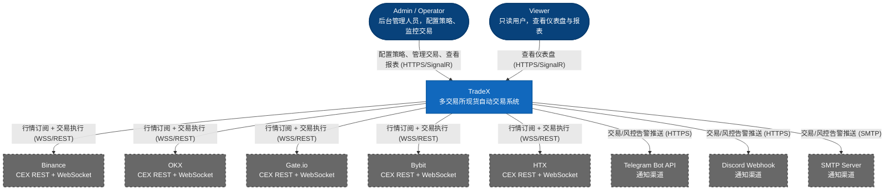

### 3.2 Level 2 — Container (容器视图)

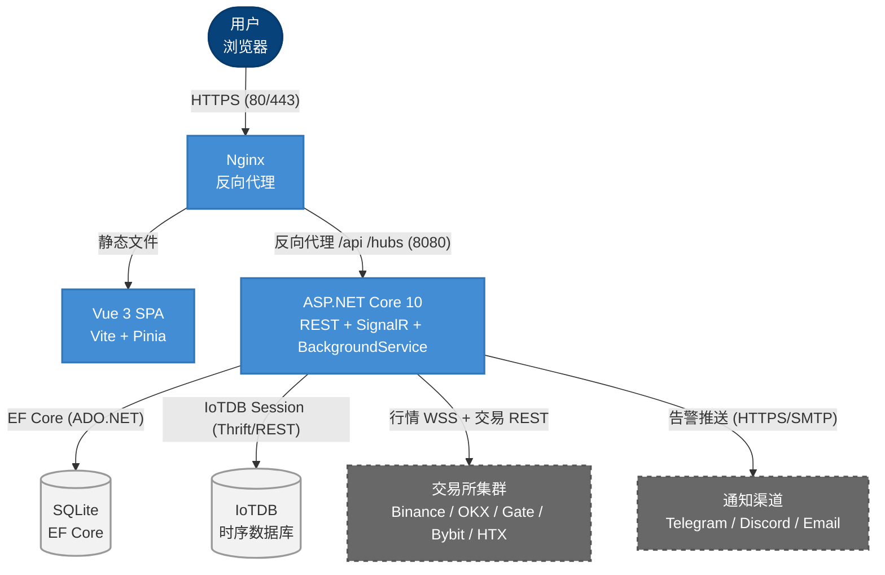

#### 3.2.1 容器职责矩阵

| 容器 | 技术 | 实例数 | 状态持久化 | 扩缩容 |
|------|------|--------|-----------|--------|
| Nginx | nginx:alpine | 1 | 无状态 | 水平（需前置 LB） |
| Vue SPA | Vue 3 + TS | 1 | 无状态（浏览器端） | 水平（CDN 可缓存） |
| Backend | ASP.NET Core 10 | 1 | 有状态（内存 K 线缓存） | 仅垂直（单实例 Trading Engine） |
| SQLite | Microsoft.Data.Sqlite | 1 | 文件持久卷 | N/A（单实例写） |
| IoTDB | apache/iotdb:1.3.3 | 1 | 文件持久卷 | 仅垂直（单实例） |

> **关键约束**：Trading Engine 作为 `BackgroundService` 维护策略评估循环和内存 K 线缓存，当前架构仅支持单后端实例。多实例部署需引入分布式缓存（Redis）和分布式锁，属于后期可演进方向。

---

### 3.3 Level 3 — Component (组件视图)

#### 3.3.1 TradeX.Api 组件

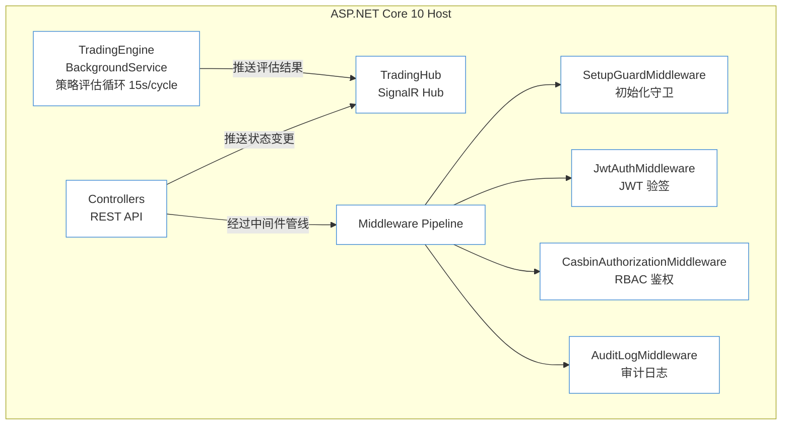

**中间件管线顺序**：
```
Request → ExceptionHandling → Serilog RequestLogging
  → SetupGuard → JwtAuth → CasbinAuthorization → AuditLog
    → Routing → Authorization → Controller → Response
```

#### 3.3.2 TradeX.Trading 组件

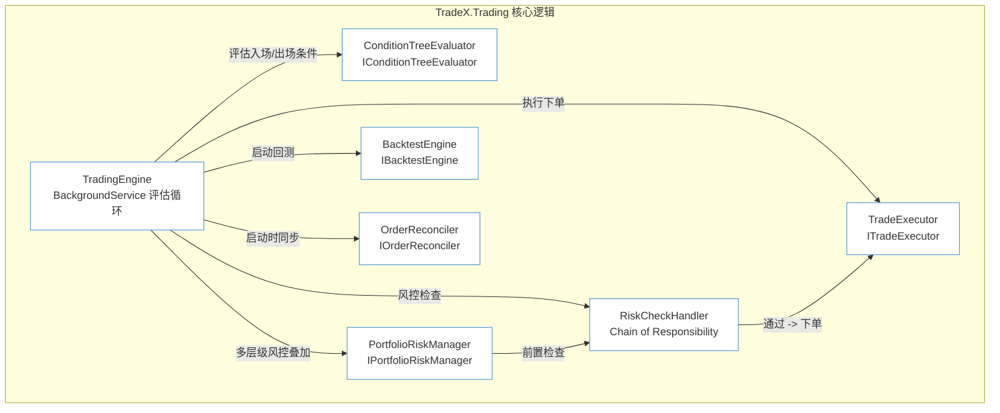

**风控链节点顺序** (Chain of Responsibility)：

```
入场信号
  → [1] SlippageCheck        — 预估滑点 > 容差？
  → [2] DailyLossCheck       — 当日亏损超限？
  → [3] MaxDrawdownCheck     — 最大回撤超限？
  → [4] ConsecutiveLossCheck — 连续亏损超限？
  → [5] FreqCircuitBreaker   — 5分钟内触发 ≥3 次？
  → [6] CooldownCheck        — 距上次交易 < 冷却期？
  → [7] MaxPositionCheck     — 持仓数已达上限？
  → [通过] ExecuteBuy / ExecuteSell
```

#### 3.3.3 TradeX.Exchange 组件

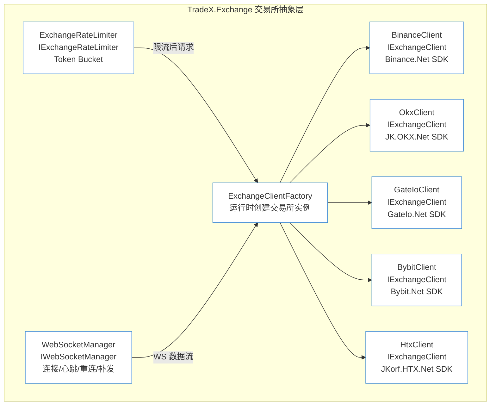

**IExchangeClient 统一接口**：

```csharp
public interface IExchangeClient
{
    // Market Data
    IAsyncEnumerable<Candle> SubscribeKlinesAsync(string symbol, string interval, CancellationToken ct);
    Task<Candle[]> GetKlinesAsync(string symbol, string interval, DateTime start, DateTime end, CancellationToken ct);
    Task<OrderBook> GetOrderBookAsync(string symbol, int limit, CancellationToken ct);

    // Account
    Task<AccountBalance> GetBalanceAsync(CancellationToken ct);
    Task<Position[]> GetPositionsAsync(CancellationToken ct);

    // Trading
    Task<OrderResult> PlaceOrderAsync(OrderRequest request, CancellationToken ct);
    Task<OrderResult> CancelOrderAsync(string exchangeOrderId, CancellationToken ct);
    Task<OrderResult> GetOrderAsync(string exchangeOrderId, CancellationToken ct);
    Task<OrderResult[]> GetRecentOrdersAsync(DateTime since, CancellationToken ct);

    // Validation
    Task<ConnectionTestResult> TestConnectionAsync(CancellationToken ct);

    // Rules
    Task<SymbolRule[]> GetSymbolRulesAsync(CancellationToken ct);
}
```

#### 3.3.4 TradeX.Infrastructure 组件

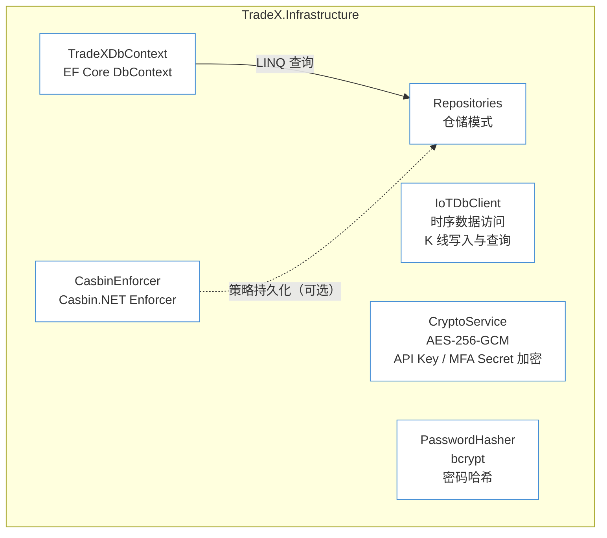

#### 3.3.5 TradeX.Notifications 组件

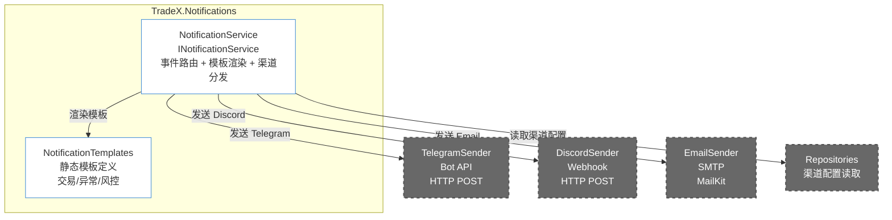

---

## 4. 数据架构

### 4.1 数据存储分布策略

| 数据类别 | 存储引擎 | 访问模式 | 一致性要求 | 备份策略 |
|----------|---------|---------|-----------|---------|
| 用户 / 配置 | SQLite | 低频读写 | 强一致 | `sqlite3 .backup` |
| 交易所凭证 | SQLite (AES 加密) | 低频读 | 强一致 | 同上 |
| 策略 / 订单 | SQLite | 中频读写 | 强一致 | 同上 |
| 持仓 | SQLite | 高频更新（15s/cycle） | 最终一致 | 同上 |
| 审计日志 | SQLite | 仅追加写 + 低频范围查 | 最终一致 | 同上 + 归档 |
| K 线历史 | IoTDB | 高频追加写 + 范围读 | 最终一致 | IoTDB snapshot |
| 归档订单 | JSON (gzip) | 极低频读 | 最终一致 | 与 SQLite 同卷 |

### 4.2 ER 图 (核心实体)

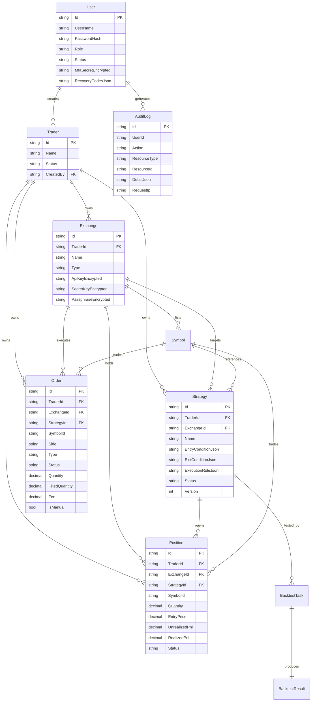

### 4.3 IoTDB 时序数据设计

| 序列路径 | 数据类型 | 说明 |
|----------|---------|------|
| `root.tradex.{exchange}.{symbol}.kline.{interval}.open` | DOUBLE | 开盘价 |
| `root.tradex.{exchange}.{symbol}.kline.{interval}.high` | DOUBLE | 最高价 |
| `root.tradex.{exchange}.{symbol}.kline.{interval}.low` | DOUBLE | 最低价 |
| `root.tradex.{exchange}.{symbol}.kline.{interval}.close` | DOUBLE | 收盘价 |
| `root.tradex.{exchange}.{symbol}.kline.{interval}.volume` | DOUBLE | 成交量 |
| `root.tradex.{exchange}.{symbol}.kline.{interval}.closeTime` | INT64 | 收盘时间戳 |

**存储组设计**: `root.tradex` 单存储组（单机部署，无需跨组）

**保留策略**: 90 天滚动删除（通过 IoTDB 的 TTL 设置）

---

## 5. 数据流架构

### 5.1 实时交易数据流

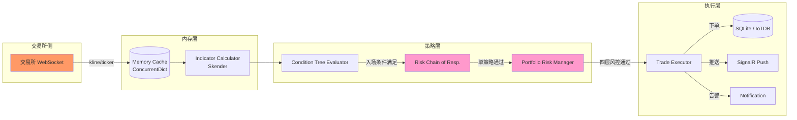

### 5.2 系统启动数据流

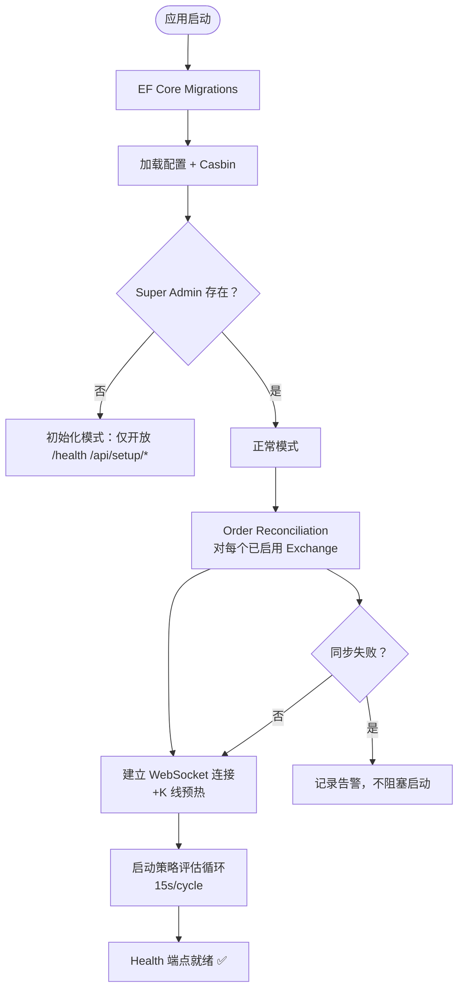

### 5.3 WebSocket 断线重连 + K 线回填

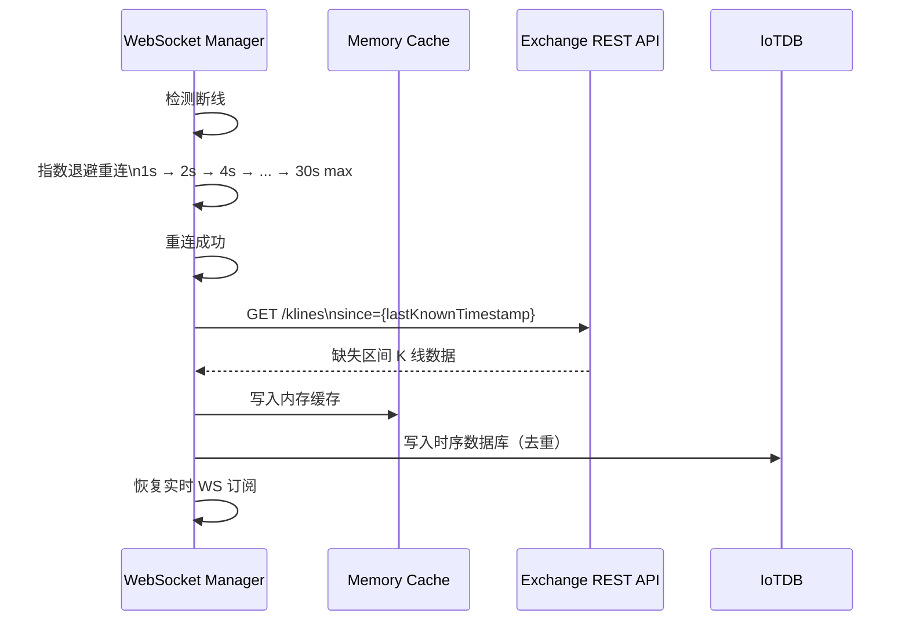

---

## 6. 架构决策记录 (ADR)

### ADR-001: SQLite 为主存储

| 属性 | 值 |
|------|-----|
| **状态** | **Accepted** |
| **上下文** | TradeX 为单机 Docker 部署系统，数据规模可控（配置数据 < 1GB/年） |
| **决策** | 使用 SQLite 作为主存储引擎，EF Core 作为 ORM |
| **理由** | 零运维、零独立进程、备份简单 (`sqlite3 .backup`)、EF Core 迁移成熟 |
| **后果** | 不支持多实例并发写；写锁争用需注意（Trading Engine 15s/cycle 写入 Order）；归档机制可缓解单表增长 |
| **替代否决** | PostgreSQL（增加运维复杂度，单机场景过重） |

### ADR-002: IoTDB 为时序数据库

| 属性 | 值 |
|------|-----|
| **状态** | **Accepted** |
| **上下文** | K 线数据是典型的时序数据：高频追加写、范围读、无需事务 |
| **决策** | 使用 Apache IoTDB 1.3.3 存储历史 K 线 |
| **理由** | 原生支持时间序列（优于 SQLite）、列式压缩存储空间、内置 TTL 过期、Docker 化部署简单 |
| **后果** | 引入额外容器依赖；初期可 SQLite 降级（FR-13 K 线预热可直接从交易所 REST 拉取） |
| **替代否决** | InfluxDB（Docker 镜像 > 300MB vs IoTDB ~200MB）；TimescaleDB（依赖 PostgreSQL） |

### ADR-003: Casbin.NET 为鉴权引擎

| 属性 | 值 |
|------|-----|
| **状态** | **Accepted** |
| **上下文** | 四角色（SuperAdmin / Admin / Operator / Viewer）基于 API 路径 + HTTP 方法的 RBAC |
| **决策** | 使用 Casbin.NET，模型为 `keyMatch3 + regexMatch` |
| **理由** | 策略与代码分离（model.conf + policy.csv）、支持热加载（不用重启）、C# 生态成熟 |
| **后果** | 每新增 API 端点需同步更新 policy.csv；需要额外 CasbinAuthorizationMiddleware |
| **替代否决** | 手写 middleware + Attribute（策略硬编码，变更需重编译）；`[Authorize(Roles="...")]`（不支持路径模式匹配） |

### ADR-004: Chain of Responsibility 为风控模式

| 属性 | 值 |
|------|-----|
| **状态** | **Accepted** |
| **上下文** | 7 个风控检查项，未来可能增加；检查顺序固定，每个独立可配置 |
| **决策** | 使用 Chain of Responsibility 模式组装风控管线 |
| **理由** | 新增检查项只需新加 Handler 并注册；每个检查独立测试；管线顺序一目了然 |
| **后果** | 需注意 Handler 之间不要产生隐含状态依赖；通过 RiskContext 传递共享数据 |
| **替代否决** | 硬编码 if-else 链（违反开闭原则）；装饰器模式（不便于管线控制） |

### ADR-005: Trading Engine 为单实例 BackgroundService

| 属性 | 值 |
|------|-----|
| **状态** | **Accepted** |
| **上下文** | 策略评估循环需要维护内存态 K 线缓存和活跃策略列表 |
| **决策** | TradingEngine 作为 `BackgroundService` 在 API 进程中运行，固定评估周期 15s |
| **理由** | 避免部署分布式缓存（Redis）的复杂度；单机场景可接受 15s 延迟；直接访问内存缓存无网络开销 |
| **后果** | 无法水平扩展多实例（多实例会导致重复下单）。如未来需要 HA，需引入分布式锁 + Redis 缓存 |
| **替代否决** | 独立 Trading Worker 进程（增加部署和 IPC 复杂度，不合算） |

### ADR-006: JKorf 系列为交易所 SDK

| 属性 | 值 |
|------|-----|
| **状态** | **Accepted** |
| **上下文** | 5 个交易所需要统一的 .NET SDK 封装 |
| **决策** | 使用 JKorf 系列各交易所 SDK（Binance.Net / JK.OKX.Net / GateIo.Net / Bybit.Net / JKorf.HTX.Net） |
| **理由** | 统一设计风格、社区活跃、WebSocket 内置、支持 .NET 10；网帘层 `IExchangeClient` 屏蔽 SDK 差异 |
| **后果** | SDK 本身有第三方依赖风险；需关注各 SDK 的 net10.0 兼容性 |
| **替代否决** | 各交易所官方 SDK（API 风格差异大、封装成本高、部分无官方 .NET SDK） |

### ADR-007: Skender.Stock.Indicators 为指标库

| 属性 | 值 |
|------|-----|
| **状态** | **Accepted** |
| **上下文** | 技术支持 8 个首批指标，未来可扩展 |
| **决策** | 封装 Skender.Stock.Indicators 为 `TradeX.Indicators` 模块 |
| **理由** | 50+ 指标、活跃维护、net10.0 兼容；封装层可替换底层库 |
| **后果** | 需确保计算结果与交易所内置指标一致（尤其 KDJ 等非标准指标） |
| **替代否决** | Trady（已不活跃）；TA-Lib（C 依赖，跨平台问题） |

### ADR-008: AES-256-GCM 为凭证加密算法

| 属性 | 值 |
|------|-----|
| **状态** | **Accepted** |
| **上下文** | API Key / Secret / Passphrase / MFA Secret 需加密存储 |
| **决策** | 使用 AES-256-GCM（认证加密） |
| **理由** | GCM 模式内置认证标签（防篡改）、NIST 推荐、.NET `AesGcm` 类原生支持 |
| **后果** | 密钥管理在 `jwt.secret` 派生（或独立密钥），需密钥轮换策略；密钥丢失 = 数据不可恢复 |
| **替代否决** | AES-CBC + HMAC（需要手动组合，易出错）；RSA（性能差，不适合大批量加解密） |

---

## 7. 部署架构

### 7.1 Docker Compose 网络拓扑

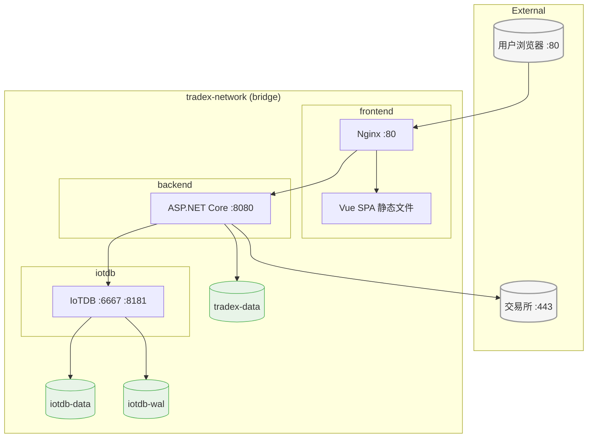

### 7.2 Nginx 反向代理配置

```nginx
server {
    listen 80;
    server_name _;

    root /usr/share/nginx/html;
    index index.html;

    # SPA 路由
    location / {
        try_files $uri $uri/ /index.html;
    }

    # API 反代
    location /api/ {
        proxy_pass http://backend:8080;
        proxy_set_header Host $host;
        proxy_set_header X-Real-IP $remote_addr;
        proxy_set_header X-Forwarded-For $proxy_add_x_forwarded_for;
    }

    # SignalR WebSocket 反代（必须支持长连接）
    location /hubs/ {
        proxy_pass http://backend:8080;
        proxy_http_version 1.1;
        proxy_set_header Upgrade $http_upgrade;
        proxy_set_header Connection "upgrade";
        proxy_set_header Host $host;
        proxy_read_timeout 86400;
    }

    # Health 反代
    location /health {
        proxy_pass http://backend:8080;
    }
}
```

### 7.3 环境变量配置清单

| 变量 | 默认值 | 说明 |
|------|--------|------|
| `ASPNETCORE_ENVIRONMENT` | Production | 运行环境 |
| `ASPNETCORE_URLS` | http://+:8080 | 监听地址 |
| `ConnectionStrings__Sqlite` | Data Source=/data/tradex.db | SQLite 路径 |
| `Jwt__Secret` | — | **必填**，JWT 签名密钥 |
| `Jwt__AccessTokenExpiresMinutes` | 30 | AccessToken 有效期 |
| `Jwt__RefreshTokenExpiresDays` | 7 | RefreshToken 有效期 |
| `IoTDB__Host` | localhost | IoTDB 主机 |
| `IoTDB__Port` | 6667 | IoTDB Thrift 端口 |
| `Serilog__MinimumLevel__Default` | Information | 日志级别 |

---

## 8. 横切关注点

### 8.1 错误处理策略

| 层级 | 策略 | 说明 |
|------|------|------|
| Controller | 全局异常过滤器 `ExceptionHandlingMiddleware` | 500 → 统一 JSON 错误响应 + 日志 + traceId |
| Service/Business | 传播异常，自定义 `DomainException` | 400/404/409 → 带业务错误码 |
| Trading Engine | catch + log + 继续循环 | 单策略异常不影响其他策略；连续 N 次异常暂停该策略 |
| Exchange Client | catch API 异常 → 转换为 `ExchangeException` | 包含错误码、HTTP 状态、原始消息 |
| WebSocket | 断线重连自动恢复 | 重连失败上限后标记 `Disconnected`，不 crash |

### 8.2 日志策略

| 日志类别 | Serilog Sink | 保留策略 | 格式 |
|----------|-------------|---------|------|
| 应用日志 | Console + File | 7 天轮换 | JSON 结构化 |
| 审计日志 | AuditLog 表 | 6 个月 | 结构化 + 已索引 |
| 交易日志 | Console + File | 30 天轮换 | 结构化（含 OrderId/TraderId） |
| 风控日志 | Console + File | 30 天轮换 | 结构化（含 RiskContext） |

### 8.3 并发策略

| 场景 | 策略 | 说明 |
|------|------|------|
| 同一 Symbol 同时触发买入 | 策略级锁 + 风控熔断 | Trading Engine 同周期内同一 Symbol 仅执行一次 |
| 手动下单 vs 策略下单 | 无冲突（共用风控链） | 手动下单同样经过滑点 + 日亏损检查 |
| 策略编辑 vs 策略评估 | 乐观并发（Version 字段） | `UPDATE ... WHERE Version = @expected` |
| 订单状态更新 | 幂等更新 | `Order.Status = Filled` 可重复执行，不报错 |

### 8.4 安全边界

| 安全域 | 信任边界 | 控制点 |
|--------|---------|--------|
| 浏览器 ↔ Nginx | 不可信 | HTTPS (生产)、CORS、XSS 防护（前端输出编码） |
| Nginx ↔ Backend | 可信内网 | Docker 内网通信 |
| Backend ↔ 交易所 | 不可信 | API Key 仅内存解密；错误处理不泄露凭证 |
| Backend ↔ SQLite | 可信 | 文件权限 0600 |
| Backend ↔ IoTDB | 可信 | Docker 内网通信 |

---

## 9. 质量属性

### 9.1 性能

| 指标 | 目标 | 测量方式 |
|------|------|---------|
| Trading Engine 评估周期 | ≤ 15s | 日志记录 cycle start/end |
| WebSocket 数据延迟 | ≤ 2s（交易所 → 内存缓存） | 时间戳比对 |
| REST API P95 响应时间 | ≤ 500ms | 中间件记录 |
| SignalR 推送延迟 | ≤ 1s | 客户端时间戳 |
| 回测 30 天 15m K 线 | ≤ 10s | 计时 |

### 9.2 可用性

| 场景 | 行为 | RTO | RPO |
|------|------|-----|-----|
| 进程崩溃 | Docker restart + Reconciliation 恢复 | < 30s | 0（SQLite 写后即落盘）|
| IoTDB 不可用 | K 线降级为仅内存缓存 + 不写历史 | N/A | 丢失断线期间 K 线 |
| 交易所 API 5xx | 限流 + 自动暂停（连续 N 次）→ 手动恢复 | < 1min | N/A |
| 交易所 WS 断线 | 指数退避重连 + K 线回填 | < 30s | 断线期间的 K 线通过 REST 回填 |

### 9.3 安全性

| 控制项 | 实现 |
|--------|------|
| 认证 | JWT AccessToken + RefreshToken + MFA TOTP |
| 授权 | Casbin RBAC（API 路径 + HTTP 方法级别） |
| 加密 | AES-256-GCM 凭证加密；bcrypt 密码哈希；HTTPS |
| 审计 | 敏感操作自动记录 AuditLog |
| 防暴力 | MFA 失败次数上限（5 次锁定 5 分钟） |

---

## 10. 关键接口合约速查

| 接口 | 模块 | 用途 |
|------|------|------|
| `IExchangeClient` | TradeX.Exchange | 交易所统一操作抽象 |
| `IWebSocketManager` | TradeX.Exchange | WS 连接生命周期 |
| `IExchangeRateLimiter` | TradeX.Exchange | 交易所 API 限流 |
| `IConditionTreeEvaluator` | TradeX.Trading | 条件树评估 |
| `IRiskCheckHandler` | TradeX.Trading | 风控单节点 |
| `IPortfolioRiskManager` | TradeX.Trading | 四层组合风控 |
| `ITradeExecutor` | TradeX.Trading | 下单执行 |
| `ITradingEngine` | TradeX.Trading | 引擎启停控制 |
| `IOrderReconciler` | TradeX.Trading | 订单同步 |
| `IBacktestEngine` | TradeX.Trading | 回测引擎 |
| `INotificationService` | TradeX.Notifications | 通知发送 |
| `IRepository<T>` | TradeX.Infrastructure | 数据持久化 |

---

## 11. 架构演进路线

| 阶段 | 架构目标 | 关键变化 |
|------|---------|---------|
| M1-M2 | 单体可运行 | SQLite + 基础鉴权 + 交易所集成 |
| M3-M4 | 核心交易能力 | Trading Engine + 风控链 + IoTDB |
| M5-M6 | 完整运维能力 | 通知 + 回测 + 仪表盘 + 审计 |
| M7 | 质量加固 | 全量测试 + 性能调优 + 边界调研 |
| **Post-MVP** | **高可用演进** | 如需要：Redis 分布式缓存 → 多实例 Trading Engine → 分布式锁 → 读写分离 |
| **Post-MVP** | **期货支持** | 多空双向、杠杆、保证金管理（需全新 RiskContext） |
