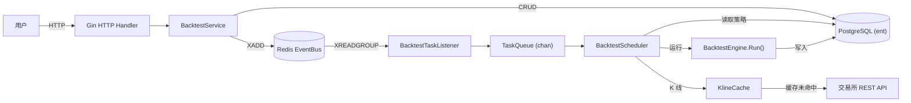
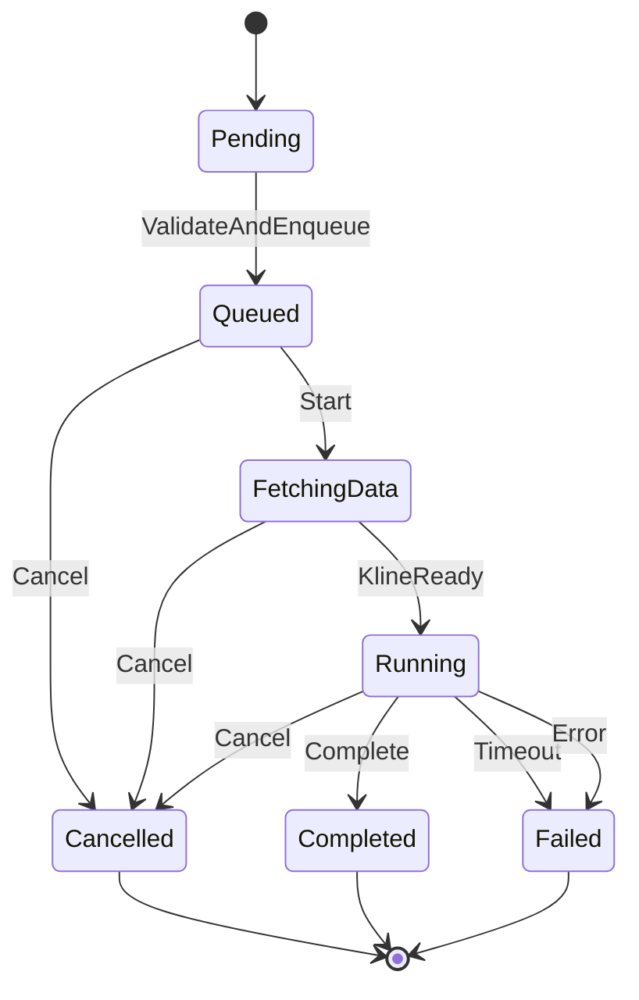
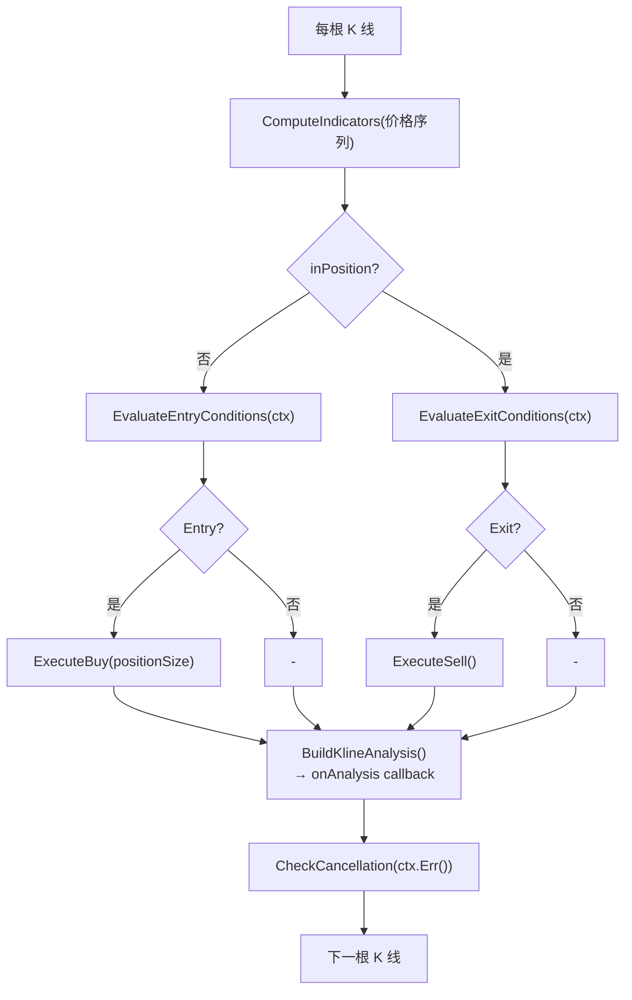

# FSD: Go 版回测引擎

- **版本**: v1.0
- **日期**: 2026-06-05
- **作者**: architect
- **关联 PRD**: PM 启动 #001

## 概述

以 Go 技术栈复刻 TradeX C# 回测引擎（Phase 1-2），覆盖纯计算内核 + 调度器 + 数据层 + API。

## 用户场景与流程

| 场景编号 | 触发条件 | 用户动作 | 系统行为 | 异常路径 |
|----------|----------|----------|----------|----------|
| SC-001 | 用户要回测一个策略 | POST `/api/v1/backtest` 提交策略 ID、交易对、时间范围、参数 | ① 验证策略存在且含入场条件 ② 创建 BacktestTask(Pending) → 入库 ③ Redis Stream 通知 Worker ④ 返回 202 + taskId | 策略不存在 → 404；参数无效 → 400 |
| SC-002 | 用户查看回测进度 | GET `/api/v1/backtest/{id}` | 返回 task 当前 status/phase/progress | 任务不存在 → 404 |
| SC-003 | 用户流式查看逐 K 线分析 | GET `/api/v1/backtest/{id}/analysis?cursor=` | 返回按时间排序的 `BacktestKlineAnalysis` 分页列表 | 任务未开始 → 空列表 |
| SC-004 | 用户获取完整回测报告 | GET `/api/v1/backtest/{id}/result` | 返回 `BacktestResult`（夏普、回撤、收益率、交易明细） | 任务未完成 → 409 Conflict |
| SC-005 | 用户取消回测 | POST `/api/v1/backtest/{id}/cancel` | ① 更新 status=Cancelled ② Redis Stream 发取消事件 ③ Worker 侧 `context.Context` 触发引擎终止 | 任务已结束 → 400 |
| SC-006 | 用户列出历史回测 | GET `/api/v1/backtest?status=&pair=&page=&size=` | 分页返回任务列表（含概要指标） | — |

## 功能边界

| 功能点 | 描述 | 关联场景 |
|--------|------|----------|
| F-001 | 回测任务 CRUD（创建/查询/取消/列表） | SC-001, SC-002, SC-005, SC-006 |
| F-002 | 纯计算引擎（K 线遍历 → 指标 → 条件 → 模拟交易） | SC-001 |
| F-003 | 策略条件树评估（EntryCondition / ExitCondition JSON 递归求值） | SC-001 |
| F-004 | 波动率网格执行（RebalancePercent / MaxPyramidingLevels） | SC-001 |
| F-005 | 工作量调度（并发控制 + 资源自适应 + 超时 + 崩溃恢复） | SC-001 |
| F-006 | K 线获取与缓存（缓存优先 → 交易所拉取） | SC-001 |
| F-007 | 逐 K 线分析流式写入与读取 | SC-003 |
| F-008 | 回测结果计算（年化收益、夏普、最大回撤、盈亏比） | SC-004 |

**边界外**:
- 实盘策略评估事件驱动流
- 交易所 WebSocket 连接
- 订单执行与对账

**与 C# 版的关系**: 输入相同 K 线 → 输出完全一致（Parity Tests 保障）

## 数据流

## 状态机

### BacktestTask

| 当前状态 | 事件 | 目标状态 | 前置条件 |
|----------|------|----------|----------|
| Pending | ValidateAndEnqueue | Queued | 策略存在且含入场条件 |
| Queued | Start | FetchingData | Worker 调度到该任务 |
| FetchingData | KlineReady | Running | K 线获取完成且数量 ≥ 50 |
| Running | Complete | Completed | 引擎执行完毕 |
| 任意 | Cancel | Cancelled | 用户发起取消 |
| Running | Timeout | Failed | 超过 TaskTimeoutMinutes |
| Running | Error | Failed | 引擎抛出异常 |

### BacktestEngine 内部

## UI 行为规格

Phase 1-2 无前端。API 响应 JSON 供前端消费，前端与现有 C# 版共用。

## 非功能约束

| 类型 | 指标 | 目标值 | 来源 |
|------|------|--------|------|
| 精度 | 数值结果偏差 | 与 C# 引擎相同输入下 ≤ 1e-12 相对误差 | Parity Test 需求 |
| 性能 | 单次回测处理速率 | ≥ 100,000 K 线/秒（单核） | 对标 C# 版 |
| 内存 | 单次回测峰值 | ≤ 256MB（含 100,000 K 线） | 对标 C# 版 |
| 可用性 | Worker 崩溃恢复 | 重启自动恢复 Running 任务 ≥ 99% | 对标 C# BacktestScheduler |
