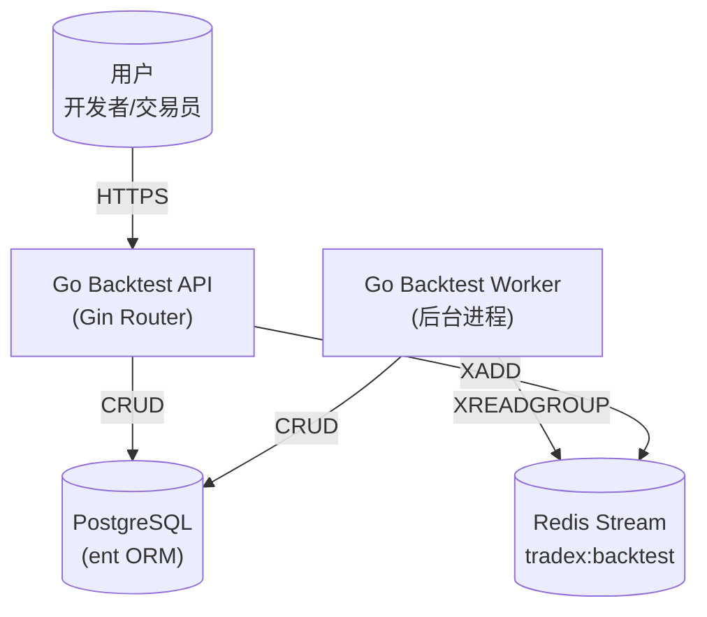
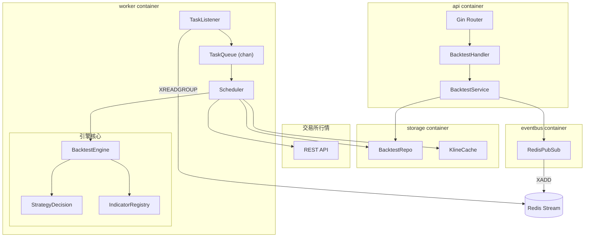
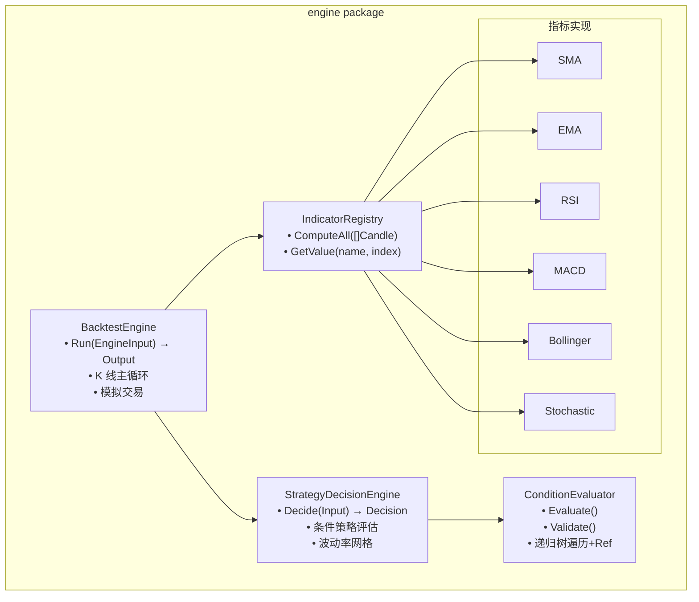

# TAD: Go 版回测引擎

- **版本**: v1.0
- **日期**: 2026-06-05
- **作者**: architect
- **关联 FSD**: Go 回测引擎 FSD v1.0

## 架构视图

### C4 - Context（系统上下文）



### C4 - Container（容器图）



### C4 - Component（组件图）



## 技术选型

| 层次 | 技术 | 版本 | 选型理由 | 备选方案 |
|------|------|------|----------|----------|
| **Web 框架** | `Gin` | v1.10+ | Go 生态最流行 HTTP 框架，性能极高（基于 httprouter），中间件机制成熟，社区活跃 | Chi（生态较弱）、Echo（社区较小） |
| **ORM** | `ent` | v0.15 | 代码生成、类型安全、已有技能 | GORM (反射重) |
| **DB 驱动** | `pgx` | v5 | 高性能 PostgreSQL 驱动，ent 默认使用 | database/sql |
| **数值精度** | `shopspring/decimal` | v1.4 | 金融计算避免 float64 误差 | — |
| **Redis** | `go-redis` | v9 | 主流 Go Redis 客户端 | redigo |
| **配置** | `Viper` | v1 | 多层次配置加载、环境变量覆盖 | envconfig |
| **日志** | `zerolog` | v1 | 零分配结构化日志，性能极高；JSON 输出可直接对接 ELK/Loki；链式字段 API 简洁 | slog（标准库，功能基础但无需依赖）、zap（API 更重） |
| **资源监控** | `gopsutil` | v4 | 跨平台 CPU/内存获取 | — |
| **加解密** | `dongle` | latest | 统一 API 覆盖 Base64/AES/RSA/bcrypt 等 30+ 种编码加密操作，与 Carbon 同生态 | Go 标准库（API 零散，样板代码多） |
| **时间处理** | `Carbon` | latest | 语义化日期时间 API，显著减少 time 标准库样板代码 | Go 标准库 time（功能完备但 API 繁琐） |
| **参数校验** | `go-playground/validator` | v10 | Gin 原生集成，struct tag 声明式校验，社区标准 | — |
| **权限管理** | `Casbin` | v2 | 支持 ACL/RBAC/ABAC，策略与代码分离，热加载 | 手写 middleware（硬编码不可维护） |
| **测试** | `testify` | v1 | Assert + Suite + Mock | — |
| **CLI 入口** | `Cobra` | v1 | Worker 进程参数管理、子命令支持 | — |
| **可观测性** | `OpenTelemetry` | v1.28+ | 链路追踪 + 指标采集；Gin 集成 `otelgin`，OTLP 导出 | Prometheus SDK（仅指标）、Jaeger Client（已弃用） |

## 接口契约

### 响应格式

所有 API 统一响应格式：

```json
{
  "code": 0,
  "message": "success",
  "data": {}
}
```

### 错误码

| 错误码 | 说明 |
|--------|------|
| 0 | 成功 |
| 400 | 参数校验失败 |
| 404 | 资源不存在 |
| 409 | 状态冲突 |
| 500 | 服务器内部错误 |

### API 端点

#### POST `/api/v1/backtest` — 创建回测任务

**请求体**:
| 参数 | 类型 | 必填 | 说明 |
|------|------|------|------|
| strategy_id | string(UUID) | 是 | 策略 ID |
| exchange_id | string | 是 | 交易所 |
| pair | string | 是 | 交易对，如 BTCUSDT |
| timeframe | string | 是 | K 线周期，如 1h |
| initial_capital | number | 是 | 初始资金 (>= 0) |
| position_size | number | 否 | 每次开仓金额 (全仓=null) |
| start_at | string(ISO8601) | 是 | 起始时间 |
| end_at | string(ISO8601) | 是 | 结束时间 |
| fee_rate | number | 否 | 手续费率，默认 0 |

**响应 201**:
```json
{
  "code": 0,
  "data": {
    "id": "uuid",
    "status": "pending",
    "created_at": "2026-06-05T10:00:00Z"
  }
}
```

#### GET `/api/v1/backtest` — 列表查询

| 参数 | 位置 | 类型 | 必填 | 说明 |
|------|------|------|------|------|
| status | query | string | 否 | 过滤状态 |
| pair | query | string | 否 | 过滤交易对 |
| page | query | int | 否 | 默认 1 |
| page_size | query | int | 否 | 默认 20，最大 100 |

#### GET `/api/v1/backtest/{id}` — 任务详情

**响应**:
```json
{
  "code": 0,
  "data": {
    "id": "uuid",
    "strategy_id": "uuid",
    "pair": "BTCUSDT",
    "timeframe": "1h",
    "status": "running",
    "phase": "fetching_data",
    "progress": 0,
    "created_at": "2026-06-05T10:00:00Z",
    "updated_at": "2026-06-05T10:00:05Z"
  }
}
```

#### GET `/api/v1/backtest/{id}/result` — 获取结果

**响应 200**:
```json
{
  "code": 0,
  "data": {
    "final_value": "1100.50",
    "total_return_percent": "10.05",
    "annualized_return_percent": "25.30",
    "max_drawdown_percent": "-8.50",
    "win_rate": "60.00",
    "sharpe_ratio": "1.25",
    "profit_loss_ratio": "2.10",
    "total_trades": 20,
    "trades": [
      {
        "entry_index": 55,
        "exit_index": 120,
        "entry_price": "50000.00",
        "exit_price": "52000.00",
        "quantity": "0.02",
        "pnl": "40.00",
        "pnl_percent": "4.00"
      }
    ]
  }
}
```

#### GET `/api/v1/backtest/{id}/analysis` — 获取 K 线分析

| 参数 | 位置 | 类型 | 必填 | 说明 |
|------|------|------|------|------|
| cursor | query | int | 否 | 分页游标 (kline_index) |
| limit | query | int | 否 | 默认 100，最大 1000 |

#### POST `/api/v1/backtest/{id}/cancel` — 取消任务

**响应 200**:
```json
{
  "code": 0,
  "data": {
    "id": "uuid",
    "status": "cancelled"
  }
}
```

### 核心 Go 接口（内部模块契约）

```go
// BacktestEngine 纯计算内核
type BacktestEngine interface {
    Run(ctx context.Context, input EngineInput) (EngineOutput, error)
}

type EngineInput struct {
    Strategy       domain.Strategy
    Pair           string
    Klines         []domain.Candle
    InitialCapital decimal.Decimal
    PositionSize   *decimal.Decimal // nil = 全仓
    FeeRate        decimal.Decimal
    Timeframe      string
}

type EngineOutput struct {
    Result   domain.BacktestResult
    Trades   []domain.BacktestTrade
    Analysis []domain.BacktestKlineAnalysis
}

// StrategyDecisionEngine 策略决策
type StrategyDecisionEngine interface {
    Decide(input DecisionInput) Decision
}

// IndicatorRegistry 技术指标容器
type IndicatorRegistry interface {
    ComputeAll(prices []domain.Candle) map[string][]float64
    GetValue(indicator string, index int) (float64, bool)
    Indicators() []string
}

// ConditionEvaluator 条件树求值
type ConditionEvaluator interface {
    Evaluate(condition json.RawMessage, ctx EvaluationContext) (bool, error)
    Validate(condition json.RawMessage) error
}

// EventBus 跨进程通知
type EventBus interface {
    Publish(ctx context.Context, channel string, payload any) error
    Subscribe(ctx context.Context, channel string, handler func(any)) error
}

// BacktestRepo 数据访问
type BacktestRepo interface {
    CreateTask(ctx context.Context, task *domain.BacktestTask) error
    GetTask(ctx context.Context, id uuid.UUID) (*domain.BacktestTask, error)
    UpdateTaskStatus(ctx context.Context, id uuid.UUID, status domain.BacktestTaskStatus, phase *domain.BacktestPhase) error
    ListTasks(ctx context.Context, filter TaskFilter) ([]*domain.BacktestTask, int, error)
    SaveResult(ctx context.Context, result *domain.BacktestResult) error
    SaveAnalysis(ctx context.Context, analysis []*domain.BacktestKlineAnalysis) error
    GetAnalysis(ctx context.Context, taskID uuid.UUID, cursor int, limit int) ([]*domain.BacktestKlineAnalysis, error)
}
```

## 数据模型

### ent Schema

```
BacktestTask:
  + id                uuid.UUID       [PK, default=gen]
  + strategy_id       uuid.UUID       [required]
  + exchange_id       string          [required]
  + pair              string          [required]
  + timeframe         string          [required]
  + initial_capital   decimal         [required]
  + position_size     decimal         [optional]
  + fee_rate          decimal         [default=0]
  + start_at          time.Time       [required]
  + end_at            time.Time       [required]
  + status            BacktestTaskStatus [default=Pending]
  + phase             BacktestPhase   [optional]
  + progress          int             [default=0]
  + error_message     string          [optional]
  + created_at        time.Time       [auto]
  + updated_at        time.Time       [auto]
  + edges:
       result         *BacktestResult  [optional, unique]

BacktestResult:
  + id                     uuid.UUID       [PK]
  + task_id                uuid.UUID       [unique FK→BacktestTask.id]
  + final_value            decimal
  + total_return_percent   decimal
  + annualized_return_percent decimal
  + max_drawdown_percent   decimal
  + win_rate               decimal
  + sharpe_ratio           decimal
  + profit_loss_ratio      decimal
  + total_trades           int
  + details                json.RawMessage
  + created_at             time.Time       [auto]

BacktestKlineAnalysis:
  + id                     uuid.UUID       [PK]
  + task_id                uuid.UUID       [FK→BacktestTask.id, index]
  + kline_index            int
  + timestamp              time.Time
  + open,high,low,close,volume decimal
  + indicator_values       json.RawMessage
  + entry_condition_result json.RawMessage
  + exit_condition_result  json.RawMessage
  + in_position            bool
  + action                 string
  + position_value         decimal
  + position_pnl           decimal
  + created_at             time.Time       [auto]
  + indexes:
       idx_task_kline: (task_id, kline_index) [unique]
```

### Go 领域模型

```go
package domain

import (
    "encoding/json"
    "time"
    "github.com/google/uuid"
    "github.com/shopspring/decimal"
)

// 核心值对象
type Candle struct {
    Timestamp time.Time
    Open      decimal.Decimal
    High      decimal.Decimal
    Low       decimal.Decimal
    Close     decimal.Decimal
    Volume    decimal.Decimal
}

// 枚举
type OrderSide string
const (
    OrderSideBuy  OrderSide = "Buy"
    OrderSideSell OrderSide = "Sell"
)

type OrderType string
const (
    OrderTypeMarket    OrderType = "Market"
    OrderTypeLimit     OrderType = "Limit"
    OrderTypeStopLimit OrderType = "StopLimit"
)

type OrderStatus string
const (
    OrderStatusPending         OrderStatus = "Pending"
    OrderStatusPartiallyFilled OrderStatus = "PartiallyFilled"
    OrderStatusFilled          OrderStatus = "Filled"
    OrderStatusCancelled       OrderStatus = "Cancelled"
    OrderStatusFailed          OrderStatus = "Failed"
)

type BacktestTaskStatus string
const (
    TaskStatusPending   BacktestTaskStatus = "Pending"
    TaskStatusRunning   BacktestTaskStatus = "Running"
    TaskStatusCompleted BacktestTaskStatus = "Completed"
    TaskStatusFailed    BacktestTaskStatus = "Failed"
    TaskStatusCancelled BacktestTaskStatus = "Cancelled"
)

type BacktestPhase string
const (
    PhaseQueued       BacktestPhase = "Queued"
    PhaseFetchingData BacktestPhase = "FetchingData"
    PhaseRunning      BacktestPhase = "Running"
)

// 聚合根
type Strategy struct {
    ID             uuid.UUID
    Name           string
    EntryCondition json.RawMessage
    ExitCondition  json.RawMessage
    ExecutionRule  json.RawMessage
}

type BacktestTask struct {
    ID             uuid.UUID
    StrategyID     uuid.UUID
    ExchangeID     string
    Pair           string
    Timeframe      string
    InitialCapital decimal.Decimal
    PositionSize   *decimal.Decimal
    FeeRate        decimal.Decimal
    StartAt        time.Time
    EndAt          time.Time
    Status         BacktestTaskStatus
    Phase          *BacktestPhase
    Progress       int
    ErrorMessage   *string
    CreatedAt      time.Time
    UpdatedAt      time.Time
}

// 结果模型
type BacktestTrade struct {
    EntryIndex  int
    ExitIndex   int
    EntryPrice  decimal.Decimal
    ExitPrice   decimal.Decimal
    Quantity    decimal.Decimal
    PnL         decimal.Decimal
    PnLPercent  decimal.Decimal
    EntryFee    decimal.Decimal
    ExitFee     decimal.Decimal
}

type BacktestResult struct {
    FinalValue              decimal.Decimal
    TotalReturnPercent      decimal.Decimal
    AnnualizedReturnPercent decimal.Decimal
    MaxDrawdownPercent      decimal.Decimal
    WinRate                 decimal.Decimal
    SharpeRatio             decimal.Decimal
    ProfitLossRatio         decimal.Decimal
    TotalTrades             int
}

type BacktestKlineAnalysis struct {
    KlineIndex           int
    Timestamp            time.Time
    Open, High, Low, Close, Volume decimal.Decimal
    IndicatorValues      map[string]float64
    EntryConditionResult map[string]any
    ExitConditionResult  map[string]any
    InPosition           bool
    Action               string // "enter" | "exit" | "hold"
    PositionValue        decimal.Decimal
    PositionPnl          decimal.Decimal
}
```

## ADR

### ADR-001: 金融计算使用 `decimal.Decimal`

- **状态**: 已采纳
- **日期**: 2026-06-05
- **上下文**: C# 使用 `decimal` (128-bit 高精度)，Go 原生只有 `float64`。回测引擎涉及资金计算，float64 的 IEEE 754 舍入误差会导致 Parity Test 失败。
- **决策**: 权宜类字段（equity, capital, PnL）使用 `github.com/shopspring/decimal`。技术指标计算（SMA, EMA, RSI, MACD）使用 `float64`（与 Skender 原版一致）。
- **后果**:
  - 正面：与 C# decimal 精度一致，货币计算无舍入偏差
  - 负面：decimal 运算比 float64 慢约 10-20x，但回测场景可接受（瓶颈在 K 线遍历而非单次运算）
  - 缓解：只在关键路径（资金权益、订单金额）使用 decimal，批量指标计算仍用 float64

### ADR-002: Go channel 作为进程内任务队列

- **状态**: 已采纳
- **日期**: 2026-06-05
- **上下文**: C# 使用 `System.Threading.Channels.Channel<T>`。Go 原生 `chan` 是惯用方案。
- **决策**: 使用带缓冲的 `chan uuid.UUID` 作为任务队列。`BacktestTaskQueue` 封装 `chan<-` / `<-chan` 接口。
- **后果**: 无外部依赖，goroutine-safe，零分配。容量由 `MaxConcurrency * 2` 决定。

### ADR-003: Redis Streams 作为跨进程通知机制

- **状态**: 已采纳
- **日期**: 2026-06-05
- **上下文**: C# 使用 `StackExchange.Redis` + Redis Stream。Go 需要有等价机制。
- **决策**: 使用 `go-redis` v9 的 `XAdd` / `XReadGroup` 实现。保持 stream key `tradex:backtest` 和 consumer group 命名与 C# 版一致。
- **后果**: 可混合运行 C# Worker 和 Go Worker（过渡期兼容）。故障恢复依赖 `Pending` 状态 DB 兜底扫描。

### ADR-004: ent 作为 ORM 框架

- **状态**: 已采纳
- **日期**: 2026-06-05
- **上下文**: C# 使用 EF Core + Npgsql。Go 生态中 ent 提供代码生成和类型安全。
- **决策**: 使用 ent v0.15 生成类型安全的 CRUD 代码。`pgx` 作为底层驱动。
- **后果**: Schema 变更需 `go generate ./...` 重新生成代码。迁移使用 ent 的自动迁移（Atlas 引擎）。

### ADR-005: 纯 Go 自研技术指标库

- **状态**: 已采纳
- **日期**: 2026-06-05
- **上下文**: C# 使用 `Skender.Stock.Indicators`。Go 的 TA-Lib binding (go-talib) 引入 CGO 依赖，跨平台构建复杂。
- **决策**: 按照 Skender 算法用纯 Go 实现 SMA、EMA、RSI、MACD、Bollinger Bands、Stochastic。每个指标实现 `Compute(values []float64) []float64` 接口。
- **后果**: 开发工作量约 2-3 天，但零 CGO、100% 可移植。指标计算逻辑逐行对照 Skender 源码确保 Parity。

### ADR-006: zerolog 为结构化日志库

- **状态**: 已采纳
- **日期**: 2026-06-05
- **上下文**: Go 1.21+ 标准库提供 `slog`，但 TradeX 回测引擎涉及多模块日志（引擎、调度器、API、事件总线），需要更好的性能、结构化输出和日志级别控制。
- **决策**: 使用 `zerolog` v1 作为结构化日志库。引擎模块的日志通过 `zerolog.Logger` 注入，支持 JSON 输出直接对接 ELK/Loki。
- **后果**:
  - 正面：零分配设计，性能高于 slog；链式字段 API 简洁（`log.Info().Str("task", id).Msg("...")`）
  - 负面：额外外部依赖；需配合 `lumberjack` 做日志文件轮转
  - 缓解：通过 `internal/log` 统一封装，后续可切换底层库

### ADR-007: Gin 为 Web 框架

- **状态**: 已采纳
- **日期**: 2026-06-05
- **上下文**: Go 生态有多种 HTTP 框架（Chi、Echo、Fiber、Gin）。TradeX 团队已有 Gin 使用经验，且技术选型清单指定 Gin。
- **决策**: 使用 Gin v1.10+ 作为 API 服务 Web 框架。
- **后果**:
  - 正面：团队熟悉、生态最成熟、中间件丰富（logging/recovery/cors/validator 原生集成）
  - 负面：Gin 基于 `httprouter` 而非标准 `net/http` Handler，但通过 `gin.RouterGroup` 可良好组织路由

### ADR-008: OpenTelemetry 为可观测性标准

- **状态**: 已采纳
- **日期**: 2026-06-05
- **上下文**: 回测引擎涉及多进程（API + Worker）、多模块（引擎、调度器、数据层），需要链路追踪来诊断性能瓶颈和跨进程调用链，需要指标来监控系统健康度。
- **决策**: 使用 OpenTelemetry Go SDK 作为统一可观测性层。API 进程使用 `otelgin` 中间件自动采集 HTTP 请求追踪；Worker 进程手动创建 Span 标记任务生命周期；指标通过 OTLP 导出。
- **后果**:
  - 正面：统一标准，避免厂商锁定；Gin 集成一行中间件即可生效；OTLP 可同时导出到 Jaeger（追踪）和 Prometheus（指标）
  - 负面：约 10+ 个传递依赖包；需要额外部署 OTel Collector 或后端服务
  - 缓解：otel 初始化封装在 `internal/telemetry` 包，非强制开启（通过配置控制）

## 项目结构

```
backend-go/
├── cmd/
│   ├── api/main.go           # API 服务入口: Gin server + ent client
│   └── worker/main.go        # Worker 入口: scheduler + engine
├── internal/
│   ├── domain/               # 纯领域模型，零依赖
│   │   ├── candle.go
│   │   ├── enums.go
│   │   ├── order.go
│   │   ├── position.go
│   │   ├── strategy.go
│   │   ├── backtest_task.go
│   │   ├── backtest_result.go
│   │   └── backtest_kline_analysis.go
│   ├── engine/               # 纯计算内核
│   │   ├── backtest_engine.go
│   │   ├── backtest_engine_test.go
│   │   ├── strategy_decision.go
│   │   ├── condition_evaluator.go
│   │   └── condition_validator.go
│   ├── indicator/            # 自研技术指标
│   │   ├── registry.go
│   │   ├── sma.go
│   │   ├── ema.go
│   │   ├── rsi.go
│   │   ├── macd.go
│   │   └── bollinger.go
│   ├── scheduler/            # 回测调度器
│   │   ├── scheduler.go
│   │   ├── resource_monitor.go
│   │   └── task_queue.go
│   ├── exchange/             # 交易所客户端（仅行情）
│   │   └── client.go
│   ├── storage/              # 数据访问层
│   │   ├── ent/              # ent 生成代码
│   │   │   ├── schema/      # ent schema 定义
│   │   │   └── generate.go
│   │   ├── backtest_repo.go
│   │   └── kline_cache.go
│   ├── eventbus/             # 事件总线
│   │   ├── eventbus.go       # IEventBus interface
│   │   └── redis.go          # Redis Streams 实现
│   └── api/                  # HTTP Handler
│       ├── router.go
│       ├── middleware.go
│       ├── backtest_handler.go
│       └── response.go
├── testdata/                  # 合成 K 线生成器 (Parity Test)
│   └── synthetic_klines.go
├── go.mod
├── Makefile
└── Dockerfile
```
