# 回测引擎工作流程

> 本文档描述 TradeX 回测引擎的完整工作流程，涵盖任务调度、数据获取、策略评估、指标计算等环节。
>
> **时区约定**：与实盘一致，所有时间字段统一使用 UTC。

---

## 1. 架构总览

回测引擎复用实盘的 `StrategyEngineContext` 进行策略评估，通过**逐根 K 线模拟 Trade 事件**驱动。回测任务**独立于部署**——用户选择交易所 + 策略 + 交易对即可创建回测，无需先创建部署。

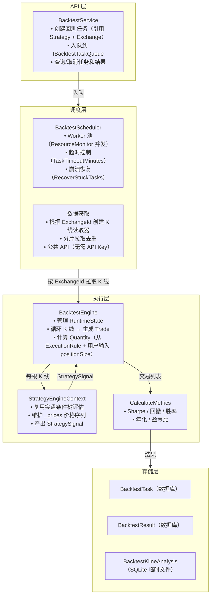

### 组件职责

| 组件 | 职责 | 生命周期 |
|------|------|----------|
| **BacktestService** | 创建回测任务，入队，查询/取消任务和结果 | 瞬态（API 请求） |
| **BacktestScheduler** | Worker 池消费队列任务，管理所有依赖，控制并发和超时 | 常驻后台服务 |
| **BacktestEngine** | 逐 K 线循环，管理 RuntimeState，驱动 Context 评估 | 单任务周期 |
| **StrategyEngineContext** | 加载策略配置，按 Trade 事件驱动评估。不感知"回测"和"实盘"的区别 | 单任务周期 |
| **TaskAnalysisStore** | 内存中的逐 K 线分析数据暂存 → SQLite 后台刷盘 | 常驻单例 |

---

## 2. BacktestTask 模型

```mermaid
flowchart LR
    subgraph Task["BacktestTask（独立于 Deployment）"]
        direction TB
        T1["Id: Guid"]
        T2["StrategyId: Guid<br/>引用策略（含 EntryCondition / ExitCondition / ExecutionRule）"]
        T3["ExchangeId: Guid<br/>引用交易所（用于确定数据源）"]
        T4["Pair: string<br/>交易对"]
        T5["Timeframe: string<br/>1m / 5m / 15m / 1h / 4h / 1d"]
        T6["InitialCapital: decimal<br/>初始资金"]
        T7["PositionSize: decimal<br/>仓位大小（用户输入，覆盖 ExecutionRule 中的默认值）"]
        T8["StartAt / EndAt: DateTime (UTC)<br/>回测时间范围"]
        T9["Status: Pending / Running / Completed / Failed / Cancelled"]
        T10["Phase: Queued / FetchingData / Running"]
        T11["CreatedBy: Guid"]
        T12["CompletedAt: DateTime? (UTC)"]
    end
```

### 数据来源

| BacktestTask 字段 | 来源 | 说明 |
|------------------|------|------|
| `StrategyId` | 用户选择策略 | 回测时从策略库选取已保存的策略 |
| `ExchangeId` | 用户选择交易所 | 决定从哪个交易所的公共 API 拉取 K 线 |
| `Pair` | 用户输入 | 回测的交易对 |
| `Timeframe` | 用户选择 | 1m / 5m / 15m / 1h / 4h / 1d |
| `InitialCapital` | 用户输入 | 回测初始资金 |
| `PositionSize` | 用户输入 | 仓位大小，可为空（为空时使用 ExecutionRule 中的默认值） |
| `StartAt / EndAt` | 用户选择 | 回测时间范围（UTC） |
| `EntryCondition` | 从 Strategy 模型加载 | 策略的入场条件树 |
| `ExitCondition` | 从 Strategy 模型加载 | 策略的出场条件树 |
| `ExecutionRule` | 从 Strategy 模型加载 | 策略的执行参数（仓位倍数、网格率等） |

### 状态机

| 状态 | 说明 | 下一个状态 |
|------|------|-----------|
| `Pending` | 任务已创建，等待调度 | → `Running` |
| `Running` | 正在执行回测 | → `Completed` / `Failed` / `Cancelled` |
| `Completed` | 回测完成，结果可查 | — |
| `Failed` | 执行异常或超时 | — |
| `Cancelled` | 用户取消 | — |

Phase 仅当 `Status == Running` 时有意义：

| Phase | 说明 |
|-------|------|
| `Queued` | 已出队，开始初始化 |
| `FetchingData` | 正在拉取历史 K 线（公共 API，无需交易所 API Key） |
| `Running` | K 线数据已就绪，正在执行策略评估 |

### 约束

| 约束 | 默认值 | 说明 |
|------|--------|------|
| `MaxBacktestDays` | 365 | 最大回测天数，超限拒绝创建任务 |
| `MaxKlines` | 100,000 | 单次回测最大 K 线数量，超限返回空结果 |

---

## 3. Service 接口

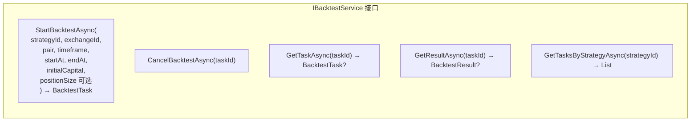

创建任务流程：

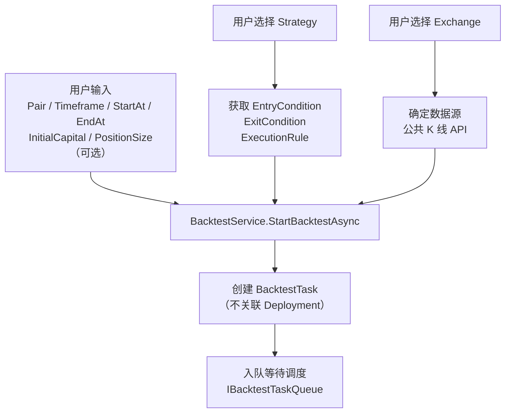

---

## 4. 任务生命周期

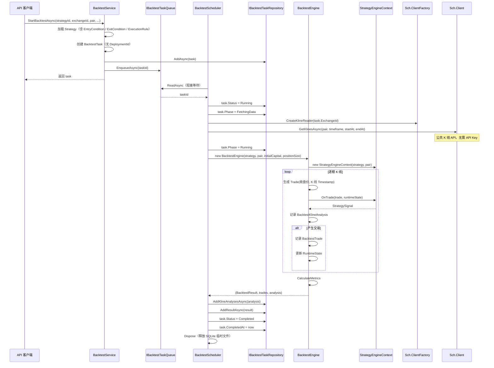

### 用户取消

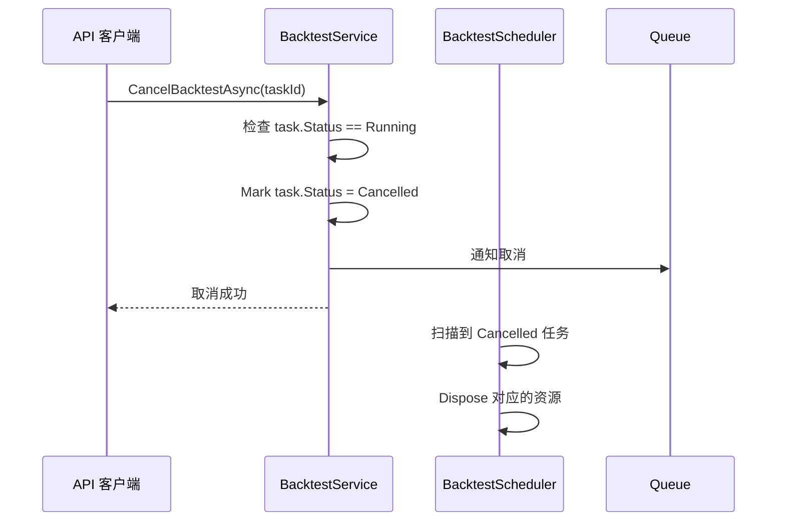

---

## 5. BacktestEngine 核心逻辑

### 5.1 评估循环

BacktestEngine 替代实盘中 `ExecutionManager` 的角色，自行管理 `RuntimeState` 并逐 K 线驱动 `StrategyEngineContext.OnTrade`。

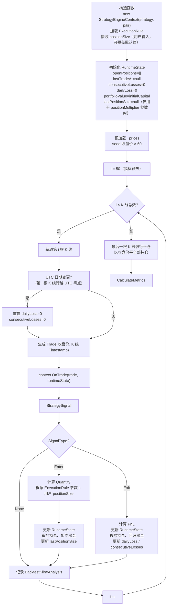

### 5.2 PositionSize 优先级

用户在创建回测任务时可输入 `PositionSize`，该值覆盖 `ExecutionRule` 中对应的默认值：

| 场景 | 实际使用的 positionSize | 说明 |
|------|-----------------------|------|
| 用户传入 `PositionSize: 200` | 200 | 用户显式指定，覆盖默认值 |
| 用户传入 `PositionSize: null` | ExecutionRule 中的 `initialPositionSize` 或 `positionSize` | 使用策略自身的默认仓位 |
| ExecutionRule 中无仓位参数 | 1（最小交易单位） | 兜底值 |

### 5.3 Quantity 计算规则

BacktestEngine 以 `ExecutionRule` 中的参数决定 Quantity 的计算方式：

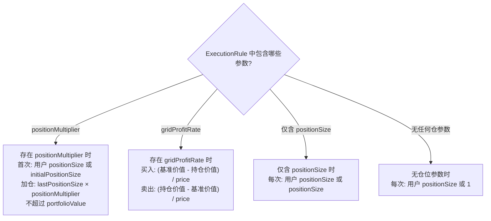

### 5.4 条件树评估复用

BacktestEngine **不再重复实现**指标计算和条件评估逻辑，全部委托给 `StrategyEngineContext.OnTrade`：

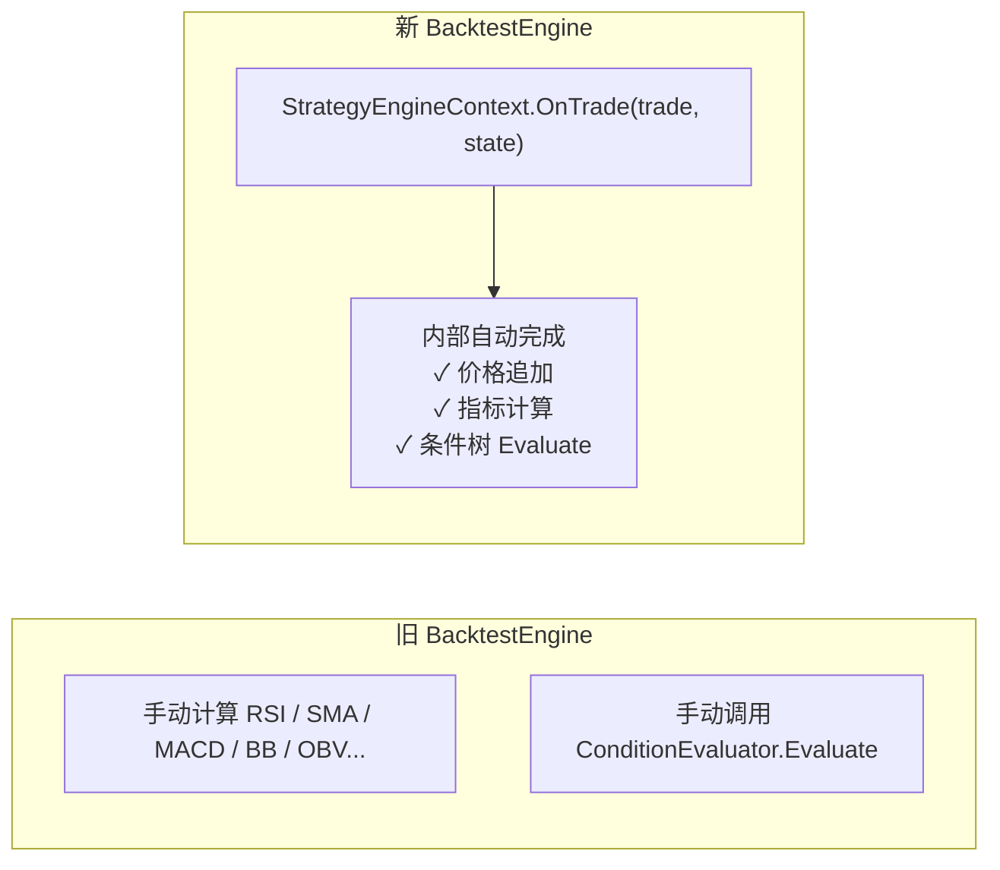

变更对照：

| 维度 | 当前 BacktestEngine | 新 BacktestEngine |
|------|--------------------|------------------|
| 依赖部署 | 需要 `DeploymentId` | 🔥 **不需要**，引用 Strategy + Exchange 即可 |
| 指标计算 | `indicatorService.CalculateRsi()` × 11 个指标 | `StrategyEngineContext` 内完成 |
| 条件评估 | `conditionEvaluator.Evaluate(entryCondition)` | `ConditionTree.Evaluate(ctx)` |
| `VolatilityGridExecutionRule` | 独立 `RunVolatilityGrid` 分支 | 🔥 删除，全部由 ConditionTree 覆盖 |
| 条件分支 | `RunVolatilityGrid` 条件分支 | 🔥 删除，通过 `ExecutionRule` 参数驱动 |
| 仓位来源 | 从 Deployment 配置读取 | 用户传入（可选覆盖） + ExecutionRule 兜底 |
| 状态维护 | 方法内局部变量 | `RuntimeState` 统一管理 |
| 代码重复 | 两套指标计算 + 两套条件评估 | **零重复**，全量复用实盘 Context |

### 5.5 BacktestTrade 模型

回测中产生的交易记录模型：

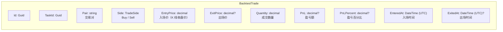

| 字段 | 说明 |
|------|------|
| `EntryPrice` | 入场时的 K 线收盘价 |
| `ExitPrice` | 出场时的 K 线收盘价（强平时为最后一根 K 线收盘价） |
| `Quantity` | 成交数量，正数为买入，负数为卖出 |
| `PnL` | `(ExitPrice - EntryPrice) × Quantity`（多单），空单反向 |
| `PnLPercent` | `(ExitPrice / EntryPrice - 1) × 100` |
| `EnteredAt` | 入场时 K 线的 Timestamp |
| `ExitedAt` | 出场时 K 线的 Timestamp |

---

## 6. 并发与资源控制

### 6.1 Worker 池

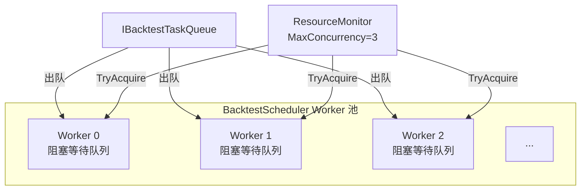

| 配置项 | 默认值 | 说明 |
|--------|--------|------|
| `MaxConcurrency` | 3 | 同时执行的最大回测任务数 |
| `TaskTimeoutMinutes` | 30 | 单个任务超时时间，超时自动标记 Failed |

### 6.2 超时控制

每个 Worker 处理任务时附带 `CancellationTokenSource` 超时，超时后：

1. 标记任务 `Status = Failed`
2. 释放 `ResourceMonitor`，Worker 继续处理下一个任务
3. 已创建的 `StrategyEngineContext` 随任务处理结束自动 Dispose

### 6.3 崩溃恢复

`BacktestScheduler.ExecuteAsync` 启动时调用 `RecoverStuckTasksAsync`：

1. 扫描所有 `Status == Running` 的任务
2. 重置为 `Status = Pending`
3. 重新入队

---

## 7. 数据获取

### 7.1 K 线拉取

K 线数据源由 `BacktestTask.ExchangeId` 决定——用户在创建回测时选择的交易所。BacktestScheduler 在初始化时从 `IExchangeClientFactory` 创建对应交易所的客户端，通过**公共 K 线 API** 拉取历史数据，**无需交易所 API Key**（所有主流交易所均提供公开 REST 的 K 线接口）。

#### K 线缓存

同一 `(ExchangeId, Pair, Timeframe)` 的 K 线数据在回测任务间可复用。BacktestScheduler 在拉取前检查内存缓存：

| key | value |
|-----|-------|
| `(ExchangeId, Pair, Timeframe, StartAt, EndAt)` | `Kline[]` |

缓存命中时直接复用，跳过网络请求。缓存生命周期随 `BacktestScheduler` 实例。

#### 数量上限

| 约束 | 默认值 | 说明 |
|------|--------|------|
| `MaxKlines` | 100,000 | 单次回测最大 K 线数量，超限直接返回空结果 |

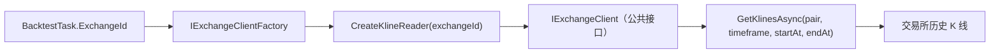

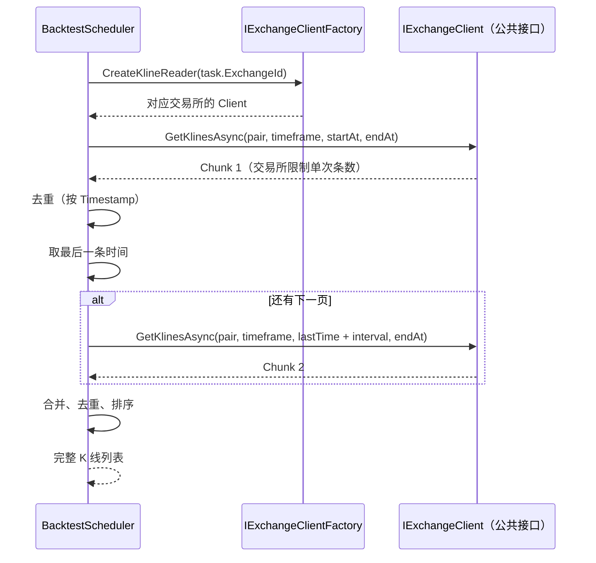

| 参数 | 说明 |
|------|------|
| `timeframe` | 1m / 5m / 15m / 30m / 1h / 4h / 1d |
| 分片策略 | 以每批返回的最后时间戳为起点，递增一个 interval，避免重复 |
| 去重方式 | `Timestamp` 精确去重 |
| 单次 chunk 上限 | 1,000 根 K 线（公共 API 常见上限） |

### 7.2 数据不足处理

| 场景 | 处理 |
|------|------|
| `K 线数量 < 50` | 直接返回空结果（`CreateEmptyResult("数据不足")`） |
| `K 线数量 == 0` | 直接返回空结果（`CreateEmptyResult("无数据")`） |
| `K 线数量 > 100,000` | 直接返回空结果（`CreateEmptyResult("数据量过大")`） |
| 拉取异常（网络错误 / 超时） | 标记 `Status = Failed`，记录错误信息 |
| 分批拉取部分失败 | 如果已获取 ≥ 50 根 K 线，记录警告后继续执行；不足 50 根则标记 Failed |

---

## 8. BacktestKlineAnalysis

每根 K 线的分析数据，用于前端逐 K 线回放：

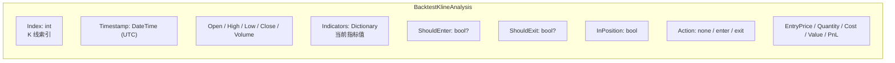

### 存储

| 维度 | 说明 |
|------|------|
| 存储方式 | SQLite 临时文件 |
| 文件路径 | 系统临时目录（`Path.GetTempPath()`），文件名 `backtest_{taskId}.db` |
| 写入策略 | `TaskAnalysisStore` 内存暂存 → 后台批量刷盘（每 100 根 K 线或任务结束时） |
| SQLite 锁 | 每个 Worker 使用独立 SQLite 文件，不共享，无锁冲突 |
| 清理时机 | `BacktestScheduler` 任务处理结束时删除临时文件 |

---

## 9. BacktestResult

### 9.0 BacktestResult 模型

```mermaid
flowchart LR
    subgraph Result["BacktestResult"]
        direction TB
        R1["TaskId: Guid<br/>关联任务"]
        R2["StrategyName: string"]
        R3["Pair: string"]
        R4["Timeframe: string"]
        R5["StartAt / EndAt: DateTime (UTC)<br/>回测时间范围"]
        R6["InitialCapital: decimal<br/>初始资金"]
        R7["FinalValue: decimal<br/>期末总价值"]
        R8["TotalTrades: int<br/>总交易次数"]
        R9["TotalReturnPercent: decimal"]
        R10["AnnualizedReturnPercent: decimal"]
        R11["MaxDrawdownPercent: decimal"]
        R12["WinRate: decimal"]
        R13["SharpeRatio: decimal"]
        R14["ProfitLossRatio: decimal"]
        R15["Details: string<br/>交易明细 JSON"]
    end
```

| 字段 | 说明 |
|------|------|
| `FinalValue` | `InitialCapital + Σ(trade.PnL)` |
| `TotalReturnPercent` | `(FinalValue / InitialCapital - 1) × 100` |

### 9.1 指标计算

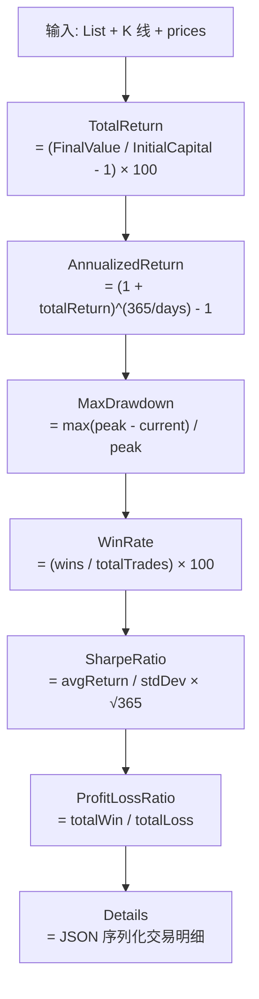

| 指标 | 说明 | 行业惯例 |
|------|------|---------|
| `TotalReturnPercent` | `(期末价值 / 期初价值 - 1) × 100`，复利计算 | 区间收益率，非简单累加 |
| `AnnualizedReturnPercent` | `(1 + totalReturn)^(365/days) - 1` | 不足 1 天按 1 天算 |
| `MaxDrawdownPercent` | `max(peak - current) / peak` | 基于价格序列 + 持仓价值联合计算 |
| `WinRate` | 盈利交易数 / 总交易数 | 0~100，无交易时返回 0 |
| `SharpeRatio` | `avgReturn / stdDev × √365` | 年化因子 √365 |
| `ProfitLossRatio` | 总盈利 / 总亏损 | 无盈利或亏损时返回 0 |

### 9.2 Details 约束

| 约束 | 值 |
|------|----|
| 最大大小 | 1 MB |
| 超限处理 | 截断至 1 MB，末尾追加 `{"truncated":true}` |

### 9.3 空结果

无交易产生时返回的默认值：

| 字段 | 值 |
|------|----|
| `TotalReturnPercent` | 0 |
| `AnnualizedReturnPercent` | 0 |
| `MaxDrawdownPercent` | 0 |
| `WinRate` | 0 |
| `TotalTrades` | 0 |
| `SharpeRatio` | 0 |
| `ProfitLossRatio` | 0 |
| `Details` | `{"message":"无交易产生"}` |

### 9.4 结果清理

| 策略 | 值 | 说明 |
|------|----|------|
| 保留时长 | 90 天 | 从 `CompletedAt` 算起，超期自动清理 |
| 触发时机 | `BacktestScheduler` 启动时 + 每次任务完成时 | |
| 清理方式 | 删除 `BacktestResult`、`BacktestKlineAnalysis` 的 SQLite 文件 | |

---

## 10. 与实盘的差异对比

| 维度 | 实盘 | 回测 |
|------|------|------|
| 创建方式 | 需要先创建 Deployment | **直接创建**，引用 Strategy + Exchange 即可 |
| 数据源 | 交易所 WebSocket Trade 流 | 历史 K 线数据（公共 REST API） |
| API 鉴权 | 需要 API Key + Secret Key | **不需要 API Key**（公共 K 线接口） |
| 驱动方式 | 事件驱动（来一笔 Trade 触发一次） | 逐 K 线遍历（循环驱动） |
| RuntimeState 维护 | ExecutionManager | BacktestEngine 自行管理 |
| 风控 | ✅ 8 个检查器链 | ❌ 关闭（依赖于数据完整性） |
| 下单 | TradeExecutor 真实下单 | ❌ 仅记录 BacktestTrade |
| 仓位来源 | Deployment 配置 | 用户传入（可选覆盖） + ExecutionRule 兜底 |
| 条件评估 | StrategyEngineContext.OnTrade | 复用同一套 StrategyEngineContext |
| Context 生命周期 | 部署激活 → 停用 | 单次回测运行期间 |
| 并发控制 | ResourceMonitor（信号量） | ResourceMonitor（Worker 池） |
| 订单幂等 | IdempotencyKey 去重 | ❌ 不需要（无真实下单） |

---

## 11. 核心文件映射

| 文件 | 职责 |
|------|------|
| [BacktestService.cs](../backend/TradeX.Trading/BacktestService.cs) | 🔄 创建/取消任务（不依赖 Deployment）、入队、查询 |
| [IBacktestService.cs](../backend/TradeX.Trading/IBacktestService.cs) | 🔄 服务接口（移除 deploymentId） |
| [BacktestScheduler.cs](../backend/TradeX.Trading/BacktestScheduler.cs) | 🔄 Worker 池 + 数据获取 + 超时控制（直接注入 IBacktestTaskRepository / IStrategyRepository / IExchangeRepository / IExchangeClientFactory / TaskAnalysisStore） |
| [BacktestEngine.cs](../backend/TradeX.Trading/BacktestEngine.cs) | 🔄 核心评估循环（不依赖 Deployment） |
| [BacktestTask.cs](../backend/TradeX.Core/Models/BacktestTask.cs) | 🔄 移除 DeploymentId，保留引用字段 |
| [BacktestResult.cs](../backend/TradeX.Core/Models/BacktestResult.cs) | 回测结果模型 |
| [BacktestKlineAnalysis.cs](../backend/TradeX.Core/Models/BacktestKlineAnalysis.cs) | 逐 K 线分析数据 |
| [IBacktestTaskRepository.cs](../backend/TradeX.Core/Interfaces/IBacktestTaskRepository.cs) | 任务仓库接口 |
| [IBacktestTaskQueue.cs](../backend/TradeX.Trading/IBacktestTaskQueue.cs) | 任务队列接口 |
| [TaskAnalysisStore.cs](../backend/TradeX.Trading/TaskAnalysisStore.cs) | 分析数据暂存 |
| [ResourceMonitor.cs](../backend/TradeX.Trading/ResourceMonitor.cs) | 并发资源控制 |
