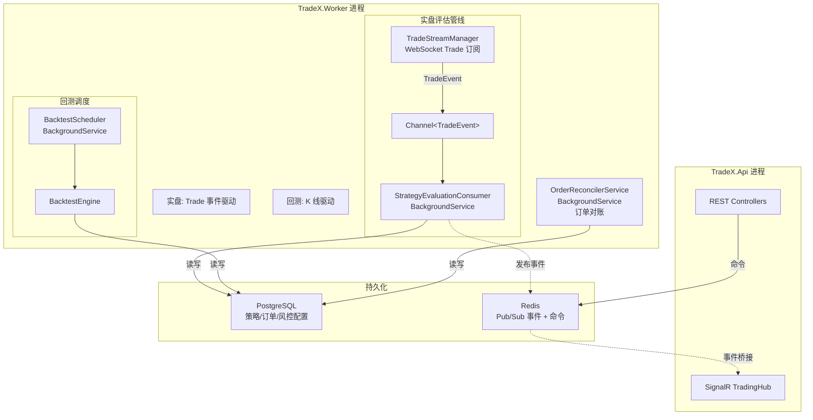
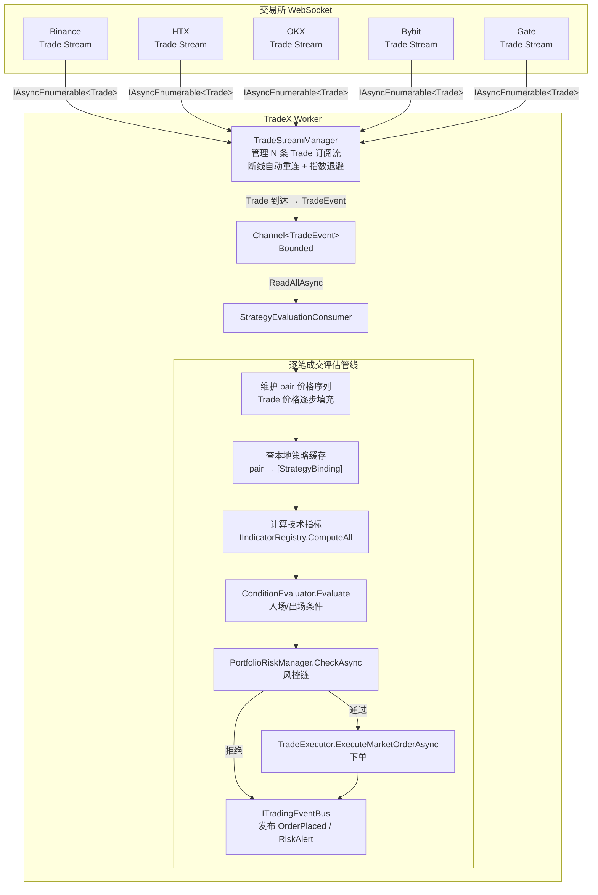
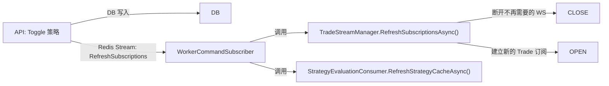
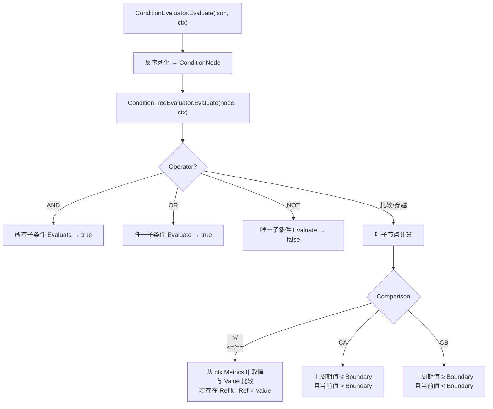
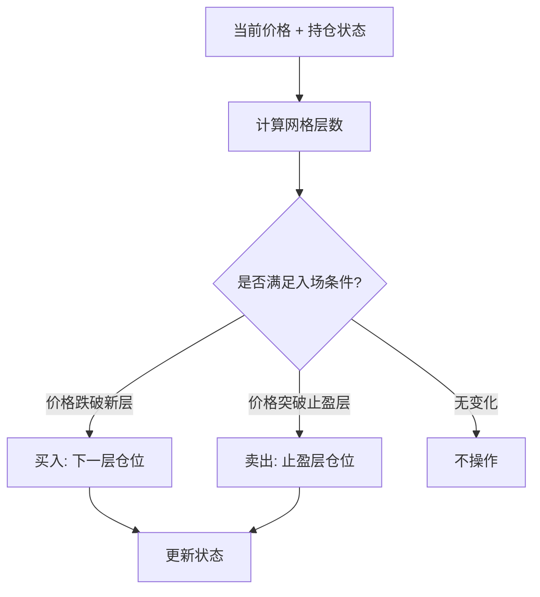
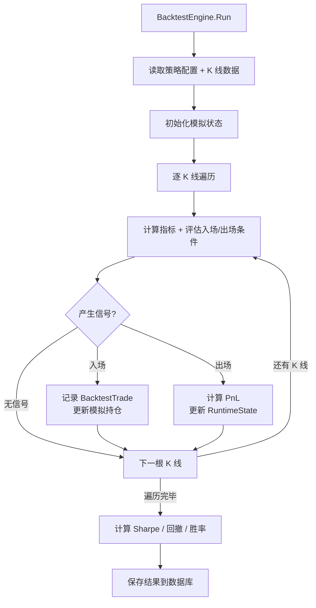
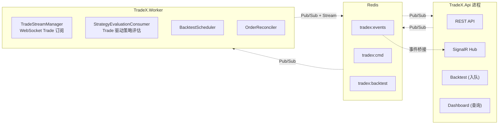

# 策略引擎工作流程

> 本文档描述 TradeX 策略引擎的完整工作流程。
>
> **实盘**由交易所 WebSocket 推送的**逐笔成交（Trade）**事件驱动，每笔成交到达即触发策略评估，实现毫秒级响应。
> **回测**由历史 **K 线（Candle）**驱动，逐根 K 线遍历模拟评估。
>
> 两者共享同一套条件评估逻辑（`ConditionTreeEvaluator` + `IIndicatorRegistry` + 风控管线），仅事件源和执行方式不同。
>
> **时区约定**：系统中所有时间字段统一使用 **UTC**。回测的 K 线时间戳也以 UTC 为准。所有涉及"当天"的计算（如每日亏损）均基于 UTC 日期边界。

---

## 1. 架构总览

策略引擎运行在 `TradeX.Worker` 进程中。实盘由 Trade 事件驱动，回测由 K 线驱动。



### 核心组件职责

| 组件 | 职责 | 所属 | 生命周期 |
|------|------|------|----------|
| **TradeStreamManager** | 管理 WebSocket Trade 流：加载活跃策略推导 (exchange, pair) 订阅，每条 Trade 推送到 Channel | 实盘 | 常驻 |
| **StrategyEvaluationConsumer** | 从 Channel 消费 Trade 事件：维护价格序列 → 计算指标 → 评估条件 → 风控 → 下单 | 实盘 | BackgroundService |
| **ConditionTreeEvaluator / ConditionEvaluator** | 递归/条件树评估（入场/出场信号） | 共用 | 瞬态 |
| **ConditionTreeValidator** | 校验条件树合法性 | 共用 | 瞬态 |
| **PortfolioRiskManager** | 职责链模式编排 9 个风控检查器 | 共用 | 每次交易前调用 |
| **TradeExecutor** | 向交易所执行实盘订单 | 实盘 | 每次下单新建 Scope |
| **KillSwitch** | 进程内熔断开关 | 共用 | Singleton |
| **OrderReconciler** | 订单对账：检测本地与交易所的订单状态不一致 | 共用 | 周期触发 |
| **BacktestScheduler** | 从 DB 拉取待执行回测任务，调度 BacktestEngine | 回测 | BackgroundService |
| **BacktestEngine** | 单次回测执行：逐 K 线模拟评估（纯函数，无 DI） | 回测 | 每任务新建 |

### 事件源对比

| 维度 | 实盘引擎 | 回测引擎 |
|------|---------|---------|
| **事件源** | 逐笔成交 (Trade)，WebSocket 实时推送 | 历史 K 线 (Candle)，IReadOnlyList |
| **触发时机** | 交易所每发生一笔成交即触发一次评估 | 遍历下一根 K 线时触发一次评估 |
| **延迟** | 毫秒级（Trade 到达即响应） | 无（全部离线计算） |
| **数据来源** | `ITradingClient.SubscribeTradesAsync` | `BacktestScheduler` 拉取的 `Candle[]` |
| **价格序列** | Trade 价格逐步填充，无 OHLC 结构 | K 线的 Open/High/Low/Close 全部可用 |

---

## 2. 实盘引擎 — Trade 事件驱动

### 2.1 数据流



### 2.2 策略缓存与订阅刷新

策略绑定变更由事件通道驱动，无需 DB 轮询：



### 2.3 并行模型

- **同一 trader 的策略顺序执行**：共享同一个 `TradingCycleScope`，避免风控竞争
- **不同 trader 的策略组并行执行**：`Parallel.ForEachAsync`，各自 Scope
- **不同 pair 天然并行**：每笔 Trade 只触发该 pair 的策略评估

### 2.4 TradingCycleScope

每次评估为每个 trader 创建一个 `TradingCycleScope`，包含 DI Scope、`PortfolioRiskManager`、`KillSwitch` 引用、`RiskSettings`。Scope 在评估结束后自动 Dispose。

---

## 3. 条件树评估系统

### 3.1 数据模型

`ConditionNode` 是纯 POCO，**不带评估行为**，仅用于序列化/反序列化：

```csharp
public class ConditionNode
{
    public string? Operator { get; init; }           // AND / OR / NOT
    public List<ConditionNode>? Conditions { get; init; }
    public string? Indicator { get; init; }          // 指标名
    public string? Comparison { get; init; }          // > / < / >= / <= / == / CA / CB
    public string? Ref { get; init; }                // 参考指标
    public decimal? Value { get; init; }              // 比较值
}
```

### 3.2 评估器

**`ConditionTreeEvaluator`** 递归评估树形条件节点：



**关键规则**：
- 空 JSON `"{}"` → 返回 `false`（不触发）
- 损坏 JSON → 返回 `false`（容错）
- 前值依赖：`CA`/`CB`（穿越）需要 `previousValues` 字典

### 3.3 条件树校验器

`ConditionTreeValidator` 校验条件树合法性：
- Operator 白名单：`AND`、`OR`、`NOT`、`>`、`<`、`>=`、`<=`、`==`、`CA`、`CB`
- 叶节点字段完整性：`indicator` + `comparison` + `value`
- `Ref` 引用指标必须在 `IIndicatorRegistry` 中注册
- `NOT` 必须有且仅有一个子节点

### 3.4 技术指标

| 指标 | 标识符 | 说明 |
|------|--------|------|
| 相对强弱指数 | `RSI` | 14 周期 RSI |
| 简单移动平均 | `SMA_{N}` | N 周期 SMA（如 `SMA_20`、`SMA_50`） |
| 指数移动平均 | `EMA_{N}` | N 周期 EMA（如 `EMA_20`） |
| MACD 快线 | `MACD_LINE` | 12/26 EMA 差值 |
| MACD 信号线 | `MACD_SIGNAL` | MACD 的 9 EMA |
| 布林带上轨 | `BB_UPPER` | 20SMA + 2σ |
| 布林带下轨 | `BB_LOWER` | 20SMA - 2σ |
| 能量潮 | `OBV` | On-Balance Volume |
| 成交量 SMA | `VOLUME_SMA` | 成交量 N 周期 SMA |
| K 线波幅 | `RANGE_PCT` | (High - Low) / Close × 100% |

指标通过 `IIndicatorRegistry` 注册，支持自定义指标扩展。

---

## 4. 波动率网格策略

### 4.1 规则解析

`VolatilityGridExecutionRule` 从 JSON 配置解析波动率网格参数。`VolatilityGridExecutionRuleParser` 负责解析。

### 4.2 网格参数

| 参数 | 默认值 | 说明 |
|------|--------|------|
| `initialPositionSize` | — | 初始仓位金额（必填） |
| `positionMultiplier` | 2.0 | 加仓倍数 |
| `takeProfitRate` | 0.03 | 单格止盈率 |
| `maxLayers` | 6 | 最大加仓层数 |
| `gridCount` | — | 网格格数 |

### 4.3 网格执行

`VolatilityGridExecutor` 在每次评估中：



---

## 5. 风控管线

### 5.1 架构

风控采用 **职责链模式（Chain of Responsibility）**，`PortfolioRiskManager` 负责构建执行链：

```mermaid
flowchart LR
    A["DailyLossHandler<br/>当日亏损超限"] --> B["DrawdownHandler<br/>回撤超限"]
    B --> C["ConsecutiveLossHandler<br/>连续亏损超限"]
    C --> D["CircuitBreakerHandler<br/>熔断激活"]
    D --> E["CooldownCheck<br/>冷却期未结束"]
    E --> F["PositionLimitHandler<br/>持仓数量超限"]
    F --> G["MaxOrderNotionalHandler<br/>单笔名义价值超限"]
    G --> H["SlippageHandler<br/>滑点超限"]
    H --> I["ExchangeHealthHandler<br/>交易所连接异常"]
```



### 5.2 检查器说明

| 检查器 | 数据来源 | 触发条件 |
|--------|---------|----------|
| **DailyLossHandler** | `IPositionRepository` | 当日亏损 > `MaxDailyLoss` |
| **DrawdownHandler** | `IPositionRepository` | `(DailyLoss / PortfolioValue) × 100 > MaxDrawdownPercent` |
| **ConsecutiveLossHandler** | `IPositionRepository` | `ConsecutiveLossCount ≥ MaxConsecutiveLosses` |
| **CircuitBreakerHandler** | `IKillSwitch.IsActive` + 静态配置 | 熔断开关激活 |
| **CooldownCheck** | 上次交易时间 | 距上次交易 < `CooldownSeconds` |
| **PositionLimitHandler** | `IPositionRepository` | 持仓数量 ≥ `MaxOpenPositions` |
| **MaxOrderNotionalHandler** | 当前订单 + 配置 | 单笔名义价值 > 上限 |
| **SlippageHandler** | `OrderBookSlippageGuard` | 滑点预估 > `MaxSlippageAmount` |
| **ExchangeHealthHandler** | 交易所连接测试（30s 缓存） | 连接测试失败 |

### 5.3 KillSwitch（熔断开关）

`KillSwitch` 是进程内 Singleton 熔断开关。激活后：
1. 所有 `CircuitBreakerHandler` 拒绝交易
2. 将所有 `Active` 的 `StrategyBinding` 改为 `Disabled`
3. 写入 `OutboxEvent("KillSwitchActivated")`

### 5.4 滑点防护

`OrderBookSlippageGuard` 基于实时订单簿深度走簿模拟，计算实际平均成交价和滑点百分比。

---

## 6. 回测引擎

### 6.1 架构

回测引擎与实盘引擎**共享条件评估逻辑**（`ConditionEvaluator` + `IIndicatorRegistry` + 指标服务），仅事件源和执行方式不同：

| 维度 | 实盘引擎 | 回测引擎 |
|------|---------|---------|
| 事件源 | Trade（逐笔成交）WebSocket | Candle（K 线）IReadOnlyList |
| 评估触发 | 每笔 Trade 到达 | 每遍历一根 K 线 |
| 数据来源 | `TradeStreamManager` → Channel | `BacktestScheduler` 拉取的 `Candle[]` |
| 下单方式 | `TradeExecutor` → 真实交易所 | 纯内存模拟 |
| 风控 | 完整风控管线 | 不执行 |
| 并行 | 按 pair 天然并行 | 单线程顺序执行 |
| 上下文 | `TradingCycleScope`（DI scope） | 纯函数，无 DI |

### 6.2 回测流程



### 6.3 回测调度

`BacktestScheduler`（Worker 进程中的 `BackgroundService`）：
1. 从 `IBacktestTaskQueue`（内存 `Channel<Guid>`）获取待执行任务
2. 通过 `ResourceMonitor` 控制并发（基于 CPU/内存使用率）
3. 调用 `BacktestEngine.Run()` 执行回测
4. 支持取消和超时
5. 完成后保存结果到数据库

---

## 7. 进程分离架构

### 7.1 进程边界



### 7.2 依赖注册分层

`TradeX.Trading/DependencyInjection.cs` 中按进程拆分：

| 方法 | 注册范围 | 注册内容 |
|------|---------|---------|
| `AddTradingShared` | 两端共用 | `ConditionEvaluator`、`PortfolioRiskManager`、`TradeExecutor`、`BacktestEngine`、`KillSwitch`、`OrderBookSlippageGuard`、各风控 Handler、`OrderReconciler` |
| `AddTradingWorker` | Worker 独占 | `Channel<TradeEvent>`（Singleton）、`TradeStreamManager`（Singleton）、`StrategyEvaluationConsumer`（HostedService）、`BacktestScheduler`、`ResourceMonitor`、`OrderReconcilerService` |
| `AddTradingCommandPublisher` | API 可选 | 发布 Worker 命令（Redis Stream） |
| `AddBacktestTaskNotifier` | API 可选 | 通知 Worker 执行回测任务 |

### 7.3 跨进程通信

| 通道 | 方向 | 用途 |
|------|------|------|
| Redis Pub/Sub (`tradex:events`) | Worker → API | 交易事件（TradeExecuted、RiskAlert 等）→ SignalR 推送到前端 |
| Redis Stream (`tradex:cmd`) | API → Worker | 管理命令（ReconcileNow、RefreshSubscriptions 等） |
| Redis Stream (`tradex:backtest`) | API → Worker | 回测任务通知 |
| 数据库（共享） | 双向 | 策略/订单/风控配置的持久化存储 |

### 7.4 事件总线实现

| 实现 | 用途 |
|------|------|
| `LoggingEventBus` | 无 Redis 时的降级方案（仅日志） |
| `RedisEventBus` | Worker 端向 Redis Pub/Sub 发布实时事件 |
| `OutboxTradingEventBus` | Worker 端写 `outbox_events` 表，由 `OutboxRelayService` 异步推送到 Redis |

---

## 8. 订单对账（Reconciliation）

`OrderReconciler` 在 `OrderReconcilerService`（Worker 中的 `BackgroundService`）中周期执行：

1. 查询数据库中的 `Pending`/`PartialFill` 状态的订单
2. 调用交易所 API 查询对应订单状态
3. 本地与交易所不一致时以交易所为准更新
4. 记录对账差异到日志

API 端可通过 `IWorkerCommandPublisher` 发送 `ReconcileNow` 命令手动触发对账。

---

## 9. 核心文件映射

| 类/接口 | 文件路径 |
|---------|---------|
| `TradeStreamManager`、`SubscriptionState` | `Streaming/TradeStreamManager.cs` |
| `StrategyEvaluationConsumer` | `Streaming/StrategyEvaluationConsumer.cs` |
| `TradeEvent` | `Streaming/TradeEvent.cs` |
| `TradingCycleScope` | `Engine/TradingCycleScope.cs` |
| `ConditionTreeEvaluator`、`ConditionEvaluator` | `Engine/ConditionTreeEvaluator.cs` |
| `ConditionTreeValidator` | `Engine/ConditionTreeValidator.cs` |
| `VolatilityGridExecutionRule`、`VolatilityGridExecutionRuleParser` | `Engine/VolatilityGridExecutionRule.cs` |
| `VolatilityGridExecutor`、`VolatilityGridState` | `Engine/VolatilityGridExecutor.cs` |
| `PortfolioRiskManager` | `Risk/PortfolioRiskManager.cs` |
| `RiskContext`、`IRiskCheckHandler` | `Risk/RiskContext.cs` |
| `IKillSwitch`、`KillSwitch` | `Risk/IKillSwitch.cs`、`Risk/KillSwitch.cs` |
| `RiskSettings` | `Risk/RiskSettings.cs` |
| `OrderBookSlippageGuard` | `Risk/OrderBookSlippageGuard.cs` |
| DailyLossHandler / DrawdownHandler / ConsecutiveLossHandler / CircuitBreakerHandler / CooldownCheck / PositionLimitHandler / MaxOrderNotionalHandler / SlippageHandler / ExchangeHealthHandler | `Risk/RiskHandlers.cs` |
| `BacktestEngine` | `Backtest/BacktestEngine.cs` |
| `BacktestService`、`IBacktestService` | `Backtest/BacktestService.cs`、`Backtest/IBacktestService.cs` |
| `BacktestScheduler` | `Backtest/BacktestScheduler.cs` |
| `BacktestTaskQueue`、`IBacktestTaskQueue` | `Backtest/BacktestTaskQueue.cs` |
| `BacktestTaskListener` | `Backtest/BacktestTaskListener.cs` |
| `ResourceMonitor` | `Backtest/ResourceMonitor.cs` |
| `TaskAnalysisStore` | `Backtest/TaskAnalysisStore.cs` |
| `TradeExecutor`、`ITradeExecutor` | `Execution/ITradeExecutor.cs`、`Execution/TradeExecutor.cs` |
| `OrderReconciler`、`IOrderReconciler` | `Execution/IOrderReconciler.cs`、`Execution/OrderReconciler.cs` |
| `OrderReconcilerService` | `Execution/OrderReconcilerService.cs` |
| `KlineGapDetector` | `Execution/KlineGapDetector.cs` |
| `ITradingEventBus`、`RedisEventBus`、`LoggingEventBus` | `Messaging/ITradingEventBus.cs`、`Messaging/RedisEventBus.cs`、`Messaging/LoggingEventBus.cs` |
| `TradingEventEnvelope`、各类 Event Payload | `Events/TradingEventEnvelope.cs` |
| `OutboxTradingEventBus`、`OutboxRelayService` | `Outbox/OutboxTradingEventBus.cs`、`Outbox/OutboxRelayService.cs` |
| `WorkerCommand`、`IWorkerCommandPublisher`、`IWorkerCommandHandler` | `Commands/WorkerCommand.cs` |
| `RedisWorkerCommandPublisher`、`NullWorkerCommandPublisher` | `Commands/RedisWorkerCommandPublisher.cs` |
| `WorkerCommandSubscriber`、`ReconcileNowHandler` | `Commands/WorkerCommandSubscriber.cs`、`Commands/ReconcileNowHandler.cs` |
| `RefreshSubscriptionsHandler` | `Commands/RefreshSubscriptionsHandler.cs` |
| `TradeXMetrics` | `Observability/TradeXMetrics.cs` |
| `LegacyStrategyScanner` | `Migration/LegacyStrategyScanner.cs` |
| `DependencyInjection` | `DependencyInjection.cs` |

---

## 10. 崩溃恢复

系统崩溃或重启后，通过以下流程恢复：

1. `StrategyEvaluationConsumer.ExecuteAsync` 启动 → `TradeStreamManager.StartAsync` 加载活跃 `StrategyBinding`
2. `TradeStreamManager` 推导 (exchange, pair) 订阅集合
3. 打开交易所 Trade WebSocket 订阅，开始接收逐笔成交
4. `StrategyEvaluationConsumer` 首次加载策略缓存
5. 每笔 Trade 到达 → 维护价格序列 → 计算指标 → 评估条件 → 风控 → 下单
