# 策略引擎工作流程

> 本文档描述 TradeX 策略引擎的完整工作流程，涵盖三层架构拆解、各层职责边界、Trade 驱动的数据流、条件树实体化设计。
>
> **时区约定**：系统中所有时间字段（`TradeAt`、`LastTradeAt`、`CreatedAt`、`UpdatedAt` 等）统一使用 **UTC**。回测的 K 线时间戳也以 UTC 为准。所有涉及"当天"的计算（如每日亏损）均基于 UTC 日期边界。各交易所推送的 Trade 时间戳需在客户端层转换为 UTC。

---

## 1. 架构总览

策略引擎拆分为三个独立组件，各司其职：

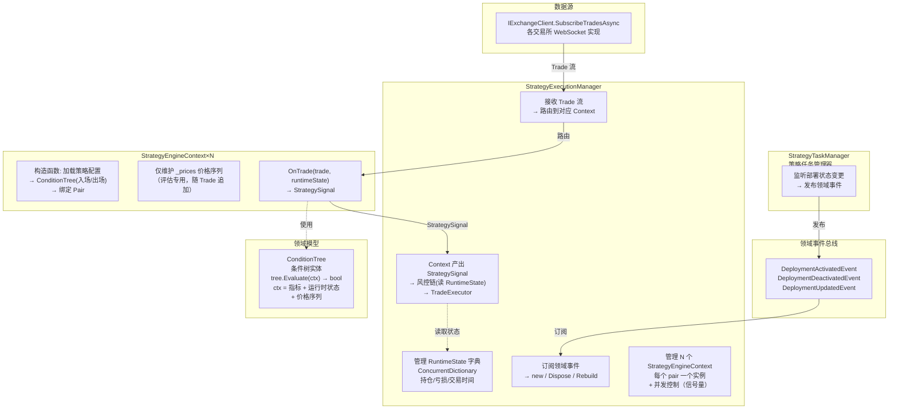
```mermaid
flowchart TD
    subgraph StrategyTaskManager["StrategyTaskManager<br/>策略任务管理器"]
        TM1["监听部署状态变更<br/>→ 发布领域事件"]
    end

    subgraph Bus["领域事件总线"]
        EV["DeploymentActivatedEvent<br/>DeploymentDeactivatedEvent<br/>DeploymentUpdatedEvent"]
    end

    subgraph StrategyExecutionManager["StrategyExecutionManager<br/>策略执行管理器"]
        EM1["订阅领域事件<br/>→ new / Dispose / Rebuild"]
        EM2["管理 RuntimeState 字典<br/>ConcurrentDictionary<br/>持仓/亏损/交易时间"]
        EM3["管理 N 个 StrategyEngineContext<br/>每个 pair 一个实例<br/>+ 并发控制（信号量）"]
        EM4["接收 Trade 流<br/>→ 路由到对应 Context"]
        EM5["Context 产出 StrategySignal<br/>→ 风控链(读 RuntimeState)<br/>→ TradeExecutor"]
    end

    subgraph StrategyEngineContext["StrategyEngineContext×N<br/>策略引擎上下文（每个 pair 一个）"]
        SC1["构造函数: 加载策略配置<br/>→ ConditionTree(入场/出场)<br/>→ 绑定 Pair"]
        SC2["仅维护 _prices 价格序列<br/>（评估专用，随 Trade 追加）"]
        SC3["OnTrade(trade, runtimeState)<br/>→ StrategySignal"]
    end

    subgraph Model["领域模型"]
        CT["ConditionTree<br/>条件树实体<br/>tree.Evaluate(ctx) → bool<br/>ctx = 指标 + 运行时状态<br/>+ 价格序列"]
    end

    subgraph Feed["数据源"]
        FD["IExchangeClient.SubscribeTradesAsync<br/>各交易所 WebSocket 实现"]
    end

    TM1 -->|发布| EV
    EV -->|订阅| EM1
    FD -->|Trade 流| EM4
    EM4 -->|路由| SC3
    SC3 -.->|使用| CT
    SC3 -->|StrategySignal| EM5
    EM5 -.->|读取状态| EM2
```

### 组件职责速览

| 组件 | 职责 | 生命周期 |
|------|------|----------|
| **StrategyTaskManager** | 部署状态变更时发布领域事件 | 常驻后台服务 |
| **StrategyExecutionManager** | 调度中枢——管理 Context、RuntimeState、Trade 路由、风控、下单 | 常驻后台服务 |
| **StrategyEngineContext** | 每个 pair 一个实例，加载配置 + 维护价格序列，按 Trade 事件驱动评估 | 部署激活→停用 |
| **RuntimeState** | StrategyExecutionManager 持有每个 (deploymentId, pair) 的运行时状态 | 与 Context 同生命周期 |
| **ConditionTree** | 条件树领域实体，统一处理入场/出场信号评估 | 瞬态（Context 内部） |
| **Trade** | 交易所单笔成交数据，由各交易所客户端通过 WebSocket 推送 | 事件流 |

---

## 2. 三层架构详解

### 2.1 StrategyTaskManager（策略任务管理器）

**核心职能**：监听已部署策略的状态变更，通过领域事件通知下层。

- 监听 API 层对 `StrategyDeployment` 的状态变更操作（创建/激活/停用/更新）
- 在状态变更后发布领域事件
- **不参与** Trade 路由、并发调度、条件评估等执行逻辑
- **不直接调用** ExecutionManager，通过领域事件总线解耦

#### 领域事件定义

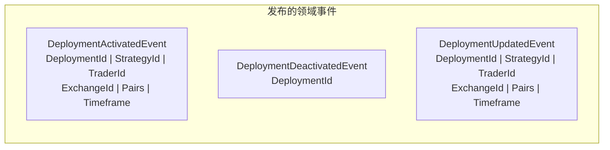
```mermaid
flowchart LR
    subgraph Events["发布的领域事件"]
        E1["DeploymentActivatedEvent<br/>DeploymentId | StrategyId | TraderId<br/>ExchangeId | Pairs | Timeframe"]
        E2["DeploymentDeactivatedEvent<br/>DeploymentId"]
        E3["DeploymentUpdatedEvent<br/>DeploymentId | StrategyId | TraderId<br/>ExchangeId | Pairs | Timeframe"]
    end
```

#### 职责边界

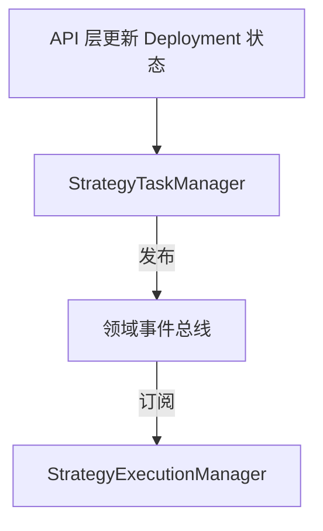
```mermaid
flowchart TD
    A["API 层更新 Deployment 状态"] --> B["StrategyTaskManager"]
    B -->|发布| C["领域事件总线"]
    C -->|订阅| D["StrategyExecutionManager"]
```

#### 热更新行为

`DeploymentUpdatedEvent` 触发时，ExecutionManager 在当前 Trade 周期处理完成后切换新配置：

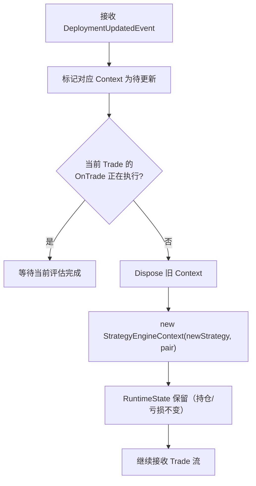
```mermaid
flowchart TD
    A["接收 DeploymentUpdatedEvent"] --> B["标记对应 Context 为待更新"]
    B --> C{"当前 Trade 的<br/>OnTrade 正在执行?"}
    C -->|是| D["等待当前评估完成"]
    C -->|否| E["Dispose 旧 Context"]
    E --> F["new StrategyEngineContext(newStrategy, pair)"]
    F --> G["RuntimeState 保留（持仓/亏损不变）"]
    G --> H["继续接收 Trade 流"]
```

**关键规则**：
- 运行中的 Trade 评估不被中断
- 新配置从下一个 Trade 到达开始生效
- 持仓数据（`RuntimeState.OpenPositions`）保留，不清仓重新入场

### 2.2 StrategyExecutionManager（策略执行管理器）

**核心职能**：执行调度中枢——管理所有存活的 StrategyEngineContext 和 RuntimeState，路由 Trade 数据流，统筹风控和下单。

#### 处理流程

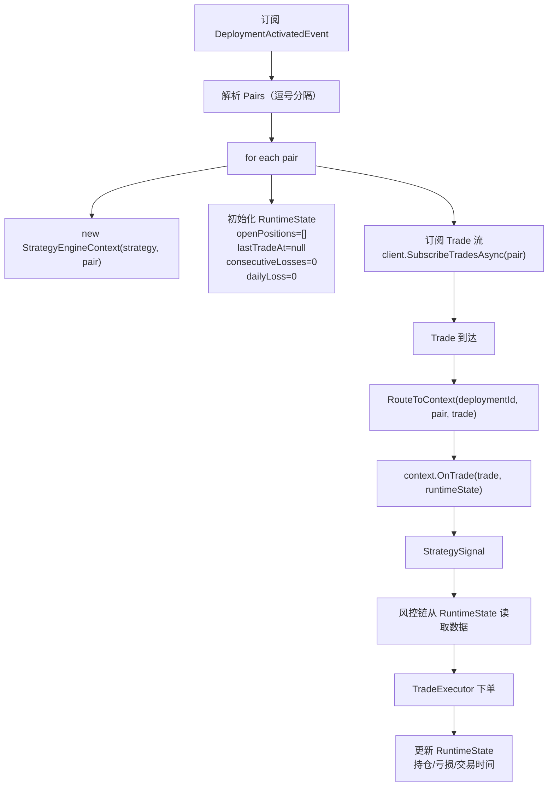
```mermaid
flowchart TD
    A["订阅 DeploymentActivatedEvent"] --> B["解析 Pairs（逗号分隔）"]
    B --> C["for each pair"]

    C --> D["new StrategyEngineContext(strategy, pair)"]
    C --> E["初始化 RuntimeState<br/>openPositions=[]<br/>lastTradeAt=null<br/>consecutiveLosses=0<br/>dailyLoss=0"]
    C --> F["订阅 Trade 流<br/>client.SubscribeTradesAsync(pair)"]

    F --> G["Trade 到达"]
    G --> H["RouteToContext(deploymentId, pair, trade)"]
    H --> I["context.OnTrade(trade, runtimeState)"]
    I --> J["StrategySignal"]
    J --> K["风控链从 RuntimeState 读取数据"]
    K --> L["TradeExecutor 下单"]
    L --> M["更新 RuntimeState<br/>持仓/亏损/交易时间"]
```

#### RuntimeState 结构

ExecutionManager 内部维护运行时状态字典，**风控链从该字典读取实时数据，不再查询数据库**。

#### API 凭证安全

`CreateExchangeClientAsync` 从数据库读取加密凭据后按以下规则处理：

| 环节 | 做法 |
|------|------|
| 读取 | `IEncryptionService.Decrypt` 解密 `ApiKeyEncrypted` / `SecretKeyEncrypted` |
| 使用 | 解密后立即传入 `IExchangeClientFactory.CreateClient`，**不缓存明文凭据** |
| 释放 | `IExchangeClient` 实例随 `StrategyEngineContext` 一起 Dispose |
| 网络 | 仅通过 TLS 连接交易所 WebSocket，证书链验证防御中间人攻击 |

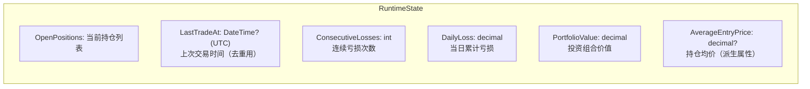
```mermaid
flowchart LR
    subgraph RS["RuntimeState"]
        direction TB
        RS1["OpenPositions: 当前持仓列表"]
        RS2["LastTradeAt: DateTime? (UTC)<br/>上次交易时间（去重用）"]
        RS3["ConsecutiveLosses: int<br/>连续亏损次数"]
        RS4["DailyLoss: decimal<br/>当日累计亏损"]
        RS5["PortfolioValue: decimal<br/>投资组合价值"]
        RS6["AverageEntryPrice: decimal?<br/>持仓均价（派生属性）"]
    end
```

#### 并发控制与数据流向

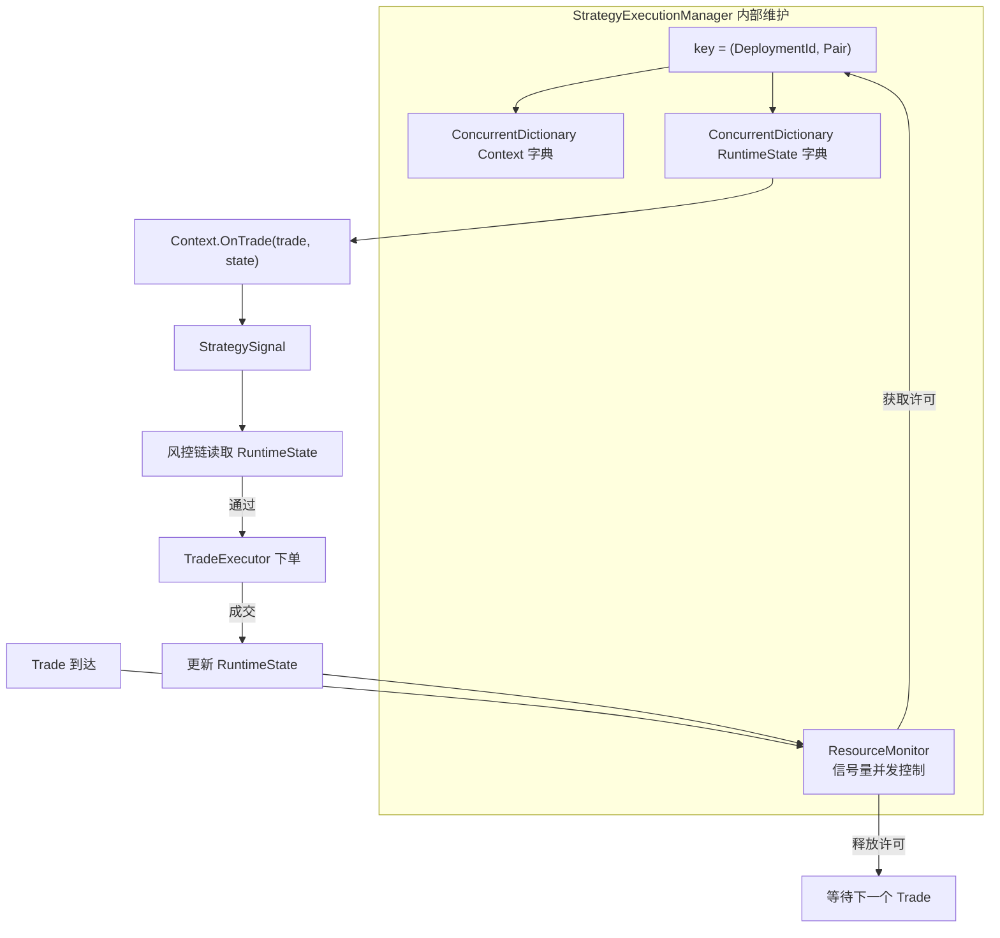
```mermaid
flowchart TD
    subgraph Manager["StrategyExecutionManager 内部维护"]
        MK["key = (DeploymentId, Pair)"]
        MD["ConcurrentDictionary Context 字典"]
        MR["ConcurrentDictionary RuntimeState 字典"]
        RM["ResourceMonitor<br/>信号量并发控制"]
    end

    Trade["Trade 到达"] --> RM
    RM -->|获取许可| MK
    MK --> MD
    MK --> MR
    MR --> Ctx["Context.OnTrade(trade, state)"]
    Ctx --> Signal["StrategySignal"]
    Signal --> Risk["风控链读取 RuntimeState"]
    Risk -->|通过| Exec["TradeExecutor 下单"]
    Exec -->|成交| Update["更新 RuntimeState"]
    Update --> RM
    RM -->|释放许可| Done["等待下一个 Trade"]
```

### 2.3 StrategyEngineContext（策略引擎上下文）

**核心职能**：每个（部署 × pair）对应一个运行时实例，加载策略配置，维护价格序列，按 Trade 事件驱动评估。

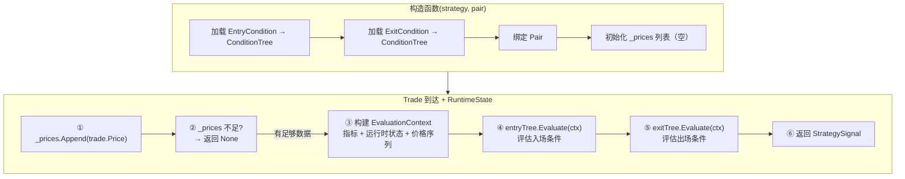
```mermaid
flowchart TD
    subgraph Constructor["构造函数(strategy, pair)"]
        C1["加载 EntryCondition → ConditionTree"]
        C2["加载 ExitCondition → ConditionTree"]
        C3["绑定 Pair"]
        C4["初始化 _prices 列表（空）"]
        C1 --> C2 --> C3 --> C4
    end

    subgraph OnTrade["Trade 到达 + RuntimeState"]
        T1["① _prices.Append(trade.Price)"]
        T2["② _prices 不足?<br/>→ 返回 None"]
        T3["③ 构建 EvaluationContext<br/>指标 + 运行时状态 + 价格序列"]
        T4["④ entryTree.Evaluate(ctx)<br/>评估入场条件"]
        T5["⑤ exitTree.Evaluate(ctx)<br/>评估出场条件"]
        T6["⑥ 返回 StrategySignal"]

        T1 --> T2
        T2 -->|有足够数据| T3
        T3 --> T4
        T4 --> T5
        T5 --> T6
    end

    Constructor --> OnTrade
```

#### Context 持有的状态

| 状态 | 类型 | 说明 |
|------|------|------|
| `_prices` | `List<decimal>` | 最近 N 根 K 线收盘价序列（容量由指标最大周期决定，默认保留 60 点，超出移除旧值） |
| `_entryCondition` | `ConditionTree` | 入场条件树（只读，构造函数加载） |
| `_exitCondition` | `ConditionTree` | 出场条件树（只读，构造函数加载） |
| `_pair` | `string` | 绑定交易对（只读） |

#### Context 不持有的状态（由 ExecutionManager 传入）

| 状态 | 来源 | 说明 |
|------|------|------|
| `openPositions` | `RuntimeState.OpenPositions` | 当前开仓列表 |
| `lastTradeAt` (UTC) | `RuntimeState.LastTradeAt` | 上次交易时间（去重用） |
| `averageEntryPrice` | `RuntimeState.AverageEntryPrice` | 持仓均价 |

#### 关键设计原则

- Context 内部**仅持有** `_prices` 价格序列（评估专用，append-only，容量=最大指标周期，默认 60 点超出移除旧值）
- 每次评估所需的运行时状态**由 ExecutionManager 通过参数传入**
- Context **不直接调用** `TradeExecutor`——只产出 `StrategySignal`
- Context **不感知**风控——风控是 ExecutionManager 的责任
- 入场/出场评估**统一走 ConditionTree**，不区分分支（条件树表达一切逻辑）

#### 产出信号

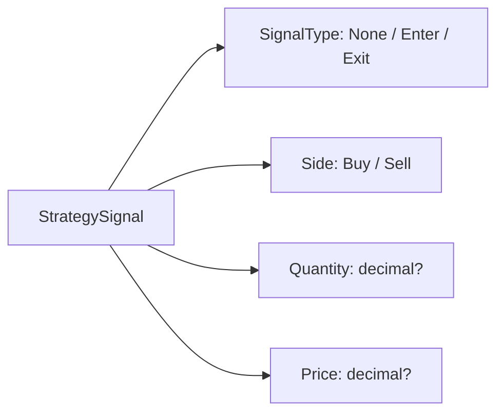
```mermaid
flowchart LR
    A["StrategySignal"] --> B["SignalType: None / Enter / Exit"]
    A --> C["Side: Buy / Sell"]
    A --> D["Quantity: decimal?"]
    A --> E["Price: decimal?"]
```

#### Quantity 决定规则

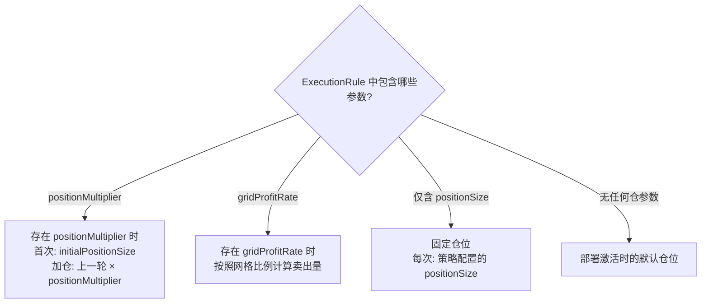
```mermaid
flowchart TD
    Q1{"ExecutionRule 中包含哪些参数?"}
    Q1 -->|positionMultiplier| QM["存在 positionMultiplier 时<br/>首次: initialPositionSize<br/>加仓: 上一轮 × positionMultiplier"]
    Q1 -->|gridProfitRate| QG["存在 gridProfitRate 时<br/>按照网格比例计算卖出量"]
    Q1 -->|仅含 positionSize| QF["固定仓位<br/>每次: 策略配置的 positionSize"]
    Q1 -->|无任何仓参数| QD["部署激活时的默认仓位"]
```

Quantity 由 **ExecutionManager** 根据 ExecutionRule 参数计算后填入 `StrategySignal.Quantity`。策略引擎 Context 仅产出 `SignalType` 和 `Side`。

#### 出入场边界规则

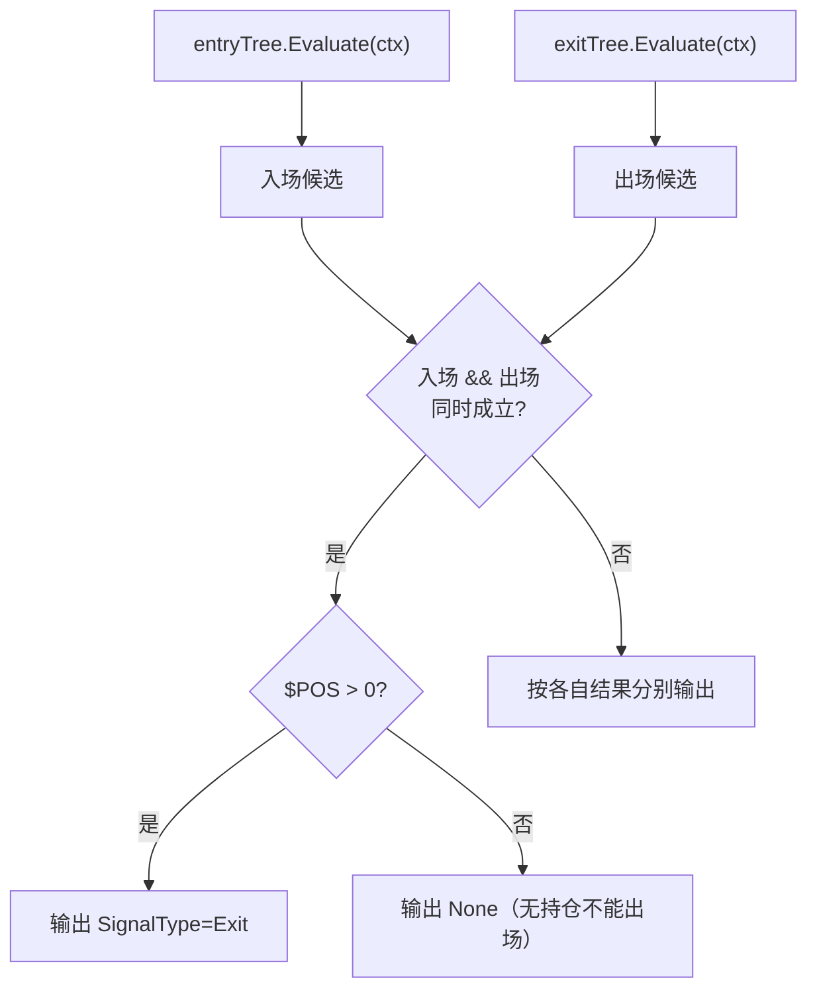
```mermaid
flowchart TD
    E["entryTree.Evaluate(ctx)"] --> ES["入场候选"] 
    X["exitTree.Evaluate(ctx)"] --> XS["出场候选"]
    ES --> BOTH{"入场 && 出场<br/>同时成立?"}
    XS --> BOTH
    BOTH -->|是| POS{"$POS > 0?"}
    POS -->|是| EXIT["输出 SignalType=Exit"]
    POS -->|否| NONE["输出 None（无持仓不能出场）"]
    BOTH -->|否| ENTER["按各自结果分别输出"]
```

**规则**：入场和出场条件同时满足时，优先检查是否有持仓。有持仓走出场，无持仓不准入。

#### 空条件树行为

`EntryCondition = "{}"` 或 `""` 时 → **视为永远不准入**（ConditionTree.Parse 返回空树，Evaluate 返回 false）。如需"始终准入"，必须显式配置条件。

---

## 3. ConditionTree 条件树实体

### 3.1 实体化设计

`ConditionTree` 从当前的纯数据 POCO 增强为**自带评估行为的领域实体**，统一处理入场/出场信号评估：

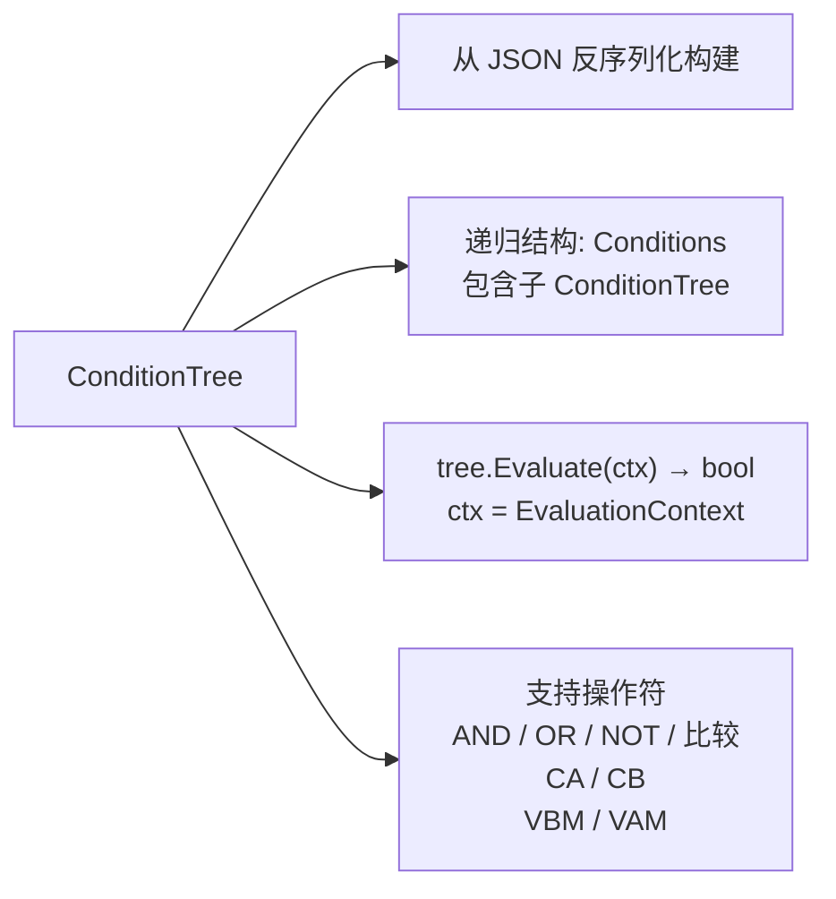
```mermaid
flowchart LR
    A["ConditionTree"] --> B["从 JSON 反序列化构建"]
    A --> C["递归结构: Conditions<br/>包含子 ConditionTree"]
    A --> D["tree.Evaluate(ctx) → bool<br/>ctx = EvaluationContext"]
    A --> E["支持操作符<br/>AND / OR / NOT / 比较<br/>CA / CB<br/>VBM / VAM"]
```

### 3.1a 安全约束

`ConditionTree.Parse` 在反序列化时施加以下限制：

| 约束 | 限制值 | 说明 |
|------|--------|------|
| 最大递归深度 | 10 | 防止栈溢出攻击 |
| Operator 白名单 | `AND`、`OR`、`NOT`、`>`、`<`、`>=`、`<=`、`==`、`CA`、`CB`、`VBM`、`VAM` | 拒绝未知操作符 |
| 叶子节点最大数量 | 100 | 防止超大 JSON 耗尽内存 |
| JSON 大小上限 | 64 KB | 拒绝超大 payload |

### 3.2 评估上下文

评估时传入三个数据源：

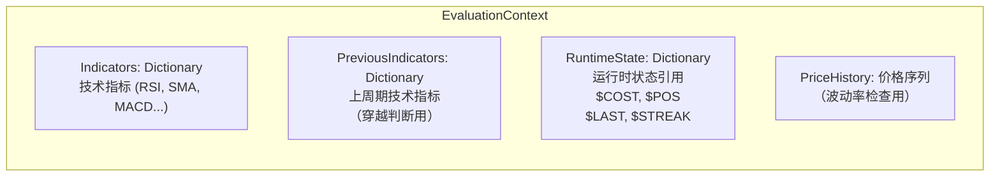
```mermaid
flowchart LR
    subgraph Ctx["EvaluationContext"]
        direction TB
        CT1["Indicators: Dictionary<br/>技术指标 (RSI, SMA, MACD...)"]
        CT2["PreviousIndicators: Dictionary<br/>上周期技术指标<br/>（穿越判断用）"]
        CT3["RuntimeState: Dictionary<br/>运行时状态引用<br/>$COST, $POS<br/>$LAST, $STREAK"]
        CT4["PriceHistory: 价格序列<br/>（波动率检查用）"]
    end
```

### 3.3 评估过程

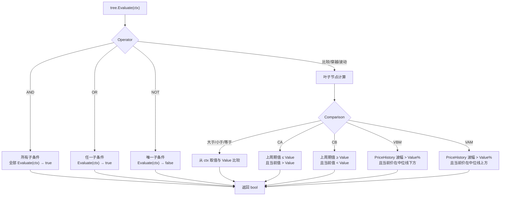
```mermaid
flowchart TD
    A["tree.Evaluate(ctx)"] --> B{Operator}

    B -->|AND| C["所有子条件<br/>全部 Evaluate(ctx) → true"]
    B -->|OR| D["任一子条件<br/>Evaluate(ctx) → true"]
    B -->|NOT| E["唯一子条件<br/>Evaluate(ctx) → false"]
    B -->|比较/穿越/波动| F["叶子节点计算"]

    F --> G{Comparison}
    G -->|大于/小于/等于| H["从 ctx 取值与 Value 比较"]
    G -->|CA| I["上周期值 ≤ Value<br/>且当前值 > Value"]
    G -->|CB| J["上周期值 ≥ Value<br/>且当前值 < Value"]
    G -->|VBM| K["PriceHistory 波幅 > Value%<br/>且当前价在中位线下方"]
    G -->|VAM| L["PriceHistory 波幅 > Value%<br/>且当前价在中位线上方"]

    C --> M["返回 bool"]
    D --> M
    E --> M
    H --> M
    I --> M
    J --> M
    K --> M
    L --> M
```

### 3.4 Indicator 引用规则

#### 运行时状态缩写

运行时状态使用 `$` 前缀引用，**缩写遵循交易行业短语习惯**：

| 写法 | 全称 | 说明 | 示例场景 |
|------|------|------|----------|
| `$LAST` | Last Price | 最新成交价（trade.Price） | 价格阈值比较 |
| `$COST` | Cost Price | 持仓成本均价 | 网格加仓/止盈判断 |
| `$POS` | Positions | 当前持仓数量 | 判断是否已有仓位 |
| `$STREAK` | Loss Streak | 连续亏损次数 | 连续亏损停盘 |
| `$DL` | Daily Loss | 当日累计亏损 | 当日亏损检查 |

技术指标直接写名称（无前缀）：`RSI`、`SMA_20`、`MACD_LINE` 等。

### 3.5 支持的操作符

#### ref 字段

当一个叶子节点指定了 `ref`，比较行为从**对标量比较**切换为**对指标比较**：

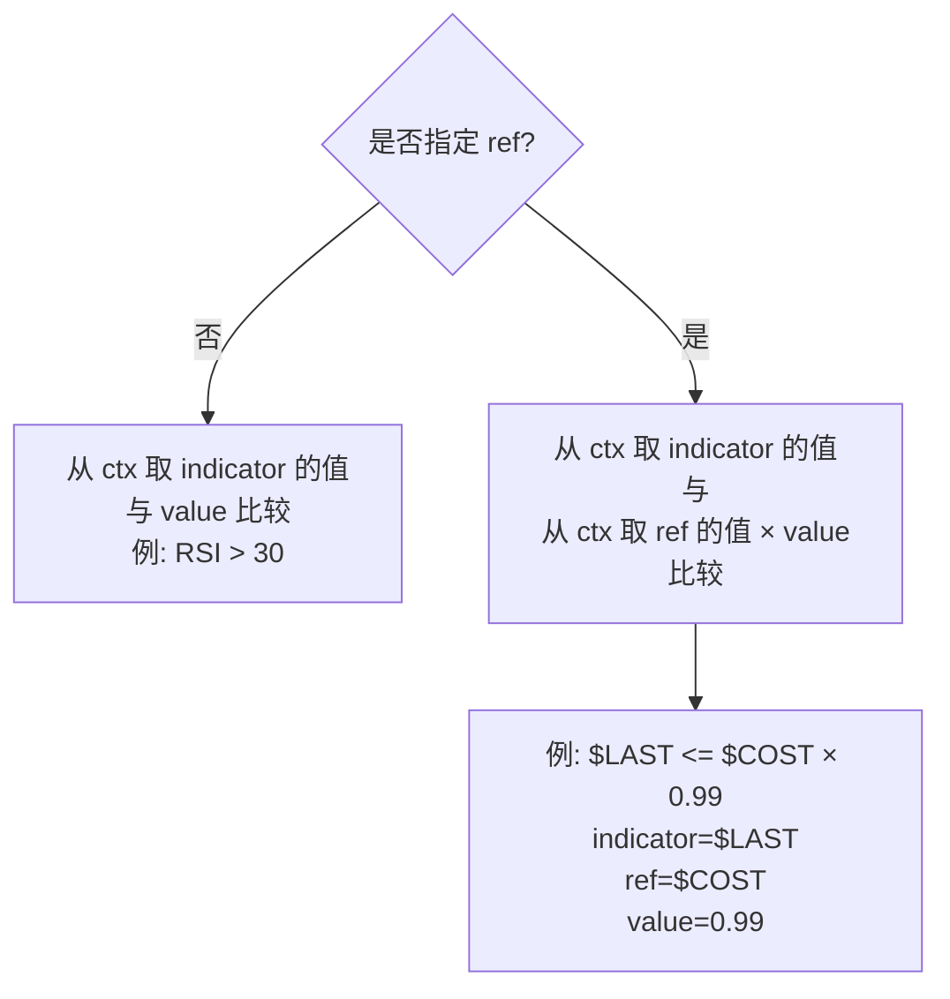
```mermaid
flowchart TD
    A{"是否指定 ref?"} -->|否| B["从 ctx 取 indicator 的值<br/>与 value 比较<br/>例: RSI > 30"]
    A -->|是| C["从 ctx 取 indicator 的值<br/>与<br/>从 ctx 取 ref 的值 × value<br/>比较"]
    C --> D["例: $LAST <= $COST × 0.99<br/>indicator=$LAST<br/>ref=$COST<br/>value=0.99"]
```

| 场景 | indicator | ref | value | 语义 |
|------|-----------|-----|-------|------|
| 指标-vs-标量 | `RSI` | _(无)_ | `30` | RSI 的当前值 > 30 |
| 指标-vs-指标 | `SMA_20` | `SMA_50` | `0` | SMA_20 是否 > SMA_50 |
| 价格-vs-成本比例 | `$LAST` | `$COST` | `0.99` | 当前价 ≤ 成本 × 0.99 |

**穿越操作符 (CA/CB) 的 ref 规则**：当 `ref` 存在时，判断的是 `indicator` 相对 `ref` 的穿越：

| 操作 | indicator | ref | 语义 |
|------|-----------|-----|------|
| `CA` | `SMA_20` | `SMA_50` | SMA_20 上穿 SMA_50 |
| `CB` | `SMA_20` | `SMA_50` | SMA_20 下穿 SMA_50 |
| `CA` | `$LAST` | `SMA_50` | 价格上穿 SMA_50 |

当 `ref` 不存在时，穿越符号与 `value`（标量）比较。

#### 完整操作符表

| 操作符 | 类型 | 说明 |
|--------|------|------|
| `AND` | 逻辑 | 所有子条件均为 true |
| `OR` | 逻辑 | 任一子条件为 true |
| `NOT` | 逻辑 | 唯一子条件取反 |
| `>` / `<` / `>=` / `<=` / `==` | 比较 | 从 ctx 取值与 Value 比较 |
| `CA` | 穿越 | 上周期值 ≤ Value 且当前值 > Value |
| `CB` | 穿越 | 上周期值 ≥ Value 且当前值 < Value |
| `VBM` | 波动 | PriceHistory 波幅 > Value%，当前价在中位线下方 |
| `VAM` | 波动 | PriceHistory 波幅 > Value%，当前价在中位线上方 |

### 3.6 预设策略

以下为三种经典数字货币交易策略及其 ConditionTree 配置。

---

#### 马丁格尔策略

**原理**：初始入场后，每亏损一次将仓位翻倍，待价格反弹至成本价以上时一次性全仓平仓获利。适用于震荡行情，依赖均值回归。

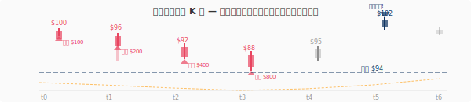

| 参数 | 值 | 说明 |
|------|----|------|
| `positionMultiplier` | 2.0 | 每层加仓倍数 |
| `dropThreshold` | 0.05 | 触发加仓的跌幅阈值 |
| `takeProfitRate` | 0.03 | 止盈率 |
| `maxLayers` | 6 | 最大加仓层数 |
| `initialPositionSize` | 100 | 初始仓位金额 |

**条件树：**

| 条件 | 表达式 | 说明 |
|------|--------|------|
| 首次入场 | `$POS == 0`（无持仓时自动入场） | — |
| 加仓 | 有持仓 且 `$LAST <= $COST × (1 - dropThreshold)` | — |
| 止盈 | — | 有持仓 且 `$LAST >= $COST × (1 + takeProfitRate)` |

> 加仓金额 = 上一轮金额 × `positionMultiplier`，由 ExecutionManager 根据 RuntimeState 记录。

```json
{
  "type": "martingale",
  "positionMultiplier": 2.0,
  "dropThreshold": 0.05,
  "takeProfitRate": 0.03,
  "maxLayers": 6,
  "initialPositionSize": 100
}
```

**入场条件（EntryCondition）**：

```json
{
  "operator": "OR",
  "conditions": [
    { "indicator": "$POS", "comparison": "==", "value": 0 },
    {
      "operator": "AND",
      "conditions": [
        { "indicator": "$POS", "comparison": ">", "value": 0 },
        { "indicator": "$LAST", "comparison": "<=", "value": 0, "ref": "$COST" }
      ]
    }
  ]
}
```
语义：`$POS == 0` 时首次入场；`$POS > 0` 时价格跌破成本均价 `dropThreshold` 比例触发倍投加仓。

**出场条件（ExitCondition）**：

```json
{
  "operator": "AND",
  "conditions": [
    { "indicator": "$POS", "comparison": ">", "value": 0 },
    { "indicator": "$LAST", "comparison": ">=", "value": 0, "ref": "$COST" }
  ]
}
```

---

#### 趋势追踪策略

**原理**：利用均线金叉/死叉判断趋势方向。快线上穿慢线（金叉）时买入，下穿（死叉）时卖出。单边趋势行情中持续持有。

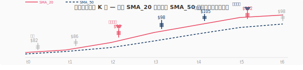

**条件树：**

| 条件 | 表达式 | 说明 |
|------|--------|------|
| 入场 | `SMA_20 CA SMA_50` 且 `SMA_20 > SMA_50` | 快线上穿慢线形成金叉 |
| 出场 | `$POS > 0` 且 `SMA_20 CB SMA_50` | 有持仓且快线下穿慢线形成死叉 |

**入场条件（EntryCondition）**：

```json
{
  "operator": "AND",
  "conditions": [
    { "indicator": "SMA_20", "comparison": "CA", "value": 0, "ref": "SMA_50" },
    { "indicator": "SMA_20", "comparison": ">", "value": 0, "ref": "SMA_50" }
  ]
}
```

**出场条件（ExitCondition）**：

```json
{
  "operator": "AND",
  "conditions": [
    { "indicator": "$POS", "comparison": ">", "value": 0 },
    { "indicator": "SMA_20", "comparison": "CB", "value": 0, "ref": "SMA_50" }
  ]
}
```

---

#### 无限网格策略

**原理**：基于固定收益率等比网格，始终维持持仓价值恒定。价格上涨时卖出超过初始价值的资产锁定利润，价格下跌时补仓恢复初始价值。无上限价格限制，适合长期上涨趋势的标的。

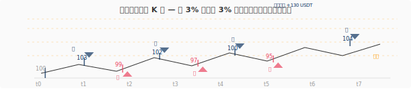

**核心参数：**

| 参数 | 值 | 说明 |
|------|----|------|
| `gridProfitRate` | 0.03 | 每格收益率（3%） |
| `lowerPriceLimit` | 10 | 下限价格（跌破停止） |
| `baseValue` | 1,000 | 持仓基准价值 |
| `minGridNotional` | 5 | 最小网格交易额 |

**条件树：**

| 条件 | 表达式 | 说明 |
|------|--------|------|
| 补仓 | `$LAST <= $COST × (1 - gridProfitRate)` | 价格跌破持仓成本一个网格距 |
| 卖出 | `$POS > 0` 且 `$LAST >= $COST × (1 + gridProfitRate)` | 价格上涨至持仓成本以上一个网格距 |

> 注意：无限网格的`上次卖出价`由 ExecutionManager 在每笔卖出成交后记录到 RuntimeState。补仓时对比当前价格与最后卖出价。`gridProfitRate` 决定网格密度，收益率越低网格越密、交易频率越高。

**入场条件（EntryCondition）**：

```json
{
  "operator": "AND",
  "conditions": [
    { "indicator": "$LAST", "comparison": "<=", "value": 0, "ref": "$COST" }
  ]
}
```

**出场条件（ExitCondition）**：

```json
{
  "operator": "AND",
  "conditions": [
    { "indicator": "$POS", "comparison": ">", "value": 0 },
    { "indicator": "$LAST", "comparison": ">=", "value": 0, "ref": "$COST" }
  ]
}
```

---

#### 策略对比

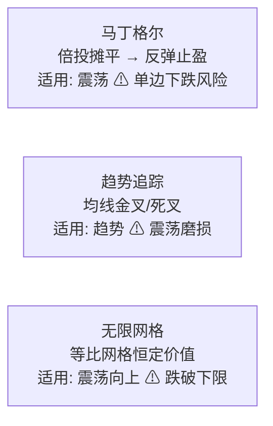
```mermaid
flowchart LR
    M["马丁格尔<br/>倍投摊平 → 反弹止盈<br/>适用: 震荡 ⚠ 单边下跌风险"] 
    T["趋势追踪<br/>均线金叉/死叉<br/>适用: 趋势 ⚠ 震荡磨损"] 
    I["无限网格<br/>等比网格恒定价值<br/>适用: 震荡向上 ⚠ 跌破下限"]
```

| 策略 | 适用行情 | 最大风险 |
|------|---------|---------|
| **马丁格尔** | 震荡 | 单边下跌耗尽资金 |
| **趋势追踪** | 趋势 | 震荡市中反复磨损 |
| **无限网格** | 震荡向上 | 单边下跌触及下限 |

### 3.7 技术指标

StrategyEngineContext.OnTrade 在每个 Trade 到达时计算以下指标：

| 指标 | 说明 |
|------|------|
| `RSI` | 相对强弱指数 |
| `SMA_20` | 20 周期简单移动平均 |
| `SMA_50` | 50 周期简单移动平均 |
| `EMA_20` | 20 周期指数移动平均 |
| `MACD_LINE` | MACD 快线 |
| `MACD_SIGNAL` | MACD 慢线（信号线） |
| `BB_UPPER` | 布林带上轨 |
| `BB_LOWER` | 布林带下轨 |
| `OBV` | 能量潮 |
| `VOLUME_SMA` | 成交量简单移动平均 |
| `RANGE_PCT` | K 线波幅百分比 |

计算时区分 `current`（当前值）和 `previous`（上一周期值），后者用于穿越（CA/CB）判断。

### 3.8 设计变化对照

| 当前设计 | 新设计 |
|---------|--------|
| `ConditionNode` = 纯数据 POCO | `ConditionTree` = 自带 `Evaluate(ctx)` 的领域实体 |
| `ConditionTreeEvaluator` 外部服务 | 逻辑归入 `ConditionTree.Evaluate()` |
| `ConditionEvaluator` JSON 反序列化 + 代理 | `ConditionTree.Parse()` 工厂方法 |
| 评估行为属于服务层 | 评估行为属于模型层（TradeX.Core） |
| Evaluate 只接收两个指标字典 | Evaluate(ctx) 接收指标 + 运行时状态 + 价格序列 |
| 网格策略有单独的 `ShouldEnterVolatilityGrid` | 网格条件通过 ConditionTree + `$COST` + `VBM` 统一表达 |
| `VolatilityGridExecutionRule` 独立实体 | 🔥 删除，全部由风控 Chain 和 ConditionTree 覆盖 |

---

## 4. Trade 数据流

### 4.1 Trade 数据模型

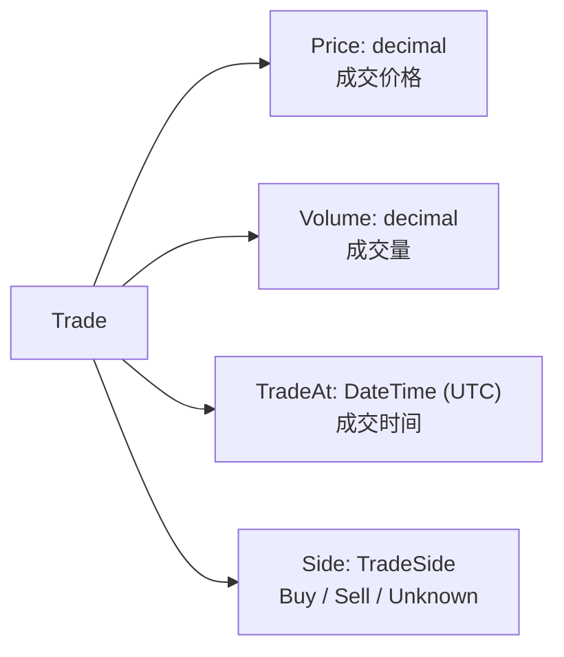
```mermaid
flowchart LR
    A["Trade"] --> B["Price: decimal<br/>成交价格"]
    A --> C["Volume: decimal<br/>成交量"]
    A --> D["TradeAt: DateTime (UTC)<br/>成交时间"]
    A --> E["Side: TradeSide<br/>Buy / Sell / Unknown"]
```

### 4.2 Trade 来源架构

各交易所客户端通过 WebSocket 实现自己的 Trade 流，通过 `IExchangeClient` 统一接口暴露。经调研，**5 家交易所均提供逐笔成交实时推送**：

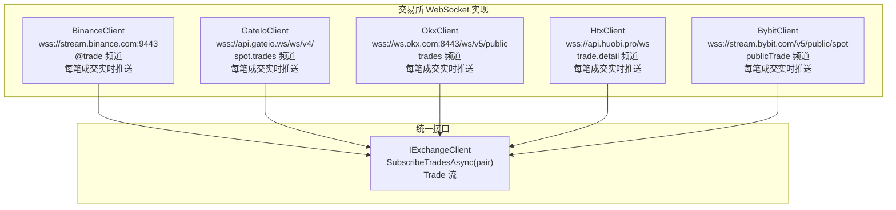
```mermaid
flowchart TD
    subgraph Exchange["交易所 WebSocket 实现"]
        BNC["BinanceClient<br/>wss://stream.binance.com:9443<br/>@trade 频道<br/>每笔成交实时推送"]
        GTE["GateIoClient<br/>wss://api.gateio.ws/ws/v4/<br/>spot.trades 频道<br/>每笔成交实时推送"]
        OKX["OkxClient<br/>wss://ws.okx.com:8443/ws/v5/public<br/>trades 频道<br/>每笔成交实时推送"]
        HTX["HtxClient<br/>wss://api.huobi.pro/ws<br/>trade.detail 频道<br/>每笔成交实时推送"]
        BYB["BybitClient<br/>wss://stream.bybit.com/v5/public/spot<br/>publicTrade 频道<br/>每笔成交实时推送"]
    end

    subgraph Interface["统一接口"]
        IF["IExchangeClient<br/>SubscribeTradesAsync(pair)<br/>Trade 流"]
    end

    BNC --> IF
    GTE --> IF
    OKX --> IF
    HTX --> IF
    BYB --> IF
```

#### 交易所速率限制

ExecutionManager 通过 `IExchangeClient` 自带的限流配置控制订阅速率：

| 交易所 | WebSocket 限流规则 | 客户端配置字段 |
|--------|-------------------|---------------|
| Binance | 5 msg/s/conn，300 conn/5min/IP | `RateLimitPerSecond: 5`、`MaxConnections: 300` |
| Gate.io | 50 req/s/channel | `RateLimitPerSecond: 50` |
| OKX | 无公开限制（建议 ≤ 20 msg/s） | `RateLimitPerSecond: 20` |
| HTX | 50 req/s（`req` 请求） | `RateLimitPerSecond: 50` |
| Bybit | 500 conn/5min | `MaxConnections: 500` |

`IExchangeClient` 实现类在 `SubscribeTradesAsync` 内部维护令牌桶，超出限制时排队等待。

#### Trade 流调研记录

| 交易所 | WebSocket 频道 | 端点 | 说明 | 文档来源 |
|--------|---------------|------|------|---------|
| **Binance** | `<symbol>@trade` | `wss://stream.binance.com:9443/ws` | 每笔成交实时推送，包含价格、数量、成交时间、买卖方向 | [Binance WebSocket Streams](https://developers.binance.com/docs/binance-spot-api-docs/web-socket-streams) |
| **Gate.io** | `spot.trades` | `wss://api.gateio.ws/ws/v4/` | V4 WebSocket，每笔成交实时推送，payload 参数传交易对 | [Gate Spot WebSocket v4](https://www.gate.com/docs/developers/apiv4/ws/) |
| **OKX** | `trades` | `wss://ws.okx.com:8443/ws/v5/public` | 公共频道，无需鉴权 | [OKX API v5 WebSocket](https://www.okx.com/docs-v5/en/#websocket-api-public-channel-trades-channel) |
| **HTX** | `market.$symbol.trade.detail` | `wss://api.huobi.pro/ws` | 订阅最近市场成交，实时推送成交明细 | [HTX Spot WebSocket](https://huobiapi.github.io/docs/spot/v1/en/#subscribe-trade-detail) |
| **Bybit** | `publicTrade.{symbol}` | `wss://stream.bybit.com/v5/public/spot` | 实时推送，单条消息最多聚合 1024 笔成交 | [Bybit WebSocket Trade](https://bybit-exchange.github.io/docs/v5/websocket/public/trade) |

### 4.3 订单幂等性

每笔订单附带 `IdempotencyKey`，防止崩溃恢复时重复下单。

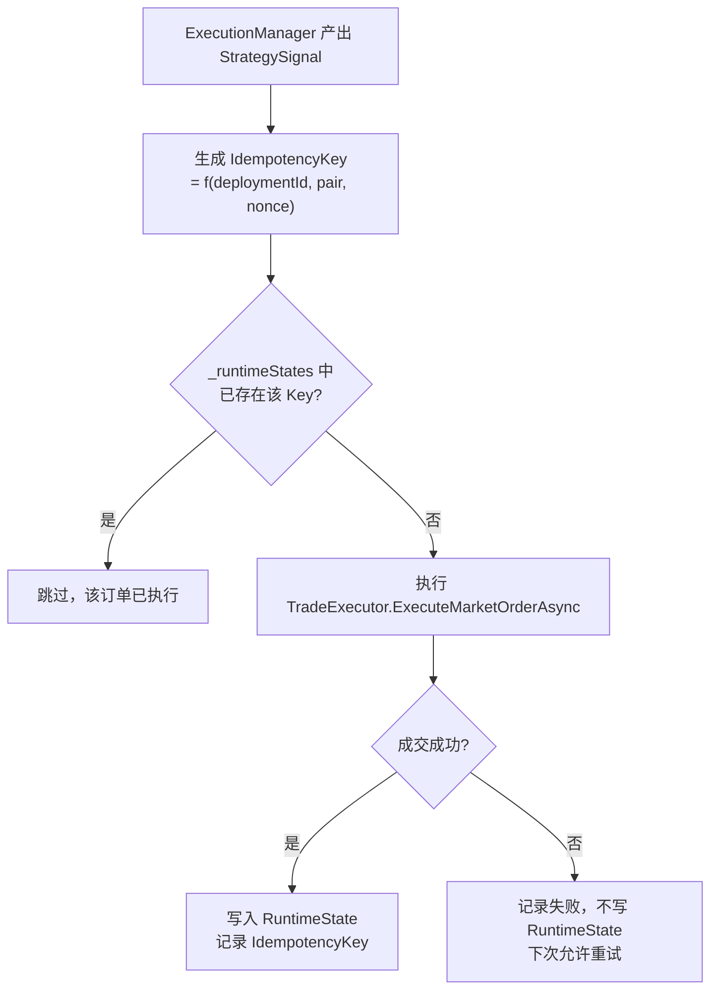
```mermaid
flowchart TD
    A["ExecutionManager 产出 StrategySignal"] --> B["生成 IdempotencyKey<br/>= f(deploymentId, pair, nonce)"]
    B --> C{"_runtimeStates 中<br/>已存在该 Key?"}
    C -->|是| D["跳过，该订单已执行"]
    C -->|否| E["执行 TradeExecutor.ExecuteMarketOrderAsync"]
    E --> F{"成交成功?"}
    F -->|是| G["写入 RuntimeState<br/>记录 IdempotencyKey"]
    F -->|否| H["记录失败，不写 RuntimeState<br/>下次允许重试"]
```

IdempotencyKey 的生成规则：`{DeploymentId}/{Pair}/{Nonce}`，其中 `Nonce` 单调递增。

**持久化位置**：`IdempotencyKey` 作为 `Order` 模型的一个字段存储：

| 模型 | 字段 | 约束 |
|------|------|------|
| `Order` | `IdempotencyKey: string` | 数据库唯一索引 |

`IOrderRepository` 新增查询方法 `GetByIdempotencyKeyAsync`。崩溃重启后，ExecutionManager 通过该接口加载所有已执行的 IdempotencyKey，防止重复下单。

### 4.4 交易对规则校验

执行下单前，ExecutionManager 校验交易所的 PairRule 约束：

| 校验项 | 来源 | 检查逻辑 |
|--------|------|---------|
| `MinNotional` | `PairRule.MinNotional` | `Quantity × Price ≥ MinNotional` |
| `MinQuantity` | `PairRule.MinQuantity` | `Quantity ≥ MinQuantity` |
| `PricePrecision` | `PairRule.PricePrecision` | `Price 的小数位 ≤ PricePrecision` |
| `QuantityPrecision` | `PairRule.QuantityPrecision` | `Quantity 的小数位 ≤ QuantityPrecision` |
| `TickSize` | `PairRule.TickSize` | `Price 必须是 TickSize 的整数倍` |

校验未通过时拒绝下单并推送 `RiskAlert` 事件。

### 4.5 完整数据流链路

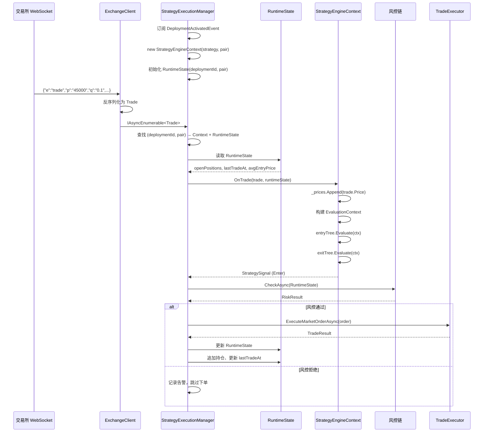
```mermaid
sequenceDiagram
    participant EX as 交易所 WebSocket
    participant Client as ExchangeClient
    participant EM as StrategyExecutionManager
    participant RS as RuntimeState
    participant Ctx as StrategyEngineContext
    participant Risk as 风控链
    participant Exec as TradeExecutor

    EM->>EM: 订阅 DeploymentActivatedEvent
    EM->>EM: new StrategyEngineContext(strategy, pair)
    EM->>EM: 初始化 RuntimeState(deploymentId, pair)

    EX->>Client: {"e":"trade","p":"45000","q":"0.1",...}
    Client->>Client: 反序列化为 Trade
    Client->>EM: IAsyncEnumerable<Trade>

    EM->>EM: 查找 (deploymentId, pair) → Context + RuntimeState
    EM->>RS: 读取 RuntimeState
    RS-->>EM: openPositions, lastTradeAt, avgEntryPrice
    EM->>Ctx: OnTrade(trade, runtimeState)

    Ctx->>Ctx: _prices.Append(trade.Price)
    Ctx->>Ctx: 构建 EvaluationContext
    Ctx->>Ctx: entryTree.Evaluate(ctx)
    Ctx->>Ctx: exitTree.Evaluate(ctx)
    Ctx-->>EM: StrategySignal (Enter)

    EM->>Risk: CheckAsync(RuntimeState)
    Risk-->>EM: RiskResult
    alt 风控通过
        EM->>Exec: ExecuteMarketOrderAsync(order)
        Exec-->>EM: TradeResult
        EM->>RS: 更新 RuntimeState
        EM->>RS: 追加持仓、更新 lastTradeAt
    else 风控拒绝
        EM->>EM: 记录告警，跳过下单
    end
```

---

## 5. 崩溃恢复

策略引擎的所有运行时状态（Context、RuntimeState、价格序列）均在内存中。系统崩溃或重启后需从持久化存储中重建现场。

### 5.1 需恢复的数据

| 数据 | 内存位置 | 重启状态 | 持久化来源 |
|------|---------|---------|-----------|
| `StrategyEngineContext` 实例 | `ConcurrentDictionary<(Guid,string), StrategyEngineContext>` | ❌ 丢失 | 从 Active 部署重建 |
| `RuntimeState.OpenPositions` | `ConcurrentDictionary<key, RuntimeState>` | ❌ 丢失 | `IPositionRepository`（数据库） |
| `RuntimeState.LastTradeAt` | `RuntimeState` | ❌ 丢失 | 最近一笔订单/持仓时间 |
| `RuntimeState.ConsecutiveLosses` | `RuntimeState` | ❌ 丢失 | 今日已平仓记录 |
| `RuntimeState.DailyLoss` | `RuntimeState` | ❌ 丢失 | 今日已平仓记录 |
| `RuntimeState.PortfolioValue` | `RuntimeState` | ❌ 丢失 | 从持仓价值计算 |
| `_prices` 价格序列 | Context 内部 `List<decimal>` | ❌ 丢失 | 从历史 K 线数据预加载 |

### 5.2 恢复流程

```mermaid
flowchart TD
    S["系统启动"] --> A["QueryActiveDeployments<br/>查询所有活跃部署"]
    A --> B["for each (deployment, pair)"]

    B --> C["LoadStrategy<br/>加载策略配置"]
    C --> D["new StrategyEngineContext(strategy, pair)<br/>注册到 _contexts"]

    D --> E["RebuildRuntimeState"]
    E --> E1["QueryOpenPositions<br/>→ IPositionRepository"]
    E --> E2["QueryTodayClosedPositions<br/>→ IPositionRepository"]
    E --> E3["Calculate DailyLoss / ConsecutiveLosses<br/>/ PortfolioValue / LastTradeAt"]

    E1 --> F["创建 RuntimeState<br/>注册到 _runtimeStates"]
    E2 --> F
    E3 --> F

    F --> G["PreloadPriceHistory<br/>从 K 线数据加载最近 N 条<br/>注入 Context._prices"]

    G --> H["SubscribeTradesAsync(pair)<br/>重新订阅 Trade 流"]

    H --> I["进入正常运行循环"]
```

### 5.3 恢复实现

```mermaid
sequenceDiagram
    participant EM as StrategyExecutionManager
    participant DepRepo as IStrategyDeploymentRepository
    participant StrRepo as IStrategyRepository
    participant PosRepo as IPositionRepository
    participant Client as IExchangeClient

    EM->>EM: ExecuteAsync 启动

    EM->>DepRepo: GetAllActiveAsync()
    DepRepo-->>EM: 活跃部署列表

    loop 每个活跃部署
        EM->>StrRepo: GetByIdAsync(strategyId)
        StrRepo-->>EM: 策略配置

        loop 每个 pair
            EM->>EM: new StrategyEngineContext(strategy, pair)

            EM->>PosRepo: GetOpenByDeploymentAndPairAsync(id, pair)
            PosRepo-->>EM: 开仓列表

            EM->>PosRepo: GetClosedByDeploymentSinceAsync(id, pair, todayStart)
            PosRepo-->>EM: 今日已平仓列表

            EM->>EM: 构建 RuntimeState（持仓/亏损/交易时间）

            EM->>Client: SubscribeTradesAsync(pair)
            Client-->>EM: Trade 流

            EM->>EM: _ = RouteTradesAsync(key, stream, ct)
        end
    end

    EM->>EM: 恢复完成，进入事件循环
```

### 5.4 RuntimeState 重建规则

```mermaid
flowchart TD
    subgraph Build["从持久化存储重建 RuntimeState"]
        A["POS → GetOpenByDeploymentAndPairAsync"] --> RS1["OpenPositions"]
        B["已平仓记录 → GetClosedByDeploymentSinceAsync(today)"] --> RS2["DailyLoss<br/>= |min(已平仓PnL之和, 0)|"]
        B --> RS3["ConsecutiveLosses<br/>= 连续亏损的次数"]
        C["最近订单时间 → 最后一条持仓/订单记录"] --> RS4["LastTradeAt"]
        D["开仓价值总和"] --> RS5["PortfolioValue<br/>= Σ(CurrentPrice × Quantity)"]
    end
```

### 5.5 _prices 价格序列预热

Context 内部的 `_prices` 列表用于指标计算（RSI 需要至少 14 个数据点，SMA_50 需要 50 个）。重启后如果从零开始积累：

| 指标 | 最短预热所需数据点 | 说明 |
|------|------------------|------|
| `RSI` | 15 | 14 周期 + 1 当前 |
| `SMA_20` | 21 | 20 周期 + 1 当前 |
| `SMA_50` | 51 | 50 周期 + 1 当前 |
| `MACD` | 27 | 26 周期 + 1 当前 |

**预热策略**：Context 初始化时从 K 线数据源加载最近的 60 根 K 线收盘价注入 `_prices`，确保所有常用指标立即可计算。预热加载量的安全值为 `60`。

```mermaid
sequenceDiagram
    participant EM as ExecutionManager
    participant Repo as K线数据源
    participant Ctx as StrategyEngineContext

    EM->>Repo: GetRecentKlinesAsync(pair, 60)
    Repo-->>EM: 最近 60 根 K 线
    loop 每根 K 线
        EM->>Ctx: SeedPrice(收盘价)
    end
    Note over Ctx: _prices 已预填 60 个数据点<br/>所有常用指标立即可计算
```

### 5.6 设计原则

| 原则 | 说明 |
|------|------|
| **数据库是唯一持久化源** | RuntimeState 不单独持久化，重启后从数据库重建 |
| **先恢复再订阅** | 必须在 RuntimeState 重建完成后才开始接收 Trade 流，防止恢复期间的 Trade 导致状态不一致 |
| **Context 自身无状态之外的数据** | Context 只持有 `_prices`，所有运行时状态由 ExecutionManager 从数据库重建 |
| **Trade 流断线重连** | 交易所 WebSocket 断开后自动重连，重连期间丢失的 Trade 可通过 REST API 补充 |

---

## 6. 风控责任链

风控由 `StrategyExecutionManager` 在收到 `StrategySignal` 后触发执行，**不嵌入 StrategyEngineContext 内部**。风控数据源为 **ExecutionManager 维护的 RuntimeState**，不再查询数据库。

```mermaid
flowchart LR
    A["DailyLoss<br/>当日亏损超限"] --> B["Drawdown<br/>回撤超限"]
    B --> C["ConsecutiveLoss<br/>连续亏损超限"]
    C --> D["CircuitBreaker<br/>熔断激活"]
    D --> E["Cooldown<br/>冷却期未结束"]
    E --> F["PositionLimit<br/>持仓数量超限"]
    F --> G["Slippage<br/>滑点超限"]
    G --> H["ExchangeHealth<br/>交易所连接异常"]

    style A fill:#e94560,color:#fff
    style D fill:#e94560,color:#fff
    style H fill:#e94560,color:#fff
```

### 6.1 各检查器说明

| 检查器 | 触发条件 | 行为 |
|--------|----------|------|
| **CooldownCheck** | 距上次交易时间（UTC） < `CooldownSeconds` | 拒绝 |
| **DailyLossHandler** | 当日亏损（UTC 日期边界） > `MaxDailyLoss` | 拒绝，记录日志 |
| **DrawdownHandler** | `(DailyLoss / PortfolioValue) × 100 > MaxDrawdownPercent` | 拒绝，记录日志 |
| **ConsecutiveLossHandler** | `ConsecutiveLossCount ≥ MaxConsecutiveLosses` | 拒绝，记录日志 |
| **CircuitBreakerHandler** | `CircuitBreakerActive == true` | 拒绝，记录日志。冷却 `CircuitBreakerCooldownSec`（默认 300s）后自动恢复，下次周期重新评估 |
| **PositionLimitHandler** | `OpenPositionCount ≥ MaxOpenPositions` | 拒绝 |
| **SlippageHandler** | 滑点预估 > `MaxSlippageAmount` | 拒绝 |
| **ExchangeHealthHandler** | 交易所 API 连接测试失败（缓存 30s） | 拒绝 |

### 6.2 数据源变更

| 当前设计 | 新设计 |
|---------|--------|
| 风控每次查 `IPositionRepository` 数据库 | 风控从 `RuntimeState` 读取实时状态 |
| `ConsecutiveLosses` 按数据库记录计算 | ExecutionManager 维护计数器 |
| 风控与 Context 状态不同步（两份数据） | **单数据源**，ExecutionManager 维护的 RuntimeState 是唯一来源 |

### 6.3 仓位与资金管理归属

| 功能 | 归属 |
|------|------|
| 持仓数量限制（MaxOpenPositions） | `PositionLimitHandler`（风控链） |
| 每日亏损限制（MaxDailyLoss） | `DailyLossHandler`（风控链） |
| 滑点容忍度（SlippageTolerance） | `SlippageHandler`（风控链） |
| 连续亏损停盘（MaxConsecutiveLosses） | `ConsecutiveLossHandler`（风控链） |
| 单笔仓位金额 | Strategy 配置，由 `StrategySignal.Quantity` 携带 |
| 总仓位上限 | `PositionLimitHandler` 结合 `RuntimeState.PortfolioValue` 控制 |

## 7. 回测复用

回测通过**逐根 K 线模拟 Trade 事件**来复用同一个 `StrategyEngineContext`。回测需要自行管理 `RuntimeState`，模拟 ExecutionManager 的行为。

### 7.1 回测流程

```mermaid
flowchart TD
    BT["BacktestEngine<br/>读取历史 K 线数据"] --> INIT["初始化 RuntimeState<br/>openPositions=[], lastTradeAt=null"]
    INIT --> LOOP["逐 K 线循环"]
    LOOP --> GEN["生成 Trade:<br/>trade = new Trade(收盘价, ...)"]
    GEN --> RS["读取 RuntimeState<br/>→ openPositions / avgEntryPrice"]
    RS --> CTX["StrategyEngineContext.OnTrade(trade, state)"]
    CTX --> SIGNAL["StrategySignal"]
    SIGNAL --> RECORD["记录为 BacktestKlineAnalysis"]
    RECORD --> TRADE{"产生交易?"}
    TRADE -->|是| UPDATE["更新 RuntimeState<br/>追加/移除持仓<br/>更新 lastTradeAt"]
    UPDATE --> ADDTRADE["记录 BacktestTrade<br/>(入场价/出场价/PnL)"]
    TRADE -->|否| SKIP["跳过"]
    ADDTRADE --> NEXT["下一根 K 线"]
    SKIP --> NEXT
    NEXT -->|还有 K 线| RS
    NEXT -->|全部遍历完毕| METRICS["CalculateMetrics<br/>Sharpe / 回撤 / 胜率 / 年化"]
```

### 7.2 实盘与回测差异

| 维度 | 实盘 | 回测 |
|------|------|------|
| 数据源 | 交易所 WebSocket Trade 流 | 历史 K 线数据 |
| 驱动方式 | 事件驱动（来一笔 Trade 触发一次） | 逐 K 线遍历（循环驱动） |
| RuntimeState 维护 | ExecutionManager | BacktestEngine 自行管理 |
| 风控 | ✅ ExecutionManager 调用风控链（读 RuntimeState） | ❌ 关闭（依赖于数据完整性） |
| 下单 | ✅ TradeExecutor 真实下单 | ❌ 仅记录 BacktestTrade |
| 条件评估 | ConditionTree.Evaluate(ctx) | 复用同一套 ConditionTree |
| Context 生命周期 | 部署激活 → 停用 | 单次回测运行期间 |

---

## 8. 新旧设计对照

### 8.1 组件对照

| 当前设计 | 新设计 | 变化类型 |
|---------|--------|---------|
| `TradingEngine` | `StrategyTaskManager` + `StrategyExecutionManager` + `StrategyEngineContext` | 🔄 拆分为三 |
| `TradingCycleScope` | `RuntimeState`（ExecutionManager 维护） | 🔥 删除 |
| `MarketDataCache` | Context 内部 `_prices` 列表 | 🔥 删除 |
| `ConditionNode`（纯数据） | `ConditionTree`（自带 Evaluate(ctx)） | 🔄 增强 |
| `ConditionTreeEvaluator` | 逻辑归入 `ConditionTree.Evaluate()` | 🔥 删除 |
| `ConditionEvaluator` | 逻辑归入 `ConditionTree.Parse()` | 🔥 删除 |
| `VolatilityGridExecutionRule` | 🔥 删除——由 ConditionTree + 风控链覆盖 | 🔥 删除 |
| 15s 定时拉取数据 | Trade 事件驱动（WebSocket） | 🔄 重构 |
| `IExchangeClient` | 新增 `SubscribeTradesAsync` | 🆕 新增 |
| 无 | 领域事件（`DeploymentActivatedEvent` 等） | 🆕 新增 |
| 风控查数据库 | 风控读 `RuntimeState`（实时状态） | 🔄 重构 |

### 8.2 行为对照

| 维度 | 当前设计 | 新设计 |
|------|---------|--------|
| 策略就绪判断 | `GetAllActiveAsync()` 一把拉 | StrategyTaskManager 发布领域事件 |
| 策略评估 | TradingEngine 内联 15s 循环 | StrategyEngineContext.OnTrade 事件驱动 |
| 指标计算 | TradingEngine 中硬编码 7 个指标 | StrategyEngineContext 内计算 |
| 条件评估 | ConditionEvaluator 外部服务 | ConditionTree.Evaluate(ctx) 领域方法 |
| 运行状态 | MarketDataCache 集中 + 方法内维护 | RuntimeState ExecutionManager 统一管理 |
| 风控数据源 | IPositionRepository 数据库 | RuntimeState 实时状态 |
| 回测 | BacktestEngine 自有一套评估逻辑 | 复用 StrategyEngineContext + 自行管理 RuntimeState |
| 网格策略 | VolatilityGridExecutionRule + 两套入口函数 | ConditionTree + `$COST` + `VBM` 统一表达 |

---

## 9. 核心文件映射

| 文件 | 职责 |
|------|------|
| [StrategyTaskManager.cs](../backend/TradeX.Trading/StrategyTaskManager.cs) | 🆕 策略任务管理器 |
| [StrategyExecutionManager.cs](../backend/TradeX.Trading/StrategyExecutionManager.cs) | 🆕 策略执行管理器 |
| [StrategyEngineContext.cs](../backend/TradeX.Trading/StrategyEngineContext.cs) | 🆕 策略引擎上下文 |
| [ConditionTree.cs](../backend/TradeX.Core/Models/ConditionTree.cs) | 🔄 条件树实体（增强：Evaluate(ctx) + 运行时状态引用 + 波动操作符） |
| [EvaluationContext.cs](../backend/TradeX.Core/Models/EvaluationContext.cs) | 🆕 评估上下文（指标 + 运行时状态 + 价格序列） |
| [Trade.cs](../backend/TradeX.Core/Models/Trade.cs) | 🆕 Trade 数据模型 |
| [IExchangeClient.cs](../backend/TradeX.Core/Interfaces/IExchangeClient.cs) | 🔄 新增 `SubscribeTradesAsync` |
| [PortfolioRiskManager.cs](../backend/TradeX.Trading/PortfolioRiskManager.cs) | 风控责任链编排 |
| [RiskHandlers.cs](../backend/TradeX.Trading/RiskHandlers.cs) | 8 个风控检查器实现 |
| [TradeExecutor.cs](../backend/TradeX.Trading/TradeExecutor.cs) | 订单执行 |
| [BacktestEngine.cs](../backend/TradeX.Trading/BacktestEngine.cs) | 🔄 改为使用 StrategyEngineContext |
| [DependencyInjection.cs](../backend/TradeX.Trading/DependencyInjection.cs) | 🔄 更新 DI 注册 |
