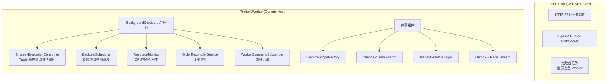
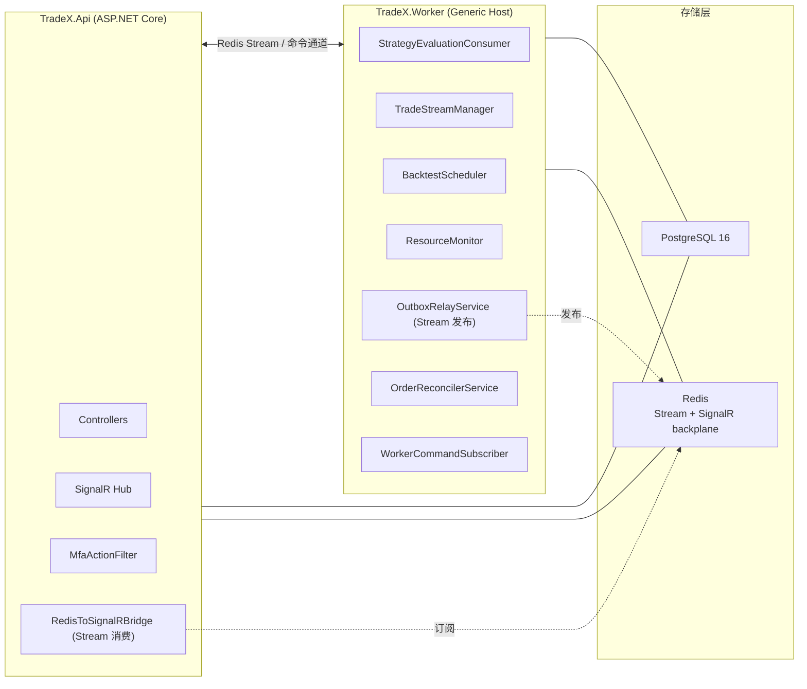

# 策略引擎进程分离设计文档

> 状态：已实现 · 关联 TAD 见 `docs/03-设计规范.md`
> 关联文档：[策略引擎工作流程.md](./策略引擎工作流程.md)

## 1. 目标与非目标

### 1.1 目标
- **故障隔离**：API 进程 OOM/Panic 不中断正在运行的策略；策略引擎崩溃不影响前端/REST 访问。
- **独立运维**：Worker 可独立重启、独立资源限制、独立日志路径，无需重启 API。
- **部署语义清晰化**：API 进程 = 无状态、可水平扩展；Worker 进程 = 有状态、单实例、慎重启。
- **为可观测性、压测、混沌演练打基础**：拆分后才有清晰的故障注入边界。

### 1.2 非目标
- **不引入消息中间件集群**：当前单机部署继续使用 PostgreSQL 16 + Redis 7.4，不引入 Kafka/RabbitMQ。
- **不做水平扩展 Worker**：单实例 Worker 即可（自动交易必须串行避免重复下单）。
- **不引入消息中间件（Kafka/RabbitMQ）**：当前数据量不需要。
- **不重写策略引擎逻辑**：仅迁移宿主，业务代码尽量不动。

---

## 2. 当前架构



**关键耦合点**：
1. `SignalREventBus` 直接持有 `IHubContext<TradingHub>`，TradingEngine 调用它推送事件
2. `MarketDataCache` 是内存单例，TradingEngine 和 API 都引用
3. `BacktestTaskQueue` 内存队列，API 入队，BacktestScheduler 消费
4. 所有组件共享同一 EF Core `IServiceScopeFactory`

---

## 3. 目标架构



### 3.1 进程边界

| 组件 | 归属 | 原因 |
|------|------|------|
| `Controllers/*` | API | 无后台依赖 |
| `MfaActionFilter` | API | 仅 HTTP 路径 |
| `AuthController` / `JwtService` | API | 仅 HTTP 路径 |
| `TradingHub` (SignalR) | API | WebSocket 长连接终结点 |
| `StrategyEvaluationConsumer` + `TradeStreamManager` | **Worker** | Trade 事件驱动评估循环 |
| `BacktestScheduler` + `BacktestEngine` | **Worker** | CPU 密集后台任务 |
| `ResourceMonitor` | **Worker** | 监测 Worker 自身资源 |
| `OrderReconciler` | **Worker** | 后台对账 |
| `TradeX.Trading` 项目 | 两边共用（保持现状） | 同一类库 |
| `TradeX.Exchange` 项目 | 两边共用 | 同一类库 |
| `TradeX.Infrastructure` | 两边共用 | EF Core + Repos |

### 3.2 共享 vs 拆分原则

- **共享**：所有 `TradeX.*` 类库 (Core / Trading / Exchange / Infrastructure / Indicators / Notifications)
- **API 独占**：HTTP/WebSocket 端点、Filters、Hubs、JWT/MFA
- **Worker 独占**：`BackgroundService` 实现、命令行入口

---

## 4. 跨进程通信设计

### 4.1 通信场景与方案

| 场景 | 方向 | 频率 | 方案 |
|------|------|------|------|
| 策略评估结果（订单/风控告警事件）推送给前端 | Worker → API → 前端 | 高 | **Outbox + Redis Stream + SignalR Backplane** |
| 用户启用/禁用策略 | API → Worker | 低 | **DB 标志位轮询**（Worker 下一周期读取生效） |
| 用户修改风控参数 | API → Worker | 低 | **DB 轮询**（同上） |
| 用户手动触发回测 | API → Worker | 中 | **DB 任务表 + Worker 轮询** （现有 `BacktestTaskQueue` 已是 DB 模型，迁移容易） |
| 立即取消订单 / 紧急熔断 | API → Worker | 低 | **Redis Stream 命令通道**（秒级延迟，显式 ACK） |
| Worker 自身健康状态 | Worker → API | 持续 | **Redis 心跳键（带 TTL）** |

### 4.2 Outbox + Redis Stream 事件设计

Worker 侧不直接推 SignalR，而是写入 outbox 表，由后台 relay 发布到 Redis Stream：

```csharp
// 接口保持不变：ITradingEventBus（已存在）
// 实现切换：
// - 旧：SignalREventBus → 直接 IHubContext.Clients.Group(userId).SendAsync(...)
// - 新：OutboxTradingEventBus → 写 outbox_events 表
// - Relay：OutboxRelayService → XADD 到 Redis Stream "tradex:events"

// API 端消费 Redis Stream 并桥接到 SignalR：
// RedisToSignalRBridge : BackgroundService
//   - XREADGROUP "tradex:events" → hub.Clients.Group(traderId).SendAsync(...)
```

Worker 进程：业务路径只写 outbox，后台 relay 发布 Redis Stream。
API 进程：消费 Redis Stream，桥接到 SignalR。

**Why Redis：**
- 微软官方 SignalR backplane 支持 Redis（`Microsoft.AspNetCore.SignalR.StackExchangeRedis`）
- 同一个 Redis 实例可复用为业务事件 Stream、命令通道和 SignalR backplane
- Docker compose 添加 1 个 redis service 即可

### 4.3 SignalR Backplane

如果将来 API 想多实例部署，必须配 backplane（否则 SignalR 实例间不互通）：

```csharp
builder.Services.AddSignalR()
    .AddStackExchangeRedis(builder.Configuration["Redis:ConnectionString"]);
```

即使 API 暂时单实例，提前装上零成本。

### 4.4 MarketDataCache 处理

当前 `MarketDataCache` 是进程内单例，存储：
- `PriceHistory`：每个交易对的近期价格序列
- `LastTradeTime`：策略×交易员的上次成交时间

**迁移策略**：
- `PriceHistory`：完全移到 Worker（只有 TradingEngine 用）
- `LastTradeTime`：完全移到 Worker（同上）

API 进程不再持有 `MarketDataCache`，DI 配置分离。

---

## 5. 项目结构变更

### 5.1 新增项目

```
backend/
├── TradeX.Worker/                 ← 新增
│   ├── TradeX.Worker.csproj      (Microsoft.NET.Sdk.Worker)
│   ├── Program.cs                (Generic Host: HostApplicationBuilder)
│   ├── appsettings.json          (复用 DB / 日志 / Redis 配置)
│   ├── WorkerHostExtensions.cs   (AddTradingWorker() 注册 BackgroundService)
│   └── Dockerfile.worker         (基于现有 Dockerfile 模式)
```

### 5.2 现有项目调整

| 项目 | 调整 |
|------|------|
| `TradeX.Api` | 移除 `AddHostedService<TradingEngine>` / `BacktestScheduler` / `ResourceMonitor`；新增 `RedisToSignalRBridge` BackgroundService；SignalR 接 Redis backplane |
| `TradeX.Trading/DependencyInjection.cs` | 拆为 `AddTradingShared()`（注册 evaluator/repos）和 `AddTradingWorker()`（注册 BackgroundService 们） |
| `TradeX.Trading` | 使用 `OutboxTradingEventBus : ITradingEventBus` + `OutboxRelayService`；不再依赖 SignalR |
| `TradeX.Api.csproj` | 新增 `Microsoft.AspNetCore.SignalR.StackExchangeRedis` + `StackExchange.Redis` |

### 5.3 部署形态

```yaml
# docker-compose.yml 增加 worker 和 redis
services:
  redis:
    image: redis:7.4-alpine

  backend:                # 原 API
    build:
      target: api         # Dockerfile 改多 stage
    environment:
      - Redis__ConnectionString=redis:6379

  worker:                 # 新增
    build:
      target: worker
    environment:
      - Redis__ConnectionString=redis:6379
```

API 与 Worker 均连接同一个 PostgreSQL 实例。业务事件采用 outbox 表作为事务边界：业务写入提交后，Worker 内的 `OutboxRelayService` 将事件推送到 Redis Stream，API 再桥接给 SignalR。

---

## 6. 分阶段迁移路线

### 阶段 1：项目骨架（最小可运行）
**目标**：Worker 可启动、可读 DB、不接管任何业务。
- 新建 `TradeX.Worker` 项目
- Generic Host + Serilog + EF Core + OTel（复用 API 的配置）
- 启动后只打日志，验证 DB 连接

**风险**：低 · **工期**：0.5 天

### 阶段 2：迁移 BackgroundService
**目标**：策略引擎物理上跑在 Worker 进程，API 不再启动它。
- 拆分 `TradeX.Trading.DependencyInjection` 为 Shared / Worker
- API 端去掉 `AddHostedService<TradingEngine>` 等
- Worker 端 `AddTradingWorker()`
- `ITradingEventBus` 此阶段保留 `SignalREventBus`，但 Worker 进程的实现替换为**空实现 NullEventBus**（暂时丢失实时事件，下一阶段恢复）

**风险**：中 · **工期**：1 天 · **验证**：策略仍能下单（DB 写入），但前端不再收到实时事件

### 阶段 3：Redis 事件总线
**目标**：恢复实时事件推送，加 SignalR backplane。
- 引入 Redis service
- 实现 `OutboxTradingEventBus : ITradingEventBus` 写入 `outbox_events`
- API 端新增 `RedisToSignalRBridge : BackgroundService`，消费 Redis Stream 并 fan-out 到 SignalR Hub
- Worker 端 DI 注册 Outbox 事件总线和 Outbox Relay
- SignalR 添加 backplane（即使 API 单实例也接上）

**风险**：中 · **工期**：1 天 · **验证**：前端重新收到实时事件

### 阶段 4：跨进程命令通道
**目标**：紧急操作（手动触发评估、紧急熔断、立即取消订单）走 Redis 而非等下一周期。
- 定义命令模型：`tradex.cmd.<verb>` 频道
- Worker 订阅命令通道
- 控制台/API 通过 Redis Publish 发命令
- 现有功能不依赖此通道，仅作为增量能力

**风险**：低 · **工期**：1 天 · **验证**：通过 API 触发"立即评估"按钮，Worker 立刻响应

### 阶段 5（可选）：API 切只读
**目标**：消除双写竞争，提高稳定性。
- API 的所有写操作改为发命令到 Worker
- Worker 执行后通过 Redis 回执
- API 连接字符串改 `Mode=ReadOnly`

**风险**：高 · **工期**：3-5 天 · 不推荐第一轮做

---

## 7. 风险与缓解

| 风险 | 缓解 |
|------|------|
| API 与 Worker 并发写 PostgreSQL | 关键写路径使用乐观并发、唯一索引和 Outbox 事务边界；需要持续补充集成测试 |
| Redis 单点故障 | Redis 持久化关闭即可（事件本就是瞬时的）；container restart 策略；后续可用 Sentinel |
| 事件丢失（Worker→Redis 网络故障） | Outbox 表保留 Pending 事件，Relay 重试推送；Redis Stream 消费侧成功后显式 ACK |
| 跨进程调试复杂度 ↑ | OTel traces 跨服务串联（trace context 通过 Redis message headers 透传） |
| Worker 单实例 SPOF | docker `restart: unless-stopped` + 健康检查；Worker 重启窗口期不下单（接受） |
| 配置漂移 | API 和 Worker 共用同一 `appsettings.json`（compose 挂载），避免分叉 |

---

## 8. 待评审决策

1. **Redis 是否引入**：本设计假定引入。如果坚持不加依赖，必须降级到"最小拆分（DB 轮询）"方案，放弃实时事件。
2. **是否进一步收敛写路径**：当前 API 与 Worker 都写 PostgreSQL；若未来需要更强串行语义，可评估把交易相关写操作统一收敛到 Worker。
3. **回测调度归属**：本设计放到 Worker。但回测是 CPU 重活，可能跟交易引擎抢资源。后续可拆为第三个进程 `TradeX.BacktestWorker`，本轮不做。
4. **Worker 内 OrderReconciler 与 TradingEngine 并存的同步语义**：两者都修改 Order/Position 表，需确认现有锁/事务边界仍正确。

---

## 9. 工期估算

| 阶段 | 工期 | 累计 |
|------|------|------|
| 1. 项目骨架 | 0.5 天 | 0.5 |
| 2. BackgroundService 迁移 | 1 天 | 1.5 |
| 3. Redis 事件总线 + Backplane | 1 天 | 2.5 |
| 4. 命令通道（可选） | 1 天 | 3.5 |
| 测试 + 联调 + 文档 | 1 天 | 4.5 |

**合计约 1 周**。阶段 5 不计入第一轮。

---

## 10. 下一步

如本设计通过评审，建议从 **阶段 1（项目骨架）** 开始，每阶段独立提交、独立验证、可回滚。
