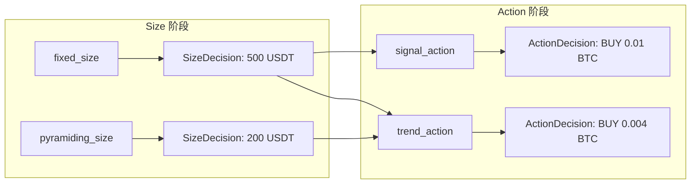

# 规则链引擎 — 配置指南

> 本文档说明如何使用 JSON 配置规则链引擎的策略。所有字段使用**小驼峰命名**（`camelCase`），与前端保持一致。
>
> 核心类型：`ChainDefinition`（规则链定义）+ `NodeInstance`（节点实例）。

---

## 1. 完整策略 JSON 示例

### 1.1 波动率网格策略

该策略结合波动率缩放和网格价格水平，实现动态网格交易。

```json
{
  "key": "vol_grid_v1",
  "name": "波动率网格 v1",
  "description": "基于 24h 波动率动态调整网格间距和仓位",
  "schemaVersion": 1,
  "nodes": [
    {
      "nodeKind": "time_gate",
      "params": {
        "mode": "INTERVAL",
        "intervalMinutes": 60
      },
      "priority": 1
    },
    {
      "nodeKind": "pair_gate",
      "params": {
        "whitelist": ["BTC/USDT", "ETH/USDT"]
      },
      "priority": 2
    },
    {
      "nodeKind": "signal_gate",
      "params": {
        "signal": "VOLATILITY_24H",
        "op": "<=",
        "threshold": 5
      },
      "priority": 3
    },
    {
      "nodeKind": "volatility_scaling",
      "params": {
        "signal": "VOLATILITY_24H",
        "baseValue": 1,
        "outputKey": "vol_scale"
      },
      "priority": 1
    },
    {
      "nodeKind": "grid_price_level",
      "params": {
        "topPrice": 70000,
        "bottomPrice": 30000,
        "gridCount": 5,
        "mode": "LINEAR",
        "outputKey": "grid_prices"
      },
      "priority": 2
    },
    {
      "nodeKind": "grid_size",
      "params": {
        "totalAmount": 1000,
        "gridCount": 5,
        "mode": "LINEAR"
      },
      "priority": 1
    },
    {
      "nodeKind": "grid_action",
      "params": {
        "deviationPercent": 2,
        "basePrice": 50000
      },
      "priority": 1
    },
    {
      "nodeKind": "max_drawdown",
      "params": {
        "maxDrawdownPercent": 15
      },
      "priority": 1
    }
  ]
}
```

### 1.2 趋势跟踪 + 移动止损策略

结合金叉死叉检测与 ATR 止损的多链策略。

```json
[
  {
    "key": "trend_entry",
    "name": "趋势入场链",
    "description": "金叉入场 + 仓位管理",
    "schemaVersion": 1,
    "nodes": [
      {
        "nodeKind": "regime_gate",
        "params": {
          "allowedRegimes": ["1", "2"]
        },
        "priority": 1
      },
      {
        "nodeKind": "position_gate",
        "params": {
          "require": "CLOSED"
        },
        "priority": 2
      },
      {
        "nodeKind": "crossover_check",
        "params": {
          "fastSignal": "EMA_12",
          "slowSignal": "EMA_26",
          "outputKey": "golden_cross"
        },
        "priority": 1
      },
      {
        "nodeKind": "fixed_size",
        "params": {
          "amount": 500,
          "currency": "USDT"
        },
        "priority": 1
      },
      {
        "nodeKind": "signal_action",
        "params": {
          "buySignal": "golden_cross",
          "sellSignal": "",
          "threshold": 0.5,
          "direction": "ABOVE"
        },
        "priority": 1
      }
    ]
  },
  {
    "key": "trend_exit",
    "name": "趋势出场链",
    "description": "ATR 止损 + 移动止盈",
    "schemaVersion": 1,
    "nodes": [
      {
        "nodeKind": "position_gate",
        "params": {
          "require": "OPEN"
        },
        "priority": 1
      },
      {
        "nodeKind": "atr_stop_calc",
        "params": {
          "atrSignal": "ATR_14",
          "multiplier": 2,
          "longStopKey": "long_stop",
          "longTpKey": "long_tp",
          "shortStopKey": "short_stop",
          "shortTpKey": "short_tp"
        },
        "priority": 1
      },
      {
        "nodeKind": "trailing_stop_action",
        "params": {
          "trailPercent": 5,
          "activationPrice": 55000
        },
        "priority": 1
      },
      {
        "nodeKind": "daily_loss_limit",
        "params": {
          "maxDailyLoss": 1000
        },
        "priority": 1
      },
      {
        "nodeKind": "kill_switch",
        "params": {
          "key": "trend_trader"
        },
        "priority": 1
      }
    ]
  }
]
```

### 1.3 DCA 定投策略

```json
{
  "key": "dca_btc",
  "name": "BTC 定投",
  "description": "每 24 小时定投 50 USDT 的 BTC",
  "schemaVersion": 1,
  "nodes": [
    {
      "nodeKind": "capital_gate",
      "params": {
        "minAvailableCash": 100
      },
      "priority": 1
    },
    {
      "nodeKind": "dca_action",
      "params": {
        "intervalHours": 24,
        "amount": 50
      },
      "priority": 1
    },
    {
      "nodeKind": "max_drawdown",
      "params": {
        "maxDrawdownPercent": 20
      },
      "priority": 1
    }
  ]
}
```

### 1.4 网格 + 成本锚定再平衡策略

```json
{
  "key": "grid_rebalance",
  "name": "网格成本锚定",
  "description": "基于成本价的网格再平衡",
  "schemaVersion": 1,
  "nodes": [
    {
      "nodeKind": "time_gate",
      "params": {
        "mode": "WINDOW",
        "windows": [
          { "dayOfWeek": 1, "startTime": "00:00", "endTime": "23:59" },
          { "dayOfWeek": 2, "startTime": "00:00", "endTime": "23:59" },
          { "dayOfWeek": 3, "startTime": "00:00", "endTime": "23:59" },
          { "dayOfWeek": 4, "startTime": "00:00", "endTime": "23:59" },
          { "dayOfWeek": 5, "startTime": "00:00", "endTime": "23:59" }
        ]
      },
      "priority": 1
    },
    {
      "nodeKind": "cost_anchored_rebalance",
      "params": {
        "deviationThreshold": 3,
        "baseQuantity": 0.001
      },
      "priority": 1
    },
    {
      "nodeKind": "cooldown",
      "params": {
        "cooldownMinutes": 30
      },
      "priority": 1
    }
  ]
}
```

### 1.5 复合风控链

多链策略：入场链做交易，独立风控链做全局保护。

```json
[
  {
    "key": "entry",
    "name": "入场链",
    "nodes": [
      {
        "nodeKind": "capital_gate",
        "params": { "minAvailableCash": 500 },
        "priority": 1
      },
      {
        "nodeKind": "max_slippage",
        "params": { "maxSlippagePercent": 0.5 },
        "priority": 1
      },
      {
        "nodeKind": "kelly",
        "params": {
          "winRate": 0.6,
          "avgWinLossRatio": 1.5,
          "outputKey": "KELLY_F"
        },
        "priority": 1
      },
      {
        "nodeKind": "kelly_size",
        "params": { "kellyFraction": 0.5 },
        "priority": 1
      },
      {
        "nodeKind": "trend_action",
        "params": {
          "trendSignal": "TREND_DIRECTION",
          "threshold": 0,
          "direction": "ABOVE"
        },
        "priority": 1
      }
    ]
  },
  {
    "key": "global_risk",
    "name": "全局风控",
    "nodes": [
      {
        "nodeKind": "max_positions",
        "params": { "maxCount": 5, "scope": "global" },
        "priority": 1
      },
      {
        "nodeKind": "consecutive_loss_stop",
        "params": { "maxConsecutiveLosses": 3 },
        "priority": 1
      },
      {
        "nodeKind": "exchange_health",
        "params": { "maxLatencyMs": 500 },
        "priority": 1
      }
    ]
  }
]
```

---

## 2. 节点参数说明

### 2.1 Gate 节点

| 节点 | 参数名 | 类型 | 必填 | 默认值 | 说明 |
|------|--------|------|------|--------|------|
| `regime_gate` | `allowedRegimes` | `string[]` | 是 | — | 允许的市场体制列表（如 `["1","2"]`） |
| `time_gate` | `mode` | `string` | 是 | — | `WINDOW`（时间窗口）或 `INTERVAL`（间隔分钟） |
| | `windows` | `TimeWindow[]` | 条件必填 | — | `mode=WINDOW` 时必填。`{dayOfWeek:0..6, startTime, endTime}` |
| | `intervalMinutes` | `int` | 否 | `60` | `mode=INTERVAL` 时的分钟间隔 |
| `pair_gate` | `whitelist` | `string[]` | 是 | — | 允许的交易对列表 |
| `signal_gate` | `signal` | `string` | 是 | — | 需要检查的信号名称 |
| | `op` | `string` | 是 | — | 比较运算符：`>` / `<` / `>=` / `<=` / `==` |
| | `threshold` | `decimal` | 是 | — | 比较阈值 |
| `capital_gate` | `minAvailableCash` | `decimal` | 是 | — | 最小可用现金 |
| `position_gate` | `require` | `string` | 是 | — | `OPEN` / `CLOSED` / `ANY` |

### 2.2 Filter 节点

| 节点 | 参数名 | 类型 | 必填 | 默认值 | 说明 |
|------|--------|------|------|--------|------|
| `min_notional` | `minNotional` | `decimal` | 是 | — | 最小名义价值（过滤太小额的买单） |
| `max_slippage` | `maxSlippagePercent` | `decimal` | 是 | — | 最大允许滑点百分比 |
| `liquidity_filter` | `side` | `string` | 是 | — | 检查方向：`BUY`（买单深度）或 `SELL`（卖单深度） |
| | `minDepth` | `decimal` | 是 | — | 最小盘口深度（名义价值） |

### 2.3 Derive 节点

| 节点 | 参数名 | 类型 | 必填 | 默认值 | 说明 |
|------|--------|------|------|--------|------|
| `crossover_check` | `fastSignal` | `string` | 是 | — | 快线信号名称 |
| | `slowSignal` | `string` | 是 | — | 慢线信号名称 |
| | `outputKey` | `string` | 是 | — | 产出键名（金叉=1，死叉=-1，无穿越=0） |
| `atr_stop_calc` | `atrSignal` | `string` | 否 | `ATR_14` | ATR 信号名称 |
| | `multiplier` | `decimal` | 是 | — | ATR 乘数 |
| | `longStopKey` | `string` | 是 | — | 多仓止损产出键名 |
| | `longTpKey` | `string` | 是 | — | 多仓止盈产出键名 |
| | `shortStopKey` | `string` | 是 | — | 空仓止损产出键名 |
| | `shortTpKey` | `string` | 是 | — | 空仓止盈产出键名 |
| `grid_price_level` | `topPrice` | `decimal` | 是 | — | 网格上限价格 |
| | `bottomPrice` | `decimal` | 是 | — | 网格下限价格 |
| | `gridCount` | `int` | 是 | — | 网格层数（>= 2） |
| | `mode` | `string` | 否 | `LINEAR` | `LINEAR`（等差）或 `GEOMETRIC`（等比） |
| | `outputKey` | `string` | 是 | — | 产出键名前缀（产出 `{key}_COUNT` 和 `{key}_0..N-1`） |
| `volatility_scaling` | `signal` | `string` | 否 | `VOLATILITY_24H` | 波动率信号名称 |
| | `baseValue` | `decimal` | 是 | — | 基准值 |
| | `outputKey` | `string` | 是 | — | 产出键名（scaled = baseValue / volatility） |
| `trailing_stop_calc` | `trailPercent` | `decimal` | 是 | — | 移动止损百分比 |
| | `outputKey` | `string` | 是 | — | 产出键名（移动止损价格） |
| `kelly` | `winRate` | `decimal` | 是 | — | 胜率（0~1） |
| | `avgWinLossRatio` | `decimal` | 是 | — | 平均盈亏比 |
| | `outputKey` | `string` | 是 | — | 产出键名（f*，上限 25%） |
| `divergence_detect` | `priceSignal` | `string` | 是 | — | 价格信号名称 |
| | `volumeSignal` | `string` | 是 | — | 成交量信号名称 |
| | `outputKey` | `string` | 是 | — | 产出键名（顶背离=-1，底背离=+1） |
| `correlation_score` | `signalA` | `string` | 是 | — | 信号 A 名称 |
| | `signalB` | `string` | 是 | — | 信号 B 名称 |
| | `outputKey` | `string` | 是 | — | 产出键名（同向=+1，反向=-1） |

### 2.4 Size 节点

| 节点 | 参数名 | 类型 | 必填 | 默认值 | 说明 |
|------|--------|------|------|--------|------|
| `fixed_size` | `amount` | `decimal` | 是 | — | 固定金额 |
| | `currency` | `string` | 否 | `USDT` | 计价币种 |
| `pyramiding_size` | `baseAmount` | `decimal` | 是 | — | 首层金额 |
| | `multiplier` | `decimal` | 是 | — | 每层增长倍数 |
| | `maxLevel` | `int` | 是 | — | 最大加仓层数 |
| `account_ratio_size` | `ratio` | `decimal` | 是 | — | 账户权益比例（0~1） |
| `volatility_adjusted_size` | `baseSize` | `decimal` | 是 | — | 基准仓位大小 |
| | `volSignal` | `string` | 否 | `VOLATILITY_24H` | 波动率信号名称 |
| | `referenceVol` | `decimal` | 否 | 当前波动率 | 参考波动率基线 |
| | `outputKey` | `string` | 是 | — | 产出键名（调整后金额） |
| `grid_size` | `totalAmount` | `decimal` | 是 | — | 网格总金额 |
| | `gridCount` | `int` | 是 | — | 网格层数 |
| | `mode` | `string` | 否 | `LINEAR` | `LINEAR`（等差）或 `GEOMETRIC`（等比=2^i） |
| `kelly_size` | `kellyFraction` | `decimal` | 否 | `1.0` | Kelly 分数（0~1，半凯利常用 0.5） |
| `portfolio_alloc_size` | `allocationPercent` | `decimal` | 是 | — | 组合分配百分比（0~100） |

### 2.5 Action 节点

| 节点 | 参数名 | 类型 | 必填 | 默认值 | 说明 |
|------|--------|------|------|--------|------|
| `signal_action` | `buySignal` | `string` | 否 | — | 买入触发信号名 |
| | `sellSignal` | `string` | 否 | — | 卖出触发信号名 |
| | `threshold` | `decimal` | 是 | — | 信号阈值 |
| | `direction` | `string` | 是 | — | `ABOVE`（超阈值触发）或 `BELOW`（低阈值触发） |
| `grid_action` | `priceLevelKey` | `string` | 否 | — | 价格层级键名（设置后启用层级匹配模式，对应 `grid_price_level` 的 `outputKey`） |
| | `deviationPercent` | `decimal` | 否 | — | 简单模式：偏离阈值百分比（与 `basePrice` 配合使用） |
| | `basePrice` | `decimal` | 否 | — | 简单模式：基准价格 |

> **双模式**：`priceLevelKey` 非空时启用层级匹配（读取 DerivedValues 中的价格层级，跨层触发交易），否则使用简单偏离检查模式。
| `trailing_stop_action` | `trailPercent` | `decimal` | 是 | — | 移动止损百分比 |
| | `activationPrice` | `decimal` | 否 | — | 激活价（达到后才激活移动止损） |
| `take_profit_action` | `tpPercent` | `decimal` | 是 | — | 止盈百分比 |
| `dca_action` | `intervalHours` | `int` | 是 | — | 定投间隔（小时） |
| | `amount` | `decimal` | 是 | — | 每次定投金额 |
| `trend_action` | `trendSignal` | `string` | 是 | — | 趋势方向信号 |
| | `threshold` | `decimal` | 是 | — | 阈值 |
| | `direction` | `string` | 是 | — | `ABOVE` / `BELOW` |
| `martingale_action` | `baseAmount` | `decimal` | 是 | — | 基准金额 |
| | `multiplier` | `decimal` | 是 | — | 亏损后倍数 |
| | `maxSteps` | `int` | 是 | — | 最大步数 |

### 2.6 Risk 节点

| 节点 | 参数名 | 类型 | 必填 | 默认值 | 说明 |
|------|--------|------|------|--------|------|
| `max_position_size` | `maxNotional` | `decimal` | 是 | — | 最大持仓名义价值 |
| `max_pyramiding` | `maxLevel` | `int` | 是 | — | 最大加仓层数 |
| `max_drawdown` | `maxDrawdownPercent` | `decimal` | 是 | — | 最大回撤百分比 |
| `daily_loss_limit` | `maxDailyLoss` | `decimal` | 是 | — | 最大日亏损金额 |
| `cooldown` | `cooldownMinutes` | `int` | 是 | — | 冷却分钟数 |
| `consecutive_loss_stop` | `maxConsecutiveLosses` | `int` | 是 | — | 最大连续亏损次数 |
| `quality_filter` | `degradeMap` | `object` | 是 | — | 信号名 → 权重值的映射（如 `{"SIGNAL_QUALITY": 1}`） |
| `max_positions` | `maxCount` | `int` | 是 | — | 最大持仓数量 |
| | `scope` | `string` | 否 | `global` | `global`（全局）/ `exchange`（交易所）/ `pair`（交易对） |
| `max_correlation` | `corrKey` | `string` | 否 | `CORRELATION` | 相关性信号键名（对应 `correlation_score` 的 `outputKey`） |
| | `maxCorrelation` | `decimal` | 是 | — | 最大允许相关性（0~1） |

### 2.7 Override 节点

| 节点 | 参数名 | 类型 | 必填 | 默认值 | 说明 |
|------|--------|------|------|--------|------|
| `kill_switch` | `key` | `string` | 是 | — | 熔断开关键（通过 `IsKillSwitchActive` 回调检查） |
| `emergency_exit` | `signal` | `string` | 是 | — | 触发信号名称 |
| | `threshold` | `decimal` | 是 | — | 阈值 |
| | `op` | `string` | 是 | — | 比较运算符：`>` / `<` / `>=` / `<=` / `==` |
| `manual_block` | `blockedKey` | `string` | 是 | — | StateStore 中的阻止标志键名 |
| `exchange_health` | `maxLatencyMs` | `decimal` | 是 | — | 最大允许交易所延迟（毫秒） |

### 2.8 混合节点

| 节点 | 参数名 | 类型 | 必填 | 默认值 | 说明 |
|------|--------|------|------|--------|------|
| `cost_anchored_rebalance` | `deviationThreshold` | `decimal` | 是 | — | 偏离阈值百分比 |
| | `baseQuantity` | `decimal` | 是 | — | 基准再平衡数量 |

---

## 3. JSON Schema 约束

### 3.1 顶层结构

```json
{
  "key": "string (必填, 同一策略内唯一)",
  "name": "string (必填)",
  "description": "string (可选)",
  "schemaVersion": "int (必填, 当前版本=1)",
  "nodes": "NodeInstance[] (必填, 至少一个节点)"
}
```

策略可以是单个 `ChainDefinition` 对象，也可以是 `ChainDefinition[]` 数组（多条链并行执行）。

### 3.2 NodeInstance（节点实例）

```json
{
  "nodeKind": "string (必填, 已注册的节点类型标识)",
  "params": "object (必填, 节点特定参数)",
  "priority": "int (必填, 同 Phase 内排序权重, 数值越小越优先)"
}
```

### 3.3 节点排序

节点执行顺序由两个维度决定：

1. **Phase（阶段）**：由 `nodeKind` 对应的 `RulePhase` 隐式决定，不可配置
2. **Priority（优先级）**：同一 Phase 内的节点按 `priority` 升序执行

| Phase | 执行顺序 | 说明 |
|-------|----------|------|
| Gate(0) → Filter(1) → Derive(2) → Size(3) → Action(4) → Risk(5) → Override(6) | 固定 | 不同 Phase 的节点按 Phase 数值升序执行 |

### 3.4 链的命名规范

- `key` 使用小驼峰（如 `vol_grid_v1`、`trend_entry`、`global_risk`）
- `name` 使用中文或英文均可，无硬性限制
- `nodeKind` 使用小写蛇形命名（如 `regime_gate`、`signal_action`）

---

## 4. 注意事项

### 4.1 Size 节点的消费规则

- Size 节点产出 `SizeDecision` 到 `ChainState.SizeDecisions` 列表
- 多个 Size 节点会**追加** SizeDecision，不会覆盖
- Action 节点（如 `signal_action`、`trend_action`）**取第一个匹配的 SizeDecision**
- Risk 阶段的 `max_position_size` 等节点**缩放**已存在的 Actions 的 Quantity

### 4.2 同一链中的节点关系



### 4.3 有状态节点的持久化

使用 `IStateNodeStore` 的有状态节点（dca_action、martingale_action、cooldown、consecutive_loss_stop、manual_block、cost_anchored_rebalance）需要配套的数据库实现。若 `StateStore` 为 null，这些节点降级为无状态模式：

| 节点 | 有状态模式 | 无状态降级 |
|------|-----------|-----------|
| `dca_action` | 按间隔执行 | 每次都执行（每次都为"首次"） |
| `martingale_action` | 按步数递增仓位 | 始终 step=0 |
| `cooldown` | 检查冷却期 | 不检查冷却期 |
| `consecutive_loss_stop` | 检查连续亏损次数 | 永远不触发 |
| `manual_block` | 读取阻止标志 | 不阻止 |
| `cost_anchored_rebalance` | 从 store 读取锚定成本 | 使用持仓均价 EntryPrice |

### 4.4 多链策略的链间关系

- 同一策略中的多条链**独立执行**
- `ChainCoordinator` 收集所有链的 Actions 后按合并算法处理
- Blocked/Terminated 链的 Actions 不参与合并
- Gate 节点仅影响所在链，不影响其他链

### 4.5 性能建议

- 避免单链超过 20 个节点
- 将风控逻辑放在专门的 Risk 链中，与交易逻辑分离
- 使用 `CoordinatorCache` 避免重复编译同一链定义
- 入场链设置合理的 `priority` 值，确保关键节点优先执行
