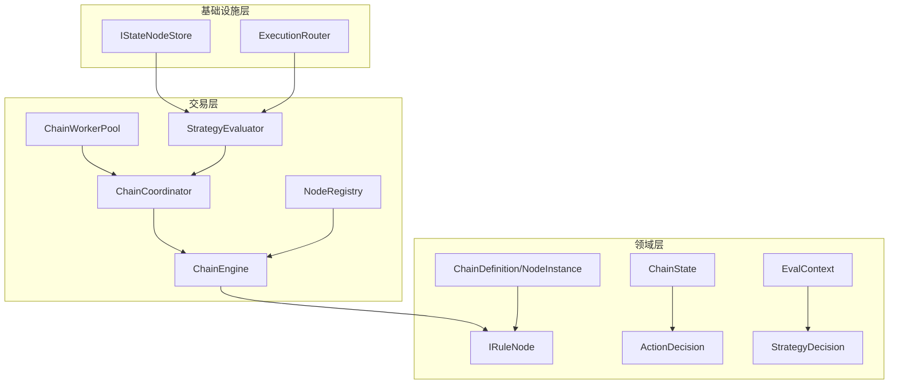
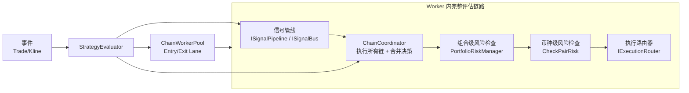
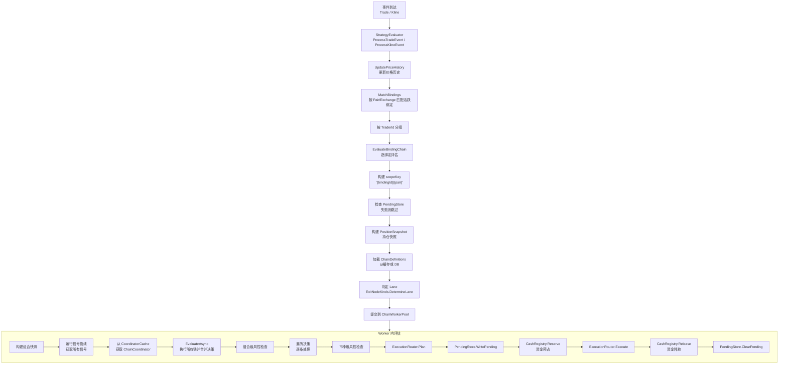
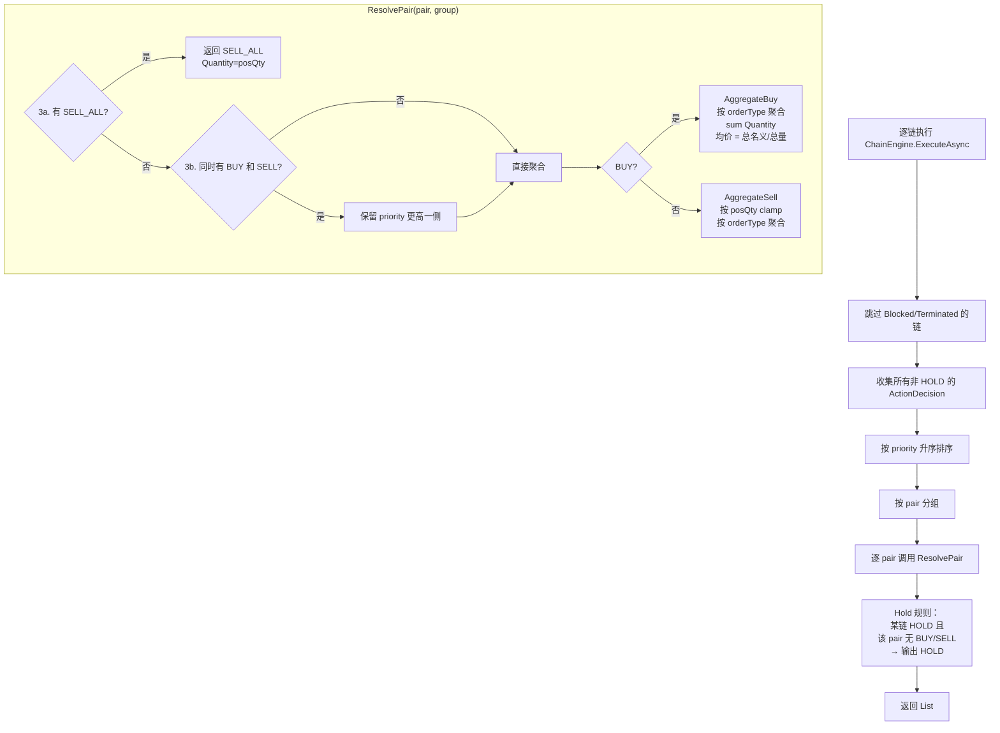
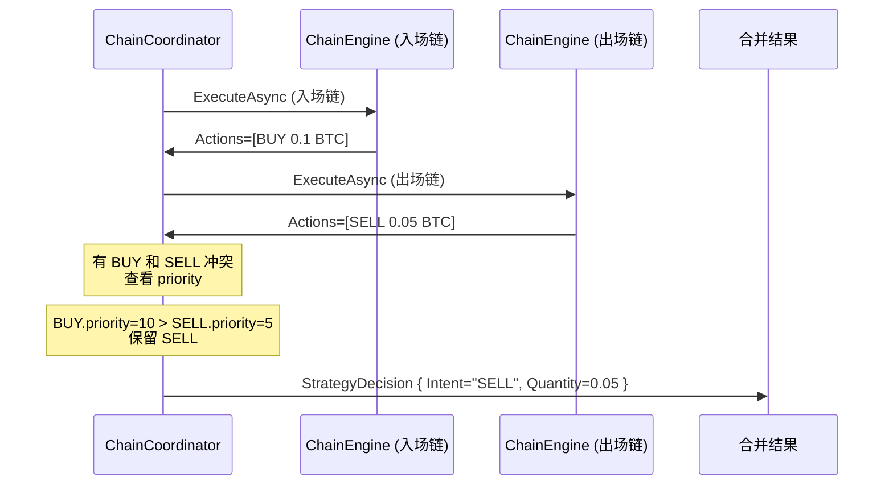
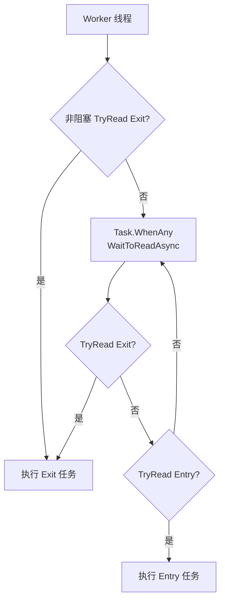

# 规则链引擎设计

> TradeX 新一代交易策略执行引擎，替代旧版 ConditionTree 条件树模式。
>
> 参考 Go 项目的 Rule Chain Engine 架构，使用 C# 14 语法完整实现。
> 核心代码位于 `TradeX.Trading/Rules/` 与 `TradeX.Core/Rules/`。

---

## 1. 概览

规则链引擎（Rule Chain Engine）是 TradeX 的新一代交易策略执行引擎。它以**可配置、可组合、可扩展**的节点管线取代了旧有的 `ConditionTree` 条件树模式，将策略定义从**硬编码的条件树**升级为**由节点组成的规则链（Rule Chain）**。

### 设计目标

| 目标 | 说明 |
|------|------|
| **可组合** | 策略由 Gate → Filter → Derive → Size → Action → Risk → Override 七个阶段的节点组成，按需自由组合 |
| **可扩展** | 通过 `NodeRegistry` 注册自定义节点，无需修改引擎核心 |
| **数据流透明** | 每轮评估产出完整的 `ChainState`，包含信号快照、派生值、操作意图、错误记录 |
| **fail-closed** | 节点执行异常按阶段采用不同错误策略，永不静默吞没错误 |
| **前后端一致** | 链定义使用小驼峰 JSON，前后端共享同一套序列化配置 |

### 与旧引擎的对比

| 维度 | ConditionTree（旧） | RuleChain（新） |
|------|--------------------|-----------------|
| 策略定义 | 硬编码条件树 | JSON 配置的节点管线 |
| 可配置性 | 需修改代码 | 运行时加载 JSON 即可 |
| 节点复用 | 条件逻辑分散 | 节点注册后可跨策略复用 |
| 执行顺序 | 固定三位模型 | 七阶段管线，每阶段内可排序 |
| 错误隔离 | 单点异常影响全局 | 按阶段错误策略隔离 |
| 状态持久化 | 无 | `IStateNodeStore` 支持有状态节点 |

---

## 2. 架构图



### 核心组件职责

| 组件 | 职责 | 文件 |
|------|------|------|
| **IRuleNode** | 规则链中的最小处理单元接口。定义 `Kind`、`Phase`、`Deps`、`ProcessAsync` | `TradeX.Core/Rules/IRuleNode.cs` |
| **ChainDefinition** | 规则链的静态定义，包含链标识、名称、描述、节点列表 | `TradeX.Core/Rules/ChainDefinition.cs` |
| **NodeInstance** | 链内的单个节点实例，引用已注册的节点类型并携带 JSON 参数 | `TradeX.Core/Rules/ChainDefinition.cs` |
| **ChainState** | 规则链的运行时状态（请求级别，每轮评估新建） | `TradeX.Core/Rules/RuleTypes.cs` |
| **EvalContext** | 评估上下文，包含交易对、价格、持仓快照、K 线窗口等 | `TradeX.Core/Rules/RuleTypes.cs` |
| **NodeRegistry** | 节点注册表，管理所有可用节点类型的注册与查找（线程安全） | `TradeX.Trading/Rules/NodeRegistry.cs` |
| **ChainEngine** | 执行单条规则链，按 Phase→Priority 顺序执行节点 | `TradeX.Trading/Rules/ChainEngine.cs` |
| **ChainCoordinator** | 协调多条规则链，执行所有链并按合并算法合并决策 | `TradeX.Trading/Rules/ChainCoordinator.cs` |
| **ChainWorkerPool** | 双 Lane 任务队列（Entry 可丢弃 / Exit 不可丢弃） | `TradeX.Trading/Rules/ChainWorkerPool.cs` |
| **CoordinatorCache** | ChainCoordinator 惰性缓存，按 binding ID 缓存预编译的协调器 | `TradeX.Trading/Rules/CoordinatorCache.cs` |
| **StrategyEvaluator** | 策略评估器——规则链引擎的总入口，消费 Trade/Kline 事件 | `TradeX.Trading/Rules/StrategyEvaluator.cs` |

---

## 3. 数据流



### 详细流程



---

## 4. 执行阶段（7 个 Phase）

规则链引擎定义了 7 个有序执行阶段，定义于 `TradeX.Core/Enums/RulePhase.cs`：

| 阶段 | 枚举值 | 数值 | 职责 | 典型节点 | 错误策略 |
|------|--------|------|------|----------|----------|
| **Gate** | `Gate` | 0 | 条件门：判断是否执行这条链 | regime_gate, time_gate, pair_gate | `Blocked=true`，跳过整链 |
| **Filter** | `Filter` | 1 | 信号过滤/转换 | min_notional, max_slippage | `continue`，跳过该节点 |
| **Derive** | `Derive` | 2 | 信号衍生新值（写入 DerivedValues） | crossover_check, atr_stop_calc | `continue`，跳过该节点 |
| **Size** | `Size` | 3 | 仓位计算（产出 SizeDecision） | fixed_size, pyramiding_size | `continue`，跳过该节点 |
| **Action** | `Action` | 4 | 决策生成（追加 ActionDecision） | signal_action, grid_action | `Terminated=true`，清空 Actions |
| **Risk** | `Risk` | 5 | 风控检查（过滤/缩放 Actions） | max_position_size, cooldown | Actions=[]，继续执行其余节点 |
| **Override** | `Override` | 6 | 覆盖/熔断（清空 Actions + Terminated） | kill_switch, emergency_exit | Actions=[], Terminated=true |

### 错误策略说明

`ChainEngine.ExecuteAsync` 中的异常处理逻辑：

```csharp
// Gate 异常 → 保守阻断整链
case RulePhase.Gate:
    state.Blocked = true;
    return;

// Filter / Derive / Size 异常 → 非致命，跳过该节点输出继续执行
case RulePhase.Filter:
case RulePhase.Derive:
case RulePhase.Size:
    continue;

// Action 异常 → 终结整链（防止未完成的操作执行）
case RulePhase.Action:
    state.Terminated = true;
    return;

// Risk 异常 → 保守拒绝所有 Actions，继续让其余风控/Override 执行
case RulePhase.Risk:
    state.Actions = [];
    continue;

// Override 异常 → 最保守：清空 Actions + Terminated
case RulePhase.Override:
    state.Actions = [];
    state.Terminated = true;
    return;
```

---

## 5. 核心数据结构

### 5.1 ChainDefinition / NodeInstance

定义于 `TradeX.Core/Rules/ChainDefinition.cs`。使用小驼峰 `JsonPropertyName` 确保前后端 JSON 格式一致。

```csharp
public sealed class ChainDefinition
{
    [JsonPropertyName("key")]         public string Key { get; set; } = string.Empty;
    [JsonPropertyName("name")]        public string Name { get; set; } = string.Empty;
    [JsonPropertyName("description")] public string? Description { get; set; }
    [JsonPropertyName("schemaVersion")] public int SchemaVersion { get; set; }
    [JsonPropertyName("nodes")]       public List<NodeInstance> Nodes { get; set; } = [];
}

public sealed class NodeInstance
{
    [JsonPropertyName("nodeKind")] public string NodeKind { get; set; } = string.Empty;
    [JsonPropertyName("params")]   public JsonElement Params { get; set; }
    [JsonPropertyName("priority")] public int Priority { get; set; }
}
```

**设计原则**：
- `ChainDefinition` 是策略静态定义的原子单位（同一条 `Strategy` 可包含多条链）
- `NodeInstance.Params` 使用 `JsonElement` 保持原始 JSON，运行时由工厂函数反序列化为具体参数类型
- 节点运行时按 `(Phase, Priority)` 升序排列，同优先级保持定义顺序（稳定排序）

### 5.2 ChainState（单一数据流原则）

定义于 `TradeX.Core/Rules/RuleTypes.cs`。`ChainState` 是规则链的运行时状态，遵循**单一数据流**原则：

```
输入         Signals + EvalContext
               │
中间状态       DerivedValues + SizeDecisions
               │
输出           Actions (被 Coordinator 合并为 Decisions)
               │
控制信号       Blocked / Terminated
               │
审计           Errors
```

```csharp
public sealed class ChainState
{
    // 输入（只读）
    public Dictionary<string, Signal> Signals { get; init; } = [];
    public EvalContext Context { get; init; } = new();

    // Derive 节点产出
    public Dictionary<string, decimal> DerivedValues { get; init; } = [];

    // Size 节点产出
    public List<SizeDecision> SizeDecisions { get; init; } = [];

    // Action 节点产出（单一权威载体，R-L3）
    public List<ActionDecision> Actions { get; set; } = [];

    // 控制信号
    public bool Blocked { get; set; }       // Gate 节点阻断
    public bool Terminated { get; set; }    // 任何节点终止

    // 审计
    public List<NodeError> Errors { get; init; } = [];

    // 最终决策（仅由 ChainCoordinator 写入）
    public List<StrategyDecision> Decisions { get; set; } = [];
}
```

### 5.3 ActionDecision / SizeDecision / StrategyDecision

```csharp
public sealed class SizeDecision
{
    public string Intent { get; set; } = "ENTER";   // ENTER / REDUCE / EXIT / HOLD
    public decimal Amount { get; set; }
    public string Currency { get; set; } = "USDT";
    public string Reason { get; set; } = string.Empty;
}

public sealed class ActionDecision
{
    public string Id { get; set; } = Guid.NewGuid().ToString();
    public string Intent { get; set; } = "HOLD";     // BUY / SELL / SELL_ALL / HOLD
    public decimal Quantity { get; set; }
    public string OrderType { get; set; } = "MARKET"; // MARKET / LIMIT / STOP_LIMIT
    public decimal? Price { get; set; }
    public decimal? StopPrice { get; set; }
    public int Priority { get; set; }
    public string Pair { get; set; } = string.Empty;
    public string Reason { get; set; } = string.Empty;
}

public sealed class StrategyDecision
{
    public string Pair { get; set; } = string.Empty;
    public string Intent { get; set; } = "HOLD";     // BUY / SELL / SELL_ALL / HOLD
    public decimal Quantity { get; set; }
    public string OrderType { get; set; } = "MARKET";
    public decimal? Price { get; set; }
    public decimal? StopPrice { get; set; }
    public List<string> ActionIds { get; set; } = [];
    public string Reason { get; set; } = string.Empty;
}
```

**三者的关系**：
1. **Size 节点**产出 `SizeDecision` → 表达"用多少钱 / 多少币量做"
2. **Action 节点**消费 `SizeDecision` 并产出 `ActionDecision` → 表达"做什么方向、什么价格"
3. **ChainCoordinator** 合并 `ActionDecision` 为 `StrategyDecision` → 最终策略决策

### 5.4 EvalContext

评估上下文，封装规则链评估所需的全部输入数据：

```csharp
public sealed class EvalContext
{
    public string Pair { get; set; } = string.Empty;
    public Guid ExchangeId { get; set; }
    public decimal CurrentPrice { get; set; }
    public PositionSnapshot? Position { get; set; }
    public PortfolioSnapshot? Portfolio { get; set; }
    public IReadOnlyList<Kline> KlineWindow { get; set; } = [];
    public DateTime EvaluationTime { get; set; } = DateTime.UtcNow;
    public string ScopeKey { get; set; } = string.Empty;         // "{bindingId}|{pair}"
    public IStateNodeStore? StateStore { get; set; }              // 有状态节点存储
    public Func<string, bool>? IsKillSwitchActive { get; set; }  // KillSwitch 回调
}
```

---

## 6. 节点类型清单

共 **45 个实现**。所有节点均实现 `IRuleNode` 接口，通过 `NodeRegistry` 注册。

### 6.1 Gate 阶段（6 个）

| 节点 | 文件 | 说明 | 参数 |
|------|------|------|------|
| `regime_gate` | `GateNodes.cs` | 市场体制门控：仅在指定体制下放行 | `AllowedRegimes: string[]` |
| `time_gate` | `GateNodes.cs` | 时间窗口门控：WINDOW（特定时段）或 INTERVAL（间隔分钟） | `Mode, Windows, IntervalMinutes` |
| `pair_gate` | `GateNodes.cs` | 交易对白名单：仅白名单内的 pair 放行 | `Whitelist: string[]` |
| `signal_gate` | `GateNodes.cs` | 信号阈值门控：信号超阈值才放行 | `Signal, Op, Threshold` |
| `capital_gate` | `GateNodes.cs` | 可用资金门控：可用现金需 >= 最小值 | `MinAvailableCash` |
| `position_gate` | `GateNodes.cs` | 持仓状态门控：支持 OPEN / CLOSED / ANY | `Require` |

### 6.2 Filter 阶段（3 个）

| 节点 | 文件 | 说明 | 参数 |
|------|------|------|------|
| `min_notional` | `FilterNodes.cs` | 最小名义值：过滤太小额的买单 | `MinNotional` |
| `max_slippage` | `FilterNodes.cs` | 最大滑点：滑点超过阈值则阻断 | `MaxSlippagePercent` |
| `liquidity_filter` | `FilterNodes.cs` | 流动性过滤：盘口深度不足则阻断 | `Side, MinDepth` |

### 6.3 Derive 阶段（8 个）

| 节点 | 文件 | 说明 | 参数 |
|------|------|------|------|
| `crossover_check` | `DeriveNodes.cs` | 金叉死叉检测 | `FastSignal, SlowSignal, OutputKey` |
| `atr_stop_calc` | `DeriveNodes.cs` | ATR 止损/止盈位计算 | `AtrSignal, Multiplier, LongStopKey, LongTpKey, ShortStopKey, ShortTpKey` |
| `grid_price_level` | `DeriveNodes.cs` | 网格价格水平计算（线性/等比） | `TopPrice, BottomPrice, GridCount, Mode, OutputKey` |
| `volatility_scaling` | `DeriveNodes.cs` | 波动率缩放系数 | `Signal, BaseValue, OutputKey` |
| `trailing_stop_calc` | `DeriveNodes.cs` | 移动止损价格计算 | `TrailPercent, OutputKey` |
| `kelly` | `DeriveNodes.cs` | Kelly 公式计算最优仓位比例 | `WinRate, AvgWinLossRatio, OutputKey` |
| `divergence_detect` | `DeriveNodes.cs` | 价量背离检测（顶背离/底背离） | `PriceSignal, VolumeSignal, OutputKey` |
| `correlation_score` | `DeriveNodes.cs` | 两信号瞬时方向相关性（+1/-1） | `SignalA, SignalB, OutputKey` |

### 6.4 Size 阶段（7 个）

| 节点 | 文件 | 说明 | 参数 |
|------|------|------|------|
| `fixed_size` | `SizeNodes.cs` | 固定金额仓位 | `Amount, Currency` |
| `pyramiding_size` | `SizeNodes.cs` | 金字塔加仓：每层 baseAmount × multiplier^level | `BaseAmount, Multiplier, MaxLevel` |
| `account_ratio_size` | `SizeNodes.cs` | 账户比例仓位：总权益 × Ratio | `Ratio` |
| `volatility_adjusted_size` | `SizeNodes.cs` | 波动率调整仓位：波动率越高仓位越小 | `BaseSize, VolSignal, ReferenceVol, OutputKey` |
| `grid_size` | `SizeNodes.cs` | 网格仓位分配（线性/等比） | `TotalAmount, GridCount, Mode` |
| `kelly_size` | `SizeNodes.cs` | Kelly 公式仓位：权益 × f* × 分数 | `KellyFraction` |
| `portfolio_alloc_size` | `SizeNodes.cs` | 组合分配仓位：总权益 × 分配百分比 | `AllocationPercent` |

### 6.5 Action 阶段（7 个）

| 节点 | 文件 | 说明 | 参数 |
|------|------|------|------|
| `signal_action` | `ActionNodes.cs` | 信号驱动买卖 | `BuySignal, SellSignal, Threshold, Direction` |
| `grid_action` | `ActionNodes.cs` | 网格再平衡：偏离阈值则反向操作 | `DeviationPercent, BasePrice` |
| `trailing_stop_action` | `ActionNodes.cs` | 移动止损执行 | `TrailPercent, ActivationPrice` |
| `take_profit_action` | `ActionNodes.cs` | 止盈执行 | `TpPercent` |
| `dca_action` | `ActionNodes.cs` | 定投：固定金额定期买入 | `IntervalHours, Amount` |
| `trend_action` | `ActionNodes.cs` | 趋势跟踪：顺势开仓 | `TrendSignal, Threshold, Direction` |
| `martingale_action` | `ActionNodes.cs` | 马丁格尔：亏损后加倍 | `BaseAmount, Multiplier, MaxSteps` |

### 6.6 Risk 阶段（9 个）

| 节点 | 文件 | 说明 | 参数 |
|------|------|------|------|
| `max_position_size` | `RiskNodes.cs` | 最大持仓规模（缩放超过上限的 Actions） | `MaxNotional` |
| `max_pyramiding` | `RiskNodes.cs` | 最大加仓层数 | `MaxLevel` |
| `max_drawdown` | `RiskNodes.cs` | 最大回撤保护（超限则清空+终止） | `MaxDrawdownPercent` |
| `daily_loss_limit` | `RiskNodes.cs` | 日亏损限制（超限则清空+终止） | `MaxDailyLoss` |
| `cooldown` | `RiskNodes.cs` | 冷却期：交易后等待指定时间 | `CooldownMinutes` |
| `consecutive_loss_stop` | `RiskNodes.cs` | 连续亏损停机 | `MaxConsecutiveLosses` |
| `quality_filter` | `RiskNodes.cs` | 信号质量过滤：按质量系数缩放仓位 | `DegradeMap` |
| `max_positions` | `RiskNodes.cs` | 持仓数限制 | `MaxCount, Scope` |
| `max_correlation` | `RiskNodes.cs` | 相关性限制：避免同向波动敞口 | `MaxCorrelation` |

### 6.7 Override 阶段（4 个）

| 节点 | 文件 | 说明 | 参数 |
|------|------|------|------|
| `kill_switch` | `OverrideNodes.cs` | 熔断开关：通过回调检查是否激活 | `Key` |
| `emergency_exit` | `OverrideNodes.cs` | 紧急平仓：信号触发立即全平 | `Signal, Threshold, Op` |
| `manual_block` | `OverrideNodes.cs` | 手动阻止：通过 StateStore 读取标志 | `BlockedKey` |
| `exchange_health` | `OverrideNodes.cs` | 交易所健康检查：延迟超限则熔断 | `MaxLatencyMs` |

### 6.8 混合阶段（1 个）

| 节点 | 文件 | 阶段 | 说明 | 参数 |
|------|------|------|------|------|
| `cost_anchored_rebalance` | `CostAnchorNode.cs` | Derive + Action | 成本锚定再平衡：以持仓均价为锚，偏离阈值则反向操作 | `DeviationThreshold, BaseQuantity` |

### 6.9 注册汇总

所有节点通过 `NodeRegistration.RegisterAllNodes()` 统一注册：

```csharp
public static void RegisterAllNodes(this NodeRegistry reg)
{
    reg.RegisterGateNodes();       // 6 个
    reg.RegisterFilterNodes();     // 3 个
    reg.RegisterDeriveNodes();    // 8 个
    reg.RegisterSizeNodes();      // 7 个
    reg.RegisterActionNodes();    // 7 个
    reg.RegisterRiskNodes();      // 9 个
    reg.RegisterOverrideNodes();  // 4 个
    reg.RegisterCostAnchorNode(); // 1 个
}
```

**节点类型统计**：Gate(6) + Filter(3) + Derive(8) + Size(7) + Action(7) + Risk(9) + Override(4) + 混合(1) = **45 个实现**

---

## 7. 决策合并算法

`ChainCoordinator.EvaluateAsync` 负责执行所有链并合并决策。

### 7.1 算法流程



### 7.2 合并规则（R-L1 ~ R-L3）

| 规则 | 说明 |
|------|------|
| **R-L1** | 节点同一 Phase 内按 Priority（数值越小越优先）升序执行 |
| **R-L2** | Blocked/Terminated 链的 Actions 不参与 Coordinator 合并 |
| **R-L3** | ChainState.Actions 是单一权威载体，Coordinator 合并后写入 ChainState.Decisions |

### 7.3 冲突解决（ResolvePair）

```
3a. SELL_ALL 覆盖一切：
    任一 ActionDecision.Intent == "SELL_ALL" → 丢弃所有 BUY/SELL，保留 SELL_ALL

3b. BUY + SELL 冲突 → 保留 priority 更高的一侧：
    group[0].Intent 决定获胜侧（已按 priority 排序，取最高优先级的 Intent）
    丢弃另一侧的所有 Actions

3c. 按 orderType 聚合：
    AggregateBuy: 同 orderType 的 quantity 累加，LIMIT 类型计算均价 = 总名义价值 / 总量
    AggregateSell: 按 posQty 逐笔 clamp，同 orderType 聚合，若全量卖出则 Intent=SELL_ALL

3d. Hold 回退：
    某条链产出了 HOLD 且该 pair 在所有链中无任何 BUY/SELL → 输出 HOLD
```

### 7.4 完整示例



---

## 8. Worker Pool（ChainWorkerPool）

`ChainWorkerPool` 实现了双 Lane 任务队列模型，定义于 `TradeX.Trading/Rules/ChainWorkerPool.cs`。

### 8.1 设计原理

```
Lane.Entry（入场）    → BoundedChannel, DropWrite（满时丢弃）
Lane.Exit（出场）     → BoundedChannel, Wait（满时等待，永不丢弃）
```

### 8.2 Lane 判定算法

`ExitNodeKinds.DetermineLane` 判定规则：

```csharp
public static Lane DetermineLane(bool hasPosition, IEnumerable<string> nodeKinds)
{
    if (hasPosition) return Lane.Exit;                 // 有持仓 → 出场
    if (nodeKinds.Any(k => Kinds.Contains(k))) return Lane.Exit;  // 包含出场类节点
    return Lane.Entry;                                 // 入场
}
```

出场节点 Kind 集合：
```csharp
public static readonly HashSet<string> Kinds =
[
    "trailing_stop_action",
    "take_profit_action",
    "emergency_exit",
    "max_drawdown",
    "consecutive_loss_stop",
    "kill_switch",
];
```

### 8.3 消费者调度

Worker 线程**非阻塞优先消费 Exit 队列**，闲置时阻塞等待任一队列：



### 8.4 单飞锁（Scope Lock）

`ChainWorkerPool.TryAcquireScope` / `ReleaseScope` 提供同 `scopeKey` 的并发控制，防止同一绑定的两轮评估同时执行。

---

## 9. 有状态节点存储

### 9.1 接口设计

```csharp
public interface IStateNodeStore
{
    Task<NodeState?> ReadStateAsync(string scopeKey, string nodeKind, CancellationToken ct = default);
    Task WriteStateAsync(string scopeKey, string nodeKind, NodeState state, CancellationToken ct = default);
    Task BatchWriteAsync(IReadOnlyList<StateEntry> entries, CancellationToken ct = default);
}

public interface IPendingStore
{
    Task WritePendingAsync(string scopeKey, CancellationToken ct = default);
    Task ClearPendingAsync(string scopeKey, CancellationToken ct = default);
    Task<bool> IsPendingAsync(string scopeKey, CancellationToken ct = default);
}
```

### 9.2 设计原则

1. **接口定义在领域层**（`TradeX.Core/Rules/IStateNodeStore.cs`），实现在基础设施层
2. 每个 `ScopeKey` 对应一个**策略绑定 + 交易对**的独立状态空间
3. **读写分离**：Evaluate 阶段只读（`ReadStateAsync`），决策执行阶段写入
4. **fail-closed 铁律**：`ReadStateAsync` 对非"键不存在"错误必须上抛，绝不返回空状态

### 9.3 使用有状态存储的节点

以下节点使用 `IStateNodeStore` 保持跨轮状态：

- `dca_action` — 记录上次定投时间 `lastAt`
- `martingale_action` — 记录当前步数 `step`
- `cooldown` — 记录上次交易时间 `lastTradeAt`
- `consecutive_loss_stop` — 记录连续亏损次数 `consecutiveLosses`
- `manual_block` — 读取手动阻止标志
- `cost_anchored_rebalance` — 记录锚定成本 `anchoredCost`

---

## 10. 信号管线

`StrategyEvaluator` 支持三种信号生成方式（按优先级）：

| 方式 | 接口 | 说明 |
|------|------|------|
| 信号管线 | `ISignalPipeline` | 完整的信号管线，单入口批量生成 |
| 信号总线 | `ISignalBus` | 多生成器注册与调度 |
| 生成器列表 | `ISignalGenerator[]` | 简单列表，逐个调用 |

信号上下文（输入）：

```csharp
public sealed class SignalContext
{
    public string Pair { get; set; } = string.Empty;
    public decimal CurrentPrice { get; set; }
    public IReadOnlyList<Kline> KlineWindow { get; set; } = [];
    public PositionSnapshot? Position { get; set; }
    public PortfolioSnapshot? Portfolio { get; set; }
}
```

信号定义：

```csharp
public sealed class Signal
{
    public string Name { get; set; } = string.Empty;
    public decimal Value { get; set; }
    public decimal PrevValue { get; set; } // 用于穿越/背离检测
}
```

---

## 11. 文件映射

| 类/接口 | 文件路径 |
|---------|---------|
| `IRuleNode` | `TradeX.Core/Rules/IRuleNode.cs` |
| `IStateNodeStore`, `IPendingStore` | `TradeX.Core/Rules/IStateNodeStore.cs` |
| `ChainDefinition`, `NodeInstance` | `TradeX.Core/Rules/ChainDefinition.cs` |
| `Signal`, `SignalContext`, `EvalContext`, `ChainState`, `SizeDecision`, `ActionDecision`, `StrategyDecision`, `NodeError`, `NodeState`, `StateEntry` | `TradeX.Core/Rules/RuleTypes.cs` |
| `RulePhase` | `TradeX.Core/Enums/RulePhase.cs` |
| `PositionSnapshot`, `PortfolioSnapshot` | `TradeX.Core/Models/PositionSnapshot.cs` |
| `RuleJsonOptions`, `NodeFactory`, `NodeDescriptor`, `ParamDescriptor`, `NodeRegistry` | `TradeX.Trading/Rules/NodeRegistry.cs` |
| `ChainEngine` | `TradeX.Trading/Rules/ChainEngine.cs` |
| `ChainCoordinator` | `TradeX.Trading/Rules/ChainCoordinator.cs` |
| `ChainWorkerPool`, `Lane`, `WorkerTask`, `ExitNodeKinds` | `TradeX.Trading/Rules/ChainWorkerPool.cs` |
| `CoordinatorCache` | `TradeX.Trading/Rules/CoordinatorCache.cs` |
| `ResolveHelpers` | `TradeX.Trading/Rules/ResolveHelpers.cs` |
| `StrategyEvaluator`, `ISignalPipeline`, `ISignalBus`, `ISignalGenerator`, `ISnapshotStore`, `ExecutionEnv`, `IExecutionRouter`, `ExecutionPlan`, `ICashRegistry`, `BalanceCacheEntry` | `TradeX.Trading/Rules/StrategyEvaluator.cs` |
| `GateNodes` (6 nodes + registration) | `TradeX.Trading/Rules/Nodes/GateNodes.cs` |
| `FilterNodes` (3 nodes + registration) | `TradeX.Trading/Rules/Nodes/FilterNodes.cs` |
| `DeriveNodes` (8 nodes + registration) | `TradeX.Trading/Rules/Nodes/DeriveNodes.cs` |
| `SizeNodes` (7 nodes + registration) | `TradeX.Trading/Rules/Nodes/SizeNodes.cs` |
| `ActionNodes` (7 nodes + registration) | `TradeX.Trading/Rules/Nodes/ActionNodes.cs` |
| `RiskNodes` (9 nodes + registration) | `TradeX.Trading/Rules/Nodes/RiskNodes.cs` |
| `OverrideNodes` (4 nodes + registration) | `TradeX.Trading/Rules/Nodes/OverrideNodes.cs` |
| `CostAnchorNode` (1 node + registration) | `TradeX.Trading/Rules/Nodes/CostAnchorNode.cs` |
| `NodeRegistration` | `TradeX.Trading/Rules/Nodes/NodeRegistration.cs` |
